.. sectionauthor:: Артём Светлов <@nextgis.ru>

.. LipetskRegEcoGIS:

Инструкция оператора системы ГИС ИАС экологической паспортизации МР и ГО Липецкой области
=============================================================================================


Описание ПО ГИС
----------------------------------------------

Комплекс ПО состоит из

* Рабочих мест оператора с настольной ГИС NextGIS QGIS - это программа под ОС Windows, в которой работают с геоданными.
* Серверной веб-гис NextGIS Web - это веб-сервер, который раздаёт геоданные по сети. Он может показывать геоданные на карте в браузере, изменять данные можно через веб-браузер, из NextGIS QGIS.


Работа с системой через настольный клиент
----------------------------------------------

Запуск приложения NextGIS QGIS
``````````````````````````````````````````````

Запускается как обычное приложение под Windows. Для запуска необходимо запустить ярлык с названием NextGIS QGIS (15.5.109) (или новее)

.. figure:: _static/LREGQgisIcon.png
   :name: LREGQgisIcon
   :align: center

   Запускайте программу по нажатию этого ярлыка

Работа с локальными слоями
``````````````````````````````````````````````
Геоданные бывают векторные и растровые.
Векторные данные обычно хранятся как электронная таблица, где у каждой записи есть своя геометрия - то есть фигура, заданная координатами точек. 
Растровые данные обычно хранятся как картинка, в которой указано, на какое место земного шара она ложится. 

Существует множество форматов хранения геоданных, и протоколов их передачи по сети. Они могут представлять собой файлы, или находится в базах данных. 
Преобразованием форматов занимаются утилиты GDAL (растровые) и OGR (векторные). Благодаря этим утилитам NextGIS QGIS может читать и записывать разные форматы данных без сильных различий для пользователя.
Разумеется, обычно используются только самые общеупотребительные форматы.  

Понятие Слой будет часто встречаться в инструкции. Слой - это то, что видно в списке слоёв, технически это один файл, или одна таблица в БД. 

Открытие SHP файлов
::::::::::::::::::::::::::::::::::::::::::::::

Стандартный формат векторных файлов используемый NextGIS QGIS называеся ESRI shapefile/


На самом деле, shape-файл состоит из нескольких файлов разных форматов. Из них три обязательны:

#. :file:`.shp` файл с геометриями
#. :file:`.dbf` файл с атрибутами в формате dBase
#. :file:`.shx` файл с индексом
#. :file:`.prj` файл с описанием проекции (не обязательно)

Так же могут прилагаться другие файлы.


Если у вас нет своих SHP-файлов, скачайте их для примера с http://beryllium.gis-lab.info/project/osmshp/. Если они в архиве - распакуйте их. 

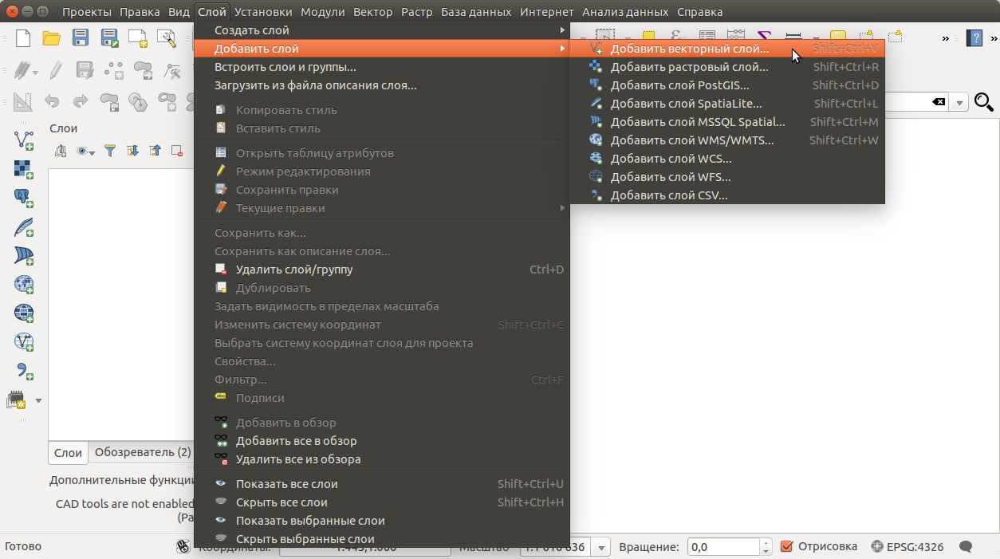


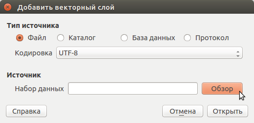


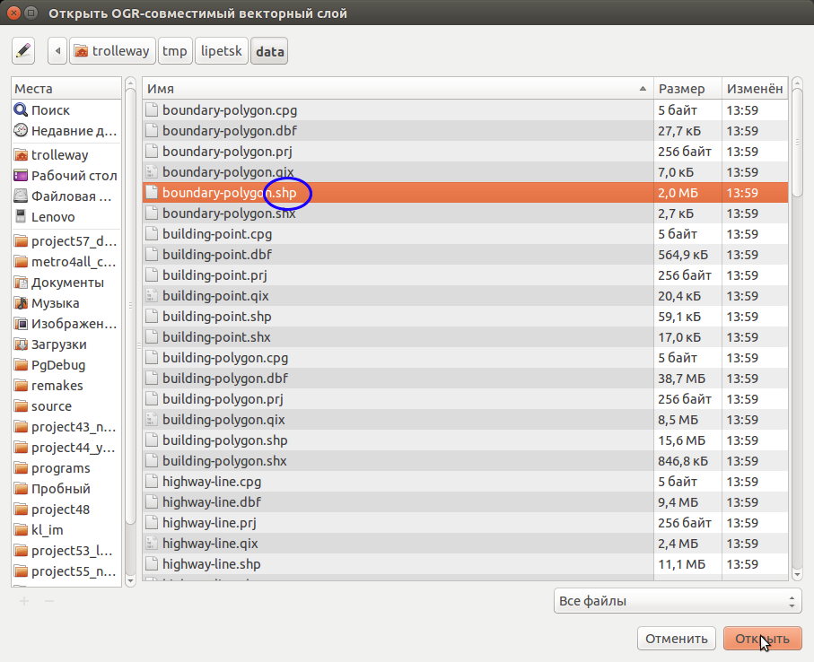


Выбираем файл с расширением .shp


В середине 2010-х годов принято, что все данные сохраняются в кодировке UTF-8. При работе на ОС Windows при открытии и сохранении векторных данных нужно явно указывать кодировку UTF-8. По умолчанию она может быть System - это значит CP1251.
Если вы открыли файл в неправильной кодировке, то русские буквы там будут нечитаемыми. В этом случае нужно в свойствах слоя выставить кодировку UTF-8. Но лучше сразу выставлять её при открытии файла, что бы не забыть.


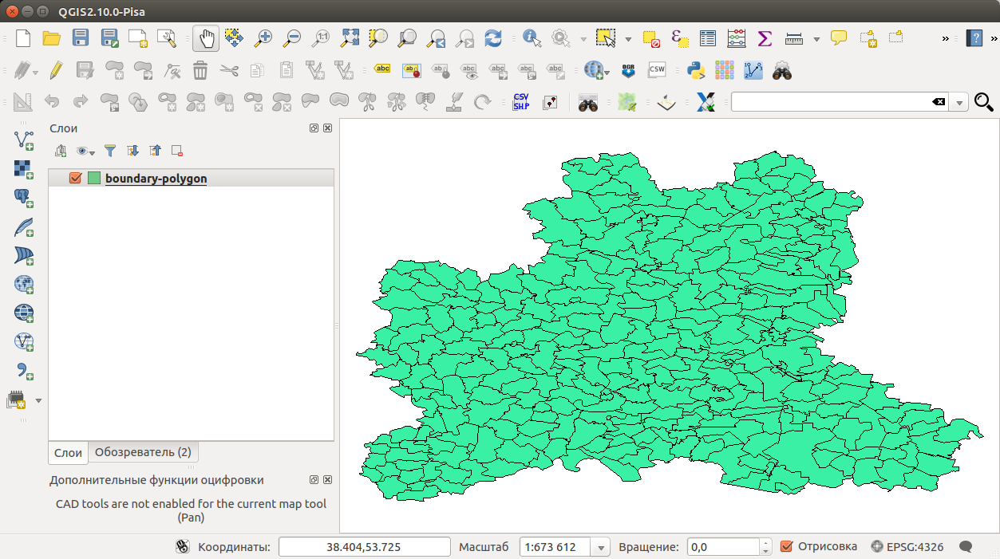


Векторные слои в QGIS могут быть точечные, линейные, или полигональные. Обычно в векторных файлах не сохраняется оформление, и при открытии он покрасится в случайный цвет. При желании можно настроить оформление, и сохранить оформление в формат qgs, с тем же именем что и векторный файл. Если файл стиля будет лежать в той же папке, то при открытии слоя NextGIS QGIS подхватит и стиль.
 

Если вы создали новый проект, и сразу же в него добавили слой, то он скорее всего он будет казаться сплюснутым по вертикали. Это потому, что как правило векторные геоданные хранятся в системе координат EPSG:4326 - в градусах. Что бы на карте не было искажений, нажмите на кнопку в правом нижнем углу, и в открывшемся окне выбора проекции в поиске введите 3857.
Это обозначает, что в QGIS включится преобразование координат на лету.

Проверьте, правильно ли он попадает в нужную местность, подложив картографическую подложку. Выьерите меню Интернет > QuickMapServices > OSM > OSM Mapnik, или любая другая подложка. 

- Если плагина QuickMapServices нет, то Модули > Управление модулями, в строке поиска ввести "QuickMapServices", и нажать галочку, либо кнопку "Установить".

Просмотр таблицы атрибутов
::::::::::::::::::::::::::::::::::::::::::::::

У векторных слоёв есть атрибуты. Их можно смотреть в таблице. 

.. figure:: _static/LREGQGISAttributeTable1.png
   :name: LREGQGISAttributeTable1
   :align: center
   :width: 15cm

Одна запись в таблице - это один объект в слое.
Столбцы - это атрибуты слоя. 
У каждого объекта есть геометрия, которая отображается на карте. 

Можно настроить, что бы таблица атрибутов открывалась в отдельном окне, а можно - что бы она всегда была внутри основного окна программы.


.. figure:: _static/LREGQGISAttributeTable2.png
   :name: LREGQGISAttributeTable2
   :align: center
   :width: 15cm

.. figure:: _static/LREGQGISAttributeTable3.png
   :name: LREGQGISAttributeTable3
   :align: center
   :width: 15cm

При желании легко можно настроить, что бы объекты из одного слоя но с разными атрибутами рисовались с разным оформлением. См. инструкции по QGIS.


В таблице атрибутов чаще всего используются следующие кнопки:

.. figure:: _static/LREGQGISAttributeTable4.png
   :name: LREGQGISAttributeTable4
   :align: center
   :width: 15cm

   Кнопки в таблице атрибутов


1.  сортировка по полю
2.  включить режим редактирования слоя. Теперь в слое можно править значения, как в электронной таблице, и править геометрию.
3.  сохранить правки в этом слое (отдельно от сохранения всего проекта)
4.  Удалить выделенные обьекты.
5.  Снять выделение с объектов
6.  Переместить карту на выделеный объект или несколько объектов
7.  Изменить масштаб карты на выделенный объект или несколько объектов
8.  Копировать-вставить выделенные объекты (вместе с геометрией)
9.  Удалить или добавить атрибут (столбец)
10.  Запуск калькулятора полей - он добавляет новый столбец со значениями по форулам, как в Excel


.. figure:: _static/LREGQGISAttributeTableSearch.png
   :name: LREGQGISAttributeTableSearch
   :align: center
   :width: 15cm

   Пример использования выражения для поиска обьектов в слое по значениям

Идентификация объектов
::::::::::::::::::::::::::::::::::::::::::::::

В Qgis есть возможность нажимать на объекты векторных слоёв на карте мышкой, и просматривать их атрибуты. Это называется "Идентификация".

.. figure:: _static/LREGQGISIdentify.png
   :name: LREGQGISIdentify
   :align: center
   :width: 15cm
   
   Работа инструмента идентификации

Выберите инструмент идентификации (1). Щёлкните на каком-нибудь объекте на карте (2). На экран выведутся его атритуты(3). В панели инструментов "Результат определения" (4) можно настроить, что именно будет показываться на экране при нажатии: будет ли открываться отдельное окно, или нет.


.. figure:: _static/LREGQGISSelect.png
   :name: LREGQGISSelect
   :align: center
   :width: 15cm
   
   Выделение нескольких объектов. В таблице атрибутов - режим "Выделенные объекты".
   
   
Рядом есть жёлтая иконка - выделения объектов(1). Она выделяет объекты в том слое, который выбран в меню слоёв. Выделеные объекты подсвечиваются в таблице атрибутов, их можно скопировать или удалить. 
Выделять можно по клику, или обводя область рамкой. Может быть выделено несколько объектов по очереди с нажатой клавишей Ctrl.   
Правее - кнопка "Снять выделение".

Создание новых SHP файлов
::::::::::::::::::::::::::::::::::::::::::::::

Есть 2 способа:

#. :menuselection:`Слой --> Создать слой --> Создать Shapefile`. Указать cписок полей, и затем создастся SHP файл.
#. :menuselection:`Слой --> Создать слой --> Создать временный защитный слой`. Добавить в него атрибуты, и сохранить как SHP файл.

Второй способ появился недавно, поэтому его нет в основной инструкции. Он удобнее, потому что сложно сразу придумать все атрибуты, которые нужно добавить. При втором способе их добавлять легче.

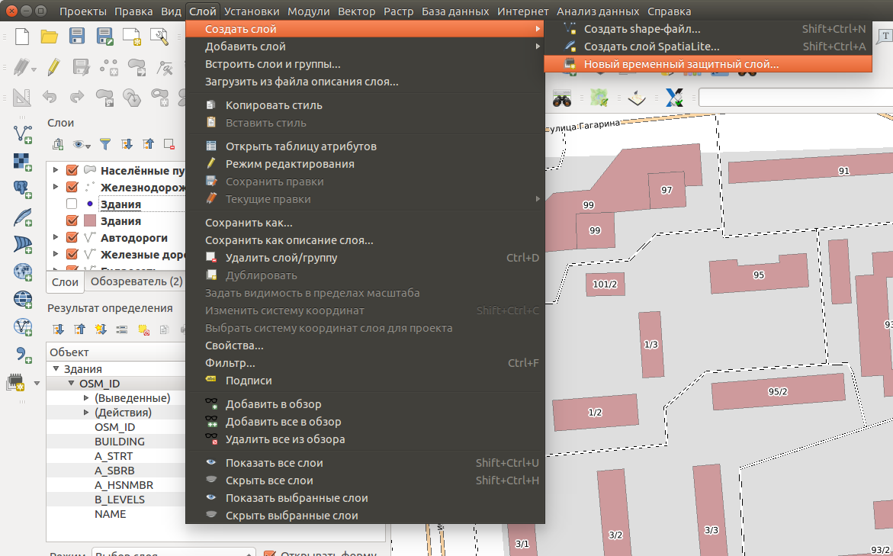

   
Для создания нового SHP файлы нажмите меню :menuselection:`Слой --> Создать слой --> Создать временный защитный слой`
   
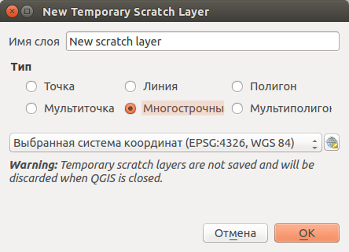

Укажите тип геометрии. Выбирайте из мультиточки, мультилинии и мультиполигона. При выборе проекции: если не указано иное, то выбирайте наиболее распространённую EPSG:4326

В главном окне QGIS в списке слоёв (слева на экране )у вас должен появится новый слой.

Чаще всего, мы хотим хранить в векторном слое не только геометрию, но какие-нибудь данные, что бы знать, что конкретно этими объектами обозначено. Поэтому добавляем атрибуты.


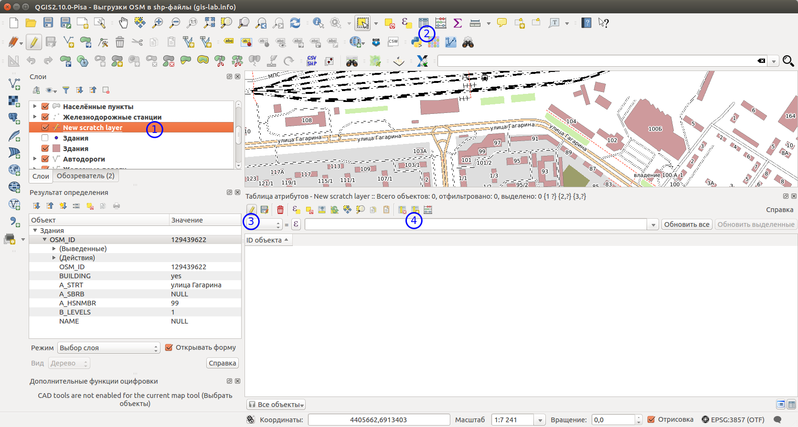

Выделяем временный слой в списке слоёв(1).

Включаем таблицу атрибутов (2)

Проверяем, включён ли временный слой в режим редактирования (3).

Нажимаем на кнопку "Добавить поле"(4)


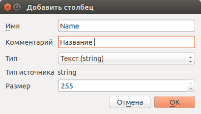

У атрибутов должен быть задан тип. В разных форматах файлов типы немного отличаются, но в основном они таковы:

1. Текстовый
2. Целое число
3. Десятичное число
4. Дата (со временем)

В формате SHP размер текстового поля ограничен 255 символами. Если ваши значения не влезают в такое ограничение - сохраняйте в формат GeoJSON. В нём нет такого ограничения, но он занимает больше места, в нём нельзя редактировать, в нём нет индексов (медленнее читается).

У десятичного числа: поле "размер" обозначает общее количество цифр до и после запятой, поле "точность" - количество цифр после запятой. Например выставив 8 и 4 можно будет вводить числа вида 9999.9999


Теперь можно начинать рисовать объекты на карте. 

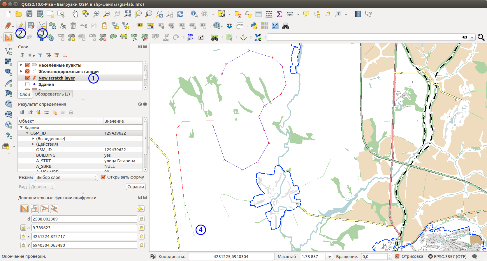
   
   Процесс рисования новой линии
   
Выделите нужный слой в списке слоёв слева (1).
Включите этот слой в режим редактирования (2), если он не включён.
Нажмите на кнопку "Добавить новый объект" (3)
Рисуйте мышкой по карте.

Во время рисования можно двигать карту нажатием колеса мыши. Завершение рисования - по нажатию правой кнопки мыши.
Затем откроется окно ввода атрибутов.
После рисования - обязательно надо особо сохранить правки слоя. Для этого (выделите слой в списке слоёв), нажмите пункт меню :menuselection:`Слой --> Сохранить правки`.

После рисования нужно сохранить временный защитный слой в формат Shapefile. Сохранять в Shapefile слой без геометрии не получится, поэтому сначала добавьте хотя бы один объект.


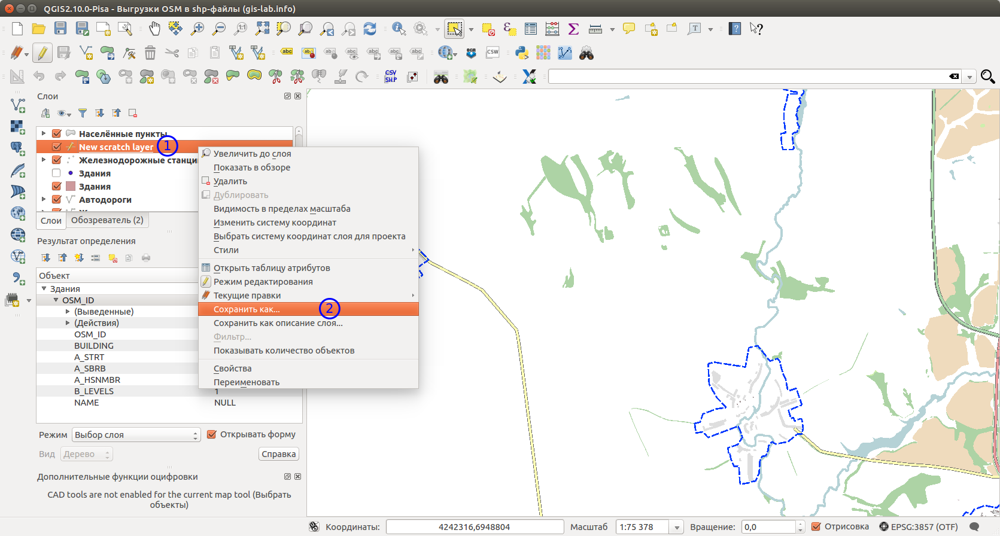

Выделите нужный слой в списке слоёв слева (1).
Откройте контекстное меню правой кнопкой мыши, выберите "Сохранить как" (2).
   
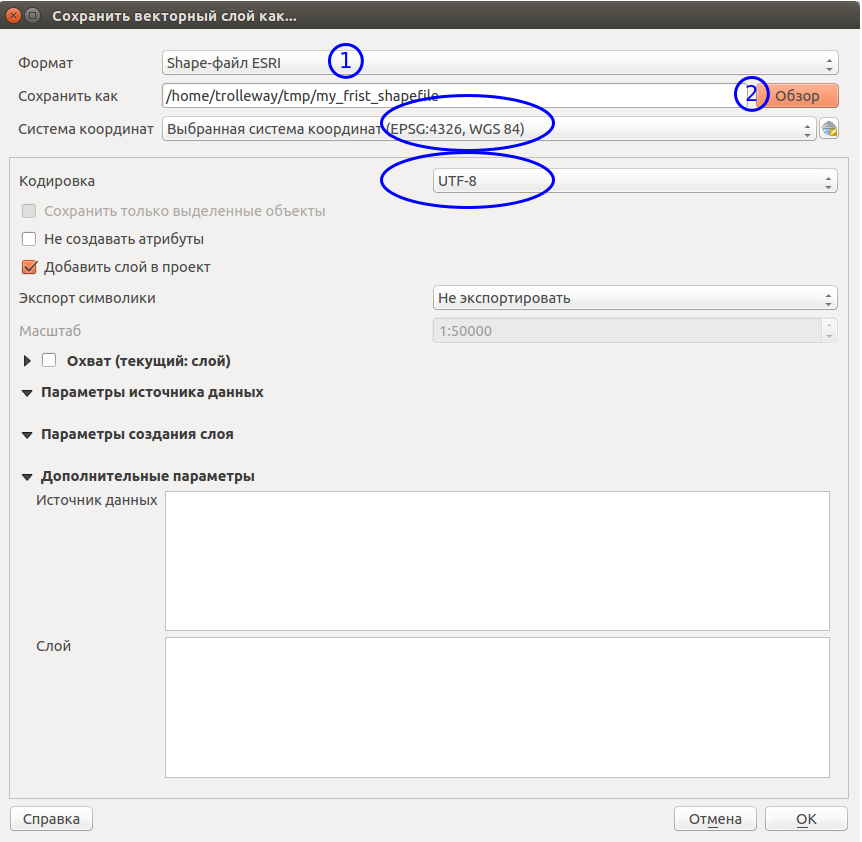
   
Укажите формат Esri Shapefile, выберите имя файла, в которое он будет сохранён. Остальные настройки - сделайте как на илюстрации.
При сохранении обратите внимание: рекомендуется сохранять в системе координат EPSG:4326 и кодировке UTF-8. Это позволит вашим файлам быть наиболее переносимыми.


При рисовании можно использовать прилипание - что бы края обьекта прилегали к другому, уже существующему объекту. 
Можно рисовать площадные объекты с дырками посредине.
Можно рисовать мультиобъекты (например территория РФ имеет анклав - Калининградская область, но нам нужно, что бы вся страна считалась одним объектом, а не двумя).
Детальные инструкции по этим операциям - см. http://docs.qgis.org/2.8/ru/docs/training_manual/create_vector_data/index.html, http://gis-lab.info/qa/qgis-vector.html


Работа со слоями на сервере
``````````````````````````````````````````````

Из QGIS можно работать с NextGIS Web напрямую. Можно смотреть и редактировать данные - перемещать, удалять, добавлять новые объекты в слой.

Настройка подключения к NextGIS Web серверу через NGW Connect
::::::::::::::::::::::::::::::::::::::::::::::

Нажмите :menuselection:`Модули --> NGW Connect --> Показать панель`. В правой части экрана откроется панель NGW.

- Если плагина NGW Connect нет, то :menuselection:`Модули --> Управление модулями`, в строке поиска ввести "NGW Connect", и нажать галочку, либо кнопку "Установить".
- Если плагин не находится, то нужно подключить репозиторий модулей NextGIS http://nextgis.ru/programs/qgis/qgis-repo.xml


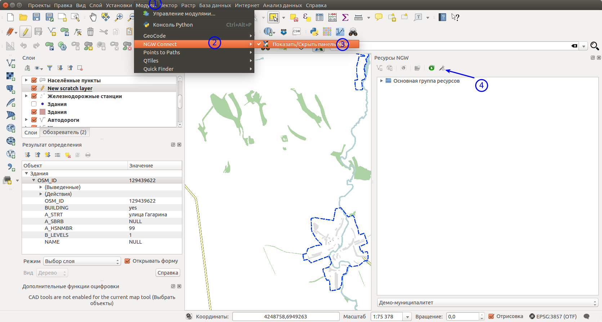

.. figure:: _static/LREGNGWConnect2.png
   :name: LREGNGWConnect2
   :align: center
   :width: 15cm

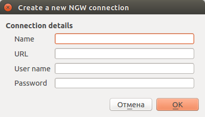

Придумайте название подключения (любое), введите адрес сервера, имя пользователя и пароль

Этот модуль позволяет добавлять в QGIS векторные слои из NextGIS Web (выгружает копию слоя в формате GeoJSON, без возможности редактирования), и добавлять в QGIS wfs-сервисы из NextGIS Web.

В случае если пользователь Windows назван на русском языке, то этот модуль может выдавать ошибки. В этом случае нужно перезагрузить компьютер. Если это не поможет, то слои WFS нужно добавить по-другому.

1. Зайти в административный интерфейс веб-гис
2. Зайти в группу ресурсов, которая называется "Служебные"
3. Зайти там в один из сервисов WFS - они разбиты по отделам.
4. На экран выведется ссылка - это адрес WFS-сервиса. Скопируйте её.
5. В QGIS выберите :menuselection:`Слой --> Добавить слой --> Добавить слой WFS`.
6. Появится окно "Добавить слой WFS". В появившемся окне нажмите "Добавить".
7. Появится окно "Создание нового WFS-соединения". Введите: "Название" - название wfs-сервиса из веб-гис. "Адрес" - тот адрес, что вы скопировали. Введите Логин и пароль. Нажмите Ок
8. Появится окно "Добавить слой WFS", нажмите "Подключится", выберите нужные слои, нажмите кнопку "Добавить"

Просмотр дерева слоев на сервере
::::::::::::::::::::::::::::::::::::::::::::::

1. Если панель ресурсов NGW выключена, то нажмите на кнопку Показать/скрыть панель NGW
2. Выберите в списке внизу панели ресурсов NGW подключение к вашему серверу, если их несколько.
3. В панели отобразится список ресурсов.
4. Выделите векторный слой, и нажмите на первую кнопку сверху слева в панели NGW - Добавить как векторный слой GeoJSON 


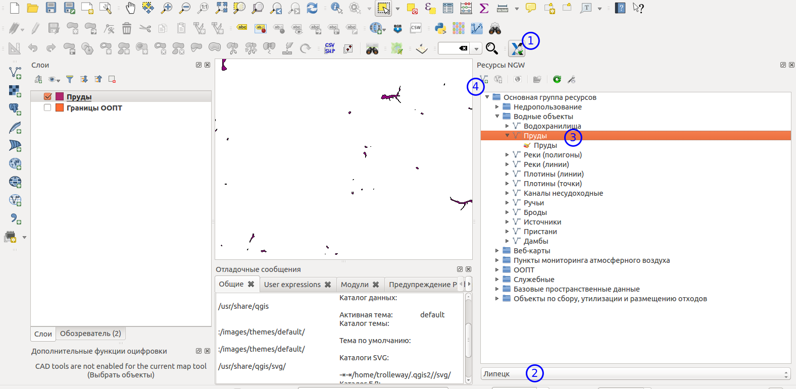

   Работа с модулем NGW Connect

   Обратите внимание, на то, что на иллюстрации выделен векторный слой. У него есть дочерний ресурс - это "векторный стиль", если его выделить, то на карту он не добавится.

В QGIS добавится векторный слой в формате GeoJSON. Править его нельзя, его можно только смотреть, или сохранить в другой файл на диске. Оформление слоя - не передаётся.

Добавление WFS слоев на карту
::::::::::::::::::::::::::::::::::::::::::::::

В QGIS возможно редактировать векторные данные, находящиеся в NextGIS Web.
В панели NGW видна группа под названием "Служебные". В ней находятся так называемые WFS-сервисы. 

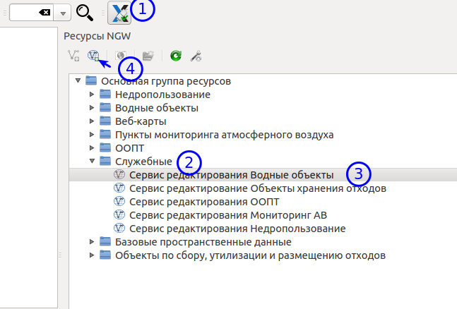

WFS сервис - это такой ресурс в NextGIS Web, который раздаёт данные по протоколу Web Feature Service - по нему можно редактировать векторные данные. В каждом WFS-сервисе находится несколько слоёв. 

1. Если панель ресурсов NGW выключена, то нажмите на кнопку Показать/скрыть панель NGW, Выберите в списке внизу панели ресурсов NGW подключение к вашему серверу, если их несколько.
2. В панели отобразится список ресурсов. Выберите пункт "Служебные", и один из сервисов редактирования.
3. Нажмите сверху в панели NGW кнопку Добавить WFS


У добавленных слоёв вы можете редактировать атрибуты и геометрию, и они сразу сохранятся на сервере. Редактирование осуществляется так же, как у SHP-файлов (см выше в этой инструкции). 

Редактирование слоев геоданных
``````````````````````````````````````````````

Описание клавиш для перемещения по карте: см. http://docs.qgis.org/1.8/ru/docs/user_manual/working_with_vector/editing_geometry_attributes.html#zooming-and-panning

Добавление нового объекта
::::::::::::::::::::::::::::::::::::::::::::::

См. http://docs.qgis.org/1.8/ru/docs/user_manual/working_with_vector/editing_geometry_attributes.html#adding-features

Изменение геометрии существующего объекта
::::::::::::::::::::::::::::::::::::::::::::::

См. http://docs.qgis.org/1.8/ru/docs/user_manual/working_with_vector/editing_geometry_attributes.html#digitizing-an-existing-layer

Изменение атрибутов существующего объекта
::::::::::::::::::::::::::::::::::::::::::::::

Удаление объекта
::::::::::::::::::::::::::::::::::::::::::::::

См. http://docs.qgis.org/1.8/ru/docs/user_manual/working_with_vector/editing_geometry_attributes.html#deleting-selected-features


Копирование объектов из одного слоя в другой
::::::::::::::::::::::::::::::::::::::::::::::

См. http://docs.qgis.org/1.8/ru/docs/user_manual/working_with_vector/editing_geometry_attributes.html#cutting-copying-and-pasting-features

Работа с системой через WEB интерфейс
----------------------------------------------

Вход на основную страницу сайта
``````````````````````````````````````````````
Адрес и пароли прилагаются в отдельном файле.

Вход в административный интерфейс сайта
``````````````````````````````````````````````
Адрес и пароли прилагаются в отдельном файле.


После входа в административный интерфейс, пользователь попадает на главную 
страницу, представленную на :numref:`LREGNGWadmin`.


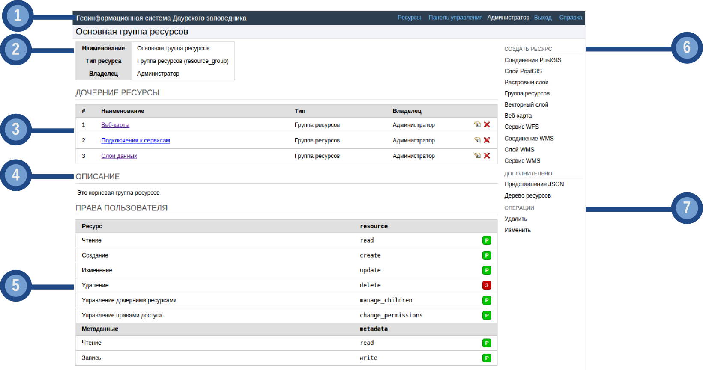

   Главная страница административного интерфейса	


Главная страница включает в себя блок основного меню, 
(см. :numref:`LREGNGWadmin` п. 1) в котором размещены следующие пункты:

* Ресурсы
* Панель управления
* Кнопка входа/выхода пользователя с индикацией текущего пользователя, 
  выполнившего вход.

Блок "дочерние ресурсы" (см. :numref:`LREGNGWadmin` п. 2) включает в себя 
перечень всех ресурсов, которые размещены в корневой группе. В блоке дается 
название ресурса, владелец ресурса, а также кнопка редактирования ресурса.

В блоке "Описание" (см. :numref:`LREGNGWadmin` п. 4) размещается описание 
корневого слоя (при наличии описания).

Блок "Права пользователя" (см. :numref:`LREGNGWadmin` п. 5) включает в себя 
перечень прав текущего пользователя на корневую группу. Зелёная отметка 
идентифицирует наличие соответствующего права. 


В блоке операций (см. :numref:`LREGNGWadmin`. 6 и 7) имеются инструменты для 
добавления данных и выполнения операций над корневой группой.

В веб-гис добавляются слои, сервисы, стили... - всё это называется ресурсами. Ресурсы могут образовывать группы (каталоги) - они тоже являются ресурсом.


Создание группового ресурса
``````````````````````````````````````````````

Ресурсы можно объединять в группы. Например, в одну группу можно сложить базовые данные, в другую группу –  космические снимки, в третью – тематические данные и т.д.

Группы служат для удобной организации слоев в панели управления, а также для удобного назначения прав доступа. 

Для создании группы ресурсов необходимо перейти в ту группу (корневая или др.) и в панели операций выбрать :menuselection:`Создать ресурс --> Группа ресурсов`. При этом откроется окно, представленное на :numref:`LREGNGWadminLayersCreateGroup`.

.. figure:: _static/admin_layers_create_group.png
   :name: LREGNGWadminLayersCreateGroup
   :align: center
   :scale: 75%

   Окно создания группы ресурсов

В открывшемся окне необходимо указать:

* Название группы
* :guilabel:`Ключ` – поле можно оставить пустым
* :guilabel:`Описание` – поле можно оставить пустым


И нажать :guilabel:`Создать`

Работа с векторными слоями
``````````````````````````````````````````````

Загрузка SHP файла на сервер
::::::::::::::::::::::::::::::::::::::::::::::

ля добавления векторного слоя перейдите в группу, где необходимо его создать. 
В блоке операций Создать ресурс выберите из списка вкладку Векторный слой. 
В открывшемся окне необходимо ввести Наименование слоя, которое будет отображаться 
в административном веб интерфейсе, а также в дереве слоев карты. 
Поля :guilabel:`Ключ` и :guilabel:`Описание` являются необязательными параметрами. 
Переключитесь с вкладки :guilabel:`Ресурс` на вкладку :guilabel:`Векторный слой`. Откроется окно, представленное на :numref:`admin_layers_create_vector_layer_resourse_description`. 

.. figure:: _static/admin_layers_create_vector_layer_resourse_description.png
   :name: LREGNGWadminLayersCreateVectoresoursedescription
   :align: center
   :scale: 75%

   Окно добавления векторного слоя

Далее необходимо выбрать систему координат, в которую будет перепроецированы векторные
данные (по умолчанию имеется только WGS84 / Pseudo Mercator (EPSG:3857) ). 

Далее необходимо указать сам исходный файл (кнопка Выбрать,
см. :numref:`LREGNGWadminVectorLayerUpload`).  
В качестве исходного файла можно загружать следующие форматы: 

* ESRI Shapefile;
* GeoJSON.

.. note:: 
   В случае ESRI Shapefile все составляющие его части (dbf, shp, shx, prj и др.) должны быть 
   упакованы в архив формата zip. 
   Шейп-файл должен быть в кодировке UTF-8 или Windows-1251.
   
   
Во входном файле не должно быть невалидных геометрий (в QGIS соответствующий 
инструмент должен выдавать пустой список невалидных геометрий), даты не должны иметь значения NULL, 
не должно быть полей с названиями: *id (ID), type(TYPE), source(SOURCE)*.
   
Cистема координат геометрий должна распознается GDAL (вывод gdalinfo должен содержать описание СК). 


.. figure:: _static/admin_layers_create_vector_layer_upload.png
   :name: LREGNGWadminVectorLayerUpload
   :align: center
   :scale: 75%

   Окно загрузки векторного слоя

Кроме того, необходимо указать кодировку, в которой записаны атрибуты.
Если кодировка не указана, то данные в ESRI Shapefile должен сопровождать файл с описание кодировки (расширение cpg).
В случае GeoJSON кодировка всегда UTF-8.

После удачной загрузки векторного файла необходимо создать стиль. 
При создании карты можно добавлять векторный слой на карту, указывая его стиль.


Настройка векторного слоя
::::::::::::::::::::::::::::::::::::::::::::::

См. http://docs.nextgis.ru/docs_ngweb/source/layers_settings.html

Настройка стиля для векторного слоя
::::::::::::::::::::::::::::::::::::::::::::::

См. http://docs.nextgis.ru/docs_ngweb/source/mapstyles.html

Работа с веб-картами
``````````````````````````````````````````````
http://docs.nextgis.ru/docs_ngweb/source/webmaps_admin.html

В веб-интерфейсе :program:`системы ГИС ИАС экологической паспортизации МР и ГО Липецкой области` набор подложек отличается от типового.
По умолчанию показываются тайлы Спутник (http://maps.sputnik.ru/). Картографческие данные - Openstreetmap, сервис поддерживается Ростелекомом, обновление нерегулярное. 
Пользователь может выбирать другие подложки: OSM Mapnik (данные Openstreetmap, регулярное обновление), подложки Google.

Создание новой веб-карты
::::::::::::::::::::::::::::::::::::::::::::::

http://docs.nextgis.ru/docs_ngweb/source/webmaps_admin.html

Редактирование существующей веб-карты
::::::::::::::::::::::::::::::::::::::::::::::

У существующей веб-карты вы можете 

* Менять порядок и наличие слоёв
* Включать и выключать слои
* Раскладывать слои по группам
* Менять стили (у одного слоя может быть несколько разных стилей)
* Задавать место, которое показывается на карте при её открытии

Включение\выключение слоев
''''''''''''''''''''''''''''''''''''''''''''''

Переименование слоев
''''''''''''''''''''''''''''''''''''''''''''''

Добавление векторного слоя на карту
''''''''''''''''''''''''''''''''''''''''''''''

Удаление векторного слоя с карты
''''''''''''''''''''''''''''''''''''''''''''''

Создание, переименование и удаление группы слоев
''''''''''''''''''''''''''''''''''''''''''''''

Редактирование основной веб-карты сайты
::::::::::::::::::::::::::::::::::::::::::::::


Изменение основной карты
''''''''''''''''''''''''''''''''''''''''''''''

В веб-интерфейсе :program:`системы ГИС ИАС экологической паспортизации МР и ГО Липецкой области` показывается одна карта - это та, у которой :guilabel:`Ключ` равен :guilabel:`public_map`.
При необходимости можно подготовить другую карту, выстаить у неё :guilabel:`Ключ` = :guilabel:`public_map`, а у старой - ключ убрать.

Работа со слоем районы Липецкой области
''''''''''''''''''''''''''''''''''''''''''''''
В веб-интерфейсе :program:`системы ГИС ИАС экологической паспортизации МР и ГО Липецкой области` справа показывается список районов - они берутся из слоя, у которого :guilabel:`Ключ` равен :guilabel:`districts`, название берётся из поля "district".

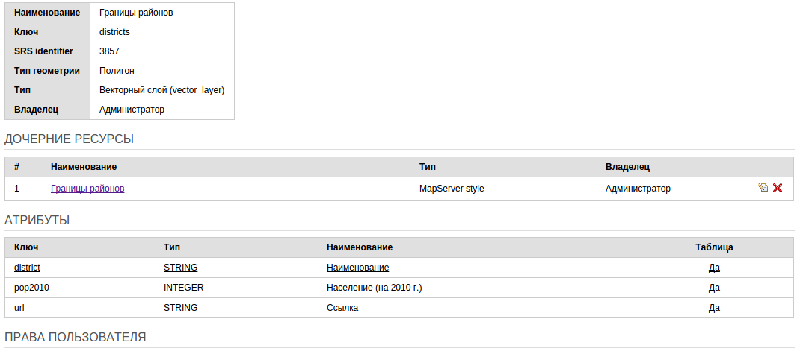

   Атрибуты слоя Границы районов
Работа со слоем Стационарные посты наблюдения
''''''''''''''''''''''''''''''''''''''''''''''

В системе :program:`ГИС ИАС экологической паспортизации МР и ГО Липецкой области` имеется слой "Станционарные посты". :guilabel:`Ключ` равен :guilabel:`stationary_posts`.
В него регулярно записывает данные внешняя система (1С).


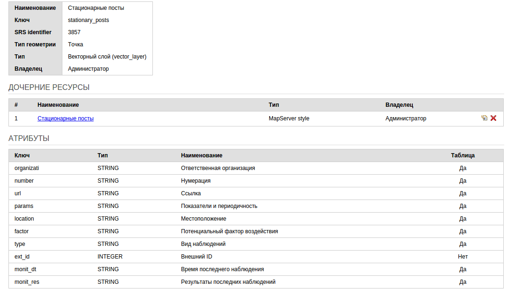

   Атрибуты слоя Стационарные посты наблюдения

Если добавится новый станционарный пост в 1С, то в веб-гис, в слое "Станционарные посты" нужно вручную создать новую запись. В поле ext_id указать значение из поля "Идентификатор для ГИС" в 1C.


Редактирование информации через веб интерфейс
----------------------------------------------


Открытие таблицы объектов из административного интерфейса
````````````````````````````````````````````````````````````````

Зайдите в административном интерфейсе в нужный слой, так что бы сверху на странице было написано :guilabel:`Тип  - векторный слой`.

Нажмите справа на ссылку :guilabel:`Таблица объектов`.

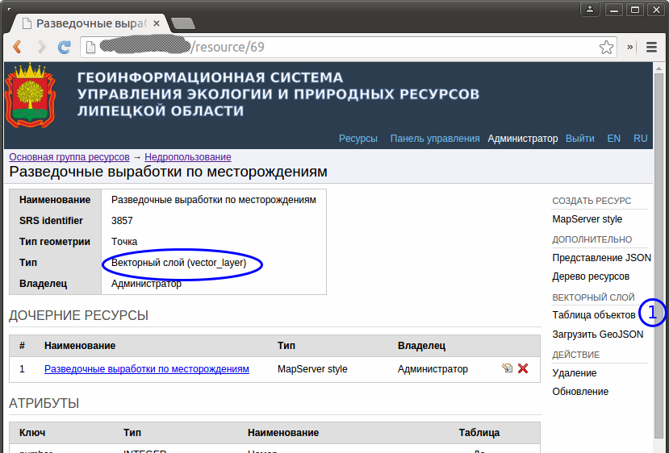
   
   Открытие таблицы объектов из административного интерфейса


Открытие карточки объекта из административного интерфейса
````````````````````````````````````````````````````````````````

Через веб-интерфейс можно изменять атрибуты слоёв, например исправлять названия. Геометрию через веб-интерфейс править нельзя, для этого нужен QGIS.
В таблице объектов нажмите на круглую кнопку в левом столбце таблицы. Нажмите на ссылку :guilabel:`Редактировать`.


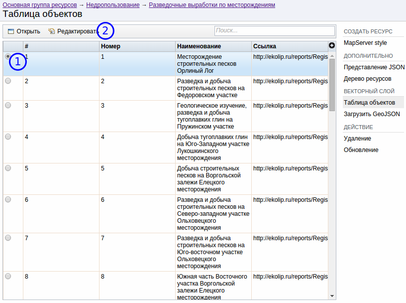

   Вызов из таблицы объектов карточки объекта


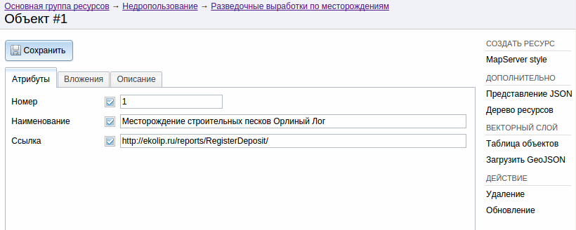

   Карточка объектов


Открытие таблицы объектов из веб-карты
````````````````````````````````````````````````````````````````

Выделите слой на веб-карте.

Сверху, над списком слоёв, нажмите на кнопку :guilabel:`Слой`, и в меню выберите :guilabel:`Таблица объектов`

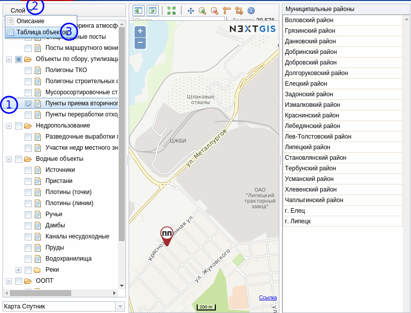

   Открытие таблицы объектов из веб-карты

В таблице объектов пользователь может просматривать данные всех объектов из слоя. 

Можно выделить объект, и пересестится к нему на карте, нажав кнопку "Перейти".
Можно выделить объект, и открыть его карточку, и отредактировать в ней его атрибуты (только если пользователь авторизован в административном интерфейсе).

Открытие карточки объекта из веб-карты
````````````````````````````````````````````````````````````````

Для редактирования необходимо сначала зайти в административный интерфейс, и авторизоваться. 

Выключите все слои на веб-карте, кроме одного.

Нажмите на кнопку Идентификация сверху над картой.

Нажмите на объект на карте.


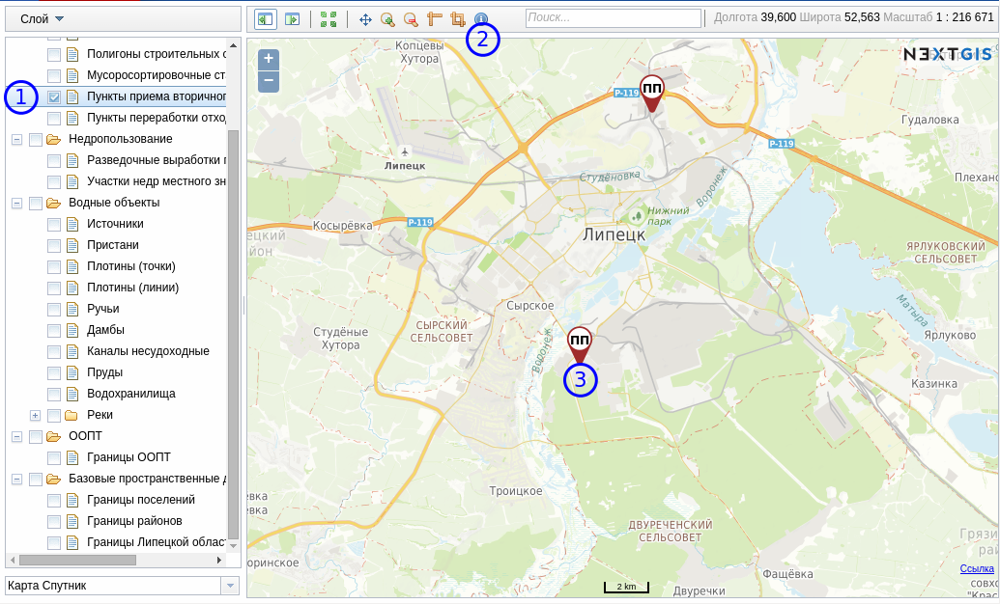

Появится окно идентификации. Нажмите в нём на кнопку редактирования. 


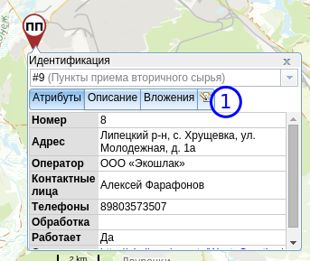

Откроется карточка объекта, в ней можно редактировать атрибуты.


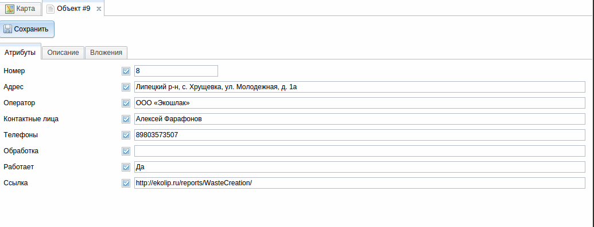
