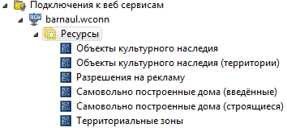
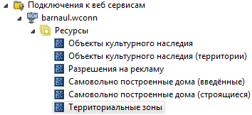

.. sectionauthor:: Денис Рыков <denis.rykov@nextgis.ru>

.. _barnaul:

Инструкция по использованию инструмента обновления данных в ИИС г. Барнаул    
==========================================================================

Для создания новых слоёв и обновления существующих используется
модифицированная версия программного продукта
`NextGIS Manager <http://nextgis.ru/nextgis-manager/>`_.
Модификация заключается в создании специального модуля, вынесенного
в отдельную панель:

   .. figure:: _static/barnaul-01.png
      :name: barnaul-toolbar
      :align: center

Если панель отсутствует, то нажмите на панели инструментов правой
кнопкой мыши и выберите *Уместить панели инструментов*,
после этого нужная панель должна появиться.

При создании нового слоя автоматически создаётся ресурс со стилем,
содержащим указание на то, что слой должен быть отрисован в соответствии
с символикой, представленной в MIF/MID.

Создание подключения к веб-порталу
----------------------------------

1. Запустите NextGIS Manager (ярлык *nextgismanager* на рабочем столе).
2. В случае, если в вашей сети используется прокси-сервер, то его параметры
   следует указать здесь: :menuselection:`Инструменты --> Параметры --> Сеть`.
3. В левой панели выберите :menuselection:`Подключение к веб-сервисам --> Создать --> Подключение к NGW`.
4. В открывшемся окне задайте названия подключения (произвольное),
   URL веб-портала, логин и пароль администратора портала.

   .. figure:: _static/barnaul-02.png
      :name: create_new_connection
      :align: center

5. Нажмите кнопку *Проверить подключение*, появится окно, отображающее
   результат выполнения проверки. Оно должно выглядеть следующим
   образом:

   .. figure:: _static/barnaul-03.png
      :name: check_connection
      :align: center

   Если окно выглядит по-другому, например, так:

   .. figure:: _static/barnaul-04.png
      :name: guest_connection
      :align: center

   или так:

   .. figure:: _static/barnaul-05.png
      :name: fail_connection
      :align: center

   то это означает, что вы неправильно задали параметры подключения.

6. Если предыдущий шаг пройден успешно, нажмите *OK*.

Подключение в веб-порталу
-------------------------

В левой панели раскройте пункт *Подключение к веб-сервисам* и дважды
нажмите на созданном на предыдущем этапе подключении. В результате
должно отобразиться дерево ресурсов, доступных на портале:

   Выбран корневой ресурс *Ресурсы* (создание)

   Выбран ресурс *Территориальные зоны* (обновление)

Загрузка нового слоя из MIF/MID + CSV
-------------------------------------

1. В дереве ресурсов выберите корневой ресурс *Ресурсы* (см. :numref:`resource-root`).
2. Нажмите кнопку |arrow_join|.
3. В открывшемся окне укажите: MIF-файл, CSV-файл,
   поле для связи в MIF-файле, поле для связи в CSV-файле,
   тип геометрии (в скобках указано количество объектов выбранного типа),
   имя выходного слоя, пункт *Не загружать невалидные геометрии*
   оставляем отключенным, после чего нажмите *OK*:

   .. figure:: _static/barnaul-08.png
      :name: load-mid-mif-csv
      :align: center

4. Запустится процесс преобразования геометрий:

   .. figure:: _static/barnaul-09.png
      :name: multigeometry
      :align: center

   и собственно сам процесс загрузки данных. В конце должно появиться
   окно, содержащее справочную информацию о результате выполнения
   загрузки:

   .. figure:: _static/barnaul-10.png
      :name: upload-final
      :align: center

Загрузка нового слоя из MIF/MID (без CSV)
-----------------------------------------

1. В дереве ресурсов выберите корневой ресурс *Ресурсы* (см. :numref:`resource-root`).
2. Нажмите кнопку |arrow|.
3. В открывшемся окне укажите MIF-файл, тип геометрии (в скобках
   указано количество объектов выбранного типа), имя выходного слоя,
   пункт *Не загружать невалидные геометрии*
   оставляем отключенным, после чего нажмите *OK*:

   .. figure:: _static/barnaul-11.png
      :name: load-mid-mif
      :align: center

Обновление существующего слоя из MIF/MID + CSV
----------------------------------------------

1. В дереве ресурсов выберите ресурс, который желаете обновить (см. :numref:`resource-select`).
2. Нажмите кнопку |arrow_circle|.
3. Дальнейшие действия аналогичны рассмотренным в разделе `Загрузка нового слоя из MIF/MID + CSV`_:

   .. figure:: _static/barnaul-12.png
      :name: update-mid-mif-csv
      :align: center

Обновление существующего слоя из MIF/MID (без CSV)
--------------------------------------------------

1. В дереве ресурсов выберите ресурс, который желаете обновить (см. :numref:`resource-select`).
2. Нажмите кнопку |arrow|.
3. Дальнейшие действия аналогичны рассмотренным в разделе `Загрузка нового слоя из MIF/MID (без CSV)`_:

   .. figure:: _static/barnaul-13.png
      :name: update-mid-mif
      :align: center

Замечание по обновлению данных
------------------------------

Обновление данных предполагает, что в новом наборе данных содержится
тот же перечень полей, что и на веб-портале. Если это не так, то
операция обновления неприменима. В этом случае нужно удалить старый слой
на веб-портале (можно сделать из NextGIS Manager), загрузить новый,
войти в административный интерфейс портала и добавить новый слой
(стиль) на карту.

