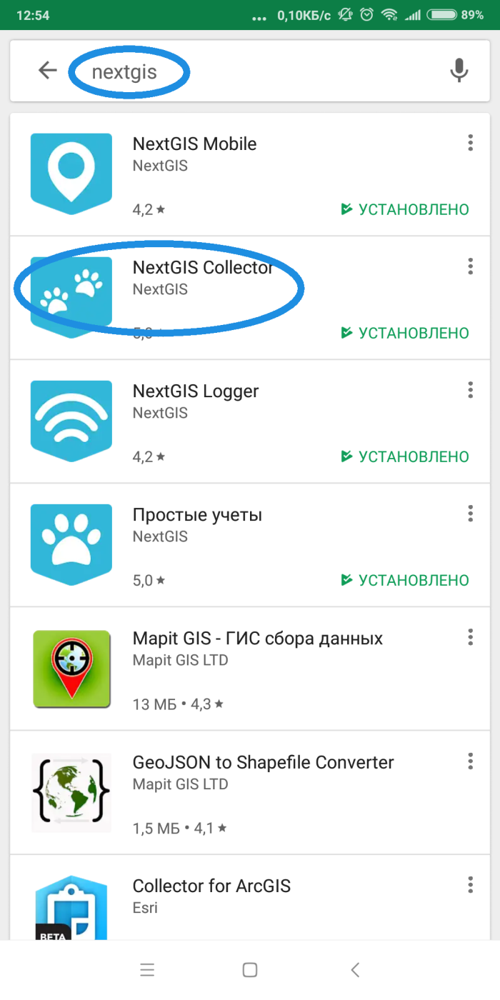
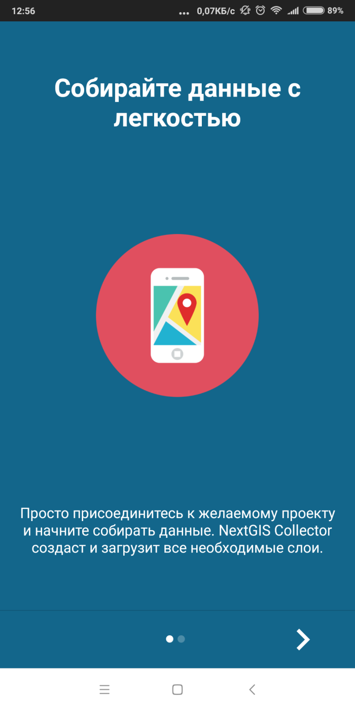
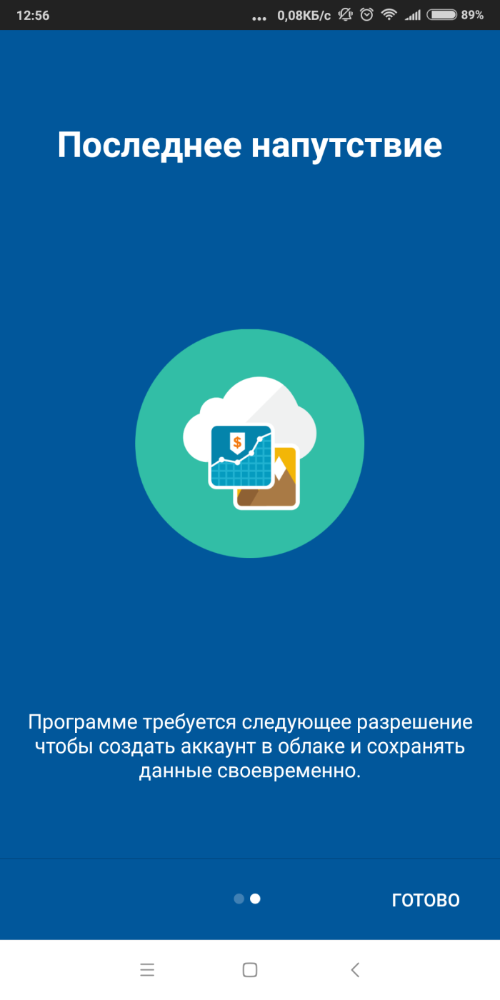
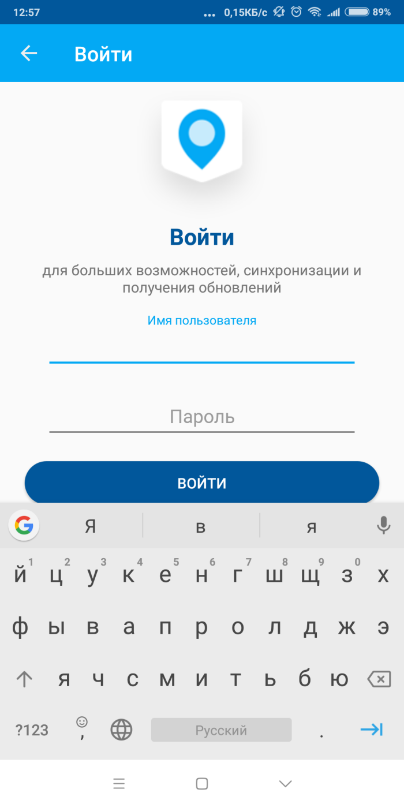
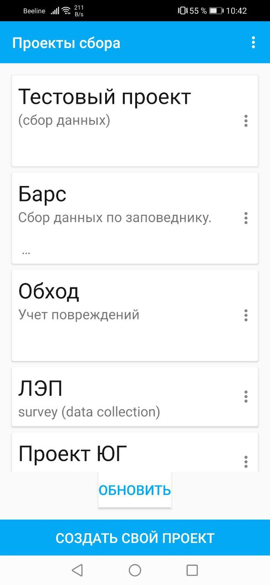
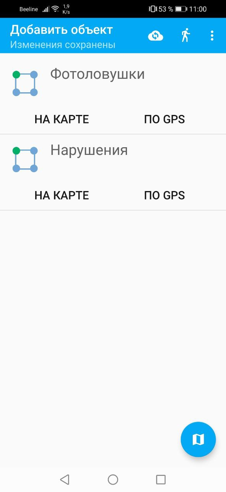
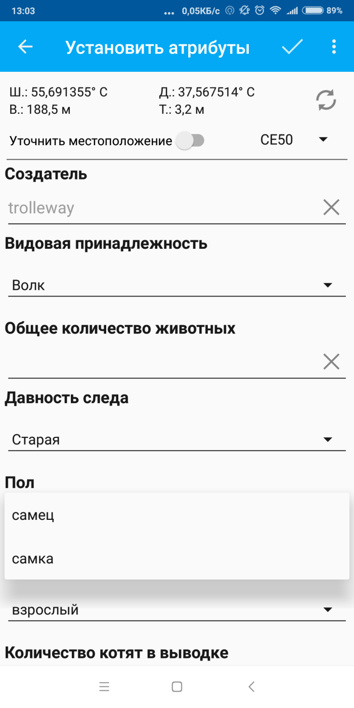

.. BarsUser:

Пример инструкции сборщика данных 
====================================================================

.. _cl_user_manual_prepare:

Подготовка
----------

1. Зайдите в Google Play, введите в строку поиска - nextgis, установите `NextGIS Collector <https://play.google.com/store/apps/details?id=com.nextgis.simple_collector>`_.

   
   Поиск в Play Market
  
  
  
2. Пока есть интернет, запустите NextGIS Collector, дайте все разрешения, которые запросит программа.

  

   
   Экран 1

  

   
   Экран 2
   
     

   
   Экран логина
   
3. Создайте аккаунт на `nextgis.com <https://my.nextgis.com>`_. Cсылка на создание аккаунта может быть спрятана под экранной клавиатурой.

4. Сообщите вашу электронную почту администратору сбора, чтобы он добавил вас в проект. 

5. Авторизуйтесь в приложении NextGIS Collector, используя в качестве логина адрес электронной почты, который вы ввели при регистрации.

6. В списке доступных проектов выберите нужный. 

7. В появившемся окне подтвердите, что хотите присоединиться к проекту, нажав **Да**.

Можно приступать к сбору данных.
   

.. _cl_user_manual_field:

Полевой сбор
------------
   
При открытии проекта вы увидите список доступных слоёв, в которые можно добавлять объекты.

   
В проекте можно собирать данные по нескольким типам объектов. Когда вы подойдёте к объекту, выберите нужный слой, и нажмите на экране кнопку **ПО GPS** - это значит поставить точку в том месте, где вы стоите. 

Кнопка **На карте** обозначает - поставить объект на карте. Например, если вы не можете подойти к нему вплотную и нужно указать местоположение вручную. 

   
В первый раз при добавлении объекта на карту приложение запросит разрешение на использование GPS и камеры. Дайте эти разрешения.

   
На экране появится форма ввода. По вопросам заполнения формы - обратитесь к администратору. 

В поля, где нужно выбрать значение из списка, например вид животного, можно вводить и свой текст с клавиатуры.

После завершения ввода объекта нажмите на галочку сверху экрана. Больше ничего делать не нужно, данные будут отправляться на сервер автоматически, когда появится интернет. 
 

.. _cl_user_manual_troubleshooting:

Возможные проблемы
------------------

**Невозможно зайти в NextGIS Collector, неверный логин или пароль**

Попробуйте зайти на `my.nextgis.com <https://my.nextgis.com>`_ с тем же логином (email) и паролем, используя любой браузер. Если тоже не заходит - зарегистрируйтесь тут же. Подтвердите email. Используйте логин (email) и пароль, указанные при регистрации, при входе в приложение.

**Зашел в приложение, но не вижу нужного проекта**

Обратитесь к администратору проекта, чтобы он добавил вас в проект.

