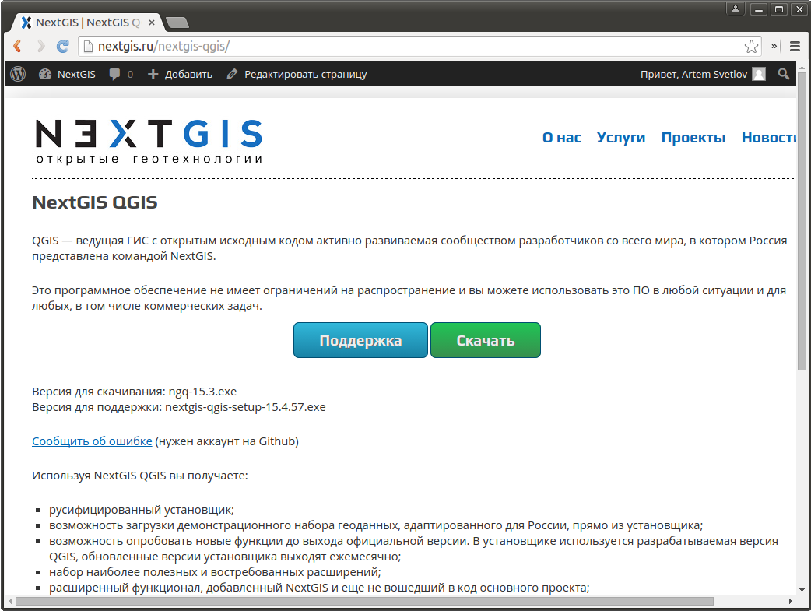
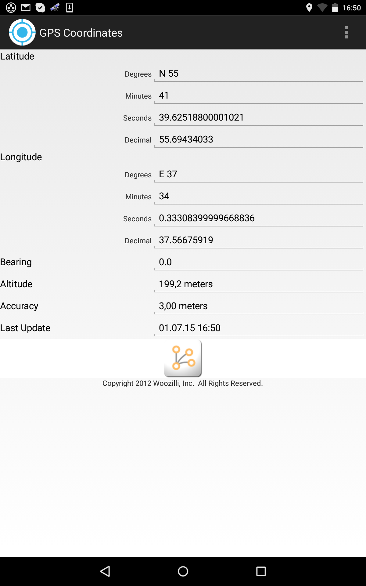
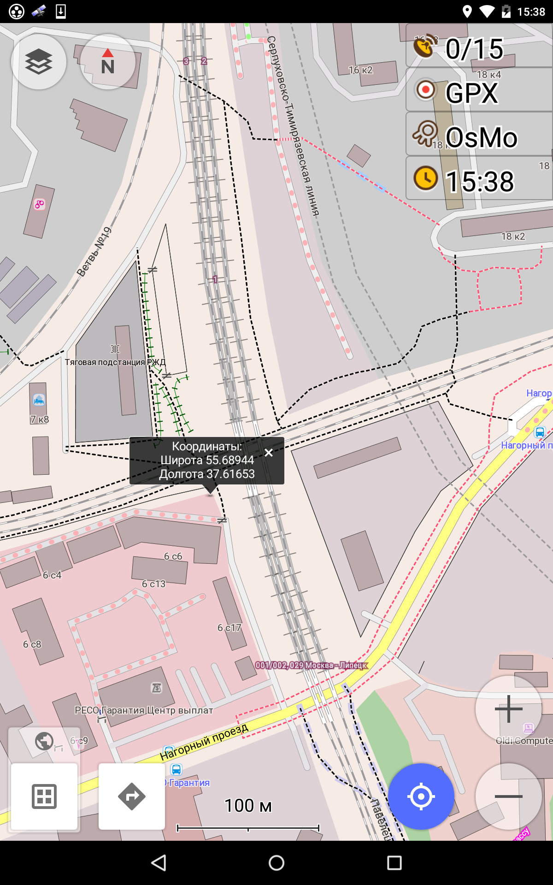

.. sectionauthor:: Артём Светлов <@nextgis.ru>

.. entels:

Демо-стенд ENTELS
=================

Установка виртуальной машины
----------------------------

Демонстрационный стенд представляет собой виртуальную машину - файл .ova, который открывается в :program:`VirtualBox`.
Устанавливаем и запускаем :program:`VirtualBox`.
В меню выберите :menuselection:`File → Import Appliance`, и в диалоге выбираем предоставленный вам файл с расширением .ova
В главном окне :program:`Oracle VM VirtualBox` должна создаться виртуальная машина с названием Nextgisweb, как на картинке

.. figure:: _static/vm_01.*

Выделяем её, и нажимаем :guilabel:`Settings` (2).
На вкладке :guilabel:`Network` выставляем настройки как на иллюстрации:

.. figure:: _static/vm_02.*

.. figure:: _static/vm_03.*

После завершения настроек запускаем виртуальную машину кнопкой :guilabel:`Start`.
Через минуту заходим браузером по адресу http://192.168.56.5/entels - там находится инстанс NextGIS Web, и по адресу http://192.168.56.5/entels_widget/ - там находится страничка с демо-стендом.

.. note:: Пароли: везде выставлены administrator/admin. В виртуальной машине ОС :program:`Ubuntu Server`. Все сервисы запускаются автоматически при старте виртуальной машины.

Установка QGIS
--------------

Заходим в интернет-браузере на адрес http://nextgis.ru/nextgis-qgis/.

Нажимаем кнопку "Скачать" 

.. image:: _static/qgis_download_02.*

Устанавливаем NextGIS как обычную программу для MS Windows.

Настройка QGIS после установки
------------------------------

Нам потребуется, что бы в QGIS были включены панели :guilabel:`Слои` и :guilabel:`Оцифровка`.

Если они отключены, то нажмите правой кнопкой мыши на пустом месте в панелях управления, и в открывшемся меню включите нужные пункты.

Создание WFS-сервиса в NextGIS Web
----------------------------------

Операция выполняется в админке :program:`NextGIS WEB`.

Для развёртывания WFS-сервиса необходимо добавить ресурс. В блоке операций выберите :menuselection:`Добавить → WFS-сервис`. Откроется типовое окно.
Введите наименование слоя, которое будет отображаться в в административном веб интерфейсе, а также в дереве слоев карты. 
На вкладке Сервис WFS добавьте в список ссылки на нужные вам слои. Для каждого добавленого слоя вам нужно указать уникальный ключ - можно скопировать его из названия. 

.. figure:: _static/admin_layers_create_wfs_service_layers.png
   :name: admin_layers_create_wfs_service_layers.png
   :align: center
   :scale: 75%

   Пример настроек WFS-сервиса для раздачи отдельных листов топокарт. 

После создания ресурса вам нужно перезайти в этот ресурс в админке. После этого выведется сообщение с URL WFS-сервиса.

Так же смотрите документацию по :program:`NextGIS WEB` на http://docs.nextgis.ru/.

Подключение WFS в QGIS
----------------------

Для этого шага вам необходимо знать

#. URL WFS-сервиса
#. Логин
#. Пароль

.. note:: Пароли: везде выставлены administrator/admin. 

Запускаем программу QGIS.

Заходим в меню :menuselection:`Слой --> Добавить слой --> Добавить слой WFS`

.. figure:: _static/qgis_wfs_01.*

В открывшемся окне :guilabel:`Добавить слой WFS` нажимаем кнопку :guilabel:`Создать`

.. figure:: _static/qgis_wfs_02.*

В открывшемся окне :guilabel:`Создание нового WFS-соединения` вводим параметры:

#. :guilabel:`Название` - вводим любое название
#. :guilabel:`Адрес` - URL WFS-сервиса
#. :guilabel:`Пользователь` - при наличии
#. :guilabel:`Адрес` - при наличии

.. figure:: _static/qgis_wfs_03.*

#. Далее выбираем созданное подключение и жмем "Подключится"
#. Выбираем из списка необходимые слои (у нас он пока один)

Подкладывание в QGIS картографической подложки
----------------------------------------------

Ищем в меню пункт :menuselection:`Интернет --> QuickMapServices`. Если его нет, то
Заходим в меню :menuselection:`Модули --> Управление модулями`.
В окне :guilabel:`Поиск` вводим название модуля QuickMapServices
Нажимаем кнопку :guilabel:`Установить модуль`.
Проверяем, что бы в списке посреди окна у этого модуля была установлена галочка.

.. figure:: _static/qgis_qms_01.*

Модуль установлен. Нажимаем :menuselection:`Интернет --> QuickMapServices --> OSM --> OSM Mapnik`.
Перемещаем в окне  :guilabel:`Слои` слой  :guilabel:`OSM Mapnik` вниз

Получение координат точек на Android
------------------------------------

Эта операция тривиальна, и доступна во множестве самых разных программ. Примеры:

GPS Coordinates
^^^^^^^^^^^^^^^

Установите из Google Play на Android-устройство бесплатную программу :program:`GPS Coordinates` (Woozilli, Inc).
В программе нас интересуют цифры из двух полей :guilabel:`Decimal`

Osmand
^^^^^^

Установите из Google Play на Android-устройство бесплатную программу :program:`Osmand`.
В программе нажмите и держите палец на нужном месте карты.

Высветится окно с подписанными координатами.

Добавление точки на WFS по координатам
--------------------------------------

В QGIS добавляем слой WFS (см. выше).
В QGIS устанавливаем плагин :program:`NumericalDigitize`.

.. figure:: _static/qgis_nmd_01.*

После его установки он добавит себя в панель инструментов редактирования и будет активен, только если слой в режиме редактирования.

Выделяем в меню слоёв слой с WFS-сервиса.
Включаем :menuselection:`Слой --> Режим редактирования`.
На панели инструментов должна активироваться кнопка плагина :program:`NumericalDigitize`. 

При его активации будет выведен вот такой диалог ввода координат:

.. figure:: _static/qgis_nmd_02.*

Выставляем галочку :guilabel:`Add a numerical feature` в :guilabel:`other`. Нажимаем на кнопку :guilabel:`Select`. В открывшемся окне в поле поиска вводим "4326", и выделяем систему координат WGS 84.

При всех этих манипуляциях, я предполагаю, что данные у нас в СК WGS84, с GPS или откуда-то еще. Поэтому надо что бы при сохранении (или вводе точек) была указана именно она (EPSG:4326).

.. note:: При вводе координат вручную надо учитывать то, что в разных окнах разных программ применяется разный порядок широты и долготы. Так например, перечисленные выше программы для парка Коломенское в Москве выдают такие координаты: 55.666, 37.666. В плагине :program:`NumericalDigitize` их нужно вводить в другом порядке: 37.666, 55.666

Добавление точек из электронной таблицы
---------------------------------------

Если у вас есть электронная таблица с координатами точек и другими атрибутами, то сохраните её в вашем редакторе электронных таблиц в формат CSV. В разных програмах - разные настройки, рекомендуется указать кодировку UTF-8.
Запускаем программу QGIS.
Заходим в меню :menuselection:`Слой --> Добавить слой --> Добавить слой CSV`

.. figure:: _static/qgis_csv_01.*

Далее, нужно провести анализ CSV-файла. В окне :guilabel:`Создать слой из текстового файла`, изменяя параметры в группе "Разделители" нужно добиться правильного разделения таблицы по столбцам.

После успешного добавления слоя из CSV, нужно так же добавить слой WFS. Включить режим редактирования слоя WFS. Далее, можно выделять объекты в слое CSV, копировать их, и вставлять в слой WFS. 

Загрузка тайлов для оффлайн работы
-----------------------------------

Для этого шага вам необходимо знать

#. URL ssh-подключения к серверу, где крутится инстанс
#. Логин
#. Пароль

Определяем зону охвата (BBOX) для региона, по которому нам надо скачивать тайлы.
Заходим в браузере на http://boundingbox.klokantech.com/
Снизу-слева в списке выбираем CSV
Выделяем на карте прямоугольником нужную область.

Подключаемся к серверу по протоколу SSH. На Windows для этого используется клиент putty, на Linux - ssh.
Для Ubuntu открываем консоль.

.. code-block:: bash

	ssh administrator@192.168.56.5
	sudo mkdir /usr/share/nginx/osm
	sudo apt-get install libgeo-osm-tiles-perl
	sudo downloadosmtiles --longitude=35:40 --latitude=54:56 --zoom=10:11 --destdir /usr/share/nginx/osm

Далее добавляем в секцию веб сервера путь до тайлов:

.. code-block:: bash

	sudo mcedit /etc/nginx/sites-available/default

	    location /osm {
		   root /usr/share/nginx/;
	    }

Добавляем тайловый слой в виджет

.. code-block:: bash

	cd /home/administrator/ngw_demo_front/ngw_demo_front/entels_demo/static/js/pages/entels_map.js
	sudo mcedit /home/administrator/ngw_demo_front/ngw_demo_front/entels_demo/static/js/pages/entels_map.js 
	#Добавляем после строки map.addOsmTileLayer();
	map.addTileLayer('OSM Local','http://192.168.56.5/osm/{z}/{x}/{y}.png');

После этого перезагружаем машину.
Теперь в картодвижке на демо-стенде будет доступен новый слой - с теми тайлами, что вы скачали

в заголовке некстгисмобайл, нужно системе NextGIS Web Entels.

