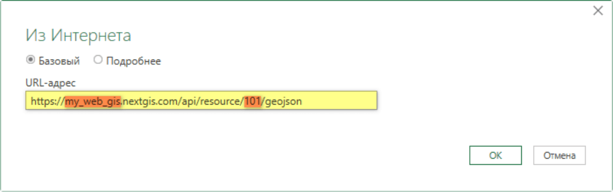
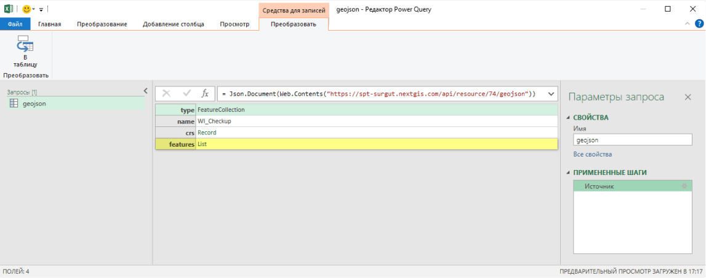
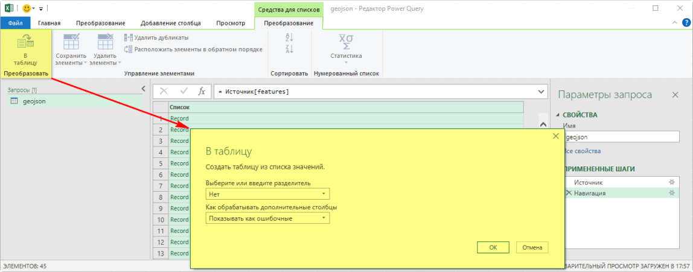
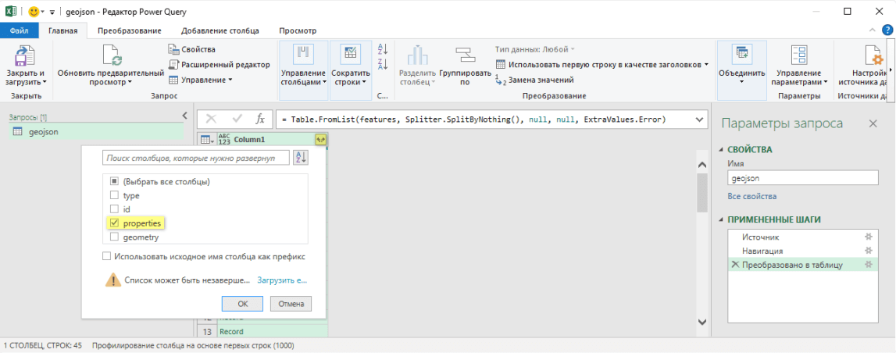
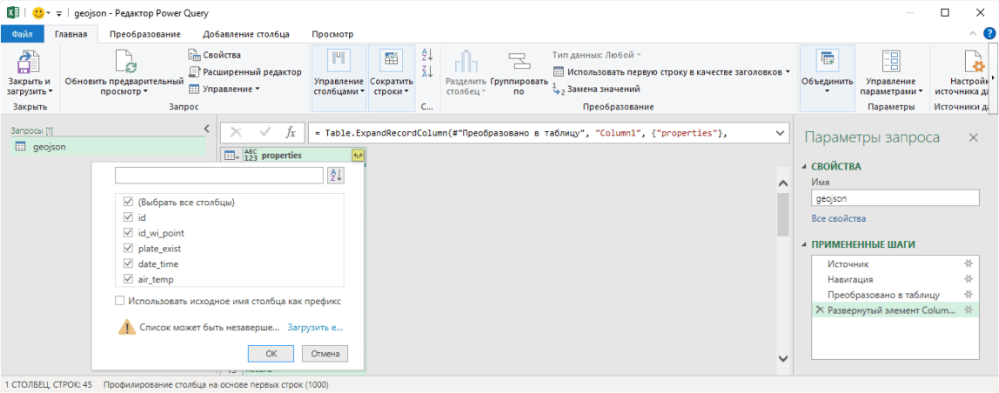
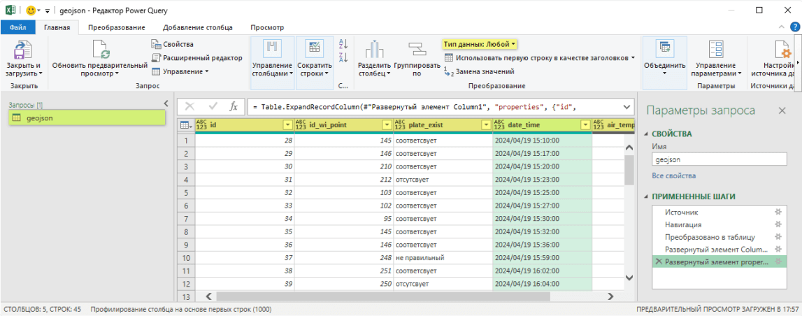
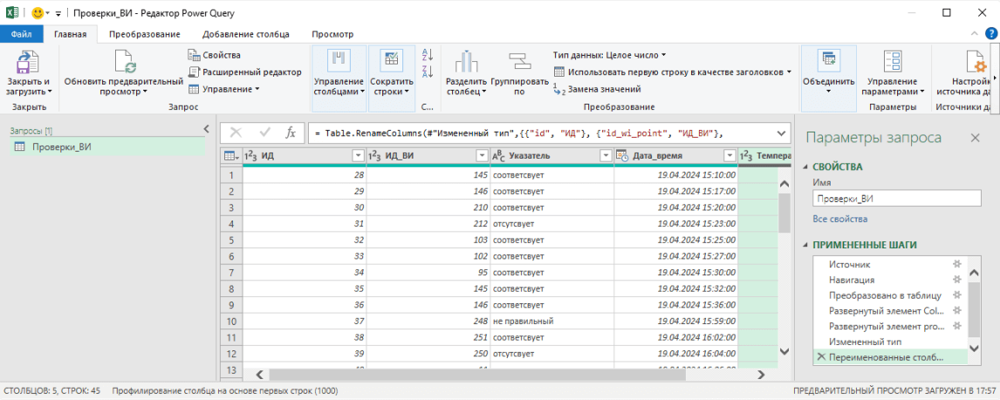
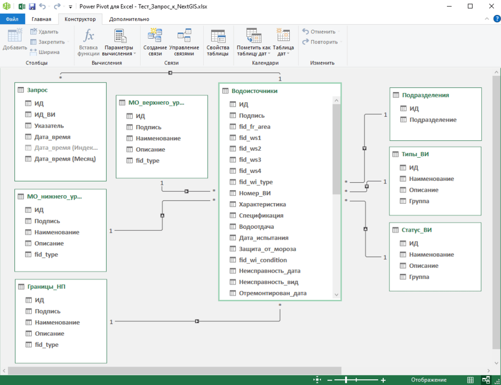

Подключение Excel
==================

Microsoft  Excel -  одна  из  наиболее  популярных  программ  для  работы  с  электронными  таблицами,  а также  функциональный  инструмент  визуализации  и  анализа  данных.  Надстройка **Power Query** (с версии 2016 встроена в Excel) позволяет подтягивать JSON из интернета и раскладывать его в таблицу.

Сервис NextGIS  WEB предоставляет  доступ  к  размещённым  данным  в  формате 
GeoJSON. Соответственно, можно настроить прямой доступ из файла Excel к сервису NextGIS Web.

Плюсы:
 
* постоянный доступ к актуальным данным (не нужно звонить, писать и ждать) 
* работа в привычном формате (Excel - самый популярный табличный редактор) 
* возможность анализа данных без интернет соединения (например в закрытой сети)

Обратите внимание: 

* для первоначальной настройки необходимы дополнительные знания (настраивается один раз, после чего можно поделиться файлом с коллегами) 
* в момент обновления данных всё же необходимо соединение с NextGIS Web

Ниже приводится пошаговый пример подключения к "таблице" на сервисе NextGIS Web из файла Excel: 

1. `Запустить настройку получения данных из интернета. <https://docs.nextgis.ru/docs_howto/source/excel.html#get-data>`_
2. `Источник - указать адрес ресурса NextGIS Web в формате GeoJSON. <https://docs.nextgis.ru/docs_howto/source/excel.html#source>`_
3. `Навигация - перейти к элементу содержащему данные ресурса. <https://docs.nextgis.ru/docs_howto/source/excel.html#query>`_
4. `Преобразовать в таблицу - распознать структуру элемента. <https://docs.nextgis.ru/docs_howto/source/excel.html#trasform>`_
5. `Развернуть элементы 1-го уровня (группы столбцов). <https://docs.nextgis.ru/docs_howto/source/excel.html#deploy-one>`_
6. `Развернуть элементы 2-го уровня (в двумерную таблицу). <https://docs.nextgis.ru/docs_howto/source/excel.html#deploy-two>`_
7. `Изменить тип данных - указать тип данных содержащихся в столбцах. <https://docs.nextgis.ru/docs_howto/source/excel.html#change-type>`_
8. `Переименовать столбцы и запрос. <https://docs.nextgis.ru/docs_howto/source/excel.html#rename>`_

Дополнительно:

* `Настройка модели данных. <https://docs.nextgis.ru/docs_howto/source/excel.html#model>`_

.. _1_get_data:

Шаг 1/8. Запуск настройки
--------------------------

.. admonition::  👉

   Данные --> Получить данные --> Из других источников --> Из Интернета

Для запуска настройки получения данных из интернета необходимо: 

1. В ленте перейти на вкладку **"Данные"**.
2. Выбрать в группе "Получить и преобразовать данные" раскрывающийся список **"Получить данные"**.
3. В раскрывшемся списке выбрать **"Из других источников"**.
4. В раскрывшемся списке выбрать **"Из Интернета"**.

.. _source:

Шаг 2/8. Источник
-----------------

Структура строки для получения доступа к ресурсу сервиса NextGIS Web в формате GeoJSON:

``https://[ваш адрес].nextgis.com/api/resource/[ID ресурса]/GeoJSON``

``https://[ваш адрес].nextgis.com`` - данный адрес формируется при регистрации в сервисе NextGIS Web. Замените часть адреса обозначенная как [ваш адрес], на данные указанные вами при настройке Веб ГИС.

Каждому ресурсу в Веб ГИС присваивается числовой идентификатор. Чтобы узнать адрес ресурса откройте Веб ГИС и перейдите к ресурсу. В адресной строке браузера после "/resource/" будет указан числовой идентификатор открытого ресурса.

.. _query:

Шаг 3/8. Навигация
------------------

Далее запустится окно редактора Power Query, в котором настраиваются дальнейшие шаги получения данных. Данные находятся в списке **"features: List"**. Нажмите на **"List"**, чтобы перейти к списку.

.. _trasform:

Шаг 4/8. Преобразование в таблицу
---------------------------------

.. admonition::  👉

   Преобразование --> В таблицу

   Преобразование в таблицу или структурирование данных

Для преобразования списка в структурированные данные необходимо: 

1. В ленте перейти на вкладку **"Преобразование"**.
2. Нажать на кнопку **"В таблицу"**.

Во всплывающем окне значения можно оставить без изменения. После выполнения команды редактор Power Query не создаст двумерную таблицу, как может показаться, а определит структуру данных.

.. _deploy_one:

Шаг 5/8. Развёртывание 1-го уровня
----------------------------------

Преобразованному в таблицу списку будет присвоено по умолчанию наименование "Column1". Справа от наименования появиться значок, позволяющий развернуть элемент. Также команда доступна при переходе:

.. admonition::  👉

   Вкладка Преобразование --> Структурированный столбец --> Развернуть

Во всплывающем окне необходимо отметить интересующие столбцы:

* Cтолбец **"id"** содержит уникальный числовой идентификатор записи в базе данных NextGIS Web. Можете отметить данный столбец, если ваша таблица не содержит идентификатора.
* Столбец **"properties"** основной, содержит таблицу ресурса.
* Cтолбец **"geometry"** содержит информацию о типе координат и сами координаты в проекции Web Mercator (EPSG:3857).

.. _deploy_two:

Шаг 6/8. Развёртывание 2-го уровня
----------------------------------

Полученный элемент **"properties"** необходимо развернуть далее в двумерную таблицу.

Справа от наименования доступен значок, позволяющий развернуть элемент. 

.. admonition::  👉

   Вкладка Преобразование --> Выпадающий список Структурированный столбец --> Развернуть

Во всплывающем окне можно выбрать интересующие столбцы ресурса.

.. _change_type:

Шаг 7/8. Изменение типа данных
-------------------------------

После выполнения предыдущих шагов данные уже доступны для использования. По умолчанию столбцам присваивается общий тип данных, и если не указать тип данных, то будет недоступна работа с датой и временем, возможны некорректные вычисления и т.д.

Указать тип данных содержащихся в столбцах можно несколькими способами. 

* Клик по названию столбца правой кнопки мыши с последующим выбором во всплывающем окне раскрывающегося списка **"Тип изменения"**;
* Выделение столбца и далее выбор значения из раскрывающегося списка **"Тип изменения"** на вкладке "Главная";
* Выделение столбца и далее выбор значения из раскрывающегося списка **"Тип изменения"** на вкладке "Преобразование".

.. _rename:

Шаг 8/8. Переименование
-----------------------

Из-за непонятных названий может быть трудно ориентироваться в имеющихся данных.

1. По умолчанию запросу присваивается название Запроса **"GeoJSON"**. Переименование доступно стандартными методами:

* по двойному клику левой кнопки мыши по названию запроса;
* клик правой кнопки мыши по названию запроса с выбором кнопки **"Переименовать"** во всплывающем окне;
* в окне "Свойства запроса", которое можно вызвать кнопкой **"Свойства"** на вкладке "Главная".

Наименование столбцов соответствует наименованиям хранимым в сервисе NextGIS Web т.е. обычно на латинице. Переименование доступно стандартными методами:

* по двойному клику левой кнопки мыши по названию столбца;
* клик по названию столбца правой кнопки мыши с выбором кнопки **"Переименовать"** во сплывающем окне.

Далее нажмите **Закрыть и загрузить**. Сформированная таблица будет открыта. Её можно сохранить как файл XLSX обычным образом.

.. _model:

Настройка модели данных
-----------------------

В одном файле Excel можно настроить несколько запросов к ресурсам NextGIS Web. Если данные ресурсы связаны между собой, то необходимо настроить связи между ними и в файле Excel. Данную настройку должен выполнять пользователь: 

* знакомый со структурой созданных ресурсов в сервисе NextGIS Web;
* имеющий понятие о типах связей между таблицами, внутренних и внешних ключах.

Для настройки связей необходимо:

* Активировать надстройку "Microsoft Power Pivot for Excel"
* Загрузить - Добавить запросы в модель данных
* Создать связи между запросами.

