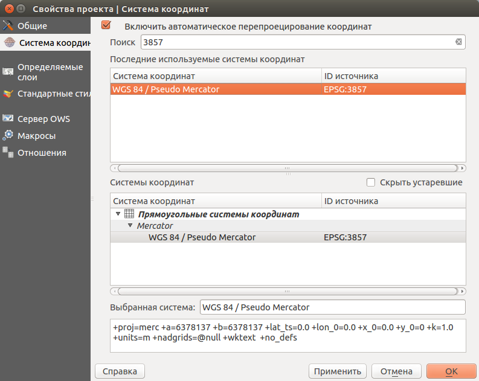
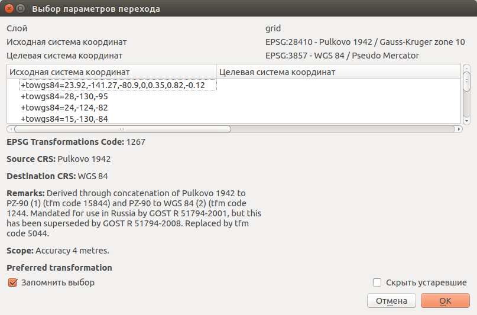
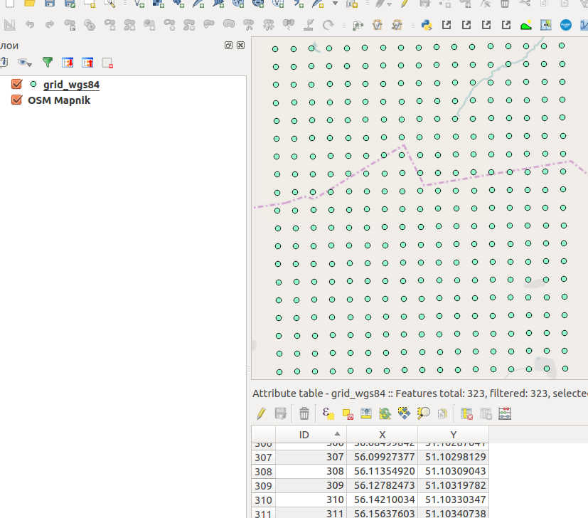
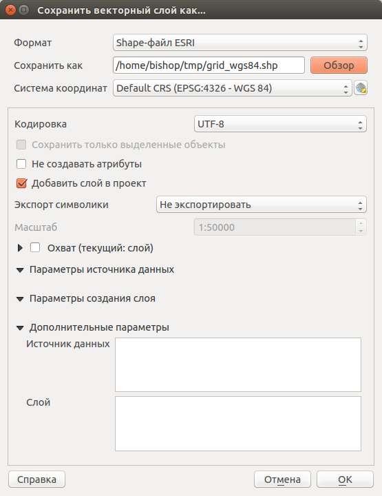
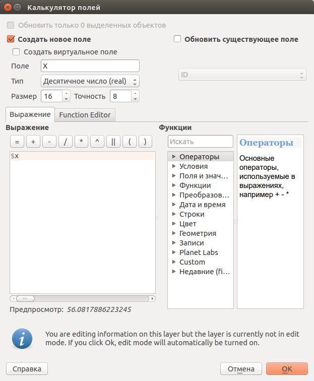

.. sectionauthor:: Дмитрий Барышников <dmitry.baryshnikov@nextgis.ru>

.. _grid_vertext_extract:

Получение координат прямоугольной сетки Гаусса-Крюгера в градусах на эллипсоиде WGS84  
======================================================================================

Для извлечения координат узлов прямоугольной сетки в проекции Гаусса-Крюгера и 
преобразование их в градусы на эллипсоиде WGS84 необходимо выполнить ряд шагов:
    
1. Подготовить сетку точек в узлах прямоугольной сетки Гаусса-Крюгера соответствующей
   зоны.
2. Перепроецировать точки в систему координат WGS84 с указанием 7 параметров перехода
   между эллипсоидами.
3. Извлечь из координат точек значения в таблицу атрибутов в колонки X и Y.        

Подготовка сетки точек
----------------------

Для подготовки сетки точек следует использовать ГИС NextGIS QGIS. В NextGIS QGIS
устанавливаем систему координат карты (иконка глобуса в левом нижнем углу) и 
выставляем EPSG:28410 (система координат Гаусса-Крюгера 6-ти градусная зона 10).
Далее, вызываем меню :menuselection:`Вектор --> Выборка --> Регулярные точки...`. 
В открывшемся диалоге (см. :numref:`howto_regular_points_pic`) вводим следующие данные.

.. figure:: _static/regular_points.png
   :name: howto_regular_points_pic
   :align: center
   :width: 10cm
   
   Диалог "Регулярные точки".
   
   
Отмечаем "Исходные координаты" и вводим координаты углов прямоугольника, в которые
необходимо вписать сетку: 

* Мин. Х - 10436000
* Мин. Y - 5664000
* Макс. Х - 10452000
* Макс. Y - 5682000

Шаг сетки выставляем в 1000 м. Указываем путь и имя файла для сохранения. Далее 
нажимаем кнопку "ОК". После формирования файла, он будет добавлен в виде слоя 
в окно карты. Для проверки корректности формирования точек добавим онлайн подложку.
Для этого выполним :menuselection:`Интернет --> QuickMapServices --> OSM --> OSM Mapnik`. 
При этом, необходимо выставить СК карты EPSG:3857 Google merkator 
(см. :numref:`howto_select_srs_pic`).

   
   Диалог "Установка системы координат".

Так как эллипсоиды у подложки и слоя точек отличаются, должен отобразиться диалог 
выбора параметров перехода (см. :numref:`howto_parameters_srs_pic`). 

   
   Диалог "Выбор параметров перехода".
    
В диалоге необходимо выбрать следующие параметры: 
+towgs84=23.92,-141.27,-80.9,0,0.35,0.82,-0.12.

Пример получившейся карты представлен на :numref:`howto_sample_map_view_pic`.

   
   Фрагмент окна карты NextGIS QGIS.
  
Перепроецирование точек в систему координат WGS84 
-------------------------------------------------
   
Для перепроецирования точек в систему координат WGS84 с указанием 7 параметров 
перехода необходимо в дереве слоев вызвать контекстное меню и выбрать :menuselection:`Сохранить как...`. 
В открывшемся диалоге (см. :numref:`howto_save_as_pic`) необходимо указать систему координат
EPSG:4326 (WGS84). 

   
   Диалог "Выбор параметров перехода".

Так как мы указали параметры перехода между эллипсоидами, то
дополнительно указывать параметры перехода не требуется. В случае, если диалог выбора 
параметров будет показан, то необходимо выбрать такие же параметры:
+towgs84=23.92,-141.27,-80.9,0,0.35,0.82,-0.12.    

Извлечение координат точек в колонки X и Y таблицы атрибутов 
------------------------------------------------------------

Для извлечения координат точек в таблицу атрибутов слоя необходимо открыть таблицу
атрибутов. В таблице атрибутов активировать калькулятор поля (ctrl+i) - см. 
:numref:`howto_field_calc_pic`.

   
   Диалог "Калькулятор поля".
 
Для добавления координаты Х в калькуляторе поля выбрать:
    
1. Создать новое поле.
2. Имя поля - Х.
3. Тип поля - десятичное целое (real).
4. Размер - 16, точность - 8.
5. Выражение - $x .

Далее нажимаем "ОК".

Для добавления координаты Y в калькуляторе поля выбрать:
    
1. Создать новое поле.
2. Имя поля - Y.
3. Тип поля - десятичное целое (real).
4. Размер - 16, точность - 8.
5. Выражение - $y .

Далее нажимаем "ОК".

