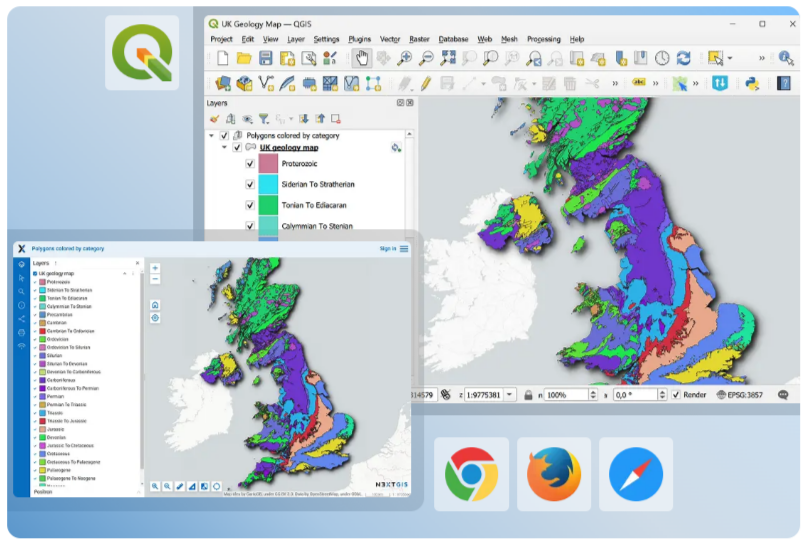
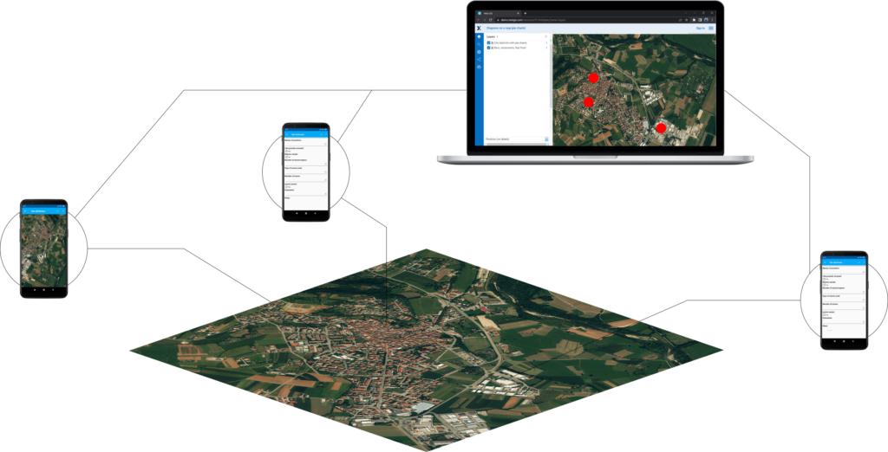

Tutorials
=========

Download a starter data kit and follow detailed step-ty-step instructions to get to know NextGIS platform with first-hand experience.

1. `Store, manage and publish your spatial data <https://docs.nextgis.com/docs_ngcom/source/tutorial_webgis.html>`_

2. `Seamless QGIS Integration <https://docs.nextgis.com/docs_ngcom/source/tutorial_qgis.html>`_

3. `Collect Spatial Data in the Field <https://docs.nextgis.com/docs_howto/source/tutorial_collect.html>`_

4. `Track Asset and Team Locations in Real Time <https://docs.nextgis.com/docs_howto/source/tutorial_track.html>`_

.. toctree::
   :maxdepth: 1
   :hidden:

   tutorial_collect
   tutorial_track
