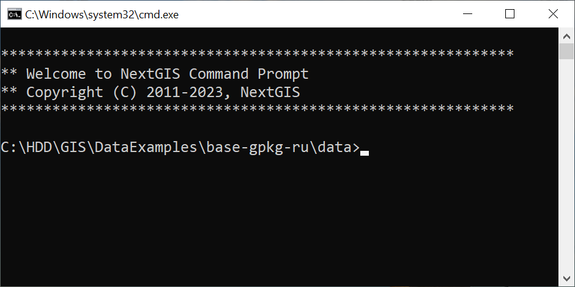
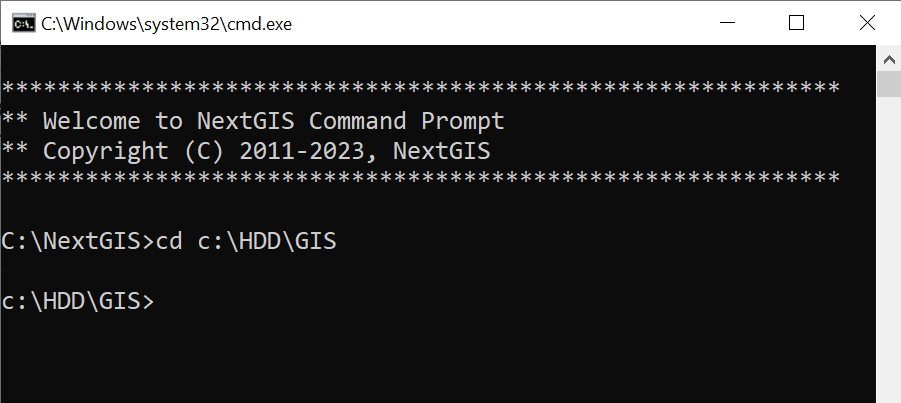

Использование консольных инструментов NextGIS Command Prompt
===============================================================

Некоторые задачи в области ГИС нельзя или неудобно выполнять через графический интерфейс и для их выполнения нужны консольные инструменты (утилиты). В состав настольного ПО NextGIS входят утилиты gdalinfo, ogr2ogr, curl и многие другие.

Запуск консоли
------------------------

Запуск утилит осуществляется через специальную консоль. Открыть консоль можно несколькими способами:

* В меню **Пуск** она называется **NextGIS Command Prompt**. 
* Также ее можно запустить открыв файл **ng.bat** из папки, куда установлено ПО NextGIS. Полный путь к файлу выглядит так: ``c:\NextGIS\ng.bat`` (в вашей системе он может отличаться).
* Третий вариант - в Total Commander перейдите в директорию, где лежат данные, которые хотите обработать, и наберите с клавиатуры ``ng``. В этом случае при запуске в консоли сразу будет открыта нужная папка.

Запущенная консоль выглядит так:

Переход к нужной папке
-----------------------------------

Системная подсказка (промпт) консоли показывает текущую рабочую папку. При запуске через "Пуск" это папка NextGIS. 

Для начала работы, как правило, необходимо перейти в папку, где лежат обрабатываемые данные.
Для этого служит команда ``cd``. 

Например, перейдём в папку GIS, указав полный путь до неё:

``cd C:\HDD\GIS``

Если нужно ли сменить диск при смене папки, то сначала необходимо добавить ключ /D. Например: ``cd /D D:\temp``.

