.. sectionauthor:: Артём Светлов <@nextgis.ru>

.. pt-zapovednik:

Инструкция оператора системы ГИС Приокско-Террасного заповедника
=============================================================================================

.. 
   Установка и запуск ПО
   Описание базовых операций ПО 
   -Открытие проекта
   -Видимость и порядок слоёв
   -Настройка стилей слоя
   -Просмотр таблицы атрибутов
   -Плагин IdentifyPlus
   -Настройка макет
   Описание импорта из Lesis
   Ссылки на другие инструкции

Описание ПО ГИС
----------------------------------------------

Комплекс программного обеспечения состоит из:

* Настольной :abbr:`ГИС (геоинформционной системой)` :program:`NextGIS QGIS` - это программа под ОС Windows, в которой работают с геоданными.
* Плагин к программе :program:`NextGIS QGIS` - :program:`lesis2sqlite`, который подготавливает выгрузку из :program:`ГИС TopoL (Lesis)`.
* Плагин к программе :program:`NextGIS QGIS` - :program:`IdentifyPlus`, который показывает атрибуты из выгрузки.
* Сохранённого проекта 

Использование ПО ГИС 
---------------------------------------------------------

Пользователь открывает в программе :program:`NextGIS QGIS` сохранённый проект. В нём он может просматривать геоданные: это имеющиеся выгрузки лесоустроительной информации, космоснимки. Так же пользователь может делать все операции доступные для program:`NextGIS QGIS`.
При необходимости можно импортировать другую выгрузку из :program:`ГИС TopoL (Lesis)` в :program:`NextGIS QGIS`. 

Далее в документации приведены детальные инструкции по использованию ПО.

Установка и запуск ПО
----------------------------------------------

ПО :program:`NextGIS QGIS` работает под ОС :program:`Microsoft Windows`, и устанавливается как обычное приложение. 

.. note::

   Рекомендуется установка под пользователем с логином латинскими буквами. При запуске под пользователем с русскими буквами в названии не гарантируется работа модулей.

В нашей сборке присутствуют модули :program:`IdentifyPlus`, :program:`lesis2sqlite`. Если вы захотите поставить новую версию :program:`NextGIS QGIS` - поставьте их через менеджер модулей.

Если на компьютере доступ в интернет осуществляется через прокси-сервер, то нужно внести настройки прокси-сервера в настройки  :program:`NextGIS QGIS`. Для этого:

1. Откройте пункт меню :menuselection:`Установки --> Параметры --> Сеть`.  
2. Включите галочку "Использовать прокси-сервер"
3. Выберите тип прокси - HttpProxy
4. Откройте веб-браузер, в котором работает интернет, найдите его настройки прокси, и перепишите оттуда в :program:`NextGIS QGIS` адрес сервера и порт.

Запуск приложения NextGIS QGIS
``````````````````````````````````````````````

Запускается как обычное приложение под Windows. Для запуска необходимо запустить ярлык с названием NextGIS QGIS (15.5.109***) (или новее)

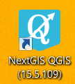

   Запуск программы по ярлыку.


Описание базовых операций ПО 
----------------------------------------------

Геоданные бывают векторные и растровые.
Векторные данные обычно хранятся как электронная таблица, где у каждой записи есть своя геометрия - то есть фигура, заданная координатами точек. 
Растровые данные обычно хранятся как картинка, в которой указано, на какое место земного шара она ложится. 

Существует множество форматов хранения геоданных, и протоколов их передачи по сети. Они могут представлять собой файлы, или находится в базах данных. 
Преобразованием форматов занимаются утилиты GDAL (растровые) и OGR (векторные). Благодаря этим утилитам NextGIS QGIS может читать и записывать разные форматы данных без сильных различий для пользователя.
Разумеется, обычно используются только самые общеупотребительные форматы.  


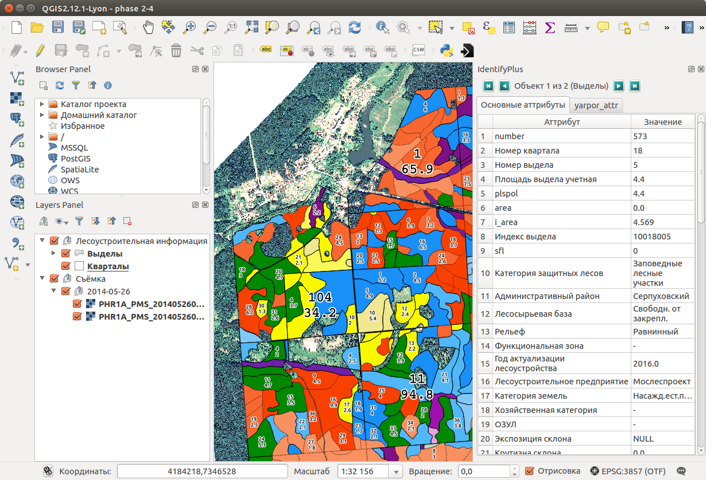

   Общий вид окна QGIS.


Открытие проекта
``````````````````````````````````````````````

Проект - это сохранённое состояние сессии :program:`NextGIS QGIS`. Программа работает с одним проектом за раз. Для сохранения проекта воспользуйтесь :menuselection:`Проекты --> Сохранить как`. Для открытия проекта используйте комманду :menuselection:`Проекты --> Открыть`.  или  :menuselection:`Проекты --> Открыть недавние`.


Если вы хотите очистить сеанс и начать новый, выберите :menuselection:`Проекты --> Создать`. Вам будет предложено сохранить существующий проект.

Информация, сохраненная в файле проекта, включает в себя:

* добавленные слои
* Which layers can be queried
* Свойства слоя, включая стили и символику.
* Проекцию окна карты
* Последний охват карты
* Макеты
* Настройки макетов
* Настройки атласов макетов
* Настройки оцифровки
* Связи между таблицами
* Макросы
* Стили по умолчанию
* Настройки плагинов

Состав проекта
``````````````````````````````````````````````

* Лесоустроительная информация
* Снимки с космического аппарата Pleiades.


Видимость и порядок слоёв
``````````````````````````````````````````````

Понятие Слой будет часто встречаться в инструкции. Слой - это то, что видно в списке слоёв, технически это один файл, или одна таблица в БД. 
Их можно включать и выключать. Можно изменять порядок и объединять в группы.


Слева-внизу на экране :program:`NextGIS QGIS` находится панель слоёв. Нажатием галочки у каждой записи можно включать-выключать показ слоя.

Слой в панели можно выделить и перетащить вверх или вниз, для измерения порядка слоёв. Порядок слоёв обозначает, что слои, находящиеся сверху в списке рисуются поверх слоёв находчщихся снизу списка. 


Cлои в панели слоёв могут быть объединены в группы. Есть два способа:

1. Нажать кнопку добавления новой группы. Ввести имя новой группы и нажать Enter. Нажать на существующий слой и перетащить его в группу.
2. Выделить несколько слоёв, нажать правой кнопкой в окне слоёв, и выбрать :guilabel:`Сгруппировать выделенное`. Выбранные слои автоматически поместятся в новую группу. 

Что бы вынести слои из группы, вы можете вытащить их перетаскиванием, или нажать правой кнопкой на них и выбрать :guilabel:`Сделать элементом первого уровня`.

Группы могут быть вложены в другие группы.

Флажок возле имени группы даёт возможность переключать видимость всех слоев в группе одним действием.

Содержимое контекстного меню слоя, вызываемого правой кнопкой мыши, зависит от того, растровый это слой, или векторный.


Как ставить модули
``````````````````````````````````````````````

Вам потребуется подключение к сети. 

Для установки и обновления плагинов необходимо нажать :menuselection:`Модули --> Управление модулями`.

Если вам надо установить плагин, введите часть его названия в панель Поиск. 


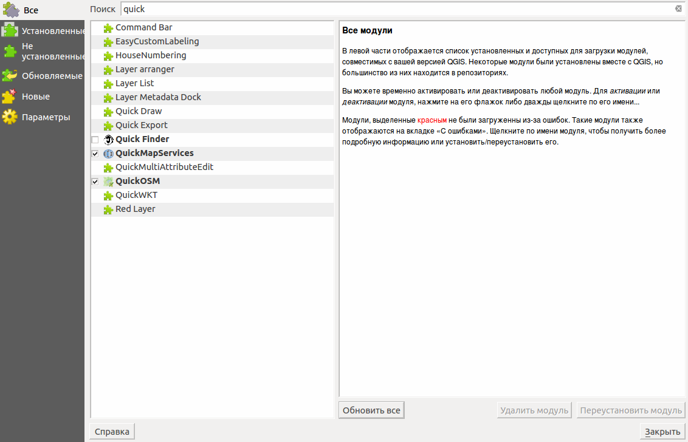

Выберите в списке нужный модуль, и нажмите кнопку Установить модуль. 

Модули могут быть установленными, но не включёнными: если в списке у модуля не установлен флажок, то он не будет заргужаться.

Если вы ввели название правильно, а модуля, который нужно поставить не нашли, то выполните следующие операции

* Проверьте, может быть он назван на другом языке.
* Проверьте на вкладке Параметры - у репозиториев должна быть зелёная отметка. Если красная - значит проблемы либо в подключении к интернету, либо с сервером.
* Попробуйте включить галочки Разрешить установку экспериментальных модулей
* Проверьте, вдруг нужный модуль - в каком-то специальном репозитории, спросите у того, кто вам про него сказал. 


Фоновые картоподложки из интернета
``````````````````````````````````````````````

Модулем QuickMapServices можно добавить слой с картоподложкой из интернета - например Openstreetmap, карты Спутник, карты Яндекс, публичную кадастровую карту РФ - и многие другие.

Установите модуль QuickMapServices.
После установки модуля нужно обновить список подложек. Зайдите в меню :menuselection:`Интернет --> QuickMapServices --> Настройки`, вкладка :guilabel:`Дополнительные сервисы`, нажмите кнопку :guilabel:`Получить дополнительные источники данных`. 

После установки расширения в панели инструментов "Интернет" появится кнопка расширения. Так же появится группа QuickMapServices в одноименном меню.

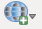

Кнопка является контейнером для базовых карт из различных источников.

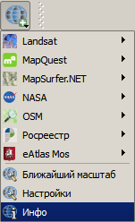

При выборе одной из них, карта автоматически подключается в проект в качестве слоя. 

Настройки сервисов хранятся отдельно от самого модуля и при удалении-обновлении модуля они не удаляются.


.. figure:: _static/modules_Qms-main.jpg

    Базовая картографическая основа и слой кадастрового деления с Публичной кадастровой карты


.. note::
    Если вы планируете распространять производную работу на основе подложки из интернета - ознакомьтесь с условиями использования данной подложки, что бы не нарушить законы об авторских правах. Если вы используете подложку OSM Mapnik - то конечную работу достаточно подписать «© Участники OpenStreetMap». Для подложки Карта Спутник - «© Спутник © Openstreetmap». Другие подложки и космоснимки могут иметь более строгие ограничения на использование. 


Настройка стилей слоя (краткое описание)
``````````````````````````````````````````````


Оператор ГИС может легко настраивать стили слоёв визуальным способом. В зависимости от значений отдельных объектов можно рисовать их разным цветом, скрывать с карты, выводить на подписи разные значения. 


Слои бывают растровые и векторные. Стилизацию растровых слоёв мы опустим, поговорим про векторные.
Векторные слои в QGIS могут быть либо точечные, либо линейные, либо полигональные, соответственно их настройки чуточку отличаются. 
Для настройки стиля нужно зайти в меню. Меню типа классификации (сверху слева) обозначает, как рисовать разные объекты. Обычный знак - значит что все объекты будут рисоваться одинаково, остальные варианты - значат что разные объекты будут рисоваться по-разному в зависимости от их значений.

Точечные
^^^^^^^^^^

Обычно точечные слои рисуются кружками, квадратиками, или другими значками.


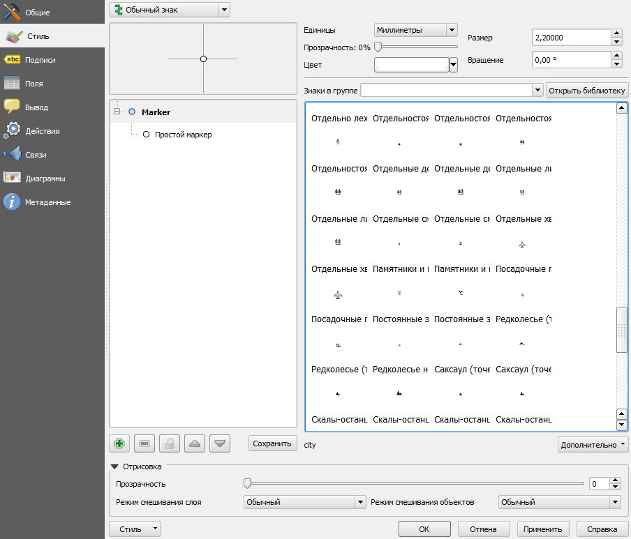

   Окно свойств стиля.

   1 - выбор рендерера, 2 - диалог слоёв значка, 3 - кнопка добавления слоя значка

При нажатии на диалог слоёв значка, появится окно, в котором можно задавать цвета.


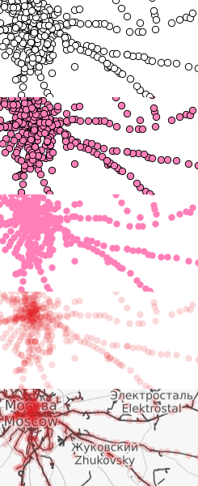

   Отображение значков при разных настройках цветов.


У значков можно менять цвет заливки и цвет обводки.


Если вам нужно выводить более сложный значок, то их можно подгружать из SVG. Так же можно выводить несколько значков наложенными друг на друга. 
По нажатию кнопки с зелёным плюсом добавится новый слой значка. Если нажать на значок в вертикальном списке, то появится окно настроек маркера, в котором можно выбрать показ из SVG.


Линейные 
^^^^^^^^^^
У линий можно задавать толщину, цвета, и тому подобное.
Так же можно рисовать несколько линий друг над другом разной толщины, или же со смещением вбок. Таким образом рисуются двойные линии, линии с обводкой.

    Окно настройки линий.

Так же на линии можно рисовать точки. Можно рисовать точки в узлах линии, или рисовать их раномерно вдоль линии.

Полигоны
^^^^^^^^^^

У полигонов можно задавать цвета, текстуры, штриховку, и прочее.


Варианты типов классификации
^^^^^^^^^^^^^^^^^^^^^^^^^^^^^^^^^^^^^^^^

* Простой - рисуется всё одинаково
* Градуированый знак - объекты рисуются разным цветом, плавно изменяющимся в зависимости от числового значения в каком-либо атрибуте. Количество вариантов цветов может быть меньше вариантов значений. Для работы необходимо, что бы атрибут имел числовой тип.

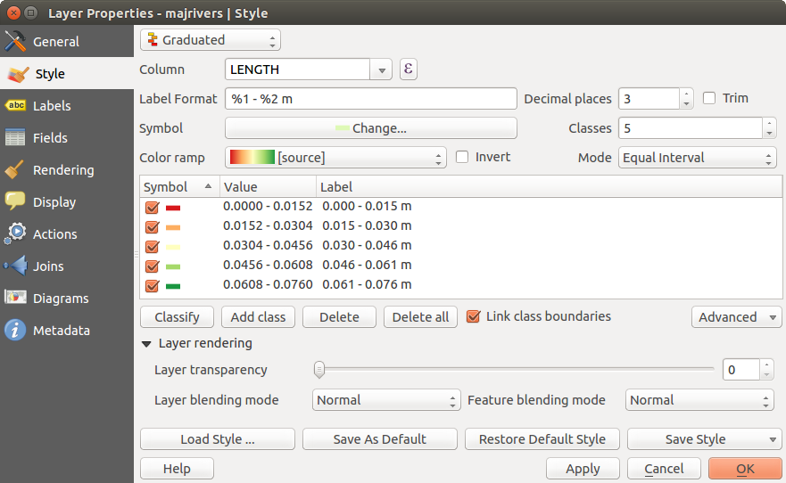

   Окно отрисовки градуированым знаком.

* Уникальные значения - объекты рисуются разным цветом. Каждое значение нарисуется своим цветом (а градуированый знак - несколько соседних значений могут рисоваться одним цветом). Это работает со всеми типами атрибутов.

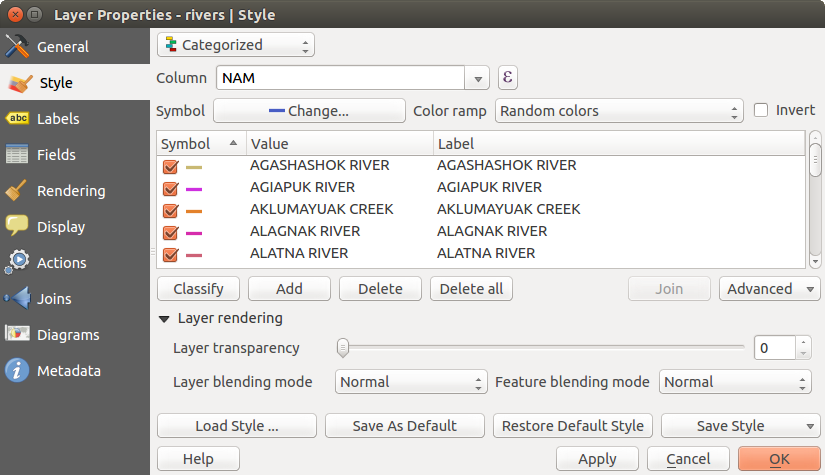

   Окно отрисовки уникальными значениями.

* Правила - для каждого цвета пользователь задаёт SQL-запрос. Если этот запрос выдаёт true для конкретного объекта - то он рисуется этим цветом. Этим же способом можно отображать на экране только объекты с конкретными значениями атрибутов.

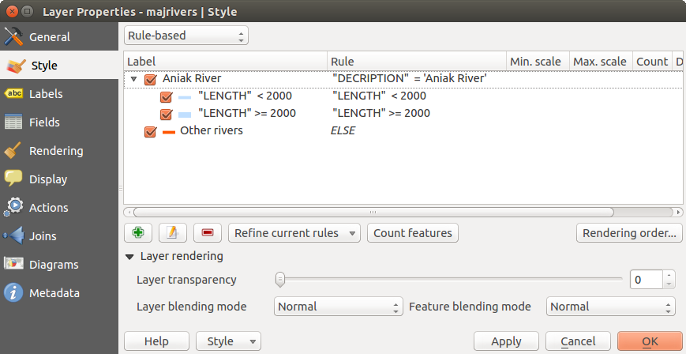

   Окно отрисовки по правилам.


* Точки со смещением - только для точек. Если несколько точек имеют одинаковые или близкие координаты, то в этом месте будет рисоваться большой кружок (или кластер)


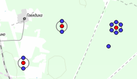

   Отображение точек рендерером "Точки со смещением".


.. note::

   Более подробно настройке стилей описано по адресу http://docs.nextgis.ru/docs_ngqgis/source/map.html#id20 (на русском языке).


Просмотр таблицы атрибутов
``````````````````````````````````````````````

У векторных слоёв есть атрибуты. Их можно смотреть в таблице. 

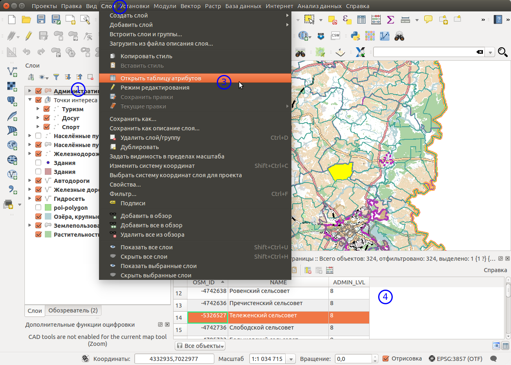
   
   Таблица атрибутов.

Одна запись в таблице - это один объект в слое.
Столбцы - это атрибуты слоя. 
У каждого объекта есть геометрия, которая отображается на карте. 

Можно настроить, что бы таблица атрибутов открывалась в отдельном окне, а можно - что бы она всегда была внутри основного окна программы.

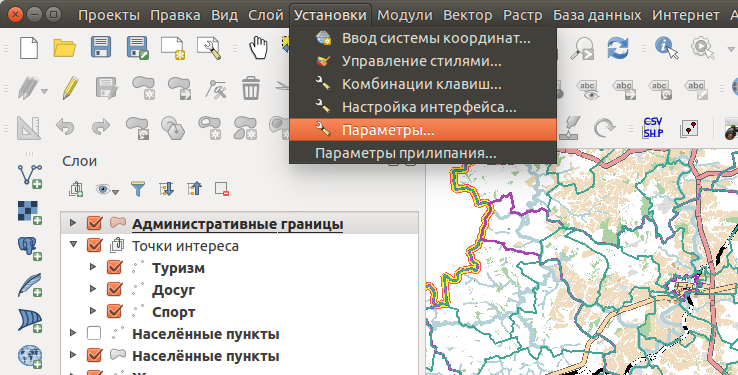
   
   Таблица атрибутов.

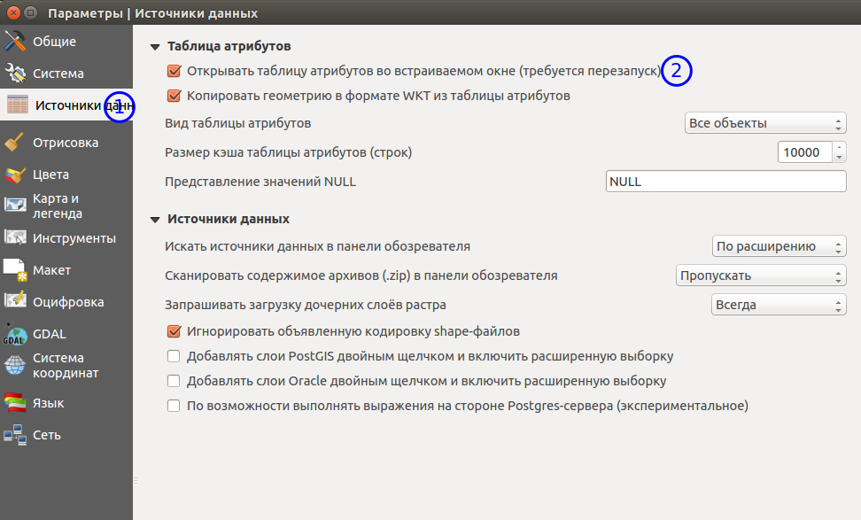

   Таблица атрибутов.
   
При желании легко можно настроить, что бы объекты из одного слоя но с разными атрибутами рисовались с разным оформлением. См. инструкции по QGIS.

В таблице атрибутов чаще всего используются следующие кнопки:

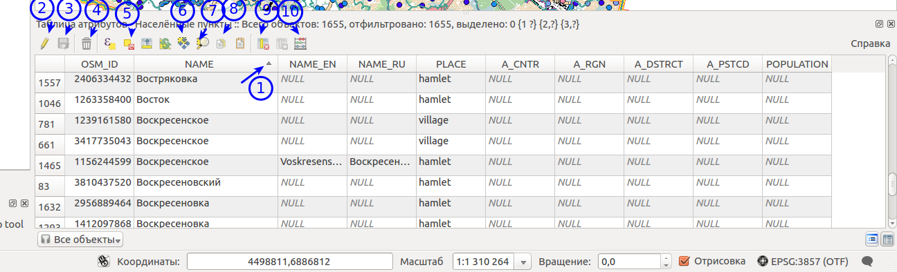

   Кнопки в таблице атрибутов.


1.  сортировка по полю
2.  включить режим редактирования слоя. Теперь в слое можно править значения, как в электронной таблице, и править геометрию.
3.  сохранить правки в этом слое (отдельно от сохранения всего проекта)
4.  Удалить выделенные обьекты.
5.  Снять выделение с объектов
6.  Переместить карту на выделеный объект или несколько объектов
7.  Изменить масштаб карты на выделенный объект или несколько объектов
8.  Копировать-вставить выделенные объекты (вместе с геометрией)
9.  Удалить или добавить атрибут (столбец)
10.  Запуск калькулятора полей - он добавляет новый столбец со значениями по форулам, как в Excel


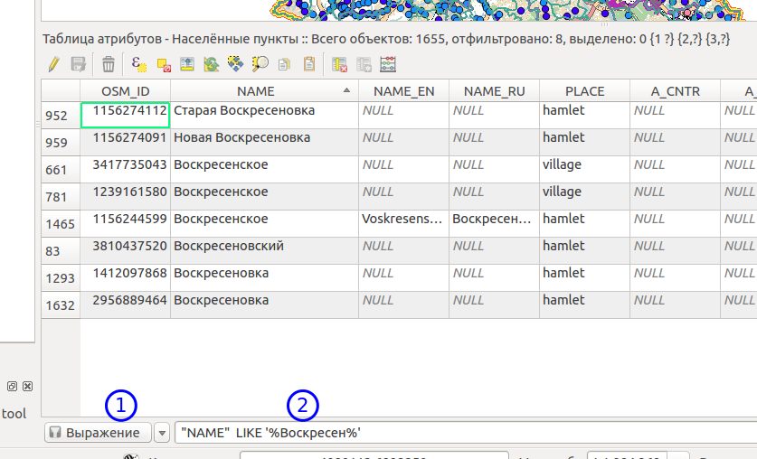

   Пример использования выражения для поиска обьектов в слое по значениям.


Идентификация через IdentifyPlus
``````````````````````````````````````````````
Этим плагином можно щёлкать на карту и просматривать атрибуты слоёв. При просмотре лесоустроительной информации он показывает вложенные элементы. 

1. Откройте рабочий проект с лесоустроительной информацией.
2. Нажмите на кнопку модуля IdentifyPlus

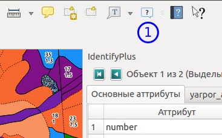

   Запуск модуля IdentifyPlus.

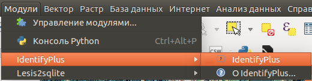

   Запуск модуля IdentifyPlus через меню.

3. Щёлкните мышкой на карте на один из выделов.
4. В появившемся окне справа появится список атрибутов выдела. 

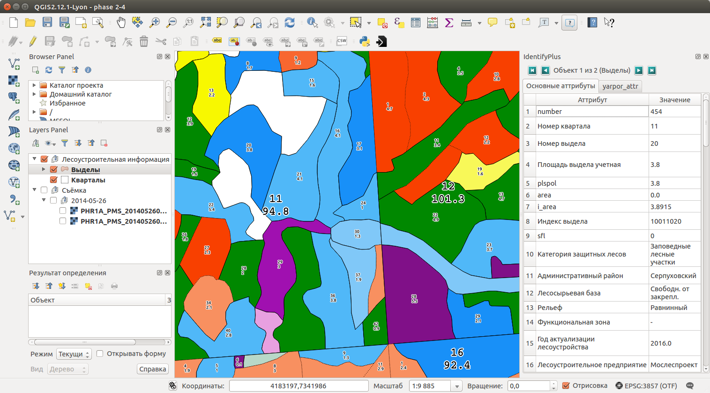

   Просмотр атрибутов с помощью модуля IdentifyPlus.

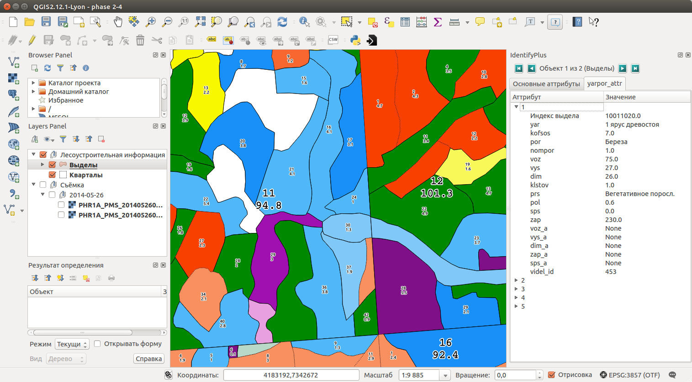

   Просмотр атрибутов с помощью модуля IdentifyPlus.

Идентификация объектов через стандартный инструмент
```````````````````````````````````````````````````

В :program:`NextGIS QGIS` есть возможность нажимать на объекты векторных слоёв на карте мышкой, и просматривать их атрибуты. Это называется "Идентификация".

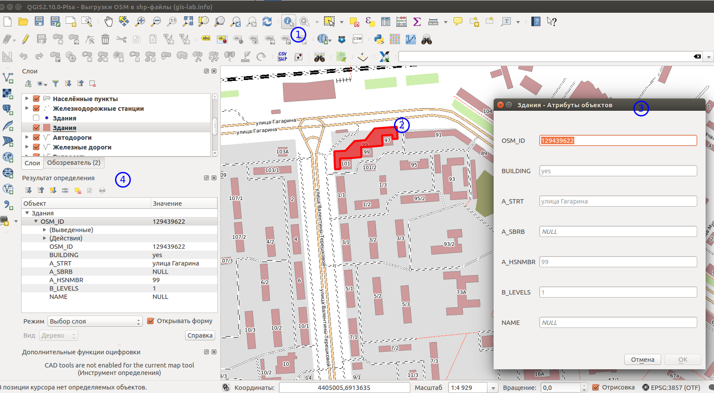
   
   Работа инструмента идентификации.

Выберите инструмент идентификации (1). Щёлкните на каком-нибудь объекте на карте (2). На экран выведутся его атритуты(3). В панели инструментов "Результат определения" (4) можно настроить, что именно будет показываться на экране при нажатии: будет ли открываться отдельное окно, или нет.

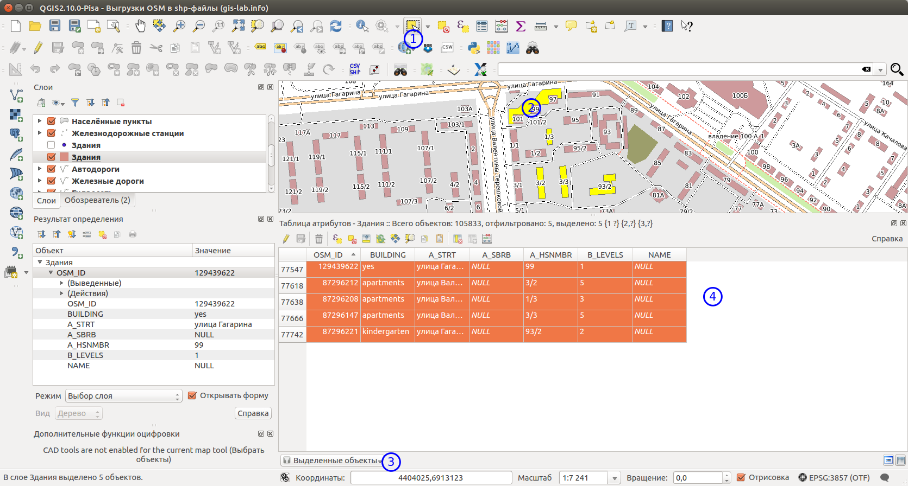
   
   Выделение нескольких объектов (в таблице атрибутов - режим "Выделенные объекты").

Рядом есть жёлтая иконка - выделения объектов(1). Она выделяет объекты в том слое, который выбран в меню слоёв. Выделеные объекты подсвечиваются в таблице атрибутов, их можно скопировать или удалить. 
Выделять можно по клику, или обводя область рамкой. Может быть выделено несколько объектов по очереди с нажатой клавишей Ctrl.   
Правее - кнопка "Снять выделение".

Настройка макета
``````````````````````````````````````````````
Имеющуюся карту можно подготовить к выводу на печать, или показа в виде файла изображения. Во избежание размывания изображения необходимо уделять внимание разрешению карты при экспорте. 
Если вам нужно напечатать карту, или сделать из неё картинку для публикации в сети - воспользуйтесь пунктом на :menuselection:`Проекты --> Создать макет`.

.. note:: Если вы планируете опубликовать полученную картинку - проверьте, допустимо ли такое использование с точки зрения лицензии на данные, использованные в карте. 

.. note:: Если на карте используется тайловая подложка, то при генерации макета возможно её ресемплирование. Это значит, что она будет выглядеть размытой. Для обеспечения высокого качества вместо тайлов нужно использовать векторные данные.

Компоновщик карты имеет возможность экспорта в форматы png, pdf, jpeg, svg.


При открытии компоновщика макетов на экране появится запрос. :program:`NextGIS QGIS` спросит у вас имя макета, но его можно оставить пустым.
 
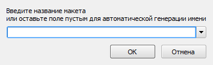
   
   Окно компоновщика.

Нажмите Ок, и появится окно компоновщика. На нём изображен макет. На макет оператор добавляет карту (или несколько карт), легенду (список условных обозначений), иллюстрации и надписи.


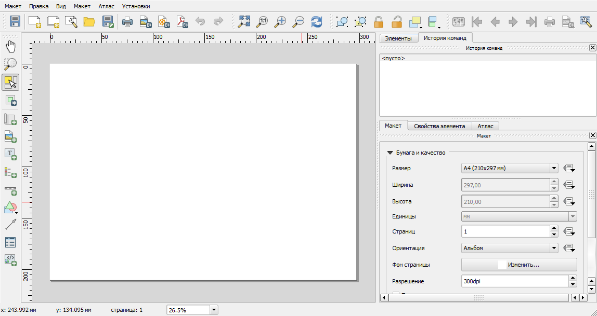
   
   Окно компоновщика.

На макет нужно добавить карту. В панели кнопок найдите кнопку 

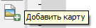

Добавить карту. 


Нажмите её, и растяните прямоугольник по макету. Теперь на макет добавится карта, в том охвате и с теми слоями, что были включены в основном окне :program:`NextGIS QGIS`.
Если вы в основном окне QGIS добавите или отключите слои, то на карте в макете они так же изменятся. А вот охват карты в макете меняется независимо.


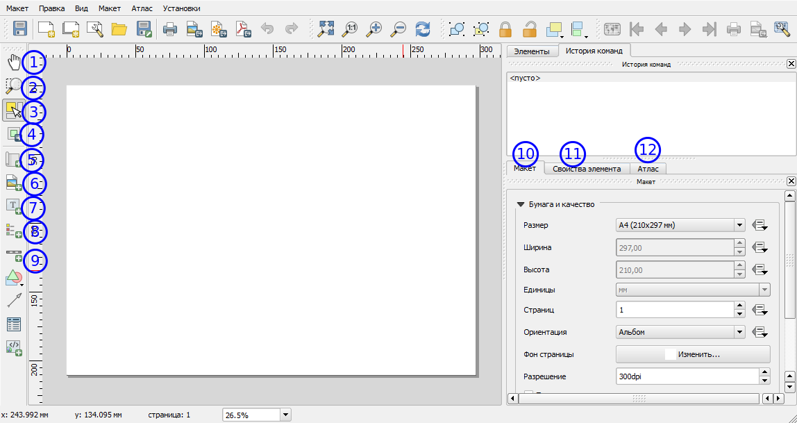
   
   Настройка карты в компоновщике

1. Инструмент :guilabel:`прокрутки макета`. Можно двигать сам макет в компоновщике.
2. Инструмент :guilabel:`увеличить макет`. Увеличивает изображение макета (не карту).
3. Инструмент :guilabel:`выделить/переместить элемент`. Можно выделить карту, и двигать её по странице макета. Можно взять карту за края, и изменять её размер. Действует "прилипание", таким образом её можно растянуть на весь лист.
4. Инструмент :guilabel:`переместить содержимое элемента`. Можно щёлкнуть внутрь карты, и двигать её изображение (менять охват). При вращении колеса мыши изменяется масштаб. При вращении колеса мыши с нажатой клавишей Ctrl масштаб изменяется более точно.
5. Инструмент :guilabel:`добавить карту`.
6. Инструмент :guilabel:`добавить изображение`.
7. Инструмент :guilabel:`добавить текст`. 
8. Инструмент :guilabel:`добавить легенду`.
9. Инструмент :guilabel:`добавить масштабную линейку`.
10. Вкладка :guilabel:`Макет`. В ней можно менять формат бумаги и разрешение в dpi.
11. Вкладка :guilabel:`Свойства элемента`. Это - свойства конкретно того элемента, что выделены инструментом из пункта 3.
12. Вкладка :guilabel:`Атлас`.

Когда макет свёрстан, нажмите :menuselection:`Макет --> Экспорт в изображение`.

.. note:: Если вы не знаете, какой формат выбрать для экспорта карты - используйте png. Если в макете используются космоснимки, то jpg. Если планируется печать на принтере - то pdf. 

Атлас.
Имеется возможность сгенерировать набор карт с одинаковыми макетами, но на разные места. Например, вам нужно сделать карту заповедника, который состоит из 4 отдельных участков. Для этого вам понадобится специальный векторный слой, из которого будут браться границы карт. Пройдите на вкладку Атлас.


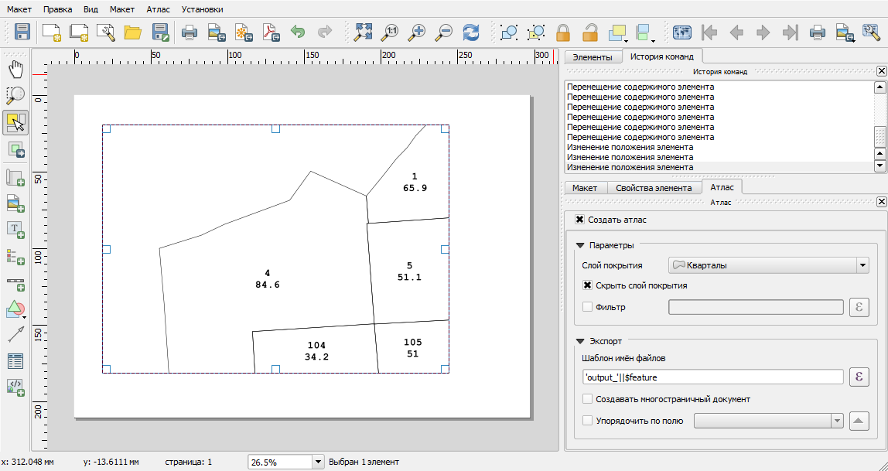
   
   Пример настроек генерации атласа


.. note::

   Это было краткое руководство. Подробнее -  см. https://docs.qgis.org/2.8/ru/docs/user_manual/print_composer/print_composer.html
 

Описание импорта из TopoL (Lesis)
``````````````````````````````````````````````

Для :program:`NextGIS QGIS` нами был разработан модуль :program:`lesis2sqlite`, который открывает выгрузки лесоустроительной информации в формате программы :program:`TopoL (Lesis)`.
Он считывает каталог с выгрузкой, конвертирует её в файл SpatiaLite, и добавляёт из этого SpatiaLite слои в окно :program:`NextGIS QGIS`. Информацию по выделам можно далее просматривать модулем IdentifyPlus.

.. note:: Cтили этот модуль не добавляет. Их нужно загружать отдельно. 

Для открытия выгрузки в :program:`NextGIS QGIS`  нужно сделать следующие операции:

* Запустить приложение NextGIS QGIS (При установке на другой компьютер - см. Запуск приложения NextGIS QGIS)
* Открыть проект с лесоустроительной информацией.
* Найти каталог с выгрузкой.

Пример структуры выгрузки (сокращённый) ::

        │   ├── D
        │   │   ├── Connect.mdb
        │   │   ├── Gulf.mdb
        │   │   ├── Lh1.DBF
        │   │   ├── Lh1.DBT
        │   │   ├── Lh1.MDX
        │   │   ├── Lh2.DBF
        │   │   ├── Lh2.MDX
        │   │   ├── Lh3.DBF
        │   │   ├── Lh3.MDX
        │   │   ├── Lh4.DBF
        │   │   ├── Lh4.MDX
        │   │   ├── LInfo.rtf
        │   │   └── SubRF.DBF
        │   ├── Filters
        │   ├── FONTY.TXT
        │   ├── GROUPS.DBF
        │   ├── Groups_ocifrovka.dbf
        │   ├── info_L.ini
        │   ├── kv.zta
        │   ├── Les.tps
        │   ├── Linzn.txt
        │   ├── n
        │   │   ├── AdmRan.DBF
        │   │   ├── AnalVyp.dbf
        │   │   ├── Arenda.dbf
        │   │   ├── ArhForm.DBF
        │   │   ├── arnBase.DBF
        │   │   ├── arnLesse.DBF
        │   │   ├── arnLessor.dbf
        │   │   ├── arnVidPolz.DBF
        │   │   ├── BolotnRast.dbf
        │   │   ├── bonid.DBF
        │   │   ├── Bonitet.dbf
        │   │   ├── Connect.mdb
        │   │   ├── conv_DB.ini
        │   │   ├── Cz_CLP.zvf
        │   │   ├── DBDWORK.INI
        │   │   ├── digres.tps
        │   │   ├── DIGRES.ZTA
        │   │   ├── DimVys.DBF
        │   │   ├── EdIzm.DBF
        │   │   ├── Ekspoz.dbf
        │   │   ├── ErrP.DBF
        │   │   ├── ErrP.DBT
        │   │   ├── ErrP.ini
        │   │   ├── ErzSkl.DBF
        │   │   ├── estet.tps
        │   │   ├── ESTET.ZTA
        │   ├── PARAMETR.MDB
        │   ├── Plan.tps
        │   ├── SRAFY.TXT
        │   ├── STYLY.TXT
        │   ├── TopoL.bk1
        │   ├── TopoL.bk2
        │   ├── Topolflt.exp
        │   ├── TOPOLINF.EXP
        │   ├── TopoL.INI
        │   └── TrueType.INI
        ├── tree.txt
        ├── VD
        │   ├── coordsys.xml
        │   ├── Выдел.DBF
        │   ├── Выдел.SHP
        │   └── Выдел.SHX
        ├── Vd_L
        │   ├── coordsys.xml
        │   ├── Визир.DBF
        │   ├── Визир.SHP
        │   ├── Визир.SHX
        │   ├── Выдела_гр.DBF
        │   ├── Выдела_гр.SHP
        │   ├── Выдела_гр.SHX
        │   ├── Геоход_окр.DBF
        │   ├── Геоход_окр.SHP
        │   ├── Геоход_окр.SHX
        │   ├── Геох_пов_т.DBF
        │   ├── Геох_пов_т.SHP
        │   ├── Геох_пов_т.SHX
   

* Нажать на :menuselection:`Модули --> Lesis2sqlite --> Import`.
* Указать в панели Папка каталог, где лежат файлы.
* Указать в панели SHP путь к каталогу, в котором находятся shp-файлы
* Указать в панели  - путь и имя файла sqlite, в который запишется выгрузка. Этот файл создастся модулем.
* Нажать на кнопку

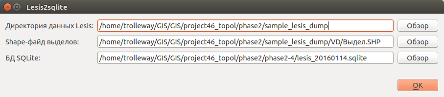
   
   Окно модуля lesis2sqlite с указаными каталогами.

* В :program:`NextGIS QGIS` добавится два слоя - выделы и полигоны. 

Этими слоями уже можно пользоваться, но у них нет оформления. Вы можете скопировать его из старых слоёв из рабочего проекта. 

* В контекстном меню старого слоя Выделы выберите :menuselection:`Стили --> Копировать стиль`. 

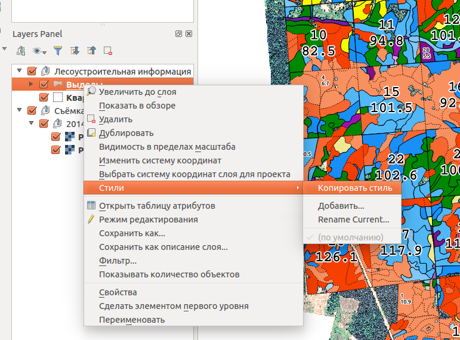

   Копирование стилей


* В контекстном меню нового слоя с выделами выберите :menuselection:`Стили --> Вставить стиль`.
* Повторите операцию для слоя кварталов.
