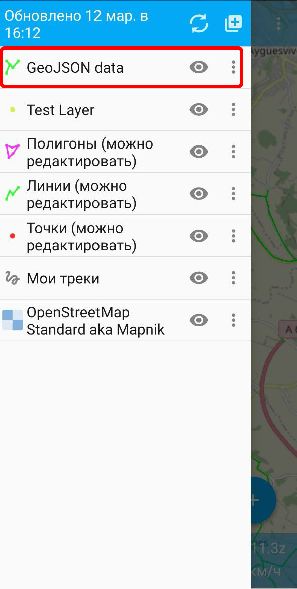

.. _howto_add_mobile:

Как открыть слой в мобильном приложении
=======================================

.. admonition:: Какие форматы файлов для этого подходят?

   * GeoJSON
   * NGRC
   * ZIP-архив с тайлами

* Установите приложение NextGIS Mobile из `Google Play <https://play.google.com/store/apps/details?id=com.nextgis.mobile>`_ или `скачав apk-файл <https://my.nextgis.com/software>`_.
* Скачайте файл к себе на устройство. Если это не архив с тайлами, не забудьте предварительно **извлечь данные** из архива.
* Откройте приложение NextGIS Mobile. На панели дерева слоев |ic_layer_tree| нажмите на кнопку "Добавить геоданные" |ic_add_layer|, далее выберите пункт диалога **Открыть локальный**.

.. figure:: _static/ngm_add_local_ru_2.png 
   :name: ngm_add_local_pic
   :align: center
   :width: 9cm

* Выберите файл на устройстве. 
* При желании можно изменить название. Нажмите **Создать**.

.. figure:: _static/ngm_add_local_name_ru.png
   :name: ngm_add_local_name_pic
   :align: center
   :width: 9cm

* Новый слой будет добавлен на самый верх списка слоёв.

`Как редактировать данные в мобильном <https://docs.nextgis.ru/docs_ngmobile/source/editing.html#ngmobile-switch-to-edit>`_

.. |ic_add_layer| image:: _static/ic_add_layer.png
   :width: 6mm
   :alt: два прямоугольника с плюсом

.. admonition:: Остались вопросы?

  * `Напишите в поддержку <https://my.nextgis.com/support>`_ из личного кабинета
  * `Подробное руководство по работе в NextGIS Mobile <https://docs.nextgis.ru/docs_ngmobile/source/index.html>`_