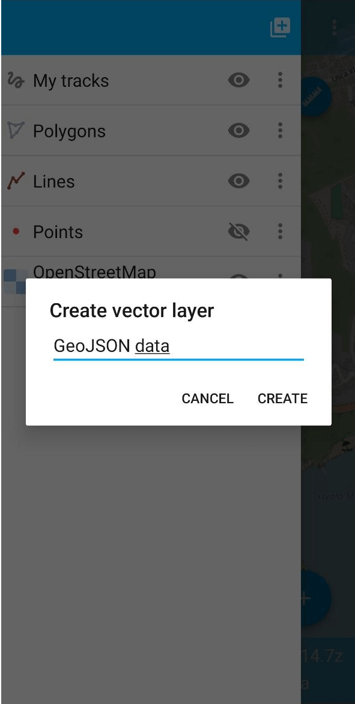

.. _howto_add_mobile:

How to open a layer in Mobile
=======================================

.. admonition:: What file formats would work?

   * GeoJSON
   * NGRC
   * Tiles in ZIP-archive

* Install NextGIS Mobile from `Google Play <https://play.google.com/store/apps/details?id=com.nextgis.mobile>`_ or from an `APK-file <https://my.nextgis.com/software>`_.
* Save the data layer to your device. If it is not a tile archive, make sure to **unpack** the data and get it from the archive.
* Run NextGIS Mobile app. Open the Layer tree panel |ic_layer_tree|, tap "Add geodata" |ic_add_layer| and select **Open local**.

.. figure:: _static/ngm_add_local_en.png 
   :name: ngm_add_local_pic
   :align: center
   :width: 9cm

* Select the file from your device. 
* You can change the layer name if you want. Tap **Create**.

* New layer is added to the top of the layer list.

.. figure:: _static/ngm_add_local_result_en.png
   :name: ngm_add_local_result_pic
   :align: center
   :width: 9cm  

`How to edit data in NextGIS Mobile <https://docs.nextgis.com/docs_ngmobile/source/editing.html#ngmobile-switch-to-edit>`_

.. admonition:: Any questions?

  * `Contact Support <https://my.nextgis.com/support>`_ from your account
  * `Full user guide for NextGIS Mobile <https://docs.nextgis.com/docs_ngmobile/source/index.html>`_

.. |ic_layer_tree| image:: _static/ic_layer_tree.png
   :width: 7mm
   :alt: three lines

.. |ic_add_layer| image:: _static/ic_add_layer.png
   :width: 6mm
   :alt: double squares with "+"