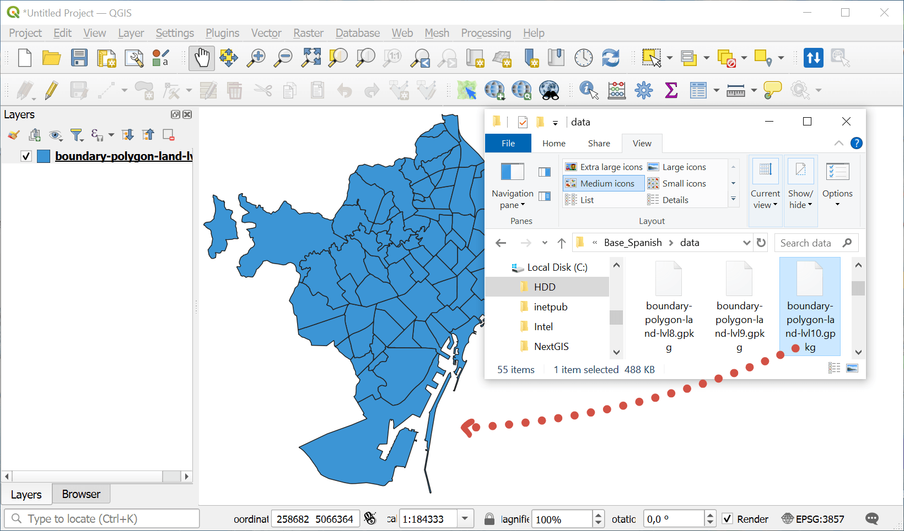
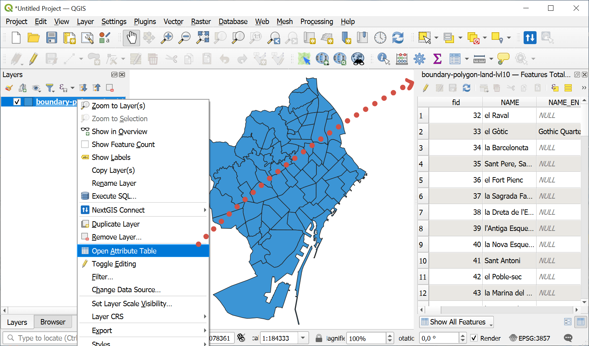

.. _howto_open_layer:

How to open a layer
=======================

* If your data is in a ZIP-archive, **unpack** it first and get the files out of the archive.
* Download and install `QGIS <https://qgis.org/en/site/forusers/download.html>`_.
* Open QGIS and drag the file into it.

* The layer is added to QGIS, ready for work.
   
* To view attributes of the layer,  right-click on it and select "Open Attribute Table" in the context menu. A table opens that contains all the characteristics (attributes) of the layer features. 

.. admonition:: Any questions?

  * `Contact Support <https://my.nextgis.com/support>`_ from your account
  * Check out our `videos <https://www.youtube.com/@nextgis_channel/playlists>`_ 

