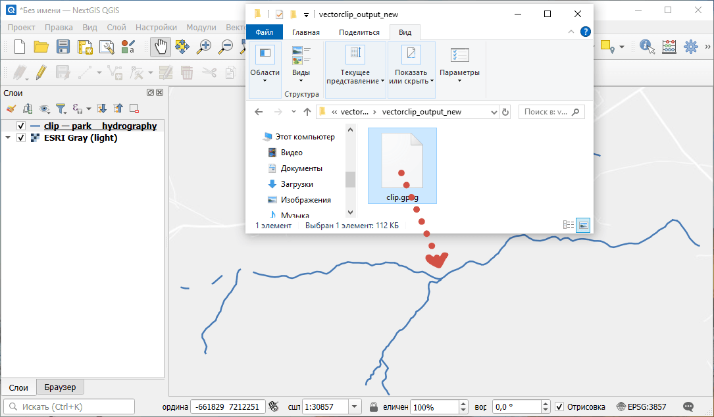
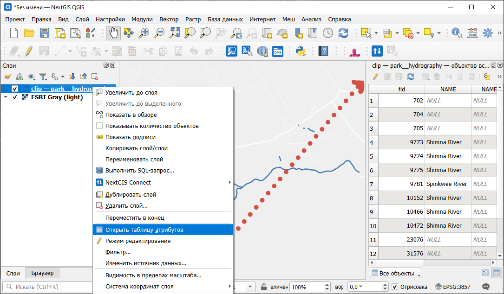

.. _howto_open_layer:

Как открыть нужный слой
=======================

* Если слои лежат в ZIP-архиве, сначала **распакуйте** архив с данными (извлеките данные из архива).
* Скачайте и установите `NextGIS QGIS <https://nextgis.ru/nextgis-qgis/>`_, можно также использовать обычный QGIS.
* Откройте NextGIS QGIS и перетащите в него файл.

* Слой будет добавлен в QGIS и готов к работе.
   
* Для просмотра атрибутов определенного слоя, щелкните по нему правой кнопкой мыши и в контекстном меню выберите «Открыть таблицу атрибутов». Откроется окно с атрибутами (характеристиками) объектов, принадлежащих слою. 

