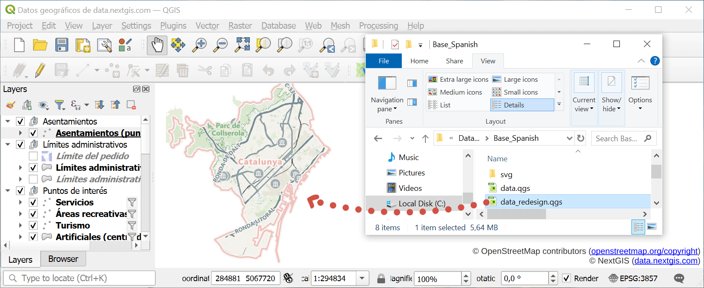
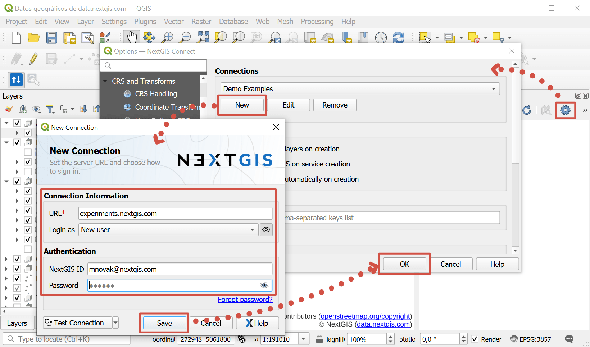
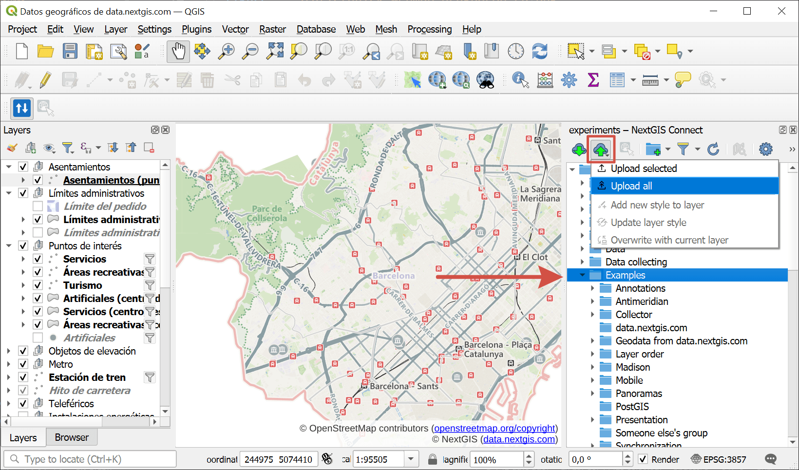
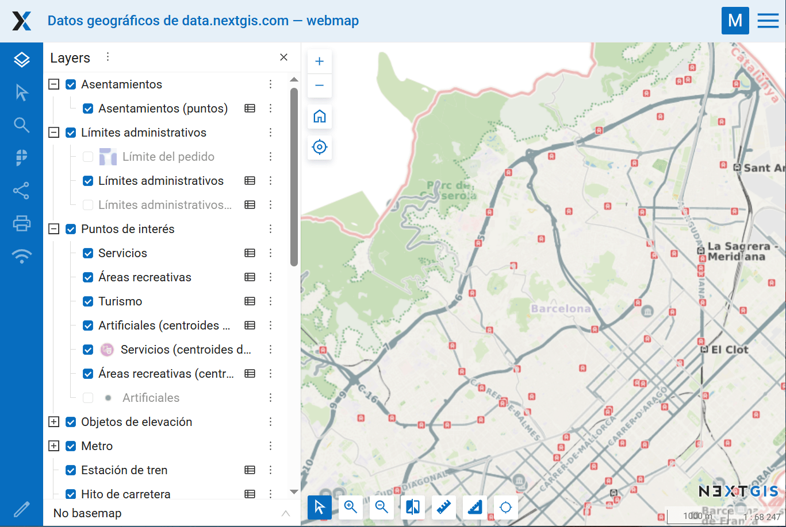

.. _howto_webmap:

How to create an interactive Web Map quickly?
==============================================

* If your data is in a ZIP-archive, **unpack** it first and get the files out of the archive.
* Download and install `QGIS <https://qgis.org/en/site/forusers/download.html>`_.
* Open QGIS and drag the project file or a particular layer into it.

.. admonition:: Which is the project file?

   Look for extention .QGS or .QGZ

* Install **NextGIS Connect** plugin (top menu Plugins - Manage and install plugins - enter *NextGIS Connect* in the search bar - Install). 

* **Add** connection to your Web GIS. Click on the gear icon to open Settings. In the Connection section click **New**. Enter the URL of your Web GIS, email you used to sign up and password. 

* Click **Save** and **OK**, then close the Settings window.

* In the NextGIS Connect panel select the folder where you want to create a Web Map, click "Add to Web GIS" |button_cloud_upload| and select **Upload all**.

When the Web Map creation is complete, it opens in the default browser.

.. |button_cloud_upload| image:: _static/button_cloud_upload.png
   :width: 7mm
   :alt: cloud with upward arrow

.. admonition:: Any questions?

  * `Contact Support <https://my.nextgis.com/support>`_ from your account
  * `What can I do on the Web Map? <https://docs.nextgis.com/docs_ngweb/source/webmaps_client.html>`_
  * `Full NextGIS Connect user guide <https://docs.nextgis.com/docs_ngconnect/source/index.html>`_
