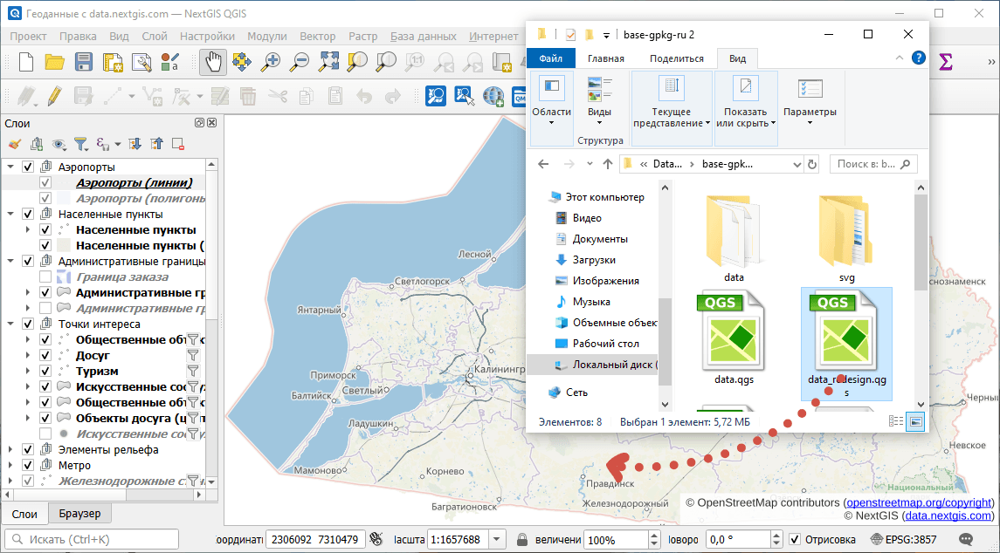
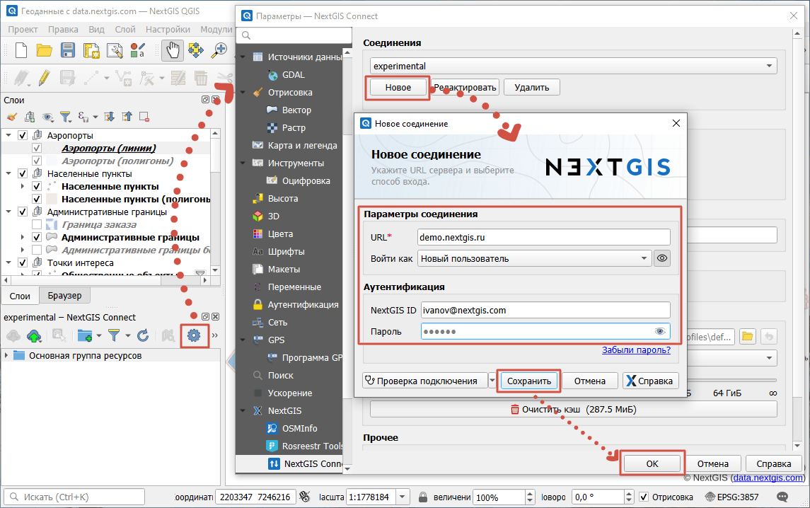
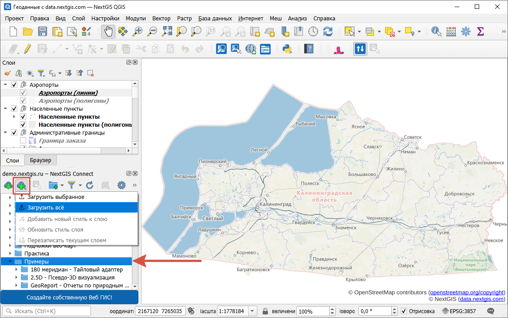
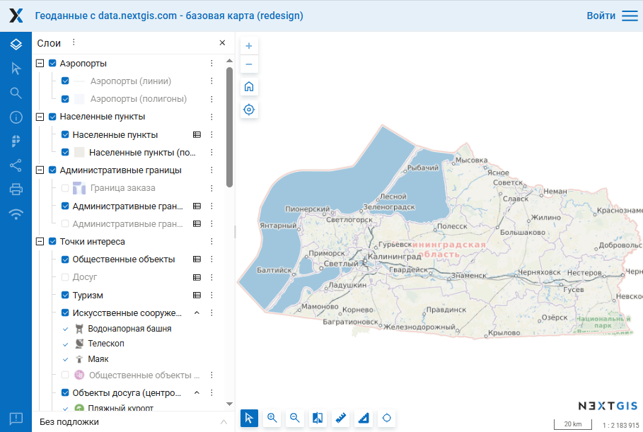

.. _howto_webmap:

Как быстро создать интерактивную веб-карту
==========================================

* Если слои лежат в ZIP-архиве, сначала **распакуйте** архив с данными (извлеките данные из архива).
* Скачайте и установите `NextGIS QGIS <https://nextgis.ru/nextgis-qgis/>`_, можно также использовать обычный QGIS.
* Откройте NextGIS QGIS и перетащите в него файл данных или проекта целиком.

.. admonition:: Как выглядит файл проекта?

   Это файл с расширением QGS или QGZ

* Установите модуль **NextGIS Connect** (Меню - Модули -Управление модулями - Ввести в поиске *NextGIS Connect* - Установить). В NextGIS QGIS модуль уже установлен.

* **Добавьте** подключение к вашей веб ГИС. Нажмите на кнопку настроек (шестеренка на панели). В разделе "Соединения" добавьте **новое**. Введите адрес вашей Веб ГИС, адрес электронной почты, на который вы регистрировались, и пароль. 

* Нажмите **Сохранить** и **Ок**, затем закройте окно настроек.

* В панели модуля NextGIS Connect выберите папку, в которой хотите создать веб-карту, нажмите кнопку "Добавить в Веб ГИС" |button_cloud_upload| и выберите **Загрузить всё**.

Через некоторое время созданная веб-карта откроется в браузере.

