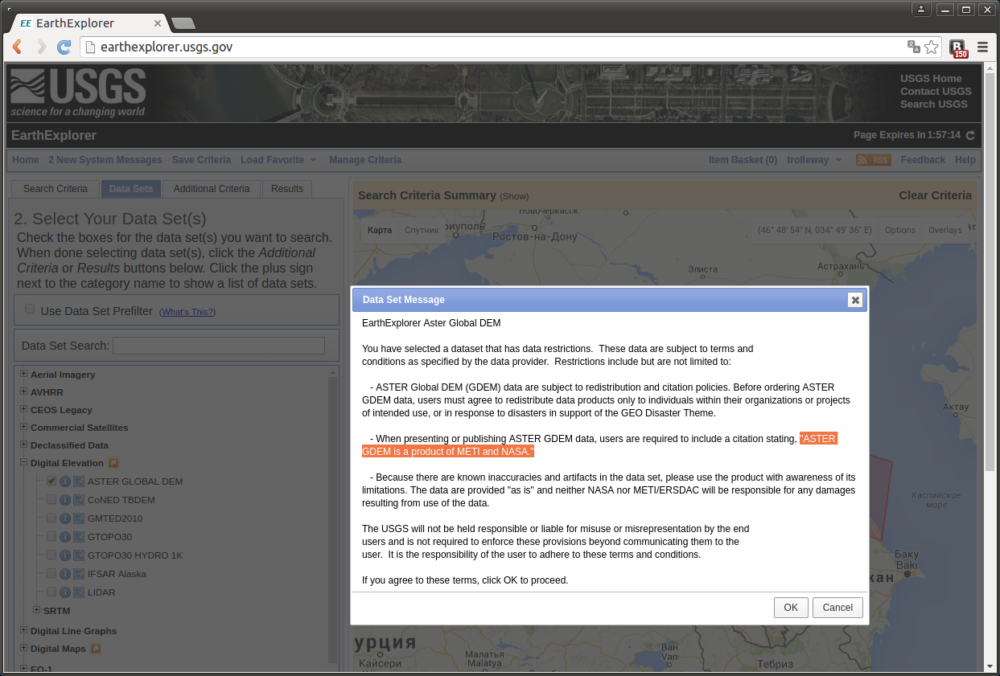
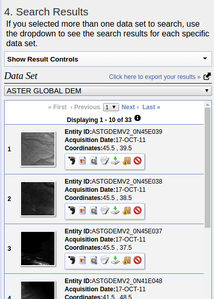
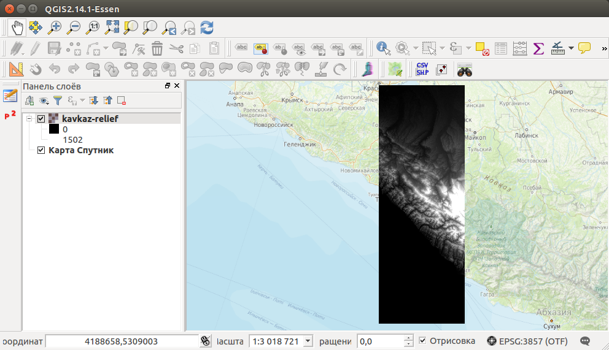
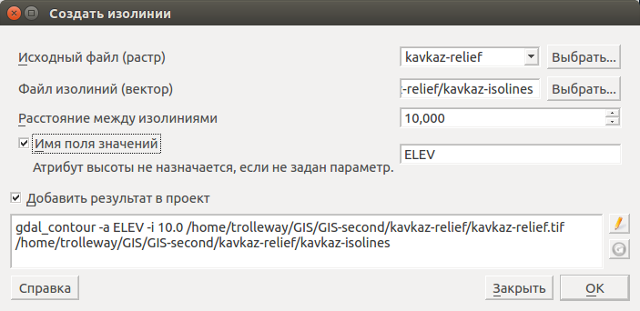
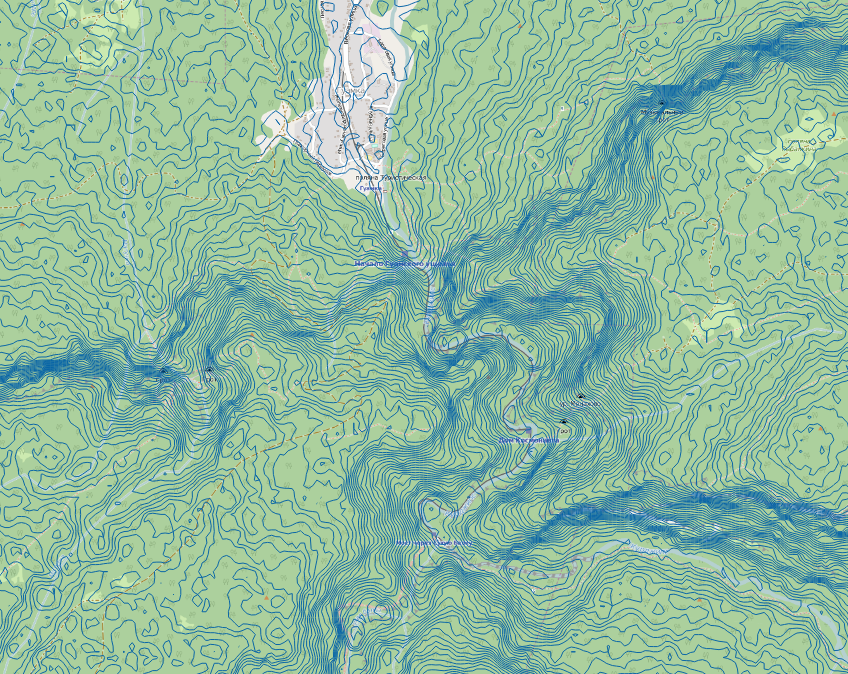
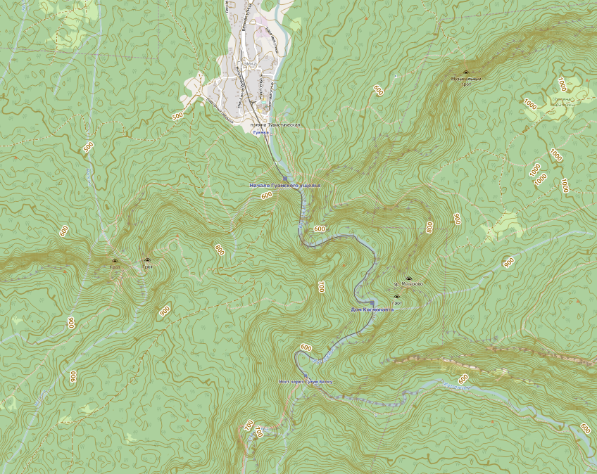

.. sectionauthor:: Артём Светлов <@nextgis.ru>

.. relief:

Как получить рельеф в NextGIS QGIS
=====================================

Введение
----------------------------

В этой инструкции мы скачаем цифровую модель рельефа (ЦМР) в tiff, склеим сцены, если нам нужна большая территория, построим по ней горизонтали, и сделаем цветную подложку. 
Для работы потребуется:

#. :program:`NextGIS QGIS`.

Геоданные о рельефе как правило называются "цифровой моделью рельефа", сокращённо - ЦМР или DEM. Как правило они распространяются в виде растра - файла GeoTIFF с привязкой. Каждый пиксел его имеет значение - высота в метрах. В :program:`NextGIS QGIS`. такие данные можно обрабатывать. 
В мире существуют разные наборы данных, разной точности и на разные территории. Мы воспользуемся бесплатным набором ASTER. Сенсор ASTER был создан METI и запущен на борту спутника NASA Terra в декабре 1999 года. Описание данных на русском языке: http://gis-lab.info/qa/aster-gdem.html

Получение данных ASTER
----------------------------

Данные можно скачать на нескольких сервисах: http://asterweb.jpl.nasa.gov/data.asp
В инструкции мы воспользуемся сервисом http://earthexplorer.usgs.gov - Геологической службы США.

Для скачивания данных нужно зарегистрироваться на сервисе.

Чтобы найти данные нужно выбрать географическую область по которой нужно найти данные

.. figure:: _static/reliefEarthExplorer01.png
   :name: sxfDownloadSample
   :align: center
   :width: 15cm

    Выделяем область

Переключиться на закладку :guilabel:`Data Sets` (наборы данных) и выбрать в группе :guilabel:`Digital Elevation` - :guilabel:`ASTER GLOBAL DEM`.

В первый раз выведется информация: при публикации данных вам положено подписать источник - "ASTER GDEM is a product of METI and NASA.", и учитывать что в данных могут быть неточности.

Для перехода к просмотру данных необходимо нажать кнопку Results.

В списке результатов нажатием кнопки :guilabel:`Show browse overlay` можно посмотреть, как ложится сцена на карту.
Нажатием кнопки :guilabel:`Download options` вы перейдёте к скачиванию.

Если нужно скачать несколько сцен - то учтите, что на Earth Ezplorer сейчас существует ошибка: при возврате со страницы скачивания в карту на экране висит надпись "Searcing", и ничего не происходит. Можно открыть другой браузер, или воспользоваться их java-приложением для массовой выкачки.

Сцена ASTER распространяется в zip-архиве. Распакуйте его, нам понадобится файл, у которого в названии есть _dem.

Склейка файлов
------------------

Если нужная вам область попадает в несколько сцен - то файлы tiff нужно сначала склеить в :program:`NextGIS QGIS`

Выберите :menuselection:`Растр --> Прочее --> Объединение`

.. figure:: _static/reliefMerge.png
   :name: sxfDownloadSample
   :align: center
   :width: 15cm

После открытия ЦМР в QGIS вы получите подобную картинку: чёрное изображение, привязанное к координатам. 

Генерация горизонталей
-------------------------------

Выберите :menuselection:`Растр --> Извлечение --> Создать изолинии`.

Выставите параметры как на иллюстрации.

После завершения работы модуля в проект добавится линейный слой с горизонталями. В его атрибутах будет высота линий в метрах.

Оформление изолиний
---------------------------------

Если вывести на экран слой без оформления, то карта просто закрасится непонятными линиями. Используя возможности настройки стилей в :program:`NextGIS QGIS` можно сделать так, что бы линии были более понятными - выделить жирным линии кратные 100 метрам, добавить бергштрихи, подписи, убирать линии на маленьком масштабе. Вы можете скачать файл картостиля по ссылке https://raw.githubusercontent.com/nextgis/docs_howto/master/source/_static/isolines_nextgis2016.qml
В свойствах слоя выберите   :menuselection:`Стиль --> Загрузка стиля`.

   Оформление по умолчанию

   Стиль isolines-nextgis

