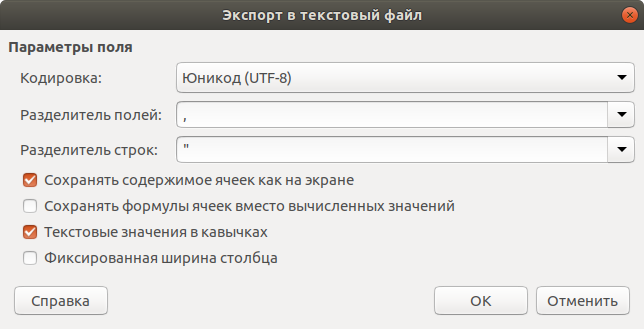
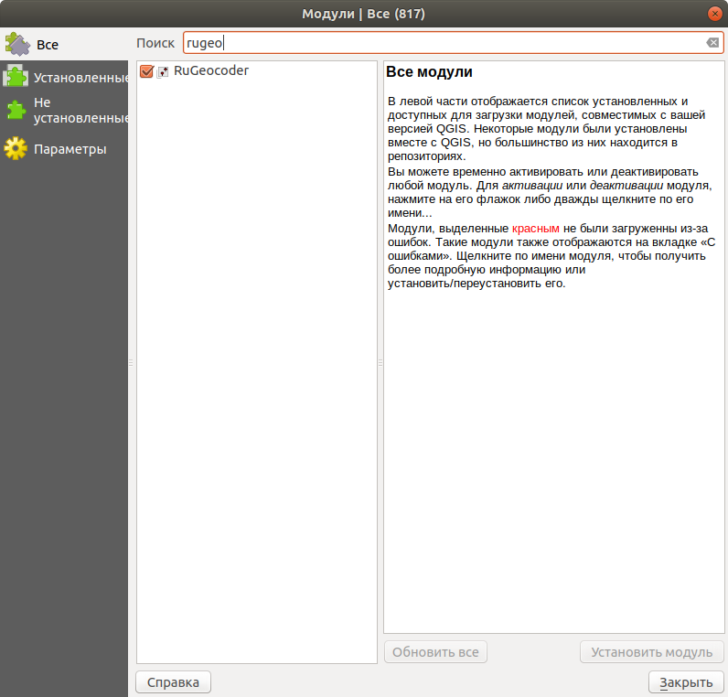
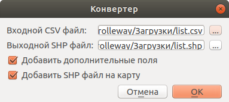
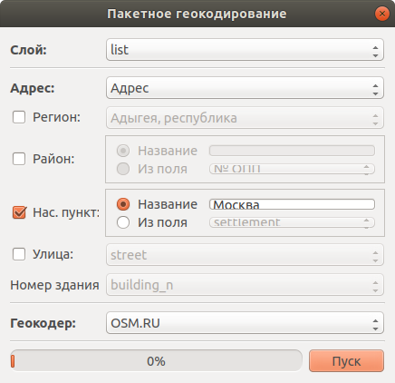

.. sectionauthor:: Артём Светлов <artem.svetlov@nextgis.ru>

.. _howto_rugeocoder:

Геокодинг - из таблицы с адресами в слой с координатами
=============================================================

Введение
----------------------------

Допустим у вас есть электронная таблица с адресами но без координат, а вам нужно получить из неё слой с точками. 
Этот процесс называется геокодинг. 
В этой инструкции мы откроем файл xls, сконвертируем его в формат csv, откроем в NextGIS QGIS, геокодируем адреса, и вручную исправим не найденные координаты.

 
Для работы потребуется:

#. :program:`NextGIS QGIS`.

1. Откройте электронную таблицу в Calc / Excel. Сохраните лист в формат csv в кодировке UTF-8 и с текстовыми значениями в кавычках. В десктопных Microsoft Excel нужный формат называется "CSV (UTF-8)". 

2. В NextGIS QGIS установите плагин RuGeocoder. 

3. В NextGIS QGIS: Веб --> RuGeocoder --> Конвертировать csv в shp

   
   
   
   У вас получится слой с точками, находящимися в 0 координат.
   
   Откройте таблицу атрибутов этого слоя, и проверьте правильность импортирования данных. Если в таблице данные битые, или отсутствуют, то сконвертируйте вашу таблицу в csv так, что бы выполнялись требования к формату в пункте 1.

   
3. В NextGIS QGIS: Веб --> RuGeocoder --> Пакетное геокодирование.

Укажите:
   
   * Слой, который будет геокодироваться.
   * Атрибут, в котором написан адрес.
   * Город, или регион (опционально)
   
После завершения работы, точки будут передвинуты на найденые адреса.

Выше был описан идеальный случай, в реальной жизни из-за глюков софта, вполне вероятно что что-то не заработает. 

Если проблемы с преобразованием xls в слой QGIS, то есть альтернативный способ:

1. В XLS используя Calc или Excel добавить столбцы LAT и LON, запишите в них нули (или какие-нибудь другие координаты).
2. Сохраните XLS в CSV
3. В NextGIS QGIS Слой --> Добавить слой CSV. Откройте csv, настройте разделители так, что бы таблица атрибутов выглядела правильно (подробнее на http://docs.nextgis.ru/docs_ngqgis/source/map.html#csv). На вопросы о системе координат, всегда отвечайте EPSG:4326.
4. В NextGIS QGIS сохраните этот слой в формат GeoPackage.
5. Дальше используйте в "Пакетном геокодинге" этот слой в GeoPackage.

В реальной жизни теперь начинается основная работа - ручная коррекция найденых координат. В самом лучшем случае, правильно найдется 70% адресов, в среднем правильно геокодируется около половины точек. 

   
