.. sectionauthor:: Артём Светлов <artem.svetlov@nextgis.ru>

.. _howto_steppe_fire_sentinel:

Определение площади степного пожара по космоснимкам Sentinel-2A или landsat-8
==============================================================================

Введение
----------------------------

В этой инструкции мы расскажем о том, как:

1. Скачать космоснимок Sentinel-2 или Landsat-8 в tiff.
2. Настроить контрастность и цвета, выделить территорию, затронутую степным пожаром.
3. Наложить её на территорию участка Оренбургского заповедника.
4. Узнать площадь сгоревшей территории заповедника.

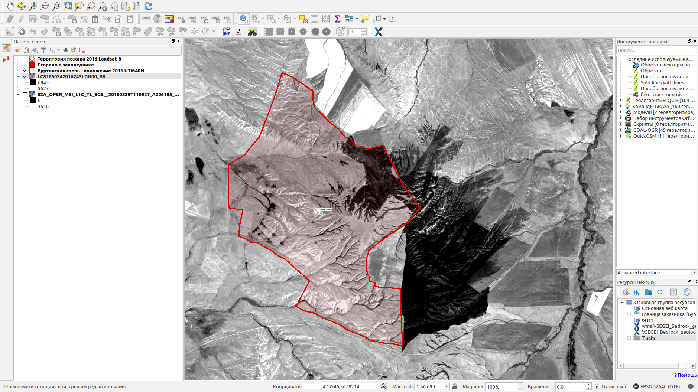

   Космоснимок со следами пожара и граница заповедника.

 
Для работы потребуется:
^^^^^^^^^^^^^^^^^^^^^^^^^^^

1. :program:`NextGIS QGIS`.
2. Веб бразуер.
3. Геоданные с территорией того участка, внутри которого нужно подсчитать площадь пожара.

К 2016 году в мире появились несколько программ предоставления доступа к материалам 
спутниковой съёмки, достаточной для того, чтобы определить по ней сгоревшие территории. 
В степях сгоревшие участки хорошо видны в обычном оптическом диапазоне. Можно бесплатно 
воспользоваться материалами Landsat (предоставляются NASA и USGS) и Sentinel-2 (предоставляются Европейским космическим агентством). Эти космоснимки можно использовать бесплатно. Спутники 
снимают каждую территорию через несколько дней, и есть возможность отобрать снимки нужных дат 
и с удовлетворительным уровнем облачности для скачивания и последующего создания слоя.

Пространственное разрешение у спутника Landsat-8: 30 м/пикс для всех каналов и 15 м/пикс для панхроматического канала.

Пространственное разрешение у спутника Sentinel-2A: 10 м/пикс для всех каналов.

Получение спутниковых снимков
---------------------------------------

Данные можно скачать на нескольких сервисах (например, https://scihub.copernicus.eu/dhus/#/home)
В инструкции мы воспользуемся сервисом http://earthexplorer.usgs.gov - 
Геологической службы США.
.. note:: На https://scihub.copernicus.eu/dhus снимки появляются быстрее, а на http://earthexplorer.usgs.gov они нарезаны на более мелкие сцены, и тот сервис предоставляет менеджер скачки, это удобно при плохом интернете.

Для скачивания данных нужно зарегистрироваться на сервисе.


Информация о наборе данных Sentinel-2:

```
USER NOTICE:  Sentinel-2 Products from USGS
The Sentinel-2 data were acquired, processed, and generated by the European Space Agency (ESA) and repackaged by USGS into tile-based bundles.  For more information on the available Sentinel-2 products and distribution from USGS, please visit: http://eros.usgs.gov/sentinel-2. 
All Sentinel-2 data products are provided under the terms and conditions prescribed by the European Commission’s Copernicus Programme.  For detailed information on data policy, appropriate usage, and citation of Sentinel data, click on this link: https://lta.cr.usgs.gov/sites/default/files/Sentinel_Data_Terms_and_Conditions.pdf
IMPORTANT: The USGS Sentinel-2 archive is a partial representation of all available acquisitions from ESA. Users should expect a delay before ESA’s acquisitions become available on EarthExplorer. For detailed information on the Sentinel-2 mission and data access available from ESA, please visit: https://sentinel.esa.int/web/sentinel/missions/sentinel-2
```

.. note:: Для скачивания Sentinel-2 со scihub.copernicus.eu утилитой wget нужно экранировать символ $ в адресе: 
 wget --no-check-certificate --user=username --password=usrpass "https://scihub.copernicus.eu/apihub/odata/v1/Products('18f7993d-eae1-4f7f-9d81-d7cf19c18378')/\$value"

Чтобы получить данные, необходимо задать географическую область.

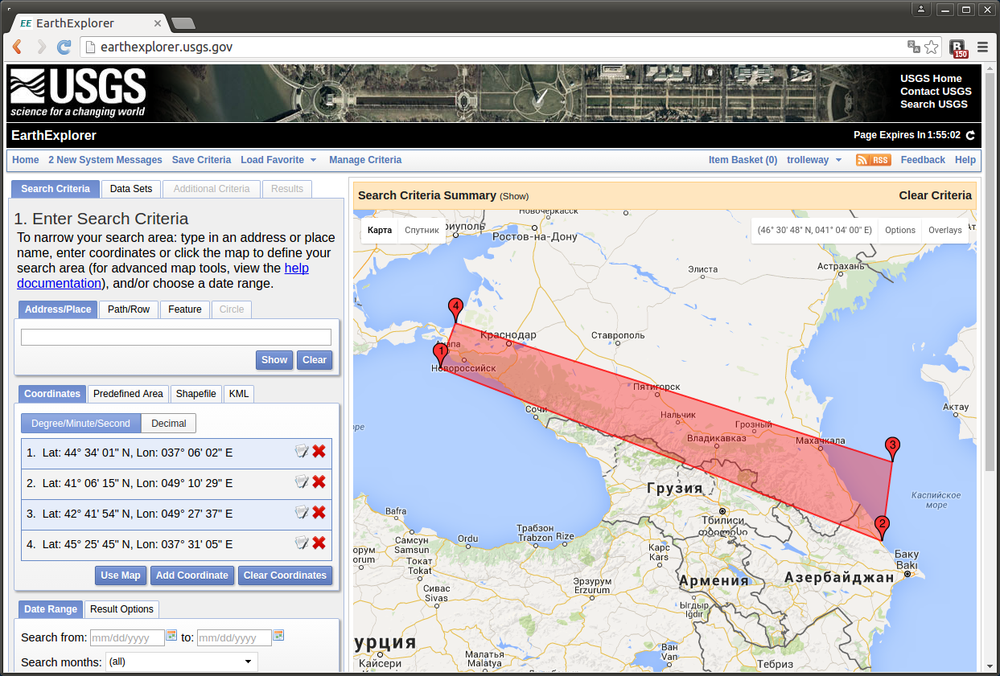

   Установка области для поиска данных.

Переключиться на закладку :guilabel:`Data Sets` (наборы данных) и выбрать в 
группе :guilabel:`Sentinel` - :guilabel:`Sentinel-2` и Landsat Archive - L8 OLT/TIRS.

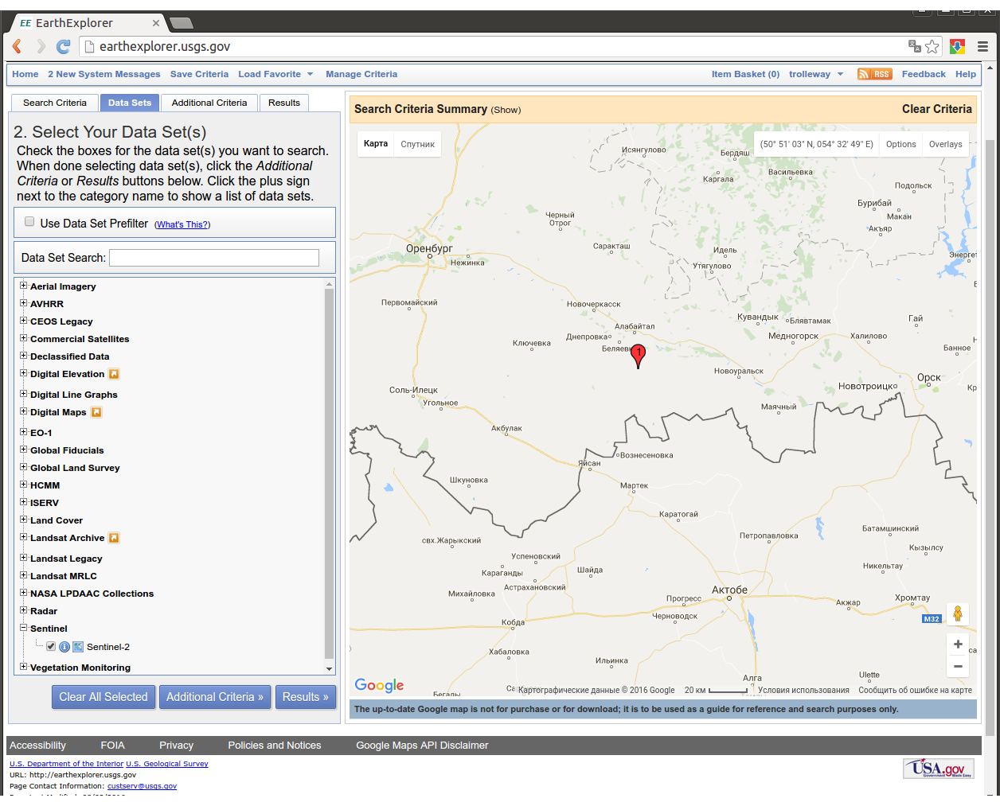

   Выбор набора данных Sentinel-2.


Для перехода к просмотру данных необходимо нажать кнопку **Results**.

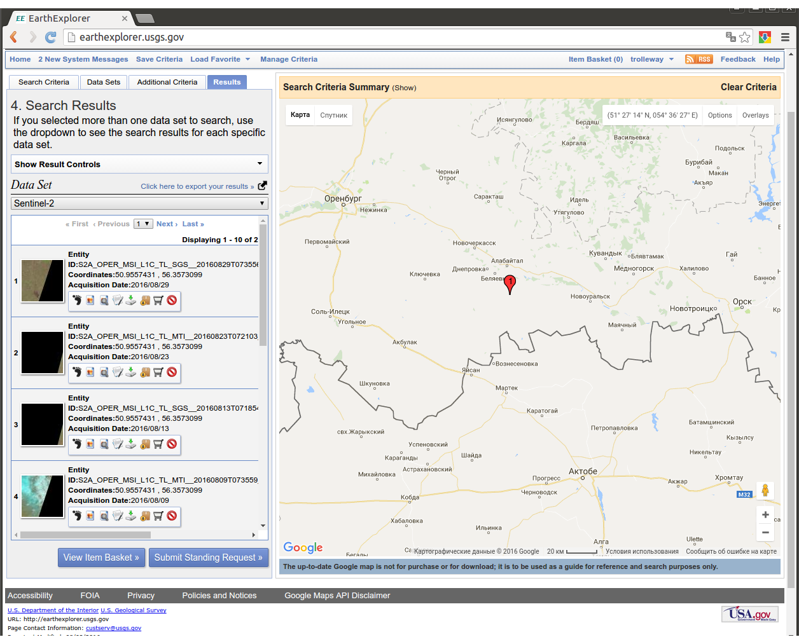
   
   Фрагмент окна результатов поиска снимков по заданной территории.

В списке результатов указываются даты снимков. Нажатием кнопки :guilabel:`Show browse overlay` можно 
посмотреть, как ложится проекция сцены на карту, и не закрывают ли облака нужное место. Нажатием кнопки 
:guilabel:`Download options` будет начат процесс скачивания.

Под надписью Data Set можно выбрать, с какого спутника вы просматриваете данные. Выберите тот, у которого более подходящие вам снимки.


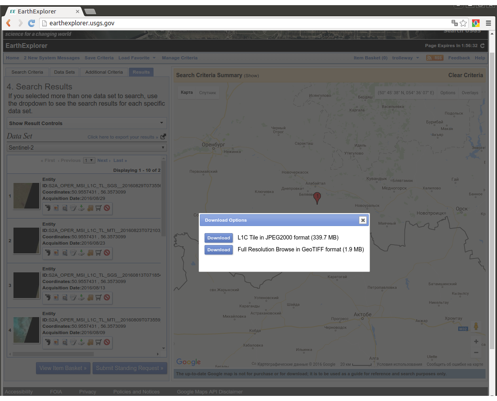
   
   Выбор вариантов скачивания: вся сцена или файл предпросмотра. 
   Выберите тот, у которого больше размер.

Если нужно скачать несколько снимков, то следует учесть, что на данный момент в
Earth Ezplorer существует ошибка: при возврате со страницы скачивания в карту на 
экране висит надпись "Searcing", и ничего не происходит. Если необходимо скачать
большое количество снимков, то можно воспользоваться специальным java-приложением
распространяемым тут же на сайте.

Космоснимок называется "сцена", он скачивается в архиве. Распакуйте архив.

Открытие одного канала (простой способ)
----------------------------------------------

* Если вы скачали снимок со спутника Landsat-8, то откройте в QGIS растровый файл из архива, который оканчивается на _B8.tif

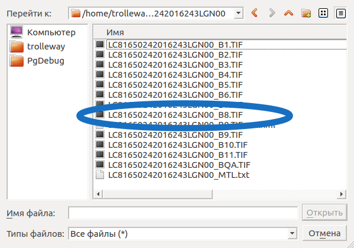
   
   При открытии снимка Landsat-8 выбирайте этот файл.
   
* Если вы скачали снимок со спутника Sentinel-2B, то откройте в QGIS растровый файл из архива, который лежит в нём по адресу /GRANULE.../IMG_DATA/ и оканчивается на _B03.JP2

Настройте контрастность картинки. Для этого следует:

1. Передвинуть карту на то место, где видны следы пожара.
2. Выделить слой с космоснимком в списке слоёв.
3. В контекстном меню слоя Свойства --> Стиль. Выставите настройки как на :ref:`howto_sentinelStyleBW1`.

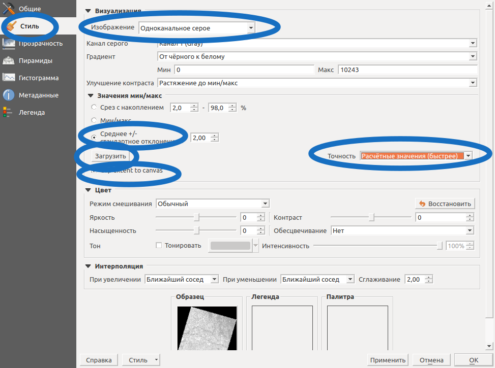
   
   Настройки стиля для чёрно-белого снимка.

4. Найдите в окне раздел "Значения мин/макс" и в нём нажмите кнопку "Загрузить". 


Контрастность растянулась. Особенно полезен этот способ, когда на снимке есть облака.

.. note:: 
    В файле яркость точек записана в диапазоне от 0 до 16000. А на мониторе она изменяется более грубо: от 0 до 255. При этой операции самые тёмно-серые места на снимке станут чёрными, а самые светло-серые - станут белыми.

Создание цветного изображения (сложный способ)
--------------------------------------------------------

В архиве в находятся отдельные tiff-файлы, по одному на канал. 

.. note:: 

    Что такое канал? 

    Камера в вашем телефоне выдаёт трёхканальные фотоснимки: у каждого пиксела записаны значения красного, зелёного и синего цветов, и на светочуствительной матрице в камере находятся датчики трёх типов.
    Спутник Sentinel-2A выдаёт 11-канальные фотоснимки, на нём находится много светочуствительных датчиков. Длинны волн, которые они снимают, известны, таблицу их значений можно найти в интернете. Каналы №2, 3, 4 - снимают в видимом диапазоне. Известно, что если считать канал №4 красным, №3 - зелёным, №2 - синим, то из этих трёх каналов можно собрать цветное изображение.

QGIS --> Растровые операции --> Объединение.

Из пачки tiff получится 1 tiff мультиканальный.

Открыть мультиканальный tiff.

Свойства слоя --> Стиль --> Многоканальное цветное. Выставите автоматическую контрастность как на :ref:`howto_sentinelStyleBW1`.


Рисование площади сгоревшего участка
---------------------------------------------

* Определите зону UTM. Слой снимка --> Контекстное меню слоя --> Свойства --> Общие --> Вкладка "Система координат".  В примере у снимка система координат EPSG:32640, запомним это название.

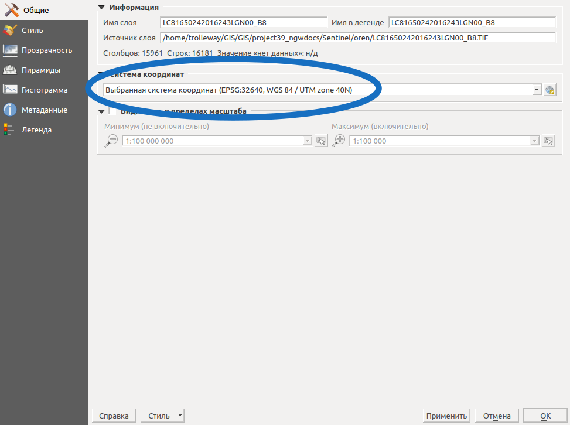
   
* Создать новый слой. Система координат - та же, что на предыдущем шаге. Тип геометрии - мультиполигон. 

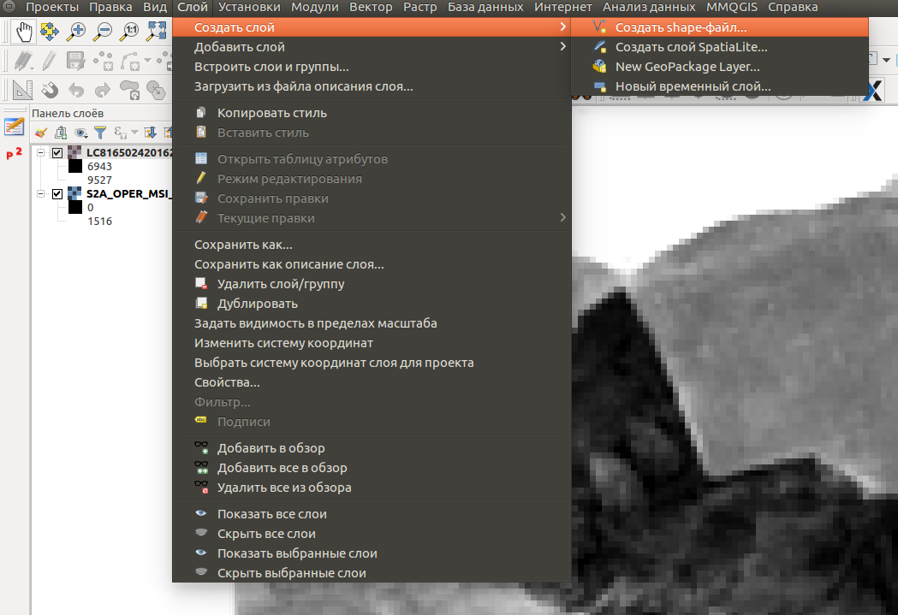
   
   
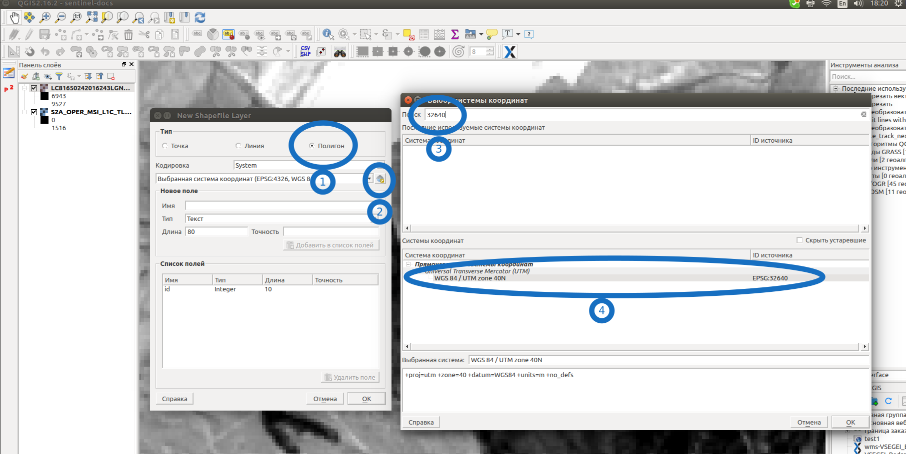
   
* Создание атрибутов пропустить.
* Выберите папку, куда сохранятся файлы слоя.
* Включить панели Рисование.
* Начать рисовать.
* Сделать слой полупрозрачным или линией. Слой --> Свойства --> Стиль. Сделайте цвет полупрозрачным.

* Если в территории дырка: на панели "Дополнительные инструменты рисования" нажмите кнопку "Добавить кольцо". Обрисуйте несгоревший участок. 
* Выйдите из режима редактирования слоя, нажав кнопку режим редактирования. Правки в слое сохранятся на диск.

Пересечение сгоревшей территории и территории заповедника
---------------------------------------------------------------
* Найдите слой с территорией заповедника и откройте его как векторный слой (для примера возьмём его из Openstreetmap: http://overpass-turbo.eu/s/ign).


* Пересохраните этот слой в ту же систему координат, что и слой со сгоревшей территорией (в примере - EPSG:32640)

.. figure:: _static/howto_sentinelSaveBoundary.png
   :name: howto_sentinelSaveBoundary
   :align: center
   :width: 15cm
   
   Выделили нужную территорию в слое границ заповедника, сохраняем выделенный объект в отдельный файл в UTM.

* Вектор --> Пересечение. Выберите эти два слоя в любом порядке. У вас получится Shapefile с той частью территории заповедника, которая сгорела.

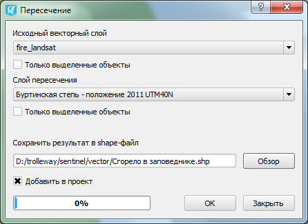
   
   Параметры инструмента "Пересечение".

Узнать площадь фигуры в квадратных километрах
^^^^^^^^^^^^^^^^^^^^^^^^^^^^^^^^^^^^^^^^^^^^^^^^

1. В свойствах проекта --> Общие выставить :guilabel:`Эллипсоид для вычислений` - WGS1984, :guilabel:`единицы для измерения длин` - метры, :guilabel:`единицы для измерения площадей` - квадратные километры (см. :ref:`project_settings`).
2. Инструментом идентификации щёлкнуть на площадной объект. Найти панель Результат определения, выведенные --> площадь. Там будет указана площадь в квадратных километрах, подсчитанная на WGS 1984.


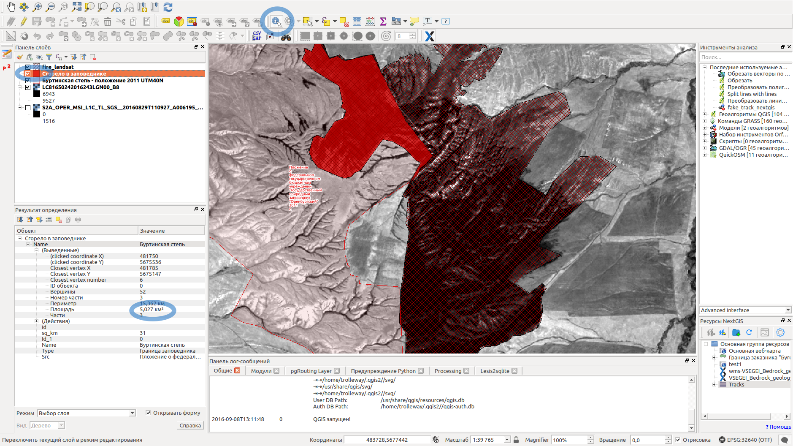
   
   Площадь полигона, хранящегося в UTM, выводится в квадратных километрах.

Узнать площадь одной или нескольких фигур в гектарах, квадратных метрах и других единицах измерения
^^^^^^^^^^^^^^^^^^^^^^^^^^^^^^^^^^^^^^^^^^^^^^^^^^^^^^^^^^^^^^^^^^^^^^^^^^^^^^^^^^^^^^^^^^^^^^^^^^^^^^^^^^^

.. note:: В версии QGIS 2.14.3 площади на лету считаются только в квадратных километрах, считать в гектарах можно только через калькулятор полей.

1. Определить зону UTM. Для Московской области это 37N. Вы можете воспользоваться веб-картой: http://data.nextgis.com/resource/51/display .
2. Сохранить слой в Shapefile или GeoJSON в WGS 84 / UTM 37N.
3. Выделить слой, зайти в калькулятор полей, создать поле. :guilabel:`Название поля` - например square, :guilabel:`тип real`, :guilabel:`размер` 20, :guilabel:`точность` 10. 

Выражение для квадратных метров: area($geometry). 

Выражение для квадратных километров: area($geometry) /1000000.

Выражение для целого значения гектаров: round(area($geometry) /10000 ).


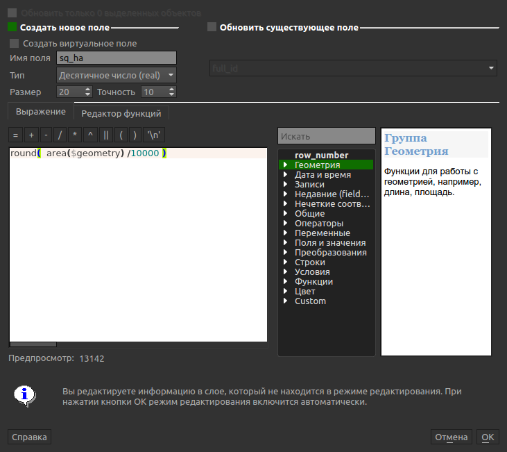
 
   Создание поля с площадью в гектарах через калькулятор полей.  

4. После завершения работы калькулятора полей в таблице атрибутов будет видна площадь. В примере получается около 5 квадратных километров. 


* Сохраните файл с геоданными сгоревшей территории, чтобы потом на следующий год его можно было найти. 
