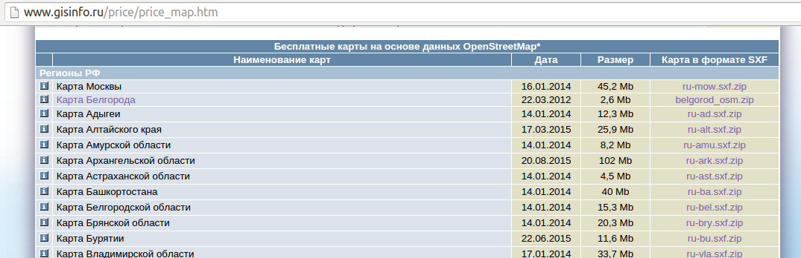
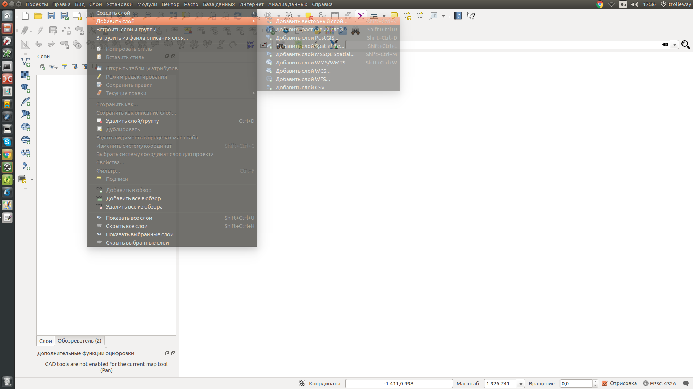
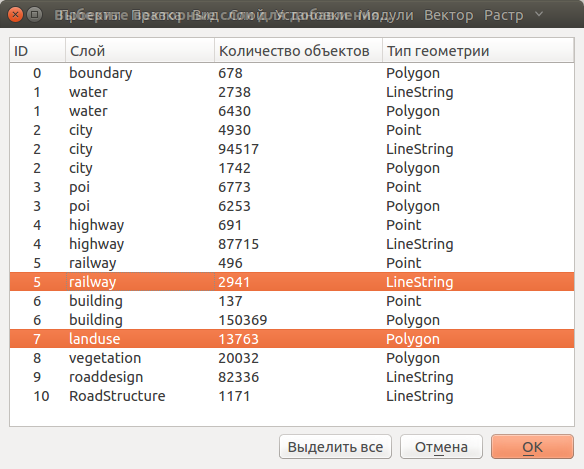
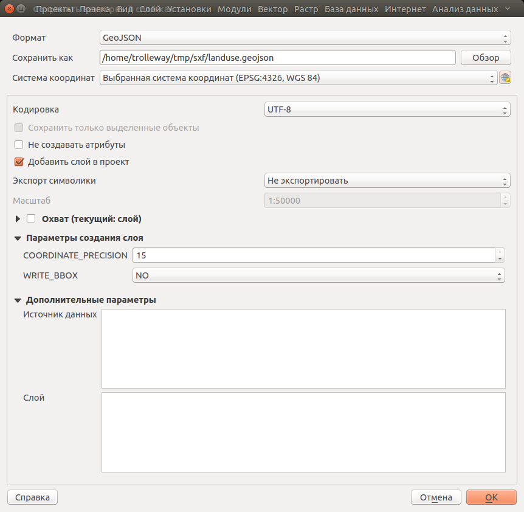
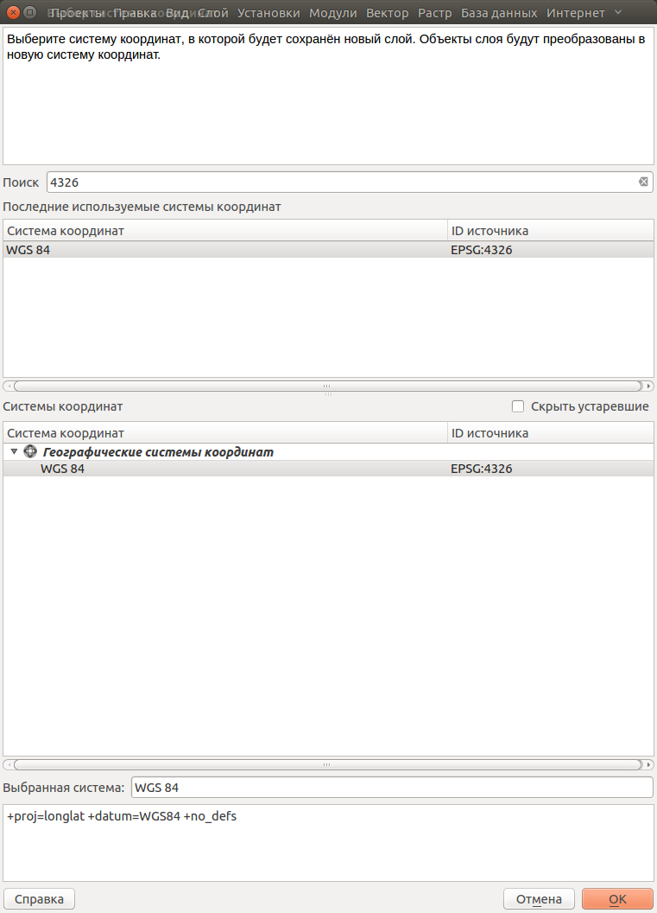
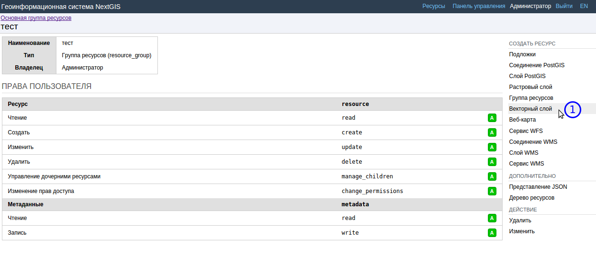
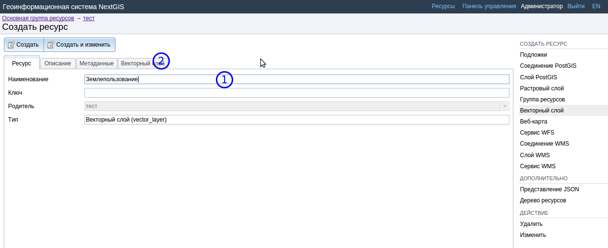
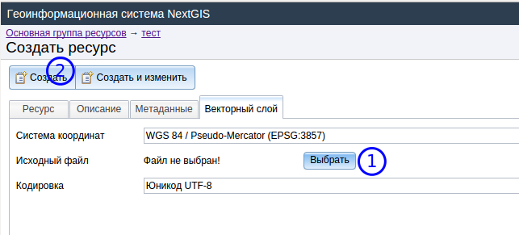
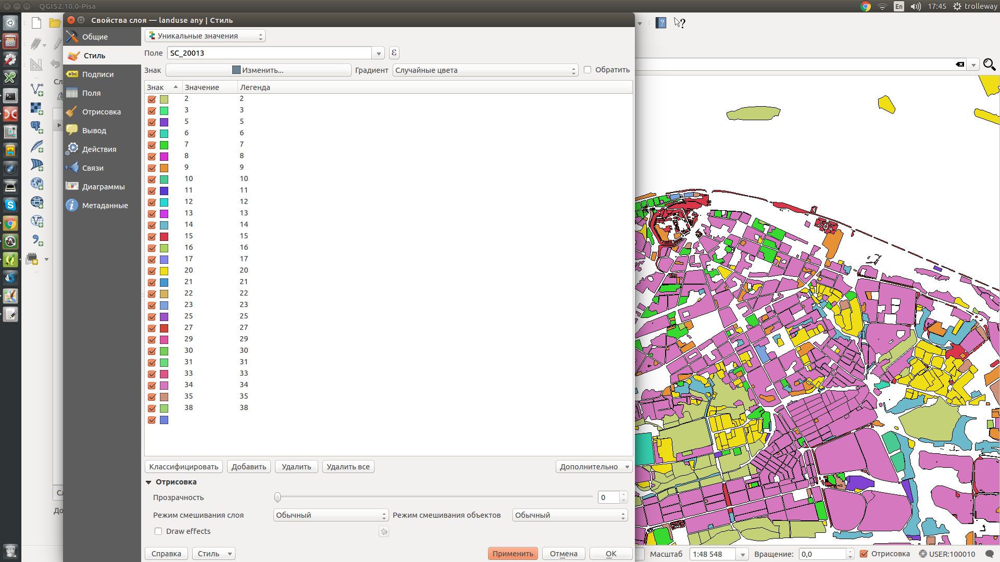
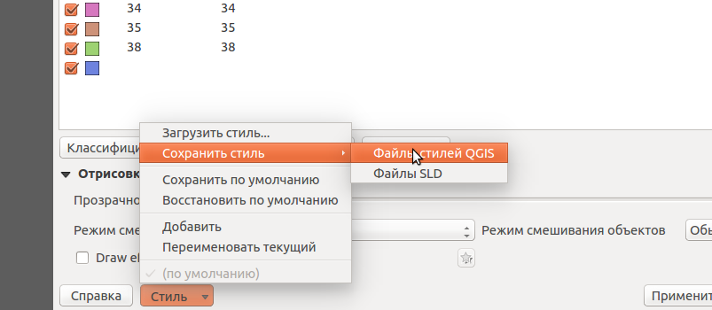

.. sectionauthor:: Артём Светлов <@nextgis.ru>

.. sxf:

Работа стека NextGIS с форматом sxf
=====================================

Введение
----------------------------

В этой инструкции мы возьмём геоданные в формате sxf, загрузим их в NextGIS Web, настроим их стиль отображения, и отобразим их на веб-карте. 
Для работы потребуется:

#. Набор данных в формате sxf - скачайте выгрузку из Openstreetmap на странице http://www.gisinfo.ru/price/price_map.htm
#. :program:`NextGIS QGIS`.
#. Доступ к инстансу :program:`NextGISWEB`. - у вас должен быть его URL, логин и пароль.

Подготовка sxf к загрузке
----------------------------

Скачайте на странице http://www.gisinfo.ru/price/price_map.htm выгрузку данных OpenStreetMap на любой интересующий вас регион.

Распакуйте их в каталог.
Поскольку :program:`NextGISWEB` сейчас поддерживает импорт только из форматов ESRI Shapefile и geojson, то нам нужно сконвертировать sxf в geojson. 

Запустите :program:`NextGIS QGIS`.

Нажмите :menuselection:`Слой --> Добавить слой --> Добавить векторный слой`.

На экране появится диалог выбора слоёв из файла sxf. В этом примере мы загрузим слой железных дорог (Railway) и землепользования (landuse)

Сохраните эти два слоя в формате geojson. Для этого, выделите слой landuse в списке слоёв, и нажмите Нажмите :menuselection:`Слой --> Сохранить как`

.. figure:: _static/sxfQGISSaveLayerMenu.png
   :name: sxfQGISSaveLayerMenu
   :align: center
   :width: 15cm

В диалоге сохранения задайте следующие настройки:

#. Формат - geojson
#. Система координат - EPSG:4326. Если её не будет в предложенном списке (такое бывает при первом запуске программы), то нажмите на кнопочку рядом, и в окне поиска введите "4326".

   Окно экспорта слоя

   Окно поиска проекции

Сохраните слои как landuse.geojson и railway.geojson.

Загрузка в NextGIS Web
----------------------------------

Откройте в браузере имеющийся у вас адрес инстанса, введите логин и пароль. Вы попадёте в админку. При желании вы можете создать в ней каталог ("группу ресурсов"), что бы работать с тестовыми данными в ней. Затем нажмите :guilabel:`Векторный слой`

   Главная страница админки

Задайте название "Землепользование". Перейдите на вкладку :guilabel:`Векторный слой`, нажмите на кнопку :guilabel:`Выбрать`, и загрузите файл landuse.geojson, затем нажмите на кнопку :guilabel:`Создать`.

Стилизация слоя в NextGIS Web
----------------------------------

Сейчас вы загрузили слой в NGW, для показа на веб-карте, или раздачи по WMS к нему нужно добавить стиль. 

Идите в :program:`NextGIS QGIS`.

Зайдите в свойства слоя Landuse, который вы экспортировали. Настройте его стиль - с классификацией по полю SC_20013.

Найдите снизу окна настроек слоя кнопку :menuselection:`Стиль --> Сохранить стиль --> Файлы стилей QGIS`. У вас сохранится стиль в формате qml.

Вернитесь в браузер. 
Сейчас вы находитесь в админке внутри слоя (если занудно - в окне свойств слоя), поэтому нажмите :guilabel:`Стиль Mapserver`.

Задайте стилю имя "Землепользование". Перейдите на вкладку :guilabel:`Mapserver`.

Нажмите кнопку  :guilabel:`Import QGIS style` (над текстовым полем). Выберите файл qml. После подтверждения, нажмите на кнопку :guilabel:`Создать`.

Показ слоя на веб-карте в NextGIS Web
------------------------------------------

Перейдите в список ресурсов, и Нажмите :guilabel:`Веб-карта`. Задайте название, и перейдите на вкладку :guilabel:`Слои`. Нажмите на кнопку :guilabel:`Добавить слой`, и выберите в списке ресурсов слои тех слоёв, что вы создали.

Нажмите на кнопку :guilabel:`Создать`.

Нажмите на кнопку :guilabel:`Просмотр`.

После этого шага в экране браузера появится веб-карта. Включите слой. 

