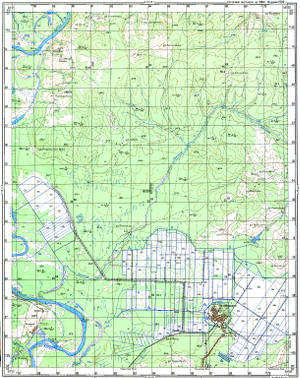
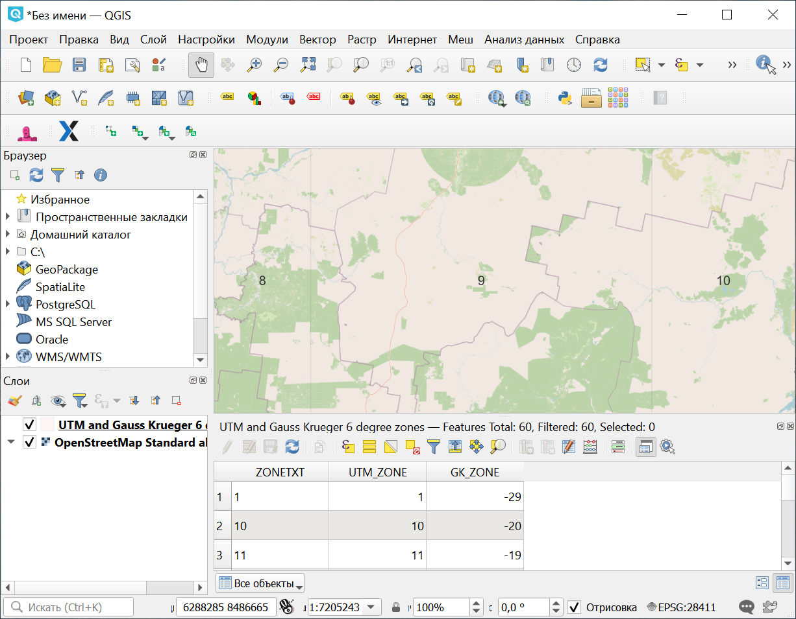
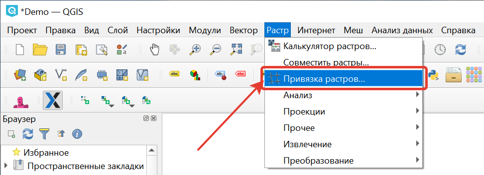
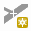
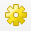
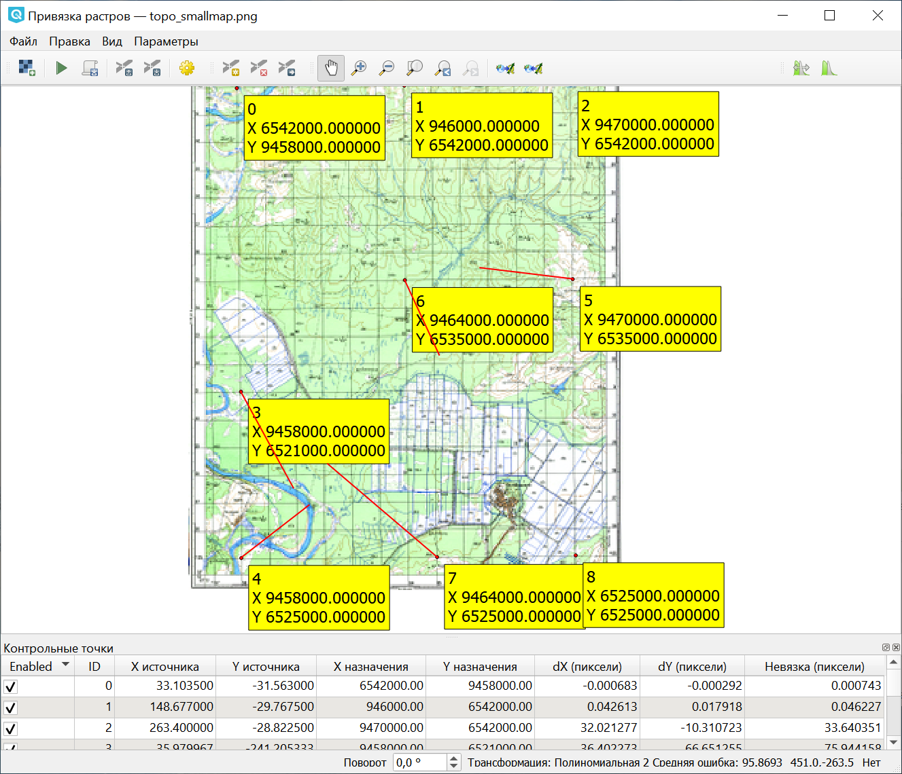
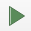

.. sectionauthor:: Артём Светлов <@nextgis.ru>

.. topo_groref:

Привязка топокарт по координатам
=====================================

Введение
----------------------------

В этой инструкции мы возьмём отсканированную топокарту Генштаба, определим её систему координат и привяжем её по сетке так, чтобы получился GeoTIFF.
Для работы потребуется:

1. Отсканированная топокарта Генштаба с зарамочным оформлением - там должны быть подписи.
2. :program:`NextGIS QGIS`.
3. Доступ к интернету, где мы будем скачивать разграфки и читать документацию.

Определяем проекции
----------------------------

Рассмотрим файл с картинкой карты в каком-либо графическом просмотрщике. 

Нам нужно, чтобы на карте было не отрезано зарамочное оформление. 

   Пример карты, подходящей для привязки по данной инструкции.

Для привязки карты нужно знать её проекцию. Известно, что наиболее распространённые карты - позднесоветские карты Генштаба - имеют проекцию Pulkovo 1942 / Gauss-Krugger zone *. В проекции Гаусс-Крюггера земной шар разделён на зоны по мередианам через 6 градусов, и нам нужно её будет указать. Чтобы узнать номер зоны, нужно приблизительно знать координаты места, изображённого на карте.  

В :program:`NextGIS QGIS`загружаем схему зон Гаусс-Крюггера. Её можно скачать с гис-лаба на странице http://gis-lab.info/qa/kmgrids.html (ищем ссылку "Скачать разграфку в формате: Shape") или добавить через плагин QuickMapServices.

По желанию делаем слой полупрозрачным. Подкладываем знакомую вам картоподложку плагином QuickMapServices и находим место, которое изображено на топокарте.

В атрибутах файла схемы зон приведены номера зон UTM и Гаусс-Крюггера (поле называется GK). Для их отображения нужно включить в свойствах слоя подписи и выбрать нужное поле как источник подписей.  Запоминаем или записываем это число. Это и будет **номер зоны Гаусс-Крюггера**.

   Определение зоны в NextGIS QGIS

Также может пригодится файл разграфки листов для соответствующего масштаба карты. Их можно скачать на странцие http://gis-lab.info/qa/topogrids.html. В атрибутивной информации приведены названия листов (номенклатура). Вы можете узнать, в какую зону попадает лист карты, если вы знаете его название, или узнать, какой лист карты искать, если вы знаете место.
Также можно поискать в QMS "Разграфка".

Нужен растр в RGB
--------------------------

Посмотрите на файл с картой в файловом менеджере. Вам нужно определить формат файла. Если формат gif, то его нужно будет пересохранить в png, jpg, или tiff. Эту операцию можно сделать в графических редакторах или в :program:`NextGIS QGIS`. :menuselection:`Растр --> Преобразование --> PCT в RGB`. 

Привязка
-------------------------

Начинаем привязку. В :program:`NextGIS QGIS` нажмите :menuselection:`Растр --> Привязка растров`. 

   Открытие окна привязки растров

Если этого пункта в меню нет, значит модуль не включён. В этом случае идите в настройку модулей :menuselection:`Модули --> Управление модулями`. Найдите модуль "Привязка растров" и включите его.

В окне привязки растров откройте файл с отсканированной картой.

Приближаемся в левый верхний угол. 

Ищем на перекрестиях отметки метровых координат. Эти цифры обозначают миллионы метров.
Выбираем инструмент |button_georef_add_point| **добавить точку**, нажимаем на перекрестие. Появляется окно, вводим в X и Y - координаты в метрах. 

Координаты X написаны за верхней и нижней границами, координаты Y - за правой и левой.
В них записаны миллионы метров, то есть, если написано 6542, то вводим с клавиатуры это число с тремя нулями: 6542000.

Нужно ввести 9 точек.

После ввода 9 точек, идём в панель |button_georef_settings| Параметры трансформации.
Выставляем: 

* Тип трансформации - Полиноминальная 2.
* Метод трансформации - Ланцоша.
* Целевая система координат - Pulkovo 1942 / Gauss Krugger Zone - и тот номер зоны, который определили. В примере мы взяли Кировскую область, она попала в 9 - выставляем Pulkovo 1942 / Gauss-Kruger zone 9, EPSG:28409. В списке будут пункты с Deprecated, а нужно выбрать те, что без Deprecated.
* Целевой растр - имя нового GeoTIFF.

После указания параметров трансформации и нажатия клавиши ОК - на экране покажутся ошибки трансформации.

Можно включить Параметры - Настройки привязки растров - включить идентификаторы, показать координаты.

   Пример привязки с большой ошибкой

На картинке мы наблюдаем длинные красные линиии, а в строке состояния - большую среднюю ошибку. Это произошло из-за ошибки ввода цифровых координат.

Внимательно проверяем введёные цифры. После исправления цифр - заходим снова в окно Параметры трансформации и нажимаем Ok - тогда пересчитывается средняя ошибка.

После исправления, значение средней ошибки уменьшилось с 400 до 1.

Запустите привязку растра, нажав кнопку с зеленой стрелкой |button_start_georef| на панели инструментов или "Файл ‣ Начать привязку растра".

Если всё получилось без ошибок, то в :program:`NextGIS QGIS` добавится геопривязанный растр в формате GeoTIFF. Вы можете проверить, как он ложится на слой OSM Mapnik (или под полупрозрачный слой OSM Mapnik).

.. figure:: _static/topo_refrencing_ok.png
   :name: howto_topo_refrencing_ok
   :align: center
   :width: 15cm

   Карта, привязанная точно

