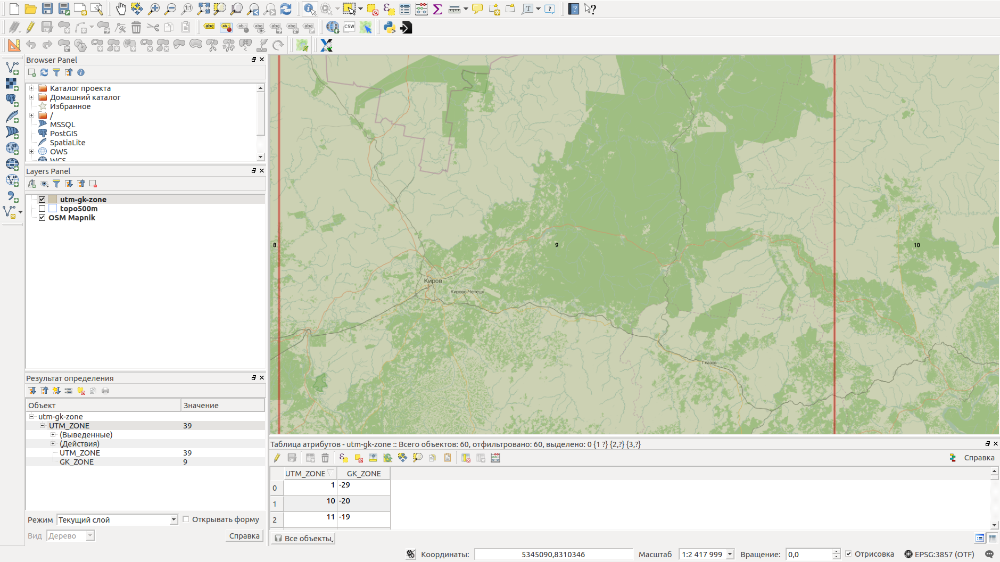
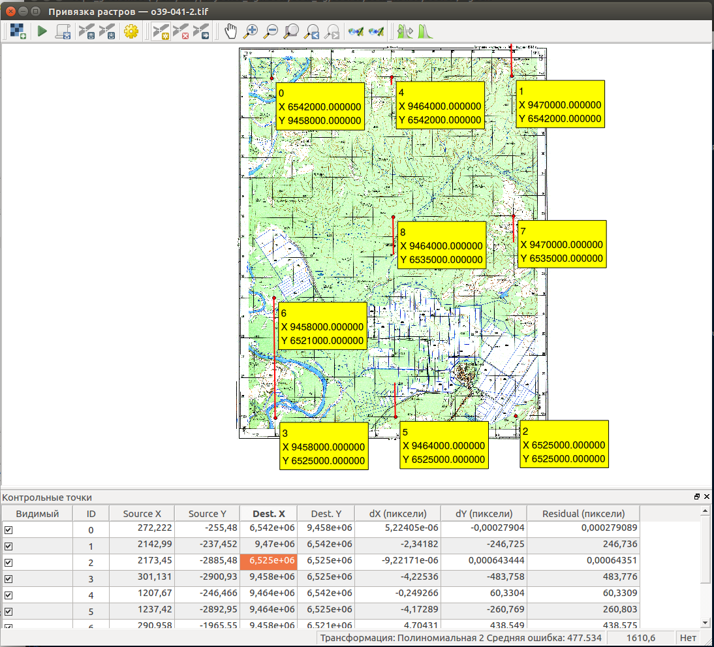

.. sectionauthor:: Артём Светлов <@nextgis.ru>

.. topo_groref:

Привязка топокарт по координатам
=====================================

Введение
----------------------------

В этой инструкции мы возьмём отсканированную топокарту Генштаба, определим её систему координат и привяжем её по сетке так, чтобы получился GeoTIFF.
Для работы потребуется:

1. Отсканированная топокарта Генштаба с зарамочным оформлением - там должны быть подписи.
2. :program:`NextGIS QGIS`.
3. Доступ к интернету, где мы будем скачивать разграфки и читать документацию.

Определяем проекции
----------------------------

Рассмотрим файл с картинкой карты в каком-либо графическом просмотрщике. Если у вас много больших растровых файлов, то для их просмотра можно использовать :program:`NextGIS Manager` - он открывает их быстрее, чем графические просмотрщики.

Нам нужно, чтобы на карте было не отрезано зарамочное оформление. 

.. figure:: _static/topo_smallmap.png
   :name: howto_topo_smallmap
   :align: center

   Пример карты, подходящей для привязки по данной инструкции.

Для привязки карты нужно знать её проекцию. Известно, что наиболее распространённые карты - позднесоветские карты Генштаба - имеют проекцию Pulkovo 1942 / Gauss-Krugger zone *. В проекции Гаусс-Крюггера земной шар разделён на зоны по мередианам через 6 градусов, и нам нужно её будет указать. Что бы узнать номер зоны, нужно приблизительно знать координаты места, изображённого на карте.  

Скачиваем схему зон Гаусс-Крюггера с гис-лаба на странице http://gis-lab.info/qa/kmgrids.html - ищем ссылку "Скачать разграфку в формате: Shape".

Открываем в :program:`NextGIS QGIS` загруженный Shape, по желанию делаем его полупрозрачным. Подкладываем знакомую вам картоподложку плагином QuickMapServices и находим место, которое изображено на топокарте.
В атрибутах файла схемы зон приведены номера зон UTM и Гаусс-Крюггера (поле называется GK). Запоминаем или записываем это число. Это и будет **номер зоны Гаусс-Крюггера**.

   Определение зоны в NextGIS QGIS.

Так же может пригодится файл разграфки листов. Их можно скачать на странцие http://gis-lab.info/qa/topogrids.html, но вам нужно знать масштаб карты. В атрибутивной информации приведены названия листов (номенклатура). Вы можете узнать, в какую зону попадает лист карты, если вы знаете его название, или узнать, какой лист карты искать, если вы знаете место.
Так же можно поискать в QMS "Разграфка".

Нужен растр в RGB
--------------------------

Посмотрите на файл с картой в файловом менеджере. Вам нужно определить формат файла. Если формат gif, то его нужно будет пересохранить в png, jpg, или tiff. Эту операцию можно сделать в графических редакторах или в :program:`NextGIS QGIS`. :menuselection:`Растр --> Преобразование --> PCT в RGB`. 

Привязка
-------------------------

Начинаем привязку. В :program:`NextGIS QGIS` нажмите :menuselection:`Растр --> Привязка растров --> Привязка растров`. 

.. figure:: _static/topo_open_refrencing_window.png
   :name: howto_topo_open_refrencing_window
   :align: center
   :width: 15cm

   Открытие окна привязки растров.

Если этого пункта в меню нет, значит модуль не включён. В этом случае идите в настройку модулей :menuselection:`Модули --> Управление модулями`. Найдите модуль "Привязка растров" и включите его.

В окне привязки растров откройте файл с отсканированной картой.
На экран выведется диалог выбора системы координат. Поскольку этот файл ещё не привязан,
то этот диалог мы закроем клавишей Отмена.

Приближаемся в левый верхний угол. 

Ищем на перекрестиях отметки метровых координат. Эти цифры обозначают миллионы метров.
Находим инструмент добавить точку, нажимаем на перекрестие. Появляется окно, вводим в X и Y - координаты в метрах. 
Нам нужно 9 точек.

Координаты X написаны за верхней и нижней границами, координаты Y - за правой и левой.
В них записаны миллионы метров, то есть, если написано 6542, то вводим с клавиатуры это число с тремя нулями: 6542000.

После ввода 9 точек, идём в панель Параметры трансформации.
Выставляем: 

* Тип трансформации - Полиноминальная 2.
* Метод трансформации - Ланцоша.
* Целевая система координат - Pulkovo 1942 / Gauss Krugger Zone - и тот номер зоны, который определили. В примере мы взяли Кировскую область, она попала в 9 - выставляем Pulkovo 1942 / Gauss-Kruger zone 9, EPSG:28409. В списке будут пункты с Deprecated, а нужно выбрать те, что без Deprecated.
* Целевой раст - имя нового GeoTIFF.

После указания параметров трансформации и нажатия клавиши ОК - на экране покажутся ошибки трансформации.

Можно включить Параметры - Настройки привязки растров - включить идентификаторы, показать координаты.

   Пример привязки с большой ошибкой.

На картинке мы наблюдаем длинные красные линиии, а в строке состояния - большую среднюю ошибку. Это произошло из-за ошибки ввода цифровых координат.

Внимательно проверяем введёные цифры. После исправления цифр - заходим снова в окно Параметры трансформации и нажимаем Ok - тогда пересчитывается средняя ошибка.

После исправления, значение средней ошибки уменьшилось с 400 до 1.

Запускаем Файл --> Начать привязку растра.

Если всё получилось без ошибок, то в :program:`NextGIS QGIS` добавится геопривязанный растр в формате GeoTIFF. Вы можете проверить, как он ложится на слой OSM Mapnik (или под полупрозрачный слой OSM Mapnik).

.. figure:: _static/topo_refrencing_ok.png
   :name: howto_topo_refrencing_ok
   :align: center
   :width: 15cm

   Карта, привязанная точно.

Настройки
-----------------------

Этот раздел будет перенесён в отдельную статью в основной документации.

Алгоритмы привязки
^^^^^^^^^^^^^^^^^^^^^^^

Это обозначает, каким алгоритмом будут перемещаться пикселы и растягиваться карта. Алгоритм выбирается в зависимости от комбинации проекций карт - ту в которой лежит растровая карта, и та к которой привязывается. 

Если вы не разбираетесь в проекциях, то выбирайте "Тонкостенный сплайн", этот алгоритм привяжет всё.

* Линейная - алгоритм делает только поворот, масштабирование, и skew. Этот алгоритм генерирует .world-файл, а все остальные алгоритмы генерируют новый GeoTIFF с привязкой внутри. Достаточно 3 точек. 
* Helmert - алгоритм делает только поворот, масштабирование, и skew. Он пригоден, если обе карты в одинаковой проекции. Например, если вы взяли карту openstreetmap, напечатали на принтере, нарисовали поверх неё ручкой новые объекты, и сфотографировали эту бумагу, то можете привязать её обратно к openstreetmap этим алгоритмом. Достаточно 3 точек.
* Полиномиальная 1-2-3 - используются для привязки бумажных карт. Чаще всего используется алгоритм Полиномиальная-2, который делает кривизну, например при привязке карт в проеции Гаусс-Крюгера к слою в Pseudo Mercator.  Полиномиальная-1 делает то, что так же назвается афинным преобразованием. Для этих алгоритмов требуется большее число опорных точек.
* Тонкостенный сплайн - современный алгоритм, который позволяет делать локальные деформации, то есть разные в разных местах карты. Он самый всеядный, пригоден для привязки всего, что можно открыть как растр.
* Проективная - работает как Helmert, но делает несколько больше геометрических операций. Пригоден для случая когда нужно привязать одиночное фото из летательного аппарата к карте.

Метод интерполяции
^^^^^^^^^^^^^^^^^^^^^^^^

Это обозначает алгоритм масштабирования изображения, все эти алгоритмы такие же, как в графических редакторах. Разница между ними в визуальном качестве изображения, и почти всегда незаметна, только чуть-чуть изменяется размытость. 

* Ближайший сосед - быстрый алгоритм. Подойдёт для случая, когда вы долго подбираете опорные точки для тонкостенного сплайна, и хотите быстро расчитать результат и посмотреть, какая получилась невязка в этот раз.
* Ланцоша - обычно все используют её, потому что этот алгоритм даёт стабильные результаты независимо от вида изображения.

Сжатие
^^^^^^^^^^^^^^^^^^^^^^^^^

После привязк растр получается несжатый, и занимает много места на диске. Можно выбрать алгоритм Deflate, он сжимает растр, но ненамного. Поэтому после привязки вы можете запустить Растр --> Извлечение --> Обрезка, и обрезать растр по альфа-каналу, затем Растр --> Преобразование --> Преобразовать формат и сохранить его в GeoTIFF с сжатием JPEG. Это заметно уменьшит размер файлов.
