Tutorial: Collect Spatial Data in the Field
===========================================

.. admonition:: Availability

    Cloud SaaS (all editions), On premise (Extended, Enterprise)

NextGIS Web is a data-centric server GIS allowing you to store, manage and publish spatial data in a flexible and effective way. It has an integrated mobile data collection subsystem that you can use to organize collaborative field work. In this step-by-step tutorial you will learn how to create a data collection project and start gathering spatial information with a mobile application. Register a free cloud account and try it right away!

In this example, we will create a project to collect data about trees in the city. An Android smartphone is required to work with mobile application.

Setting up

* `Step 1. Free account and Web GIS <https://docs.nextgis.com/docs_howto/source/tutorial_collect.html#account>`_
* `Step 2. Resource group <https://docs.nextgis.com/docs_howto/source/tutorial_collect.html#webgis>`_
* `Step 3. Vector layer (database) <https://docs.nextgis.com/docs_howto/source/tutorial_collect.html#create-layer>`_
* `Step 4. Data collecting form <https://docs.nextgis.com/docs_howto/source/tutorial_collect.html#form>`_ 
* `Step 5. List of field workers <https://docs.nextgis.com/docs_howto/source/tutorial_collect.html#collectors>`_
* `Step 6. Collector project <https://docs.nextgis.com/docs_howto/source/tutorial_collect.html#project>`_

Collect and check the data

* `Enter data <https://docs.nextgis.com/docs_howto/source/tutorial_collect.html#fieldwork>`_
* `Check and visualize in Web GIS <https://docs.nextgis.com/docs_howto/source/tutorial_collect.html#check>`_

.. _account:

Step 1/6 Create free account and Web GIS
----------------------------------------

Go to `my.nextgis.com`, click the **Create Account** button and sign up using your email address. 

After registration your account page would appear. Select the **Web GIS** menu on the left, come up with a name (ngw-quickstart.nextgis.com in this example) and select the nearest Data center location (DE Falkenstein in this example). Then click **Create Web GIS**.

.. figure:: _static/tutorial_create_wg_en.png
   :name: 
   :align: center
   :width: 20cm

When the creation process is complete, the contents of the page will change. Direct link to your new Web GIS will appear.

.. figure:: _static/tutorial_my_wg_en.png
   :name: 
   :align: center
   :width: 20cm

.. _webgis:

Step 2/6 Access your Web GIS and create resource group
-------------------------------------------------------

Click on the Web GIS link or type it into your browser.

You'll see the main interface of your Web GIS.

.. figure:: _static/tutorial_wg_main_en.png
   :name: tutorial_wg_main_pic
   :align: center
   :width: 20cm

In NextGIS Web everything is a resource — layers, Web Maps, folders (groups), connections to services and databases. Resources are organized as files at your computer — in a tree. 

Let’s create our first resource, a folder or *resource group* named Data collecting. To do that, click the blue **Create resource** button on the top of the page. 

.. tip:: If you don’t see the **Create resource** button, you should log in first. Click the **Sign in** button in the top right corner and then select **Sign in with NextGIS ID**.

.. figure:: _static/tutorial_log_in_en.png
   :name: tutorial_log_in_pic
   :align: center
   :width: 20cm

When you click **Create resource**, a window appears showing all available options of what could you create in the current context. Select **Resource group**.

.. figure:: _static/tutorial_select_group_en.png
   :name: tutorial_select_group_pic
   :align: center
   :width: 20cm

The resource creation window consists of several tabs, in this case we need to set only the name ``Data collecting`` on the “Resource” tab.

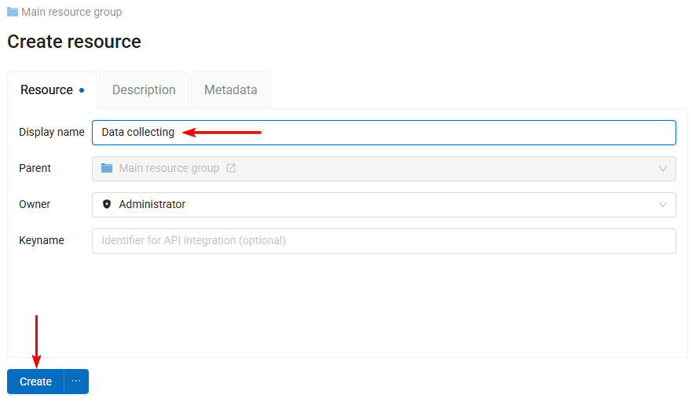

Click **Create** and you'll be redirected to the page of the new resource.

The URL in your browser is the path to the resource, and the numbers at the end of the URL are the resource ID. 

.. figure:: _static/collect_group_result_en.png
   :name: collect_group_result_pic
   :align: center
   :width: 14cm

*Data collecting* is a child for the *Main resource group* folder where we created it. The parent resource is shown above the resource name.

Now you can upload data to this folder.

.. _create_layer:

Step 3/6 Create a vector layer (container for data collecting)
--------------------------------------------------------------

Next we need to create a vector layer, it will serve as a database where the collected information about geographical objects would be stored. Click the **Create resource** button, then select **Vector layer**.

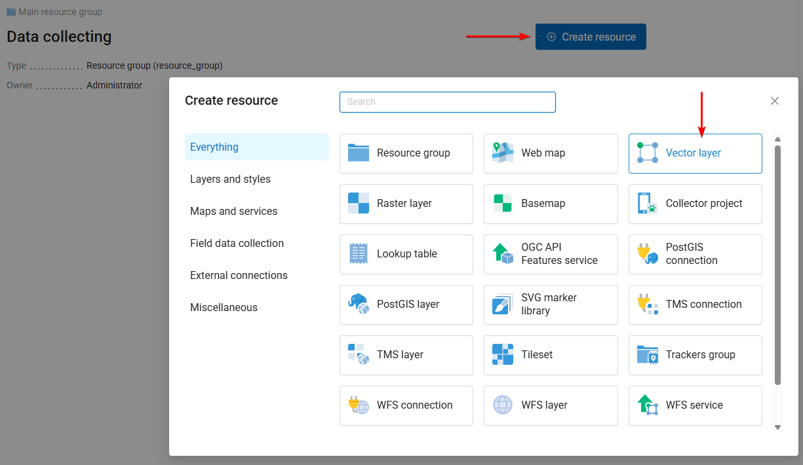

It is possible to upload a vector layer from a file, or create it from skratch. Open the dropdown menu on the top of the “Vector layer” tab and select **Create empty layer**.

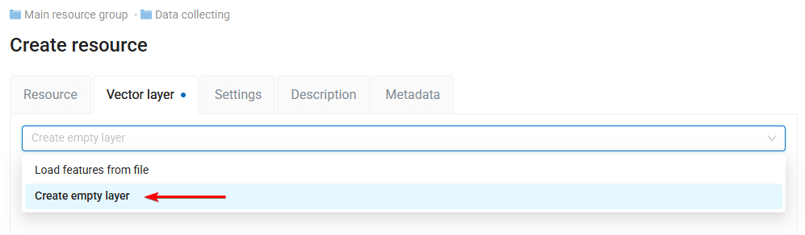

In the changed interface select the **Point** geometry type.

.. figure:: _static/tutorial_empty_layer_geom_en.png
   :name: tutorial_empty_layer_geom_pic
   :align: center
   :width: 20cm

On the **Resource** tab set the name for the new layer, ``Trees``, and click **Create**.

The vector layer is created and you are redirected to its page. You can see primary metadata and layer structure (currently empty).

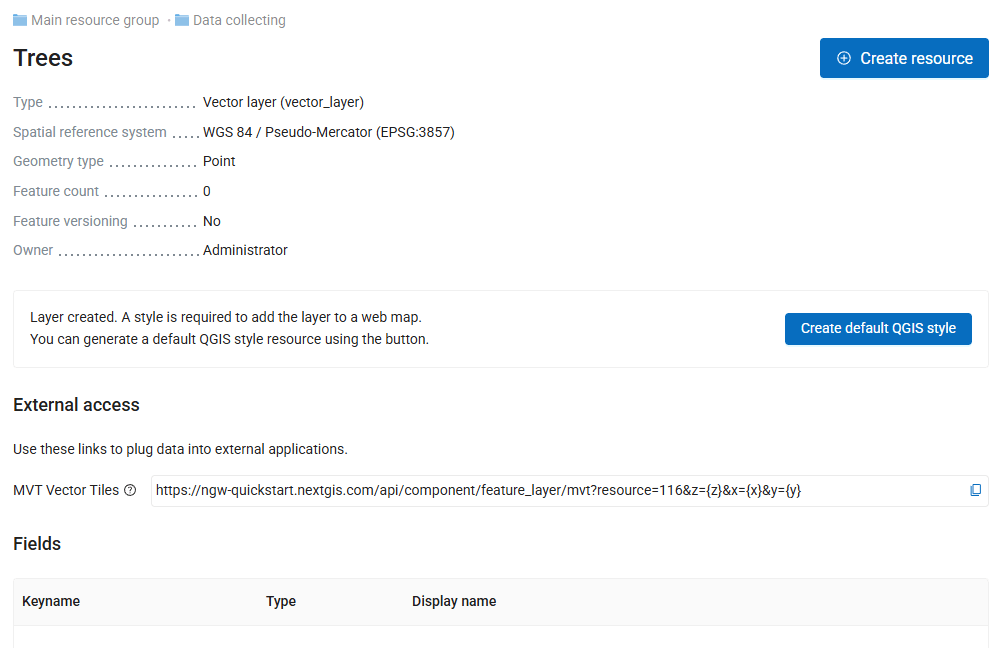

.. _form:

Step 4/6 Create data collecting form 
--------------------------------------

By creating a form we'll accomplish two things at once:

1. Determine what kind of data we want to collect to the vector layer,
2. Create a comprehensible interface for the data collectors.

On the vector layer resource page click **Create resource** and select **Form**.

.. figure:: _static/collect_select_form_en.png
   :name: collect_select_form_pic
   :align: center
   :width: 20cm

Switch the mode to **Design form**

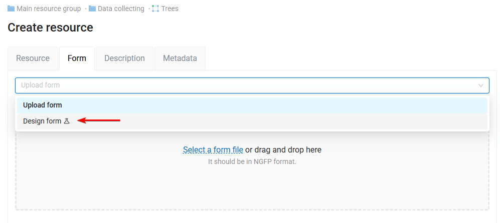

In this visual drag-n-drop interface you could construct a form that your field workers would see on their mobile devices. 

This tab is split vertically into three sections:

* On the left: a list of available elements, 
* In the middle: layout for the smartphone screen, 
* On the right: settings for the selected element.

.. figure:: _static/collect_designer_interface_en.png
   :name: collect_designer_interface_pic
   :align: center
   :width: 20cm

Click on the **Label** element and drag it to the layout. It appears with the default text value. 

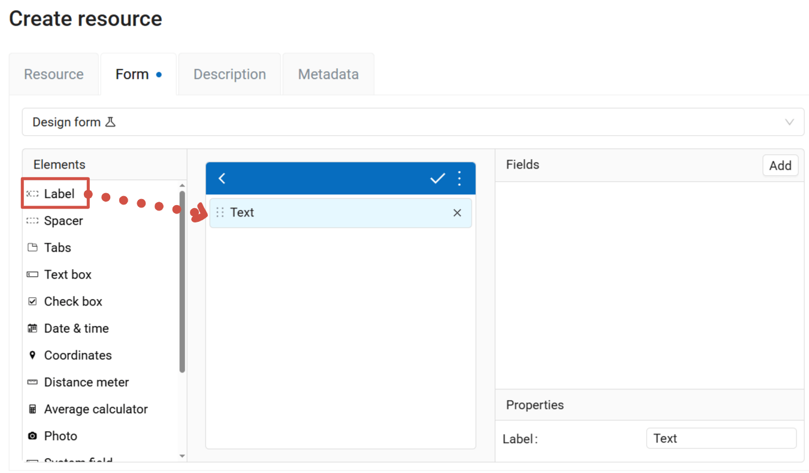

On the right panel find the **Properties** block and set the label value to ``Tree species``. This is the title for the first data field we're going to add.

.. figure:: _static/collect_label_text_en.png
   :name: collect_label_text_pic
   :align: center
   :width: 20cm

Now we need to add the field where collectors enter the data. For this first field we'll provide the collectors with a predetermined list of tree species.Select the element **Dropdown** and drag it to the layout. 

A dialog appears that prompts you to select the attribute of the layer to which the data entered in this field is to be written.

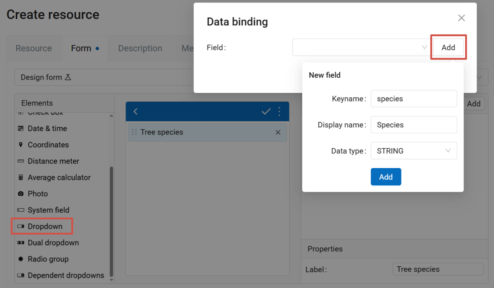

Currently we don’t have any attributes yet, so click on the **Add** button.  For the new field set up the parameters:

* Keyname = ``species``,
* Display name = ``Species``,
* Data type = STRING.

Then click the blue **Add** button.

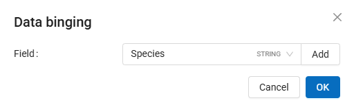

And then **OK** in the Data binding dialog.

Now the layout looks like this:

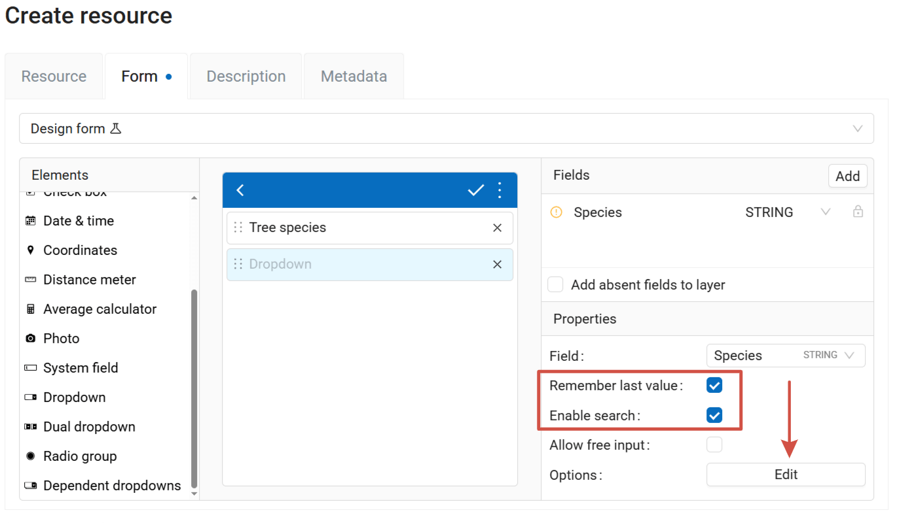

Click on the Dropdown element and in the Properties block activate **Remember last value** and **Enable search** checkboxes. 

Now we need to enter the list of options to choose from in the dropdown. Click **Edit** button next to the Options. 

An empty table appears. The first column, Value is what would be recorded to the database, Label is what field workers would see in the interface. 

We'll keep it simple and have the same things in both columns. 
Enter six options: ``Beech, Oak, Spruce, Pine, Birch, Other``.

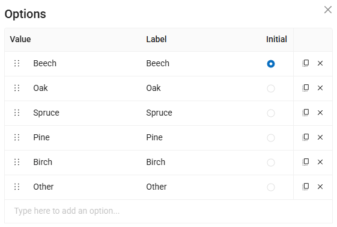

Next element we're going to add is a simple checkbox. Click on the **Check box** element and drag it to the layout. In the binding dialog add a new field with:

* Keyname = ``damaged``, 
* Display name = ``damaged``, 
* Data type = INTEGER. 

In the element properties set:

* Label = ``The tree is damaged``. 

Here's the result you should get:

.. figure:: _static/collect_ckeckbox_en.png
   :name: collect_ckeckbox_pic
   :align: center
   :width: 8cm

For the next element, click on the **Date & time** and drag it to the layout. In the binding dialog add a new field with:

* Keyname = ``datetime``, 
* Display name = ``Date and time``, 
* Data type = DATETIME. 

In the element properties set *Type* to Date & time.

.. figure:: _static/collect_datetime_properties_en.png
   :name: collect_datetime_properties_pic
   :align: center
   :width: 10cm

Then click on the **Photo** element and drag it to the layout. In the element properties set *Max* number to 5.

Now that we added all the elements we need to add the corresponding fields to the layer. Activate the checkbox **Add absent fields to layer**. This is the final look of the form:

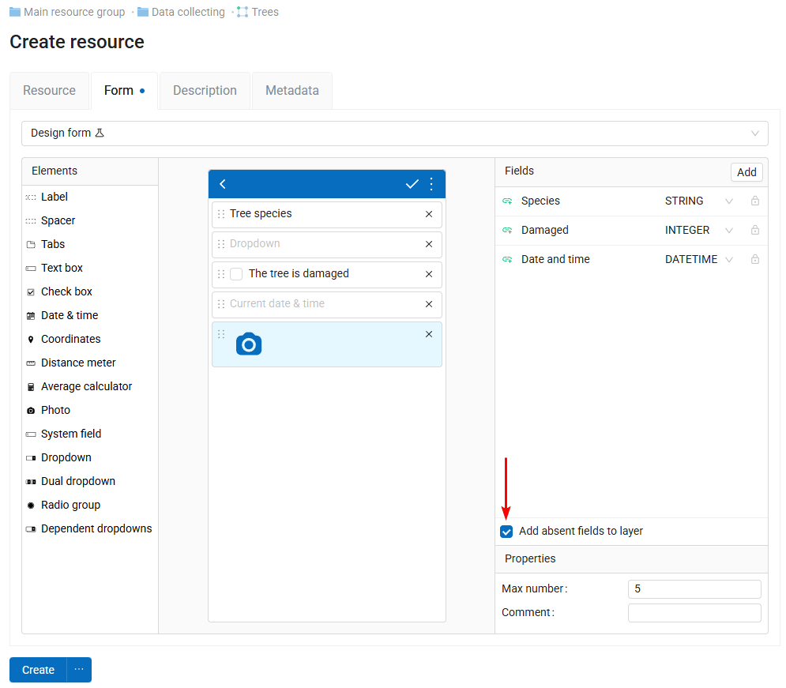

Click the **Create** button. After creation you are immediately redirected to the new resource page. 

To allow people to use this form for data collection you need to add them to the list of collectors.

.. _collectors:

Step 5/6 Create list of field workers
--------------------------------------

Open the menu in the top right corner of the NextGIS Web interface and go to the **Control panel**.

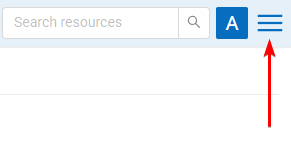

Then select **Collector projects**.

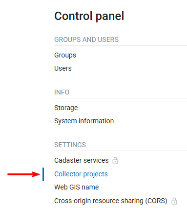

Here you can manage the list of users connected to your Web GIS as field data collectors. Any user with NextGIS ID account can be added as a field data collector, even if they are not a part of your `team <https://docs.nextgis.com/docs_ngcom/source/teams.html>`_.

Initially the list is empty.

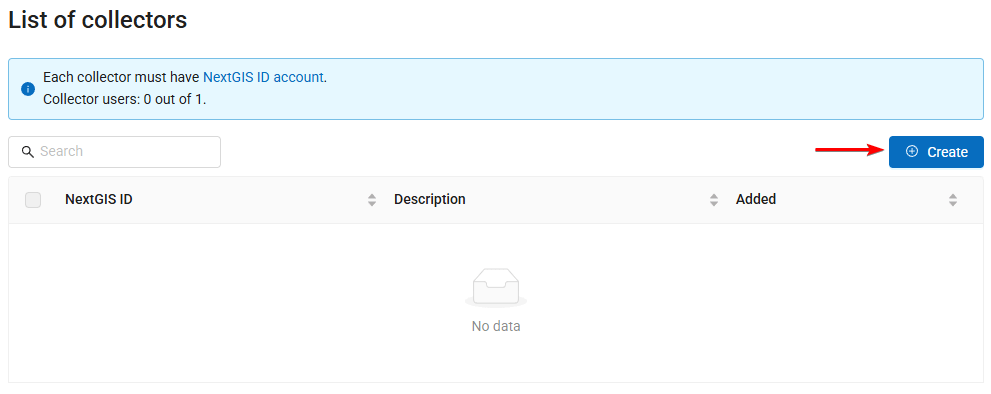

Click the **Create** button to add a user to the list of collectors. First, add yourself. In the NextGIS ID field enter your email used for the registration on my.nextgis.com.

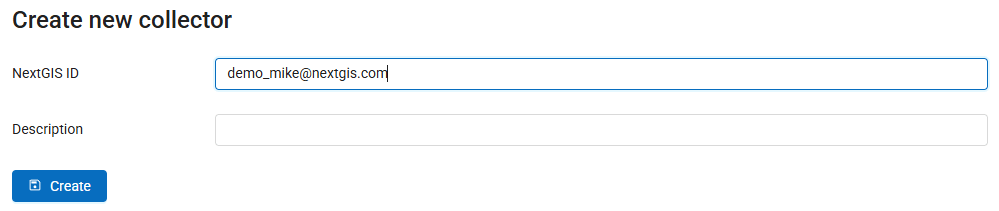

A new entry is added to the list of collectors.

.. _project:

Step 6/6 Create Collector project
----------------------------------

Return to the “Data collecting” resource group and create a new resource - **Collector project**.

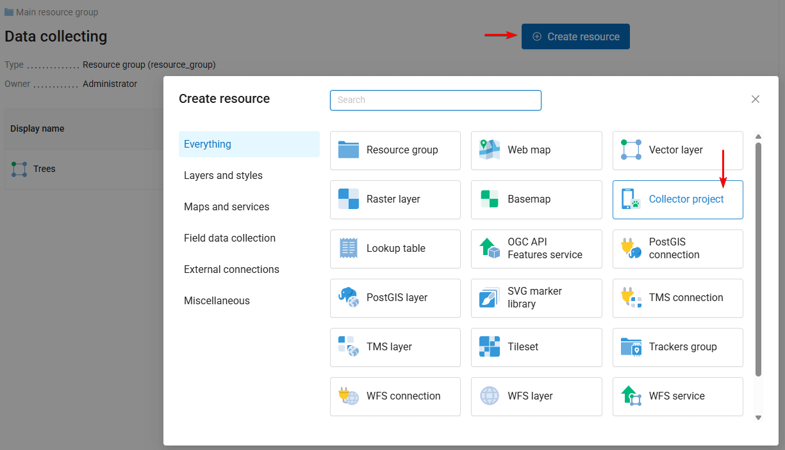

On the Resource tab set the name of the project that the data collectors would see in the app. Enter ``Trees in the city``.

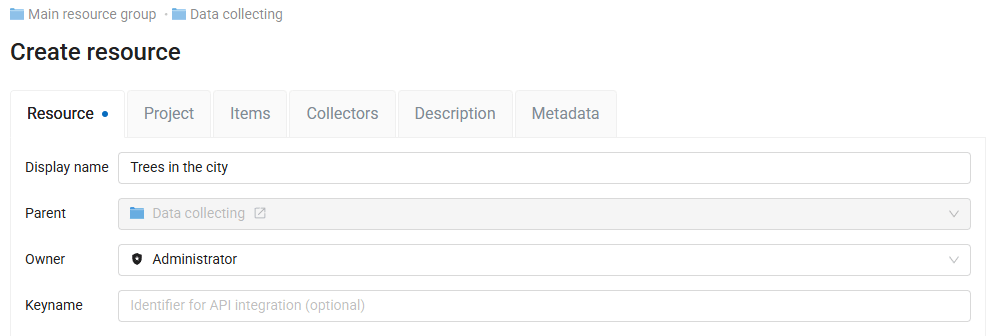

On the Project tab enter the username and password of Web GIS administrator, use your own credentials - the email you used to create NextGIS ID and its password.

.. figure:: _static/collect_project_settings_en.png
   :name: collect_project_settings_pic
   :align: center
   :width: 20cm

On the Items tab determine the contents of your project. Which data should the field workers gather? Which layer should they see as a reference on the map? Click **+ Layer** button and select ``Trees`` layer.

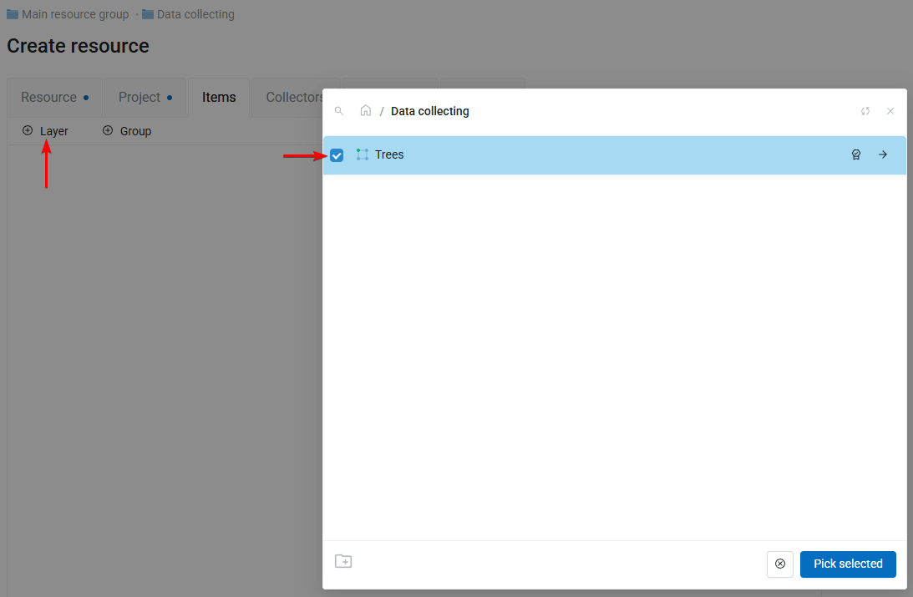

Click on the added item to see its properties in the panel on the right. 
Make sure that *Editable* and *Syncable* check boxes are active.

.. figure:: _static/collect_item_properties_en.png
   :name: collect_item_properties_pic
   :align: center
   :width: 20cm

On the Collectors tab activate the check box near your email - it adds you as a field data collector to this project.

.. figure:: _static/collect_tick_collectors_en.png
   :name: collect_tick_collectors_pic
   :align: center
   :width: 20cm

That’s it. A project has been created and field workers could start their work.

For this project you'll act as the data collector yourself.

.. _fieldwork:

Collect data in the field (from the field worker’s perspective)
------------------------------------------------------------------

Install NextGIS Collector application on your Android device. It could be found in Google Play.

Run the application. Sign in with the email you used to create NextGIS ID and its password.

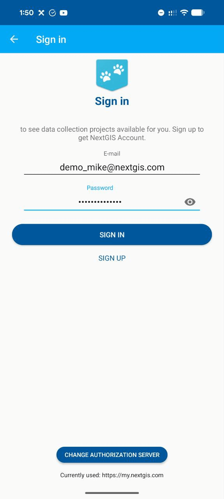

After authorization you can see a list of projects assigned to you. Select **Trees in the city** and confirm joining it.

.. figure:: _static/collect_project_list_en.png
   :name: collect_project_list_pic
   :align: center
   :width: 8cm

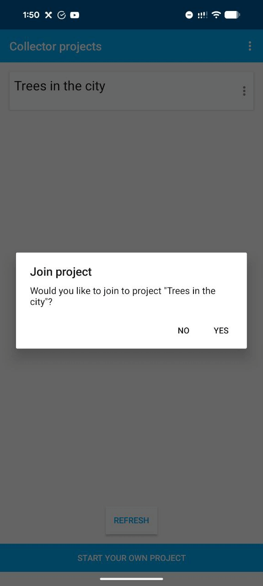

Inside the project you see the lis of layers. This project contains only one - *Trees*. 

Go to the nearest tree and click **USING GPS** - it records the current GPS coordinates of your mobile phone and opens the form to enter the other information. 

.. figure:: _static/collect_using_gps_en.png
   :name: collect_using_gps_pic
   :align: center
   :width: 8cm

Pick the tree species from the dropdown, check if it's damaged, add one or several photos, and then click |button_tick| button to save.

.. |button_tick| image:: _static/button_tick.png
   :width: 6mm

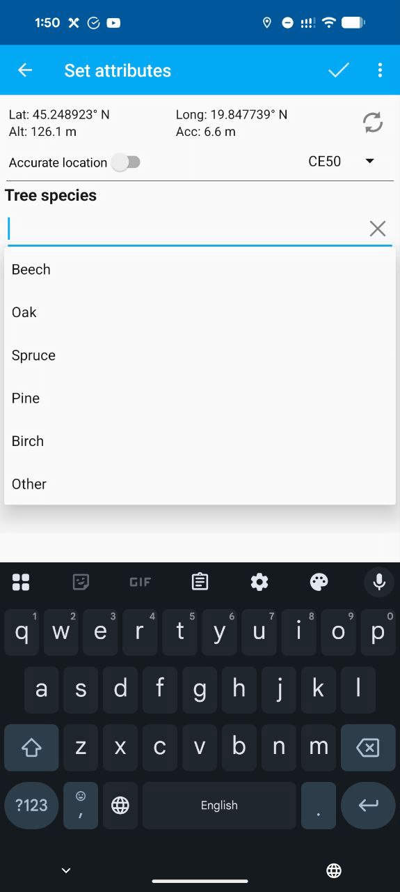

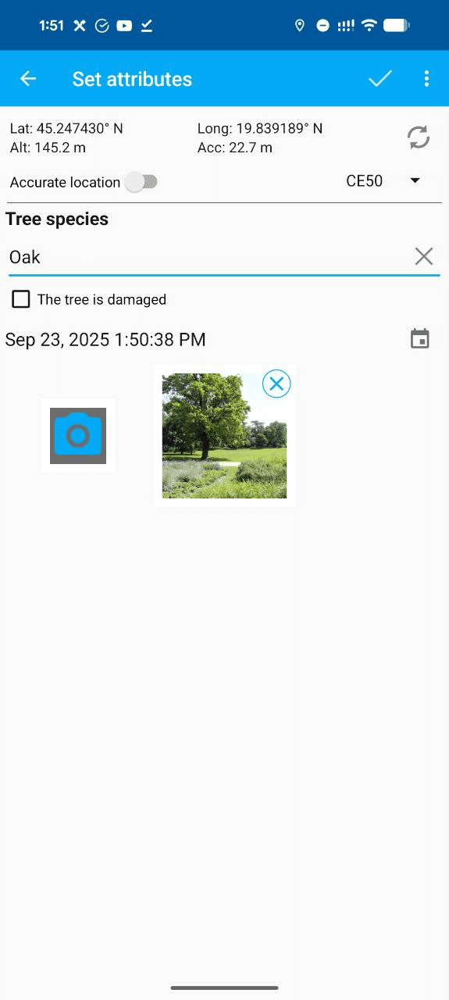

Data is collected. As a field worker you could go to the next tree and repeat the procedure.

.. _check:

Check collected data in Web GIS
----------------------------------

Return to Web GIS and open the *Trees* vector layer resource. In its metadata you can see that the feature count has changed. It's synchronized as the collected data's been uploaded to the cloud.

.. figure:: _static/collect_feature_count_en.png
   :name: collect_feature_count_pic
   :align: center
   :width: 20cm

To display the added feature click on the preview button:

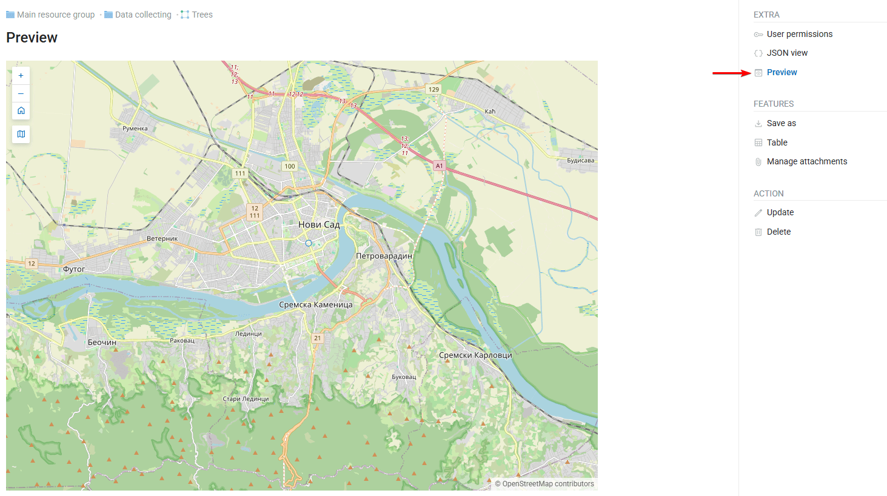

Or check the attribute values in the feature table:

.. figure:: _static/collect_feature_table_en.png
   :name: collect_feature_table_pic
   :align: center
   :width: 16cm

Open the feature preview to see the attached photo.

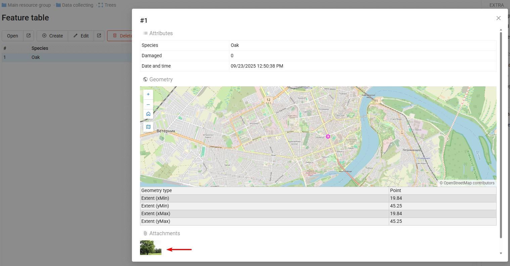

This allows you to track the data collection process in real time. The layer that stores the data can be used like any other - added to Web Maps, published as tiles or via OGC protocols, downloaded, connected to QGIS and so on.
