Анализ и прогнозирование изменений земного покрова
===================================================

В этом уроке мы будем использовать модуль для QGIS MOLUSCE (Modules for Land Use Change Simulations). С его помощью можно оценить, какие изменения уже произошли на территории, и построить прогноз на будущее, опираясь на математические алгоритмы и пространственные переменные.

Все шаги будут подробно и последовательно описаны, чтобы Вы могли легко повторить их на интересующей Вас территории.

.. contents::
   :local:
   :depth: 2

Шаг 1. Установка MOLUSCE
------------------------

Прежде чем приступить к работе, необходимо установить сам модуль MOLUSCE. Он доступен в общем репозитории плагинов QGIS и устанавливается стандартным способом: через меню «Модули» → «Управление модулями», поиск по названию и нажатие кнопки «Установить». 

Шаг 2. Выбор исходных данных
-----------------------------

Для примера была выбрана часть территории Осинторфского гидрологического заказника. Он расположен на востоке Беларуси, в Дубровенском районе Витебской области, занимает небольшую площадь и находится на месте бывших торфоразработок. После прекращения добычи здесь началось естественное восстановление верхового болота, и в настоящее время открытые торфяники активно зарастают лесом.

:download:`Скачайте данные по ссылке <_>`
Скачивание исходных данных
	
В папке находятся: 

* исходные растры земного покрова за 2017, 2021 и 2025 годы ``LC_2017.tif, LC_2021.tif, LC_2025.tif``. Это готовые классифицированные растровые данные с пространственным разрешением 10 метров, построенные на основе снимков Sentinel‑2. Для анализа выбраны три временных среза: 2017, 2021 и 2025 годы. Растры за 2017 и 2021 год используются для моделирования изменений, а слой 2025 года - для проверки точности прогноза;
* цифровая модель рельефа ``SRTM_30.tif``;
* векторный слой водоёмов ``water_polygon.gpkg``;
* бинарный растр леса ``forest_bin_2017.tif``;
* границы интересующего участка ``AOI.gpkg``;
* файл стиля QGIS для отображения классификации ESRI Land Cover ``ESRI.qml``;
* готовый проект QGIS с уже загруженными слоями ``Osintorf_case.qgz``.

Источники:

* Данные о земном покрове для территории Осинторфского заказника получены с открытого сайта ESRI Living Atlas. 
* Полигональные данные - слой водоёмов из OpenStreetMap.
* Данные рельефа получены с OpenTopography.org

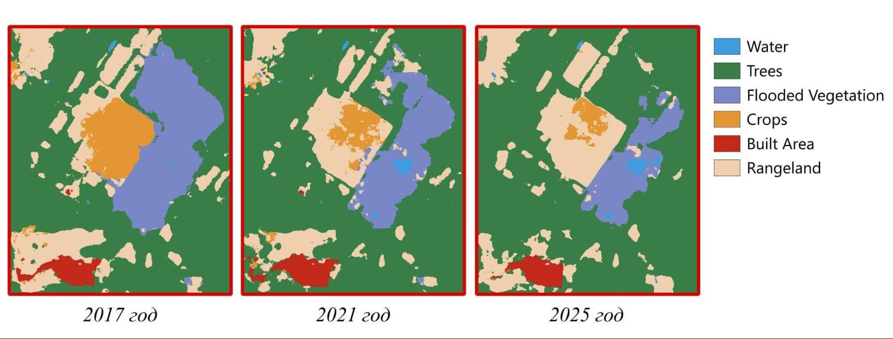

   Растры земного покрова за разные годы

Подбор предикторов
~~~~~~~~~~~~~~~~~~

Предикторы - пространственные переменные факторов окружающей среды. Именно они объясняют, почему изменения происходят в одних местах, а не в других. От того, насколько удачно выбраны эти факторы, во многом зависят качество модели и реалистичность прогноза.

В нашем примере, ориентируясь на процесс зарастания болота лесом, были отобраны три предиктора:

1. **уклон поверхности**, рассчитанный по цифровой модели рельефа SRTM (30 м).
2. **расстояние до водных объектов**, рассчитаное из полигонального слоя водоёмов;
3. **расстояние до границы леса**, определённое по классу «деревья» из классифицированного растра земного покрова 2017 года.

Чтобы все слои можно было использовать в MOLUSCE, их необходимо привести к единому разрешению, охвату и размеру.

Шаг 3. Подготовка данных
------------------------

Скачайте и распакуйте архив с исходными данными. Кликните дважды по файлу ``Osintorf_case.qgz``, чтобы открыть проект в QGIS.

Создание опорного растра
~~~~~~~~~~~~~~~~~~~~~~~~

Сначала необходимо подготовить базовый слой земного покрова, который станет шаблоном для всех остальных данных. Для этого обрежем растр 2017 года по нашей территории, используя инструмент **Обрезать растр по маске** («Растр» → «Извлечение»). 

Выберите в качестве исходного слоя ``LC_2017`` (можно выбрать из списка или просто перетащить нужный слой из панели Слои). В качестве слоя маске выберите ``AOI``.

Установите следующие параметры:

* В пункте "Назначить указанное значение NoData («нет данных») для выходных каналов" установите значение ``0`;
* Пооставьте галочку **Сохранить разрешение исходного растра**.

Это позволит сохранить детальность 10 метров и одновременно задать чёткие границы участка. Сохраним результат как новый файл, например ``LC_2017_prepared.tif``. Теперь у нас есть опорный растр, с которым будут согласовываться все остальные слои.

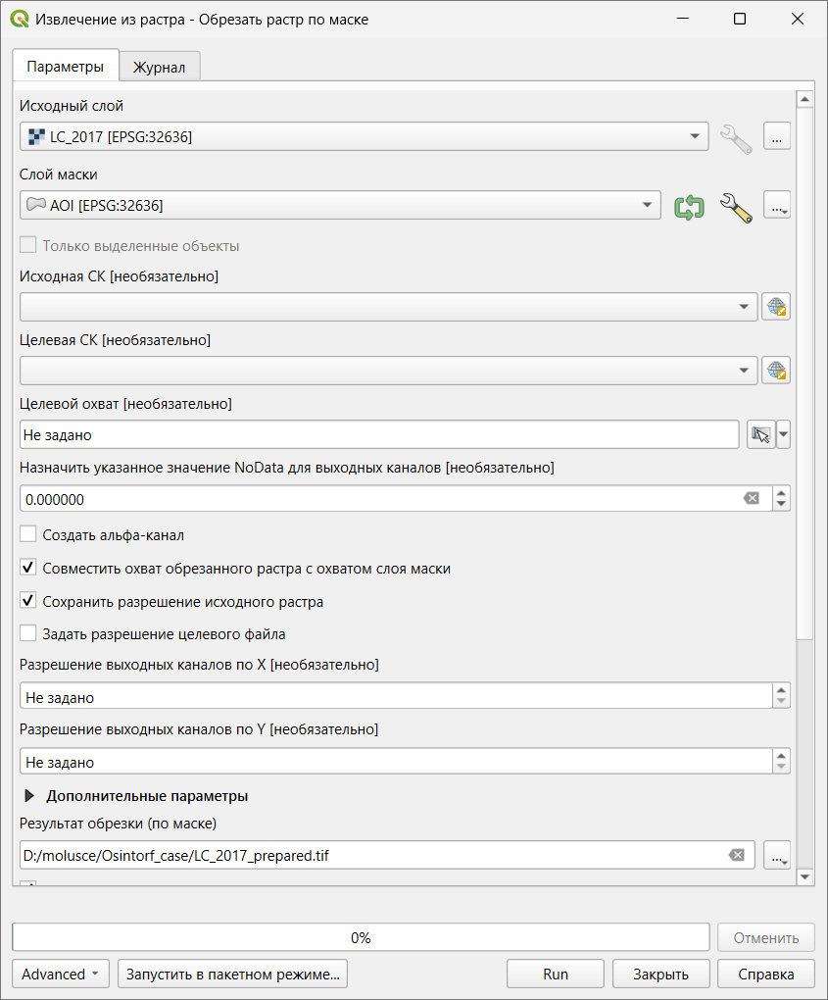

   Обрезка по маске

Обработка остальных растров
~~~~~~~~~~~~~~~~~~~~~~~~~~~

Выберем инструмент **Подготовка растрового набора данных для MOLUSCE** в панели инструментов анализа.

В качестве **подготавливаемого растрового слоя** укажем растр 2021 года ``LC_2021``, а в качестве **опорного** - подготовленный ранее обрезанный растр 2017 года ``LC_2017_prepared``.

Обязательно установим **алгоритм ресэмплинга** (то есть способ пересчёта пикселей при изменении разрешения) - **Ближайший сосед**. Для категориальных данных это критически важно, чтобы избежать появления новых, несуществующих классов при пересчёте.

Сохраним результат в файл ``LC_2021_prepared``.

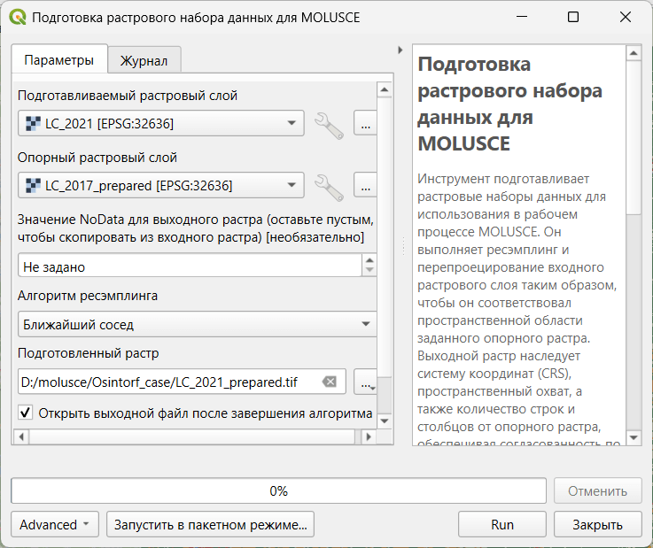

   Подготовка растрового слоя для MOLUSCE

Точно так же проделаем процедуру для растра 2025 года. Теперь все три временных среза имеют одинаковые границы и разрешение.

Подготовка предикторов
~~~~~~~~~~~~~~~~~~~~~~~

1. Расстояние до водоёмов. С помощью инструмента **Подготовка векторного набора данных для MOLUSCE** (панель инструментов Анализа) преобразуем полигональный слой водоёмов ``water_polygon.gpkg`` в растр близости. 

* Подготавливаемый векторный слой - ``water_polygon``;
* Опорный растровый слой - ``LC_2017_prepared``;
* Режим обработки **Близость** - инструмент автоматически рассчитает расстояние от каждого пикселя до ближайшего водного объекта. 

Остальные параметры оставляем без изменений. Полученный слой сохраняем как ``water_proximity.tif``.

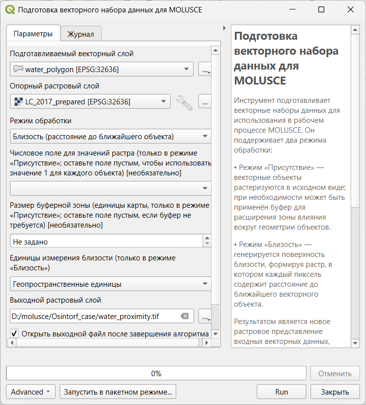

   Построение растра расстояния до воды

2. Расстояние до границы леса. Выберем в панели инструментов Растр → Анализ → **Близость (растровое расстояние)**. 

* Исходный слой - ``forest_bin_2017``;
* Список целевых пикселей - зададим значение ``1``.

Остальные параметры оставим без изменений. На выходе получим растровый слой удалённости от границы леса, который сохраним как ``forest_proximity.tif`` (расстояние до леса).

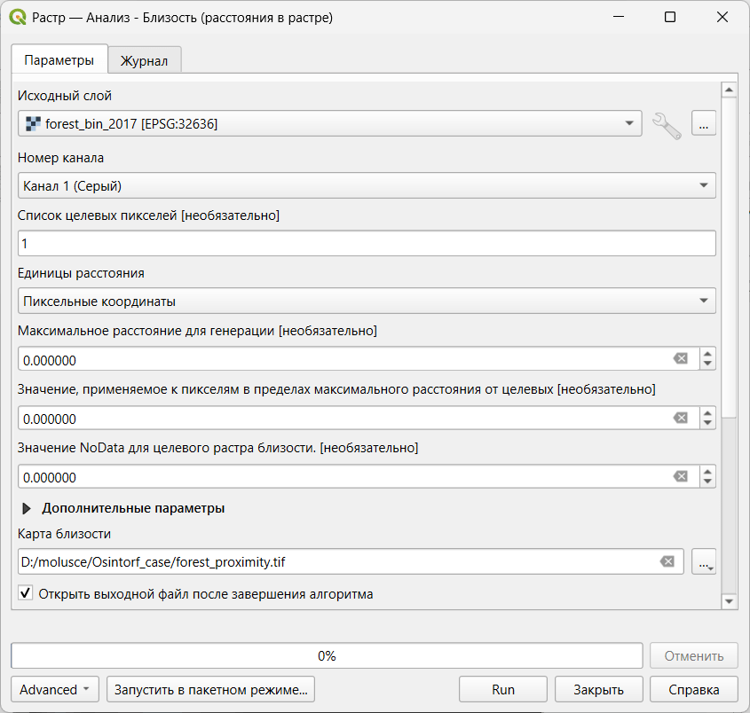

   Построение растра расстояния до леса

3. Цифровая модель рельефа. Приводим к единому формату с помощью инструмента **Подготовка растровых данных для MOLUSCE**. 

* Подготавливаемый векторный слой - ``SRTM_30``;
* Опорный растровый слой - ``LC_2017_prepared``;
* Алгоритм ресэмплинга указываем **Кубическая 4×4**. Это важно для сохранения плавности рельефа - метод ближайшего соседа здесь не подходит.

Абсолютная высота над уровнем моря сама по себе редко бывает хорошим предиктором для прогнозирования. Гораздо информативнее оказываются производные от рельефа показатели, в первую очередь уклон поверхности. Он часто определяет условия дренажа и перераспределение влаги, что важно для многих природных процессов. Поэтому после приведения ЦМР к нужному формату мы сразу рассчитываем уклон: Растр → Анализ → Крутизна , применяем его к подготовленной модели рельефа и сохраняем результат как предиктор ``slope``.

Таким образом, все слои приведены к единому разрешению и размеру:

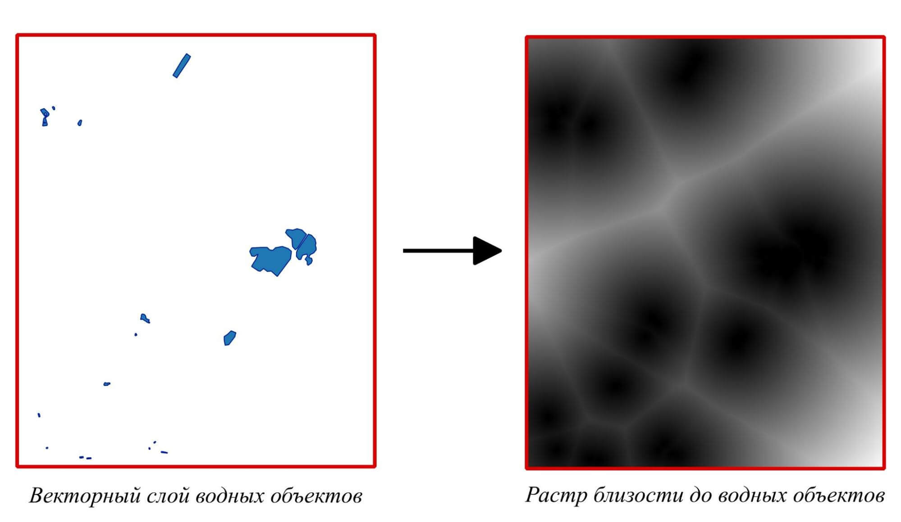

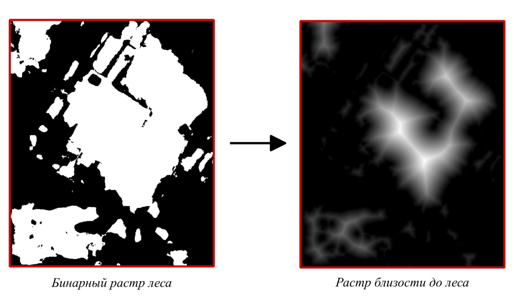

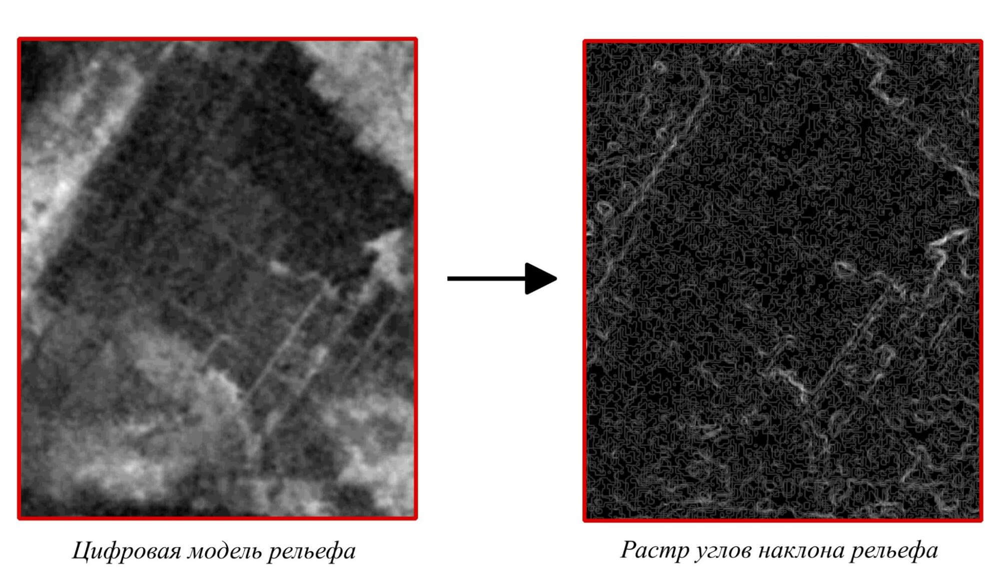

Теперь можно переходить к работе в модуле MOLUSCE.

Шаг 4. Загрузка данных в MOLUSCE
----------------------------------

После того как все слои подготовлены, откроем MOLUSCE (через меню «Растр» → «NextGIS MOLUSCE» или с помощью комбинации клавиш Shift+M). Перед нами появится окно с несколькими вкладками.

На вкладке «Входные данные»:

* В поле «Растр начальных состояний» загружаем растр земного покрова за 2017 год ``LC_2017_prepared``.
* В поле «Растр конечных состояний» загружаем растр за 2021 год ``LC_2021_prepared``.
* В блоке «Пространственные переменные» с помощью кнопки «Добавить» поочерёдно добавим три подготовленных предиктора: уклон ``slope``, расстояние до водоёмов ``water_proximity`` и расстояние до границы леса ``forest_proximity``.

Если все растры были правильно подготовлены (совпадают по экстенту, разрешению и проекции), модуль выдаст информационное сообщение о том, что слои совпадают. Это важный момент контроля: такое сообщение подтверждает, что данные полностью готовы к анализу и можно двигаться дальше. 

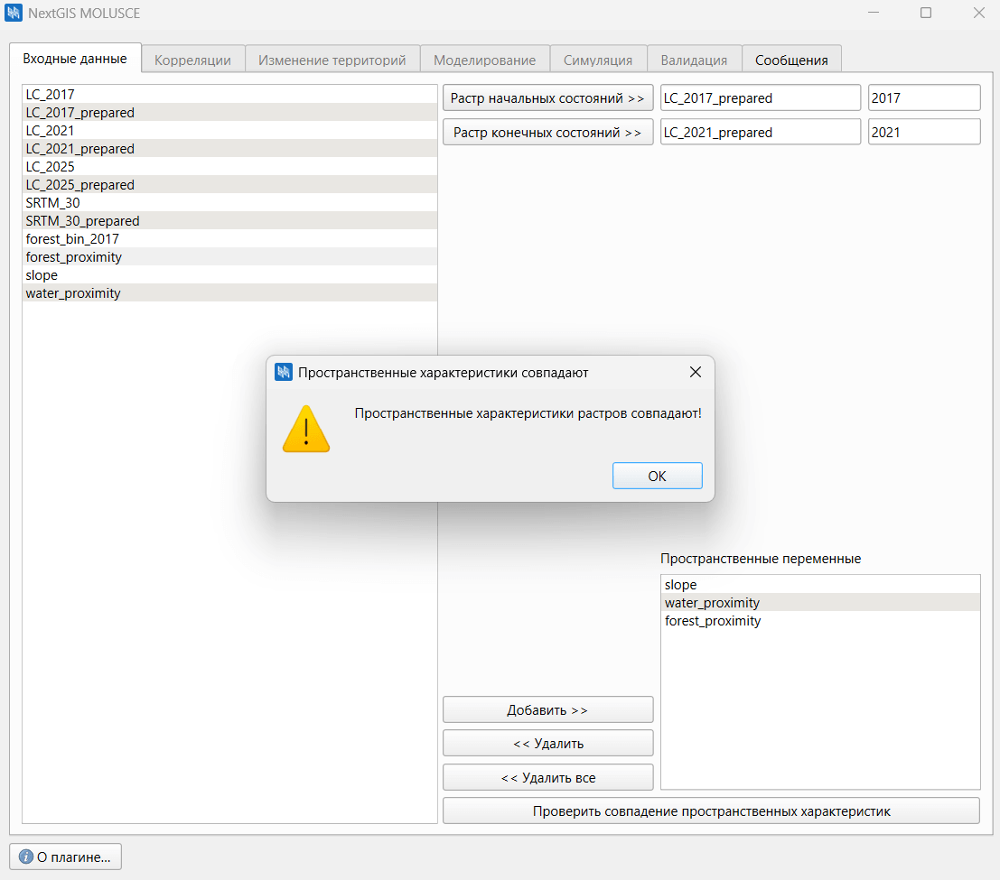

   Подтверждение совпадения данных

Если на этапе загрузки что-то не так, появится сообщение об ошибке с указанием проблемного набора данных.

Как только модуль подтвердил, что все растры совпадают, становятся активными остальные вкладки. 

Следующий шаг не обязательный, но он помогает понять, насколько удачно подобраны пространственные переменные.

Открываем вкладку **Корреляции** и нажимаем **Рассчитать**. По умолчанию для каждой пары переменных рассчитывается коэффициент корреляции Пирсона. 

.. note:: Если в качестве предикторов используются категориальные пространственные переменные (например, типы почв), то стандартный коэффициент Пирсона для них не подходит. В таких случаях следует применять коэффициент Крамера. В нашем наборе все предикторы непрерывные, поэтому достаточно Пирсона.

В появившейся таблице отображаются значения от -1 до 1, где значения, близкие к 1 или -1, говорят о сильной линейной связи. Это может ухудшить работу модели, и в таких случаях один из факторов желательно исключить.

В нашем примере расчёт показывает, что корреляция несущественная, все переменные содержат независимую информацию и могут использоваться в модели без опасения искажений результата.

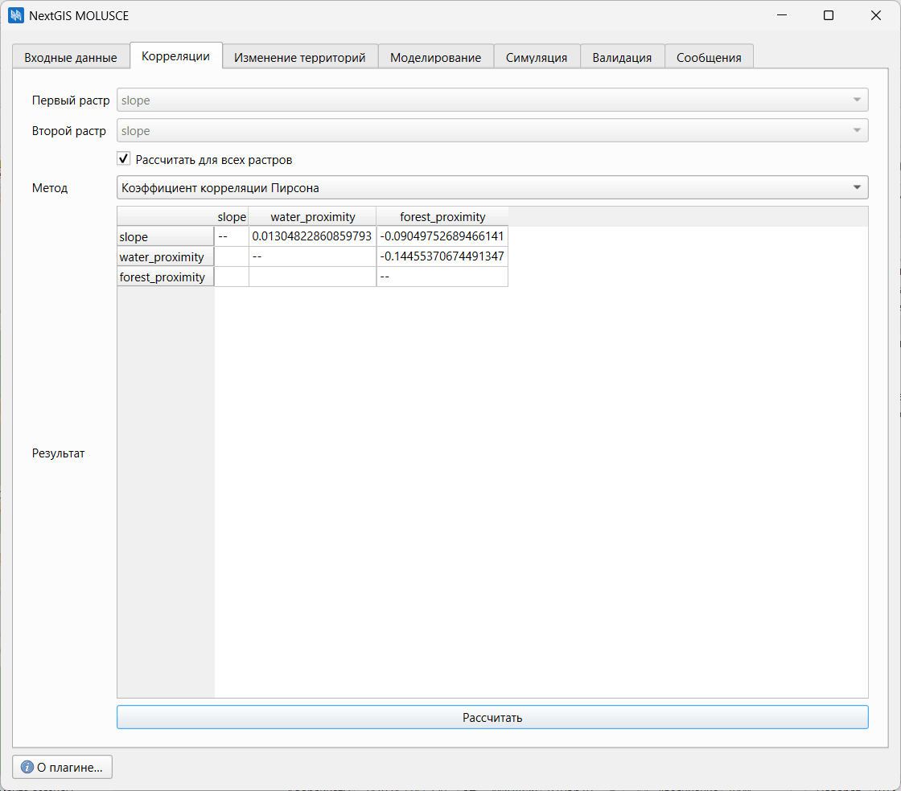

   Оценка корреляции

Шаг 5. Изменение территорий
----------------------------

Следующий шаг - количественная оценка того, что происходило с земным покровом между начальным и конечным годом. Для этого в главном окне модуля открываем вкладку **Изменение территории** и нажимаем **Обновить таблицы**. MOLUSCE обработает два классифицированных растра за два года и выдаст две таблицы с результатами, которые легко можно скопировать правой кнопкой мыши и загрузить в удобные для дальнейшей работы программы.

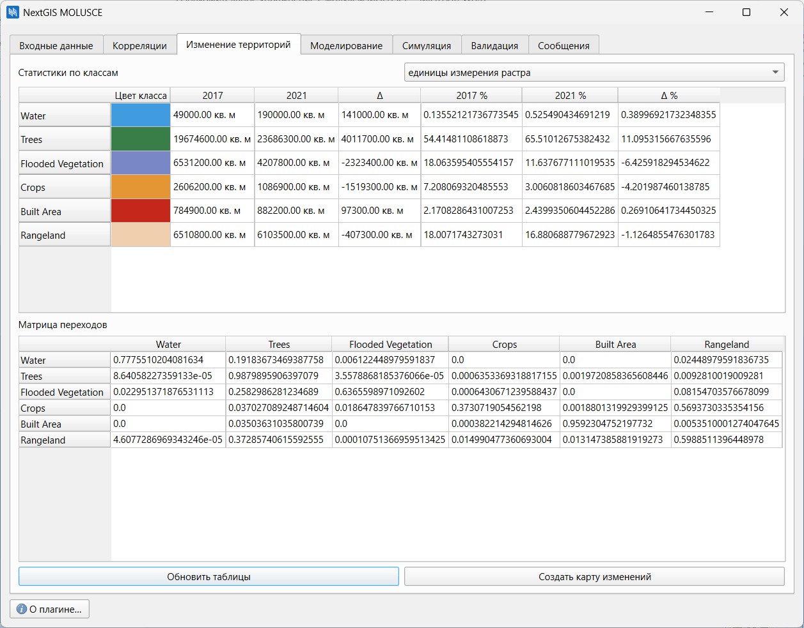

   Вкладка "Изменение территорий"

Первая таблица содержит общую **статистику по классам**: площадь каждого класса в начальный и конечный год, а также величину прироста или сокращения площади в выбранных единицах измерения и процентах. В нашем случае хорошо заметно, что сильнее всего изменилась площадь леса: она выросла на 11%. В то же время площади классов «затопленная растительность» и «сельскохозяйственные культуры» сократились — на 6% и 4% соответственно.

Вторая таблица - **матрица переходов**.  Она показывает, как именно классы земного покрова трансформировались друг в друга за рассматриваемый период. На пересечении строк и столбцов указана доля площади, перешедшей из одного класса в другой. В нашем примере матрица наглядно демонстрирует основной тренд: классы «затопленная растительность» и «луга» переходят в лес, а сельскохозяйственные культуры - в луга. Это соответствует ожидаемому процессу зарастания болота.

Помимо таблиц, MOLUSCE позволяет построить наглядную карту изменений, которая автоматически добавляется в кугис. Для этого на той же вкладке нажимаем **Создать карту изменений**. В результате создаётся растровый слой, где каждому пикселю присвоен его переход из одного класса в другой.

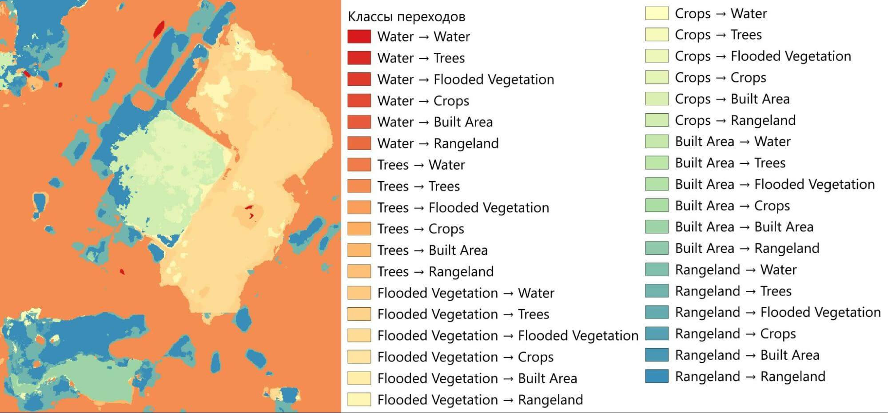

   Карта переходов

Такая карта помогает визуально оценить, где именно происходили изменения. В нашем случае видно, что переход открытых болотных участков в лес происходит преимущественно вдоль опушек и вблизи существующих лесных массивов, что логично для процесса зарастания.

Шаг 6. Моделирование
---------------------

Следующий ключевой этап - обучение модели. Здесь выявляются закономерности между произошедшими изменениями и нашими предикторами, чтобы затем использовать эти связи для прогноза.

Выбор метода 
~~~~~~~~~~~~~
Первое, что необходимо сделать, - выбрать математический метод моделирования. 

MOLUSCE предлагает четыре подхода:

* Нейронные сети  - основной метод, хорошо подходит для моделирования сложных нелинейных зависимостей.
* Логистическая регрессия - второй по популярности метод, более простой и интерпретируемый.
* Значимость признака - метод, преобразующий непрерывные предикторы в категории и прогнозирующий переходы на основе весов. Требует сильной связи между факторами и изменениями.
* Многокритериальная оценка - предназначена для прогнозирования конкретного перехода между двумя классами, когда исследователь сам вручную определяет важность каждой переменной.

В нашем примере мы будем использовать **нейронные сети**.

Настройка параметров 
~~~~~~~~~~~~~~~~~~~~~

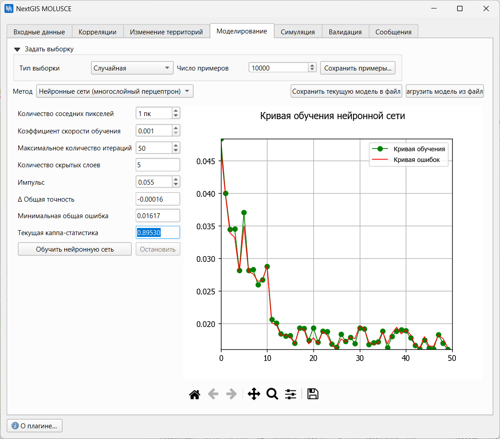

   Вкладка "Моделирование"

* Выборка - в верхнем блоке настроек можно указать тип выборки: случайная, полная или стратифицированная. Полная выборка (использование всех пикселей) слишком трудоёмка для обычного ноутбука и избыточна для учебных задач. Стратифицированная выборка разделяет территорию на подобласти и отбирает пиксели из каждой. Мы остановимся на **случайной** выборке и зададим количество пикселей равным ``10000``.

* Метод - Нейронные сети.
* Количество соседних пикселей (окрестность) - определяет, сколько соседних пикселей будет учитываться при анализе. Оставим ``1``.
* Коэффициент скорости обучения - шаг, с которым модель корректирует свои внутренние параметры в ответ на ошибку. Чем меньше значение, тем «осторожнее» обучается модель. Установим минимальное значение ``0,001``.
* Максимальное количество итераций - ограничение числа циклов обучения. Установим ``50``.
* Количество скрытых слоёв - определяет сложность архитектуры нейронной сети. Чем больше слоёв, тем более сложные зависимости способна уловить модель. Небольшое значение соответствует более простой сети. Зададим ``5``.
* Импульс - показывает, насколько сильно предыдущий шаг обучения влияет на следующий. Установим ``0,05``.

Задав настройки, нажимаем **Обучить нейронную сеть**.

Оценка модели
~~~~~~~~~~~~~

Главным критерием успешности обучения служит **каппа-статистика**. Рекомендуемое значение каппы - выше 0,8. Однако достичь такого результата удаётся не сразу. Необходимо экспериментировать с параметрами и следить за кривой обучения, пока не будет получено приемлемое значение. 

Модуль отображает кривую обучения модели. Если график выглядит как хаотичные пики, это говорит о плохой модели. Если же две кривые плавно снижаются и сближаются - это свидетельствует о хорошей, устойчивой модели.

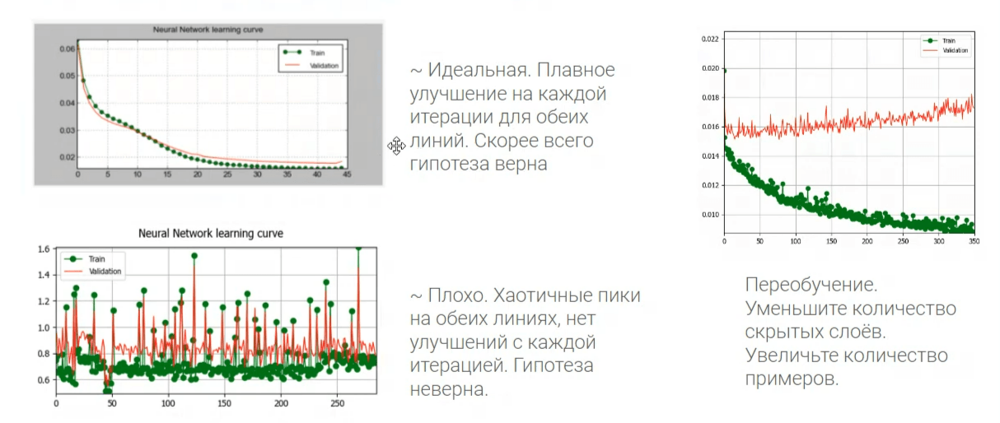

   Примеры кривых обучения для моделей разной удачности

В нашем примере после нескольких итераций удалось добиться каппы около 0,8. Это не идеальная модель, но для демонстрации работы MOLUSCE достаточно.

Шаг 7. Прогнозирование
----------------------

После того как модель обучена, можно переходить к прогнозу. Для этого в главном окне MOLUSCE переходим на вкладку **Симуляция**.

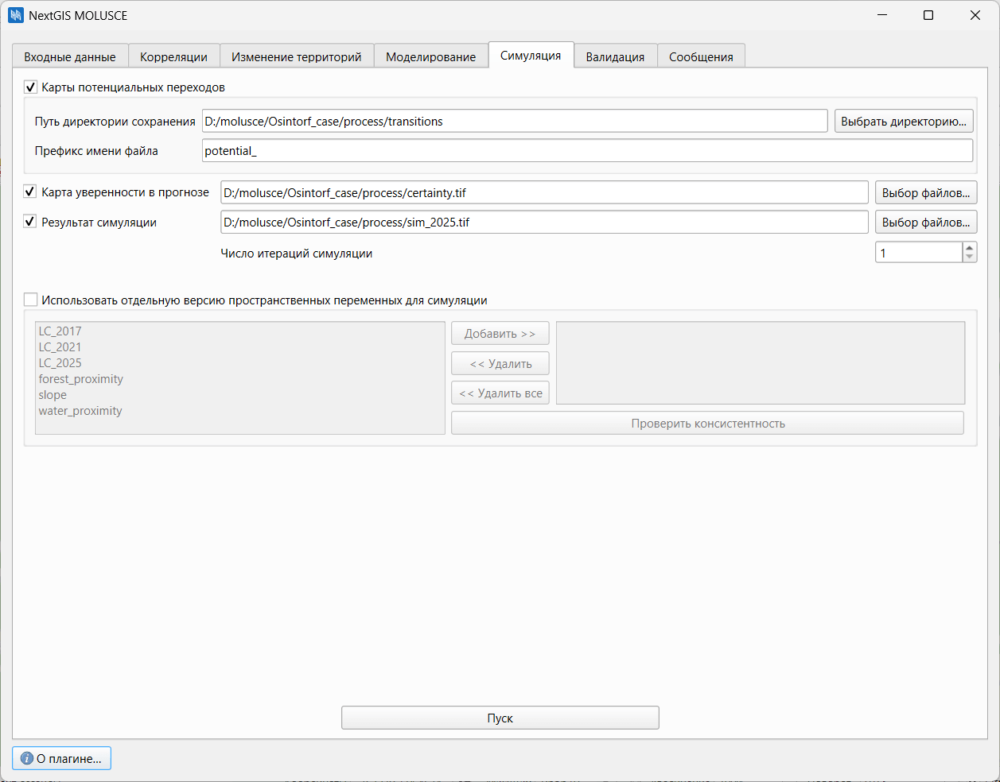

   Вкладка "Симуляция"

MOLUSCE позволяет получить три типа результатов:

* Карты потенциальных переходов, задайте для неё имя ``transitions``. Для каждой возможной смены классов создаётся отдельный растр, показывающий вероятность именно этого перехода в каждом пикселе.
* Карта уверенности, задайте для неё имя ``certainty``. Показывает, насколько модель «уверена» в своём прогнозе для каждого пикселя. Высокие значения соответствуют высокой достоверности, низкие - пикселям, где прогноз ненадёжен.
* Итоговый прогнозный растр, задайте для него имя ``sim_2025``. Это основной результат - карта ожидаемого состояния земного покрова на выбранный год.

На этой же вкладке задаётся важный параметр - количество итераций симуляции. Он определяет, на какой временной шаг вперёд мы делаем прогноз. В нашем случае между исходными растрами (2017 и 2021) 4 года. Это и есть один шаг моделирования. Соответственно:

* 1 итерация - прогноз на 2025 год,
* 2 итерации - прогноз на 2029 год,
* 3 итерации - прогноз на 2033 год и так далее.

Для начала установим **число итераций симуляции** равным ``1``, чтобы получить прогноз на 2025 год и позже сравнить его с реальными данными.

Задаём пути для всех выходных файлов и запускаем моделирование кнопкой **Пуск**.

.. hint:: По умолчанию все предикторы одинаковы и для этапа обучения, и для построения прогноза. Однако в реальной жизни факторы среды могут меняться. В MOLUSCE предусмотрена возможность задать **отдельные версии пространственных переменных для периода прогнозирования**. Мы можем, например, заложить в модель строительство новых дорог, снос зданий или другие ожидаемые изменения. Особенно ценной эта возможность становится при работе с климатическими данными, для которых существуют различные прогнозные сценарии.

После завершения расчёта мы получаем карту прогноза на 2025 год.

Шаг 8. Валидация прогноза
--------------------------

Заключительный этап работы - проверка качества полученного прогноза. Для этого в модуле MOLUSCE предусмотрена вкладка **Валидация**.

На этом шаге мы загружаем эталонный растр - реальный растр земного покрова за 2025 год, который ранее подготовили, ``LC_2025_prepared.tif``. 

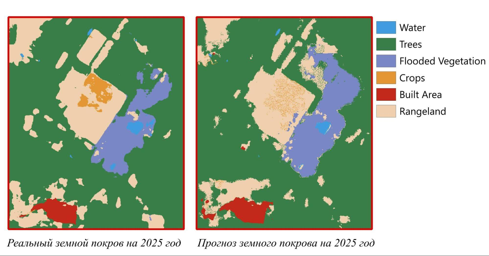

   Сравнение прогноза модели с реальными данными за 2025 год

Прогнозная карта на 2025 год, созданная моделью, уже автоматически подгружена. После нажатия **Начать валидацию** модуль попиксельно сравнивает два растра и рассчитывает статистические показатели.

Мы получаем график и статистические показатели. Главное значение, на которое стоит ориентироваться - **процент правильных ответов** (процент правильно классифицированных пикселей). В нашем примере он превышает 0,8, что говорит о неплохом качестве прогноза. Также модуль рассчитывает несколько коэффициентов, которые позволяют детальнее оценить результат: каппа общая, каппа по гистограмме и каппа по положению.

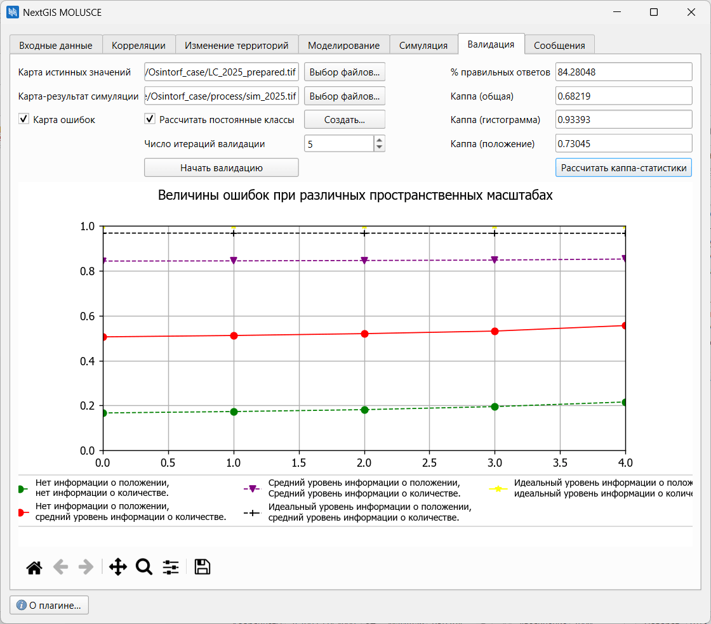

   Валидация результата

Прямая проверка прогноза возможна не всегда. В данном примере мы намеренно выбрали временной промежуток, для которого уже существуют реальные данные на 2025 год.

Помимо сводной статистики, на этой же вкладке можно создать **карту ошибок**. Она представляет собой растр, который для каждого пикселя показывает разницу между смоделированным и эталонным состоянием. Пиксели, где прогноз совпал с реальностью, отображаются прозрачными, а все расхождения раскрашиваются в разные цвета в соответствии с типами ошибок.

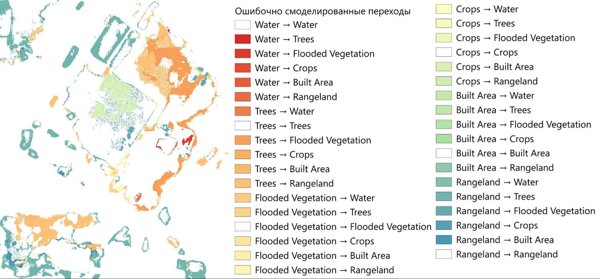

   Карта ошибок

Проверив модель на уже известных данных, можно построить прогноз на будущее. Чтобы получить прогноз на 2029 год, во вкладке **Симуляция** :numref:`tutorial_ms_simulate_pic` достаточно задать **2 итерации** (в нашем случае каждая итерация - один временной шаг в 4 года), и модуль создаст соответствующий растр. Для результирущего файла задаём имя ``sim_2029``.

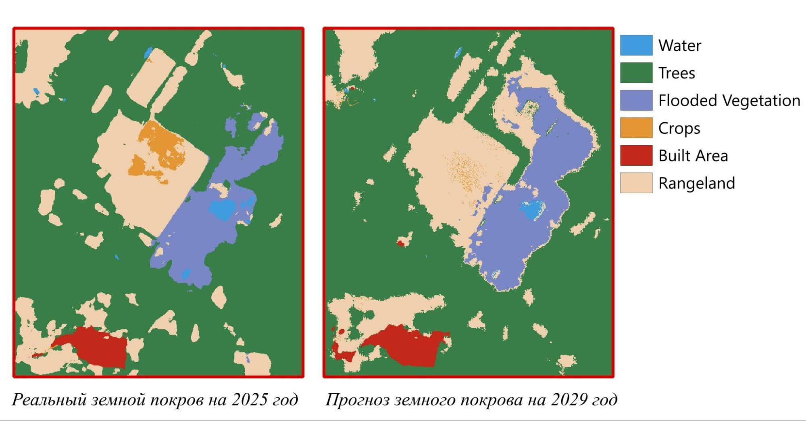

   Прогноз на 2029 год

Полученный результат можно оценить не только визуально, но и статистически. Для этого снова воспользуемся вкладкой **Изменение территорий** :numref:`tutorial_ms_changes_pic`. Теперь в качестве начального растра загрузим последние реальные данные (2025 год) ``LC_2025_prepared``, а в качестве конечного - наш прогноз на 2029 год ``sim_2029``. Инструмент выдаст нам таблицы, с помощью которых можно количественно описать ожидаемые изменения.

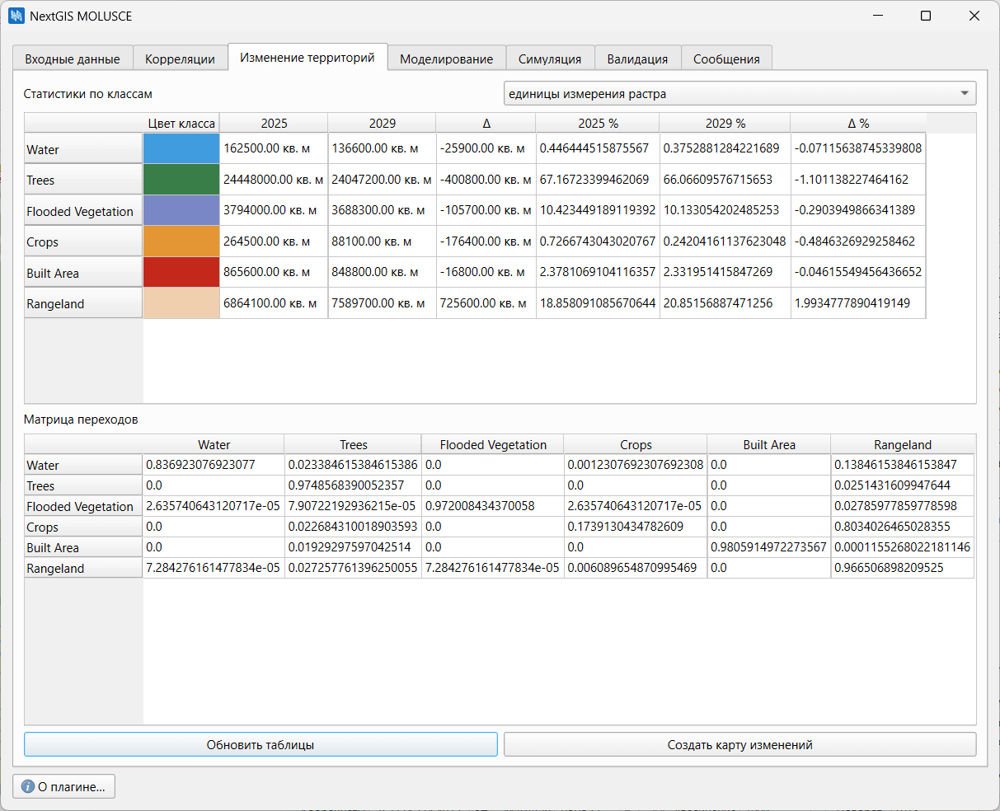

   Прогнозируемые изменения

По нашим данным, модель предсказывает увеличение класса лугов - его доля вырастет почти на 2% площади за счёт сокращения сельскохозяйственных культур (более 80% их площади перейдёт в луга) и небольшого уменьшения площадей леса и затопленной растительности. 

Таким образом с помощью MOLUSCE можно получить не только пространственную картину будущего, но и её количественное статистическое описание.

