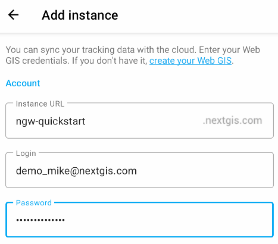
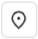

Track Asset and Team Locations in Real Time
============================================

.. admonition:: Availability

   Cloud SaaS (all editions), On premise (Extended, Enterprise)

NextGIS Web is a data-centric server GIS that allows you to store, manage and publish spatial data in a flexible and effective way. It has an integrated mobile data collection subsystem, that you can use to organize collaborative field work and track assets and teams in real time as well as simply record your own movements.

In this step-by-step tutorial you will learn how to start collecting GPS tracks and monitor them on a real-time map!

An Android smartphone is required to work with mobile application.

Basic:

Create free account and Web GIS
Install and set up NextGIS Tracker on your Android device
Start collecting locations
Track the device position on a Web Map

Additional:
Create reports and 
export GPX file

.. _account:

Step 1/6 Create free account and Web GIS
----------------------------------------

Go to `my.nextgis.com`, click the **Create Account** button and sign up using your email address. 

After registration your account page would appear. Select the **Web GIS** menu on the left, come up with a name (ngw-quickstart.nextgis.com in this example) and select the nearest Data center location (DE Falkenstein in this example). Then click **Create Web GIS**.

.. figure:: _static/tutorial_create_wg_en.png
   :name: 
   :align: center
   :width: 20cm

When the creation process is complete, the contents of the page will change. Direct link to your new Web GIS will appear.

.. figure:: _static/tutorial_my_wg_en.png
   :name: 
   :align: center
   :width: 20cm

.. _install:

Step 2 Install and set up NextGIS Tracker on your Android device
------------------------------------------------------------------

Install NextGIS Tracker application on your Android device. It could be found in Google Play.

Run the application. Allow access to your device’s location. 

You can start recording local tracks immediately and then share them as GPX files. But we want to sync the tracks with Web GIS.

Tap the synchronization switch in the top right corner of the interface:

.. figure:: _static/sync_turn_on.png
   :name: 
   :align: center
   :width: 20cm

On the next screen enter your Web GIS name (created at step 1, in this example ngw-quickstart.nextgis.com), then the email and password you used to create NextGIS ID.

Tap on the green icon in the bottom corner to save the changes.

Active synchronization is indicated by the blue color of the switch as well as the |icon_layer_sync| symbol next to it. Now the App sends all collected GPS tracks to the Web GIS.

.. |icon_layer_sync| image:: _static/icon_layer_sync.png
   :width: 6mm
   :alt: circular arrows

.. _record:

Step 3 Start collecting locations as you go for a short walk
-------------------------------------------------------------

To start recording your first track, tap on the green “Start” button in the bottom right corner. 

Tha application would ask you to allow allow the app to access location continuously even when the app is not in use. It is important for so that App is able to record tracks. 

.. figure:: _static/_.png
   :name: 
   :align: center
   :width: 10cm

Go to your device Settings and select “Allow all the time” for the Tracker app. The dialog may vary depending on Android version.

.. figure:: _static/_.png
   :name: 
   :align: center
   :width: 10cm

Now when you return to the app there's a new status, “Collecting tracking data and syncing…”.

.. figure:: _static/_.png
   :name: 
   :align: center
   :width: 10cm

Take a short walk to collect some locations!

You monitor your movements in real time using Web Map.

.. _position:

Step 4 Track the device position on a Web Map
-----------------------------------------------

Open your Web GIS in a browser by clicking on the highlighted link in `your account <https://my.nextgis.com/webgis/>`_ or by typing it directly in the address bar. You'll see the main interface of your Web GIS.

.. figure:: _static/_.png
   :name: 
   :align: center
   :width: 20cm

In NextGIS Web everything is a resource — directories, layers, Web Maps, connections to services and databases. Resources are organized as files at your computer — in a tree. 

You already have a couple of resources:

* Main Web Map - a default resource created with the new Web GIS;
* “TrackersGroup” - a resource created by the NextGIS Tracker application when you set up the synchronization. You also can manage trackers manually.

Click on the |button_open_web_map| icon to open the “Main Web Map” resource in the display mode:

.. |button_open_web_map| image:: _static/button_open_web_map.png
   :width: 6mm
   :alt: map with a magnifying glass

.. figure:: _static/_.png
   :name: 
   :align: center
   :width: 20cm

This Web Map is empty - no layers, just a default basemap. But in the left panel a Trackers menu is available, activate it.

.. figure:: _static/_.png
   :name: 
   :align: center
   :width: 20cm

By default, you can explore data collected by your Tracker app on every Web Map created in your Web GIS. It could be disabled in Web Map settings. 

The Trackers panel lists all connected tracker devices. You have only one tracker connected to Web GIS right now, click the |button_tracker_lastpoint| “Last known point” button.

Last recorded location would be shown on the Web Map. If the device with the tracker moves, you see it in real-time.

.. figure:: _static/_.png
   :name: 
   :align: center
   :width: 20cm

By clicking other buttons you could view track line and track points recorded within the selected time range.

.. figure:: _static/_.png
   :name: 
   :align: center
   :width: 20cm

Hover over track points to see detailed information on the date, time, speed, direction and other parameters.

.. figure:: _static/_.png
   :name: 
   :align: center
   :width: 10cm

When you've collected some tracks, you can analyze them by creating reports or export the tracks in GPX format to share and create backup.

.. _report:

Create reports 
----------------

Activate the “Reports”:

Here you can create different types of reports. Select “Average speed” type, set the time range covering your today’s walk, set grouping by hours and select the only available tracker, then click “Create report” button.

You got a fast calculation of average speed. 

.. _export:

Export GPX file
----------------

Then select the “GPX file” type of report. After pushing the “Create report” button you’ll get the “Download GPX file” link. This GPX file could be used in QGIS or other applications.

.. _manage:

Manage trackers
---------------

The NextGIS Tracker app gives you a possibility to start collecting locations with Web GIS syncing very easily. In simple cases, it could set up everything on the Web GIS side by itself, as shown in this tutorial.

But you can create and manage trackers manually, using the “Trackers group” type of resource in NextGIS Web: there is a “Tracker” resource that could be created inside the “Trackers group”. In production environments there could be hundreds of trackers connected to Web GIS.

Other NextGIS mobile apps: NextGIS Mobile and NextGIS Collector also support tracking and Web GIS synchronization.