GPS-мониторинг техники и персонала
===================================

.. admonition:: Доступно

   облако, на своём сервере (Extended, Enterprise)

NextGIS Web - платформа для хранения, управления и публикации геоданных. В ней есть встроенный модуль сбора данных, который можно использовать для организации совместной работы в поле и отслеживания передвижений в реальном времени, а также просто чтобы записывать свои перемещения.

В этом пошаговом руководстве вы узнаете, как начать записывать GPS-треки и отслеживать передвижения онлайн.

Для работы с мобильным приложением понадобится смартфон на базе Android.

Базовый уровень:

* Шаг 1 `Создание бесплатного аккаунта и Веб ГИС <https://docs.nextgis.ru/docs_howto/source/tutorial_track.html#account>`_
* Шаг 2 `Установка и настройка NextGIS Tracker на устройстве Android <https://docs.nextgis.ru/docs_howto/source/tutorial_track.html#install>`_
* Шаг 3 `Сбор даных о местоположении <https://docs.nextgis.ru/docs_howto/source/tutorial_track.html#record>`_
* Шаг 4 `Отображение местоположения и записанного трека на веб-карте <https://docs.nextgis.ru/docs_howto/source/tutorial_track.html#position>`_

Продвинутый уровень:

* `Создание отчётов <https://docs.nextgis.ru/docs_howto/source/tutorial_track.html#report>`_
* `Экспорт в файл GPX <https://docs.nextgis.ru/docs_howto/source/tutorial_track.html#export>`_
* `Управление трекерами <https://docs.nextgis.ru/docs_howto/source/tutorial_track.html#manage>`_

.. _account:

Шаг 1/4 Создание бесплатного аккаунта и Веб ГИС
-----------------------------------------------

Зайдите на  `my.nextgis.com`, нажмите кнопку **Создать аккаунт** и зарегистрируйтесь на свой адрес электронной почты. 

После регистрации откроется страница аккаунта. Выберите в меню слева пункт **Веб ГИС**. Придумайте название (мы в этом примере будем использовать ngw-quickstart.nextgis.com) и выберите ближайший Центр обработки данных (Москва в этом примере). Затем нажмите **Создать Веб ГИС**.

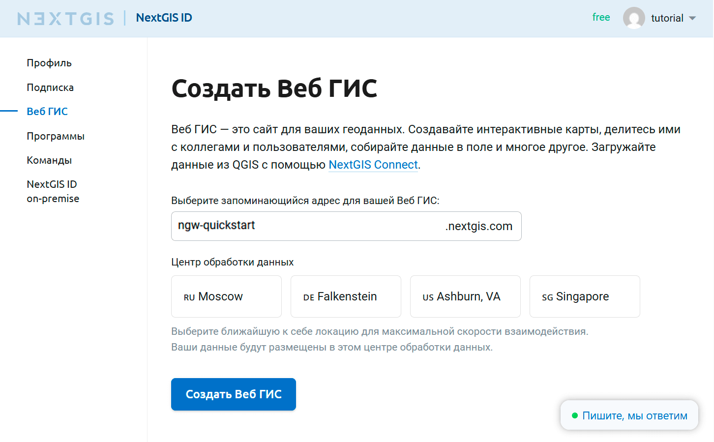

Когда процесс создания завершится, вид страницы изменится. На ней появится прямая ссылка на вашу новую Веб ГИС.

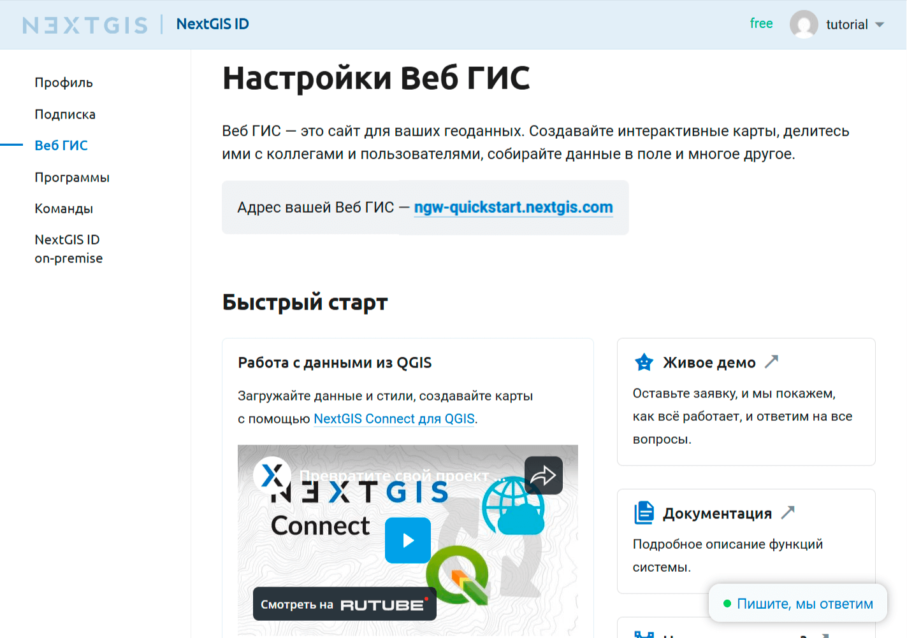

.. _install:

Шаг 2/4 Установка и настройка NextGIS Tracker на устройстве Android
--------------------------------------------------------------------

Установите приложение NextGIS Tracker на смартфон с ОС Android. Его можно найти в Google Play.

Запустите приложение. Дайте программе доступ к местоположению устройства. 

Вы можете сразу начать запись треков и делиться ими, пересылая GPX-файлы. Но мы хотим, чтобы треки автоматичесмки передавались в Веб ГИС.

Нажмите на переключатель синхронизации в правом верхнем углу экрана:

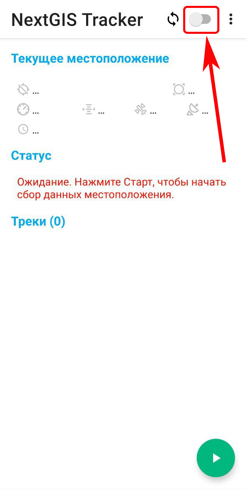

На следующем экране введите адрес вашей Веб ГИС (созданной на шаге 1, в нашем примере это ngw-quickstart.nextgis.com), адрес электронной почты и пароль, который вы задали при создании аккаунта NextGIS ID.

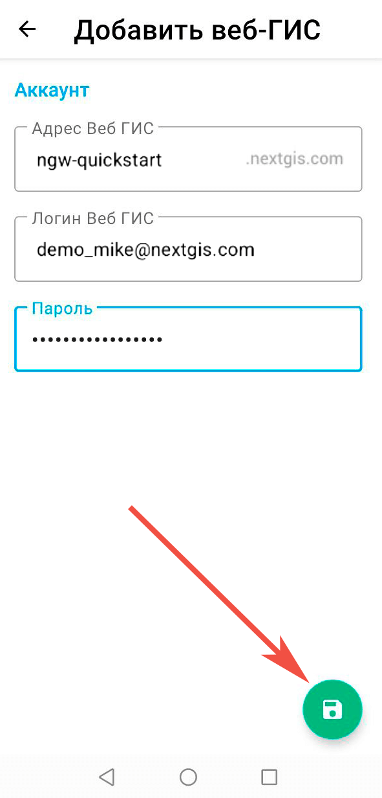

Нажмите на зелёную кнопку с дискетой в нижнем углу, чтобы сохранить изменения.

Когда синхронизация включена, переключатель становится синим и рядом с ним отображается значок |icon_layer_sync|. Теперь приложение пересылает GPS-треки в Веб ГИС.

.. |icon_layer_sync| image:: _static/icon_layer_sync.png
   :width: 6mm
   :alt: стрелки по кругу

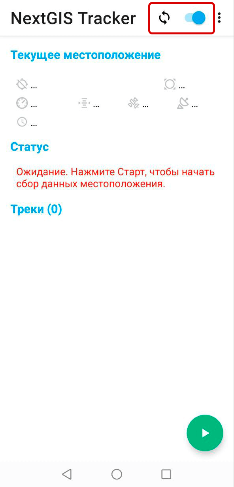

.. _record:

Шаг 3/4 Сбор даных о местоположении
-------------------------------------

Чтобы записать свой первый трек, нажмите на зелёную кнопку "Пуск" в правом нижнем углу. 

Приложение запросит разрешение на использование местоположения в любом режиме. Это разрешение необходимо, чтобы приложение могло записывать треки. 

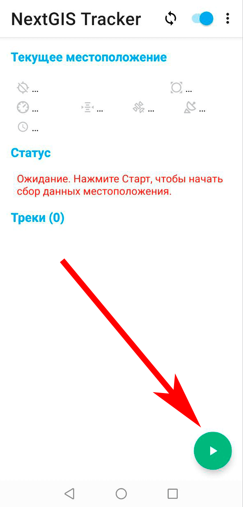

Перейдите в настройки устройства и дайте приложению NextGIS Tracker постоянный доступ к местоположению. Вид диалога запроса может отличаться в зависимости от версии Android.

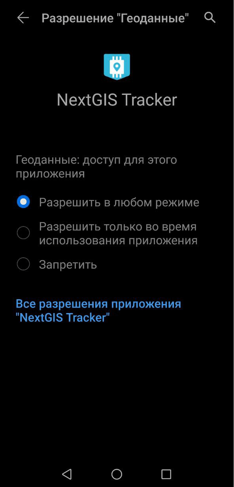

Теперь, когда вы вернётесь в приложение, вы увидите новый статус: "Сбор данных местоположения и синхронизация...".

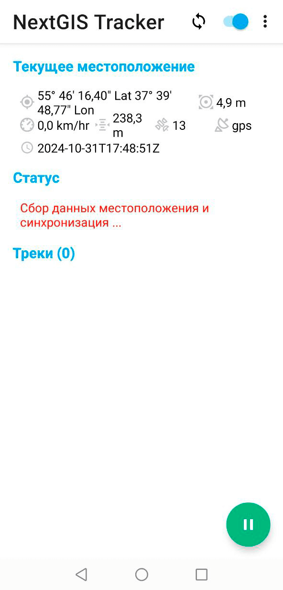

Отправьтесь на небольшую прогулку, чтобы записать свои перемещения.

При помощи веб-карты вы можете отслеживать своё положение в реальном времени.

.. _position:

Шаг 4/4 Отображение местоположения и записанного трека на веб-карте
---------------------------------------------------------------------

Откройте свою Веб ГИС в браузере, нажав на ссылку в `личном кабинете  <https://my.nextgis.com/webgis/>`_ или вписав URL Веб ГИС в адресную строку браузера. Отроется основной интерфейс вашей Веб ГИС.

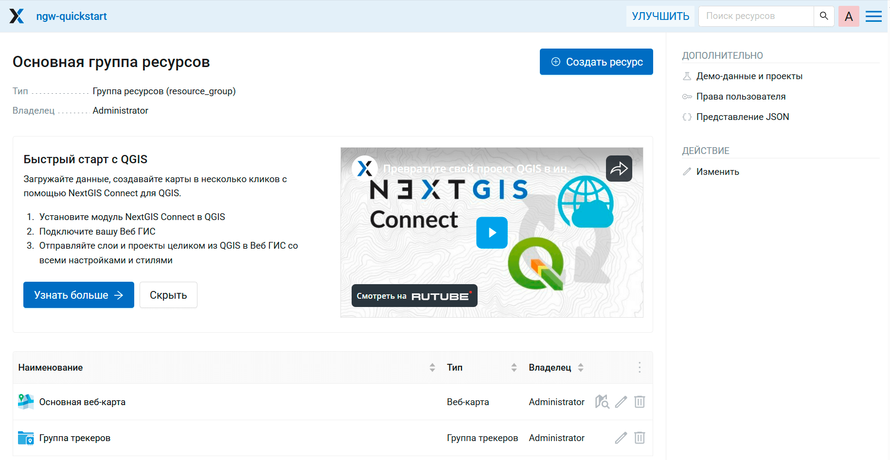

NextGIS Web состоит из ресурсов. Папки (группы), слои, веб-карты, соединения с сервисами и подключения к базам данных - всё это ресурсы. Ресурсы организованы как файлы на компьютере - в виде "дерева". 

У вас уже есть несколько ресурсов:

* Основная веб-карта - стандартный ресурс, который создаётся вместе с Веб ГИС;
* Группа трекеров - ресурс, созданный приложением NextGIS Tracker при включении синхронизации. Трекерами можно управлять вручную.

Нажмите на значок |button_open_web_map|, чтобы открыть Основную веб-карту в режиме просмотра:

.. |button_open_web_map| image:: _static/button_open_web_map.png
   :width: 6mm
   :alt: карта с лупой

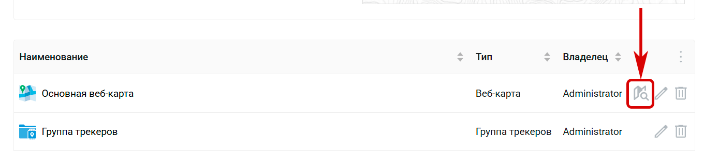

Эта веб-карта пустая - на ней нет слоёв. Но в меню слева доступна панель Трекеры |panel_trackers|. Откройте её.

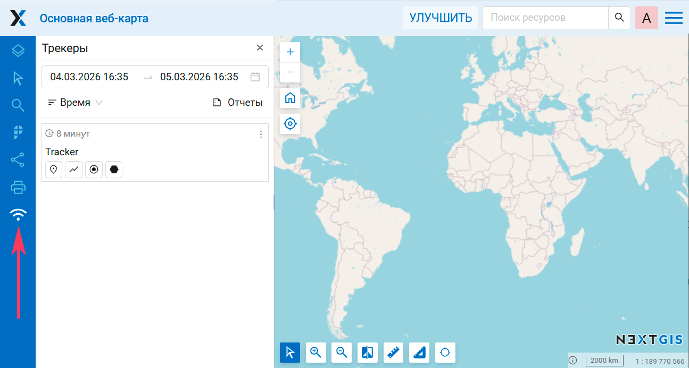

По умолчанию, треки, собранные приложением Tracker, можно просматривать на всех веб-картах вашей Веб ГИС. Это можно отключить в настройках веб-карты. 

В панели Трекеры отображается список всех подключённых трекеров. Сейчас у вас подключён только один трекер. Нажмите кнопку |button_tracker_lastpoint| "Последняя точка".

.. |button_tracker_lastpoint| image:: _static/button_tracker_lastpoint.png
   :width: 6mm
   :alt: перевёрнутая капля с точкой

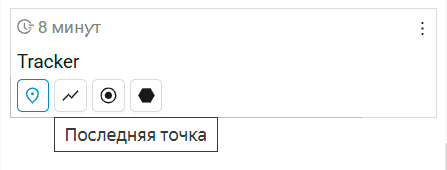

Последнее зафиксированное местоположение будет показано на веб-карте. Если устройство, на котором установлен трекер, двигается, вы увидите это в режиме реального времени.

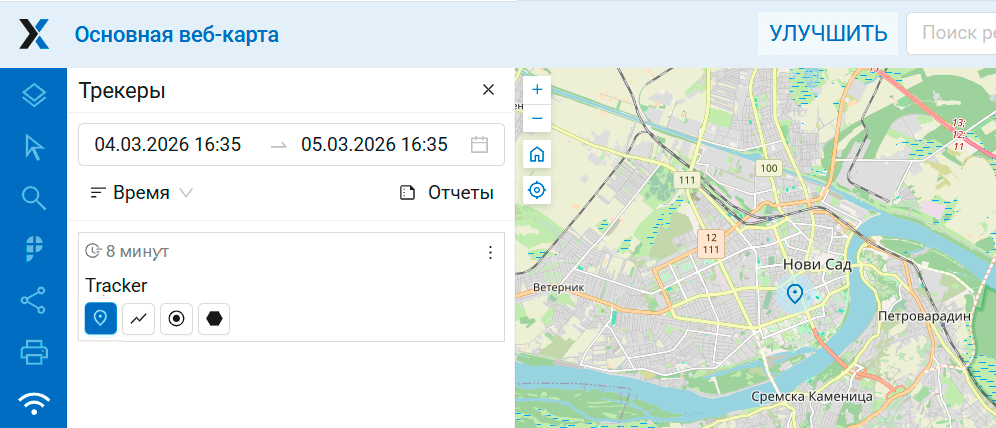

Нажимая на другие кнопки, вы можете включить отображение линии трека и точек, записанных с заданным интервалом.

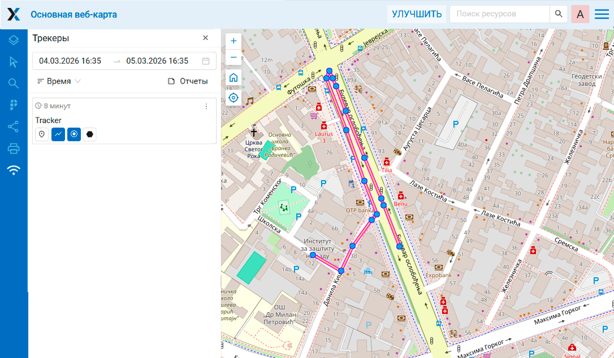

Наведите курсор на точку, чтобы увидеть информацию о дате, времени, скорости, направлении и других параметрах.

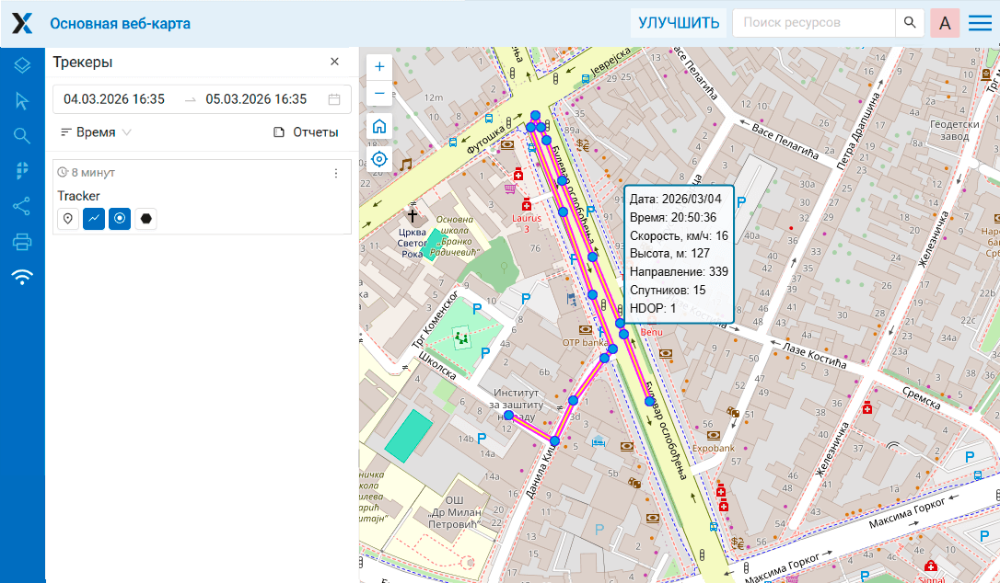

Записав несколько треков, вы можете проанализировать их путём `создания отчётов <https://docs.nextgis.ru/docs_howto/source/tutorial_track.html#report>`_ или `экспортировать треки <https://docs.nextgis.ru/docs_howto/source/tutorial_track.html#export>`_ в формате GPX, чтобы поделиться ими или сохранить как резервную копию.

Если у вас подписка Премиум, вы можете подключить к своей Веб ГИС `несколько устройств-трекеров <https://docs.nextgis.ru/docs_howto/source/tutorial_track.html#manage>`_.

.. _report:

Создание отчётов 
----------------

На панели трекеров нажмите кнопку "Отчёты":

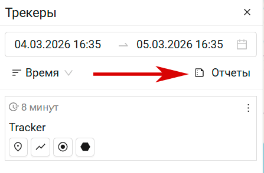

Здесь можно создавать разные виды отчётов. 

В выпадающем меню "Тип отчёта" выберите **Средняя скорость**. Задайте период времени, в который попадает ваша сегодняшняя прогулка. В поле "Группировать по" выберите группировку по часам.

Отметьте единственный доступный трекер, затем нажмите **Построить отчёт**.

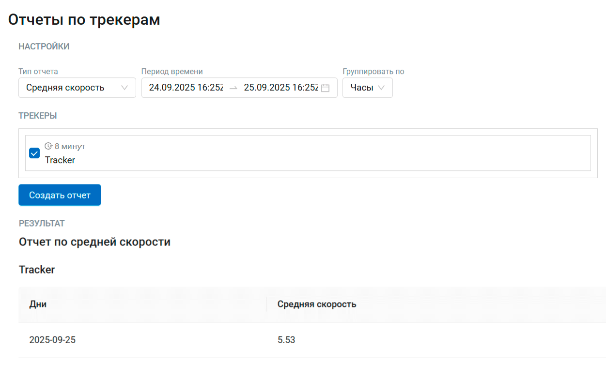

Вы получите данные о средней скорости движения. 

.. _export:

Экспорт в файл GPX
-------------------

Чтобы сохранить трек в файл, перейдите на страницу отчётов (см. :numref:`trackers_reports_pic`).

В поле "Тип отчёта" выберите **GPX-файл**. 

Нажмите **Построить отчёт**, появится ссылка на скачивание файла. Файл GPX можно открыть в QGIS и других приложениях.

.. _manage:

Управление трекерами
--------------------

Когда вы включаете синхронизацию с Веб ГИС в приложении NextGIS Tracker, оно автоматически производит нужную настройку на стороне Веб ГИС, как мы увидели на предыдущих шагах.

Но вы можете редактировать и создавать трекеры вручную, используя типы ресурсов `Группа трекеров и Трекер <https://docs.nextgis.ru/docs_ngcom/source/tracking.html#tracking-create>`_. Это позволяет добавлять в Веб ГИС сотни трекеров, используя функционал трекинга в промышленных масштабах.

.. seealso::

   Другие мобильные приложения NextGIS также поддерживают запись треков и их синхронизацию. Узнайте об этом больше:

   * `NextGIS Mobile <https://docs.nextgis.ru/docs_ngmobile/source/index.html>`_
   * `NextGIS Collector <https://docs.nextgis.ru/docs_collector/source/index.html>`_
