Tutorial: Store, manage and publish your spatial data
=====================================================

.. admonition:: Availability

   Cloud SaaS (all editions), On premise (all editions), Open Source

NextGIS Web is a data-centric server GIS, allowing you to store, manage and publish spatial data in a flexible and effective way. In this step-by-step tutorial you will learn how to convert your GIS files into shareable Web Maps, tile and OGC services, as well as to create and manage data directly on the server. Register a free cloud account and try it right away!

:download:`Download tutorial data <https://nextgis.com/tutorials/store_manage_publish_geospatial_data.zip>` (source: `Wrocław Spatial Information System <https://geoportal.wroclaw.pl/>`_)

Basic

1. `Create Account and Web GIS <https://docs.nextgis.com/docs_howto/source/tutorial_webgis.html#step-1-6-create-free-account-and-web-gis>`_
2. `Create Resource group <https://docs.nextgis.com/docs_howto/source/tutorial_webgis.html#step-2-6-access-your-web-gis-and-create-resource-group>`_
3. `Upload vector layer <https://docs.nextgis.com/docs_howto/source/tutorial_webgis.html#step-3-6-upload-and-publish-vector-layer>`_
4. `Upload style <https://docs.nextgis.com/docs_howto/source/tutorial_webgis.html#step-4-6-upload-a-style>`_
5. `Upload raster layer <https://docs.nextgis.com/docs_howto/source/tutorial_webgis.html#step-5-6-upload-and-publish-raster-layer>`_
6. `Publish Web Map <https://docs.nextgis.com/docs_howto/source/tutorial_webgis.html#step-6-6-publish-web-map>`_

Advanced

7. `Add external WMS layer to Web Map <https://docs.nextgis.com/docs_howto/source/tutorial_webgis.html#add-external-wms-layer-to-web-map>`_
8. `Add basemaps <https://docs.nextgis.com/docs_howto/source/tutorial_webgis.html#add-basemaps-to-web-map>`_
9. `Create vector layer inside Web GIS <https://docs.nextgis.com/docs_howto/source/tutorial_webgis.html#create-vector-layer-inside-web-gis>`_
10. `Edit vector layer on Web Map, add file attachments <https://docs.nextgis.com/docs_howto/source/tutorial_webgis.html#edit-vector-layer-on-a-web-map-add-file-attachments>`_
11. `Publish OGC API — Features service <https://docs.nextgis.com/docs_howto/source/tutorial_webgis.html#ogc-api>`_
12. `What next <https://docs.nextgis.com/docs_howto/source/tutorial_webgis.html#what-next>`_

.. _account:

Step 1/6 Create free account and Web GIS
-----------------------------------------

Go to `my.nextgis.com`, click the **Create Account** button and sign up using your email address. 

After registration your account page would appear. Select the **Web GIS** menu on the left, come up with a name (ngw-quickstart.nextgis.com in this example) and select the nearest Data center location (DE Falkenstein in this example). Then click **Create Web GIS**.

.. figure:: _static/tutorial_create_wg_en.png

When the creation process is complete, the contents of the page will change. Direct link to your new Web GIS will appear.

.. figure:: _static/tutorial_my_wg_en.png

.. _webgis:

Step 2/6 Access your Web GIS and create resource group
-------------------------------------------------------

Click on the Web GIS link or type it into your browser.

You'll see the main interface of your Web GIS.

.. figure:: _static/tutorial_wg_main_en.png

In NextGIS Web everything is a resource — layers, Web Maps, folders (groups), connections to services and databases. Resources are organized as files at your computer — in a tree. 

Let’s create our first resource, a folder or *resource group* named Wroclaw. To do that, click the blue **Create resource** button on the top of the page. 

.. tip:: If you don’t see the **Create resource** button, you should log in first. Click the **Sign in** button in the top right corner and then select **Sign in with NextGIS ID**.

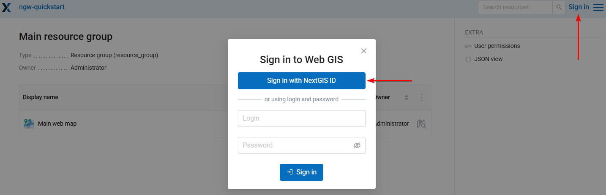

When you click **Create resource**, a window appears showing all available options of what could you create in the current context. Select **Resource group**.

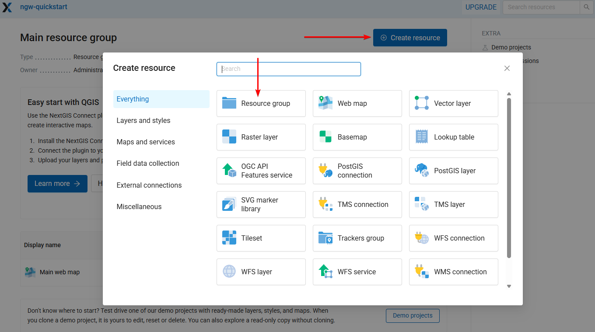

The resource creation window consists of several tabs, in this case we need to set only the name ``Wroclaw`` on the “Resource” tab.

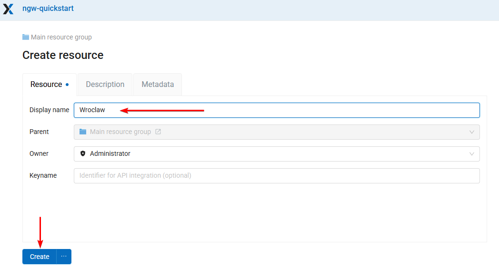

Click **Create** and you'll be redirected to the page of the new resource.

.. figure:: _static/tutorial_group_result_en.png

The URL in your browser is the path to the resource, and the numbers at the end of the URL are the resource ID. 

*Wroclaw* is a child for the *Main resource group* folder where we created it. The parent resource is shown above the resource name.

Now you can upload data to this folder.

.. _vector:

Step 3/6 Upload and publish vector layer
-------------------------------------------

`Download the tutorial data <https://nextgis.com/tutorials/store_manage_publish_geospatial_data.zip>`_ and unzip the archive.

Inside the *Wroclaw* folder, click **Create resource** and select the **Vector layer** type of resource.

.. figure:: _static/tutorial_select_vlayer_en.png

You'll see the interface for resource creation with several tabs. 

.. figure:: _static/tutorial_create_vlayer_upload_en.png

The default tab is called **Vector layer**. Add the file called ``bicycle_roads.gpkg`` from the tutorial dataset to the field **Select a dataset** by drag-and-drop or click on the field and then select the file.

After the upload completes, the file size is displayed. 

Switch to the **Resource tab** and enter the Dislpay name for the new layer, for example, ``Bicycle roads``. Then click the **Create** button.

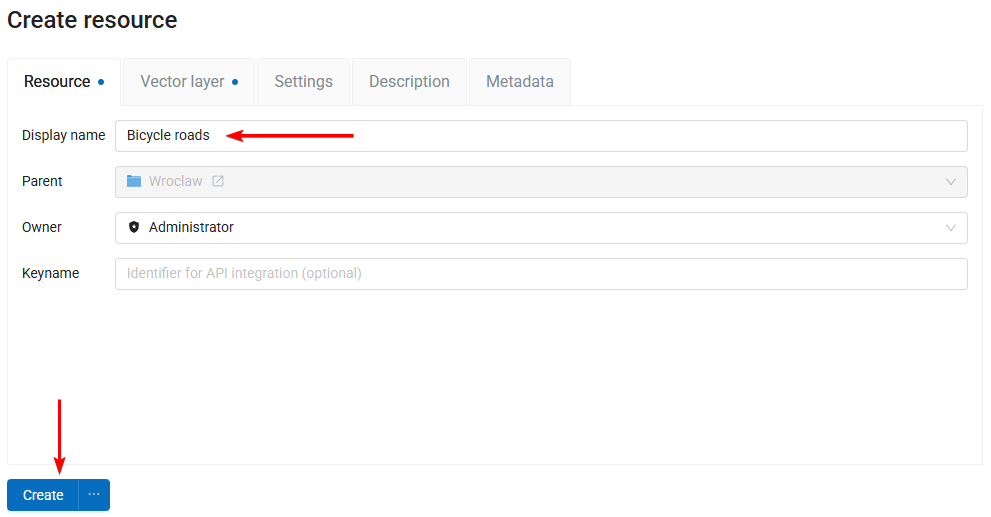

The vector layer is created and you are redirected to its page. The numbers at the end of the URL represent the ID of the layer.

This page has the information about the layer:

* Its place in the resource tree (Main resource group / Wroclaw);
* Basic metadata (geometry type, feature count etc.);
* List of fields a.k.a. attribute structure;

.. figure:: _static/tutorial_vlayer_result_en.png

In the **External access** section you'll find an automatically generated URL that allows to access the layer via MVT vector tiles. Right away you can connect this data to a Web app or add it to QGIS using this link. `More on MVT tiles <https://docs.nextgis.com/docs_ngweb/source/services.html#mvt-vector-tiles>`_.

To view the data open the Feature table by clicking |button_open_feature_table| **Table** in the menu on the right.

.. |button_open_feature_table| image:: _static/button_open_feature_table.png
   :width: 6mm

.. figure:: _static/tutorial_feature_table_en.png 

Select any feature and click **Open** to view it.

In the opened window you see all the properties of the selected feature, including its attributes, geometry and a map representation on top of the default basemap.

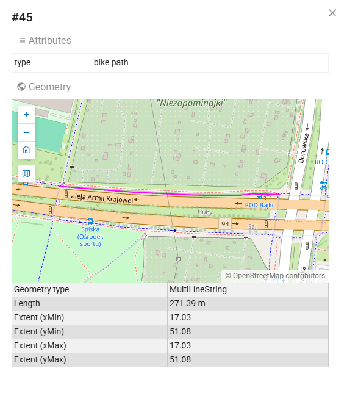

The feature table allows you to inspect, edit and manage vector layer features as independent database records, without using maps or other applications. (`More on how to do it <https://docs.nextgis.com/docs_ngweb/source/feature_table.html#ngw-feature-table-blank>`_)

.. _style:

Step 4/6 Upload a style
------------------------

If you want to generate **TMS tiles** or **add the layer to a Web Map**, you need to define its appearance a.k.a. a **style**. You can click **Create default QGIS style**, but for this layer we have a special file that determins colors and structures of the lines depending on the attribute values.

On the layer page click **Create resource** button. You'll see a different set of available resources, because a vector layer could only be a parent for styles and forms. We use QGIS styles as the primary way to define data appearance. Select **QGIS vector style**.

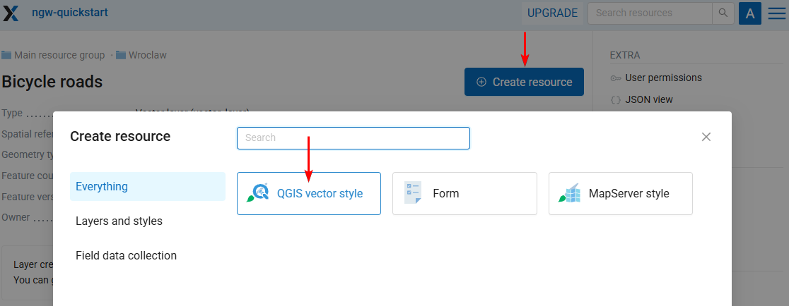

Upload the file called ``bicycle_roads.qml`` from the tutorial dataset. Then click the **Create** button.

The vector style is created and you are redirected to its page. Click **Preview** in the menu on the right to see how the style looks.

In the **External access** section you'll find an auto-generated URL you can use to connect this styled data as a Tiled Map Service, for example, add it to QGIS. `More on TMS <https://docs.nextgis.com/docs_ngweb/source/services.html#tms-service>`_

Now you can upload another type of layer or skip to the `Web Map creation <https://docs.nextgis.com/docs_howto/source/tutorial_webgis.html#step-6-6-publish-web-map>`_.

.. _raster:

Step 5/6 Upload and publish raster layer
-----------------------------------------

Return to the *Wroclaw* resource group by clicking its name at the current path.

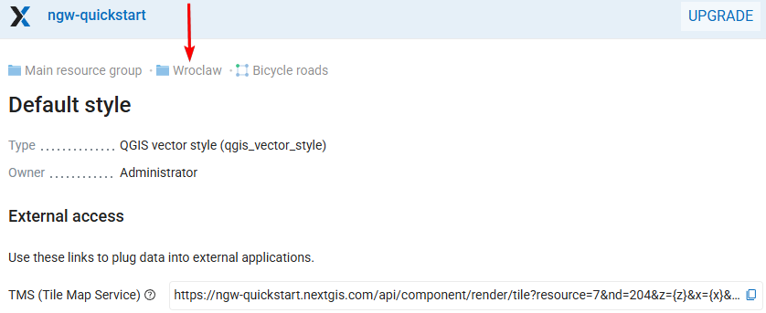

Click the **Create resource** button and select **Raster layer**.

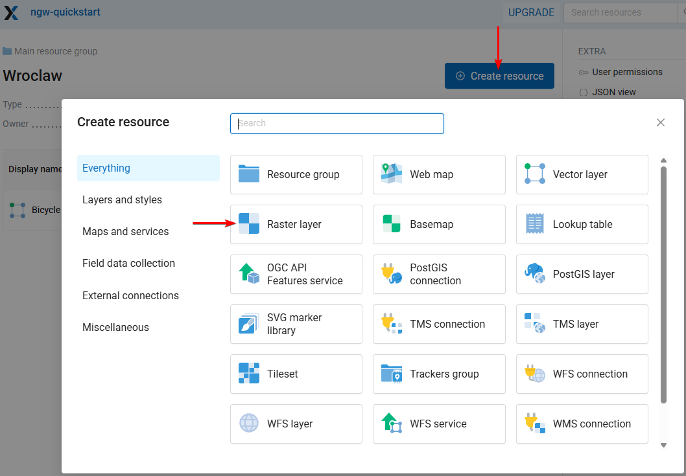

On the **Raster layer** tab drag and drop the file called ``plan.tif``  from the tutorial dataset or click **Select the dataset** and select the file. Then click the **Create** button.

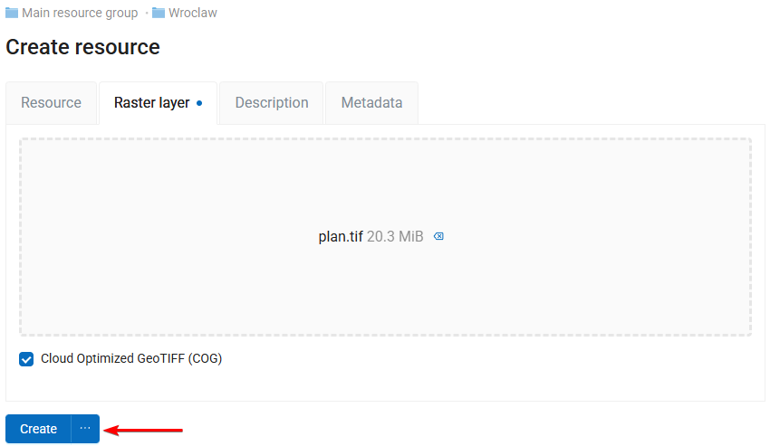

The raster layer is created and you are redirected to its page. Here you can see:

* Its place in the resource tree (Main resource group / Wroclaw);
* Basic metadata (bands, dimensions etc.);

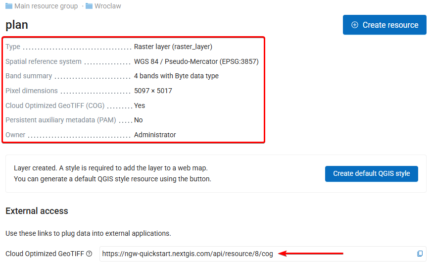

In the **External access** section you'll find an auto-generated **Cloud Optimized GeoTIFF** access URL to this data. Right away you can connect this data to external resources using this link.

You can style rasters with QGIS styles by creating child resources. To style RGB(A) rasters, however, you can simply click **Create default QGIS style**. Let’s do it. The default raster style is created and you are redirected to its page. 

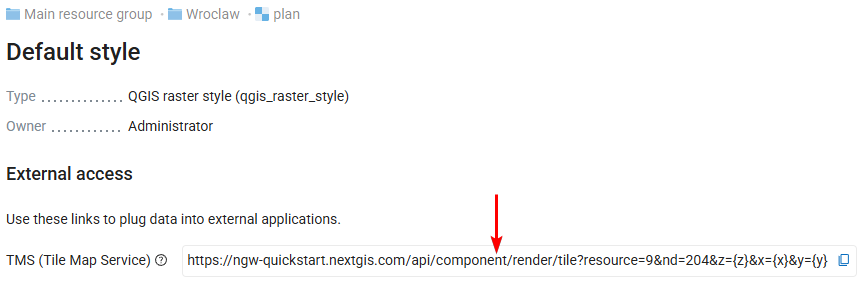

**Raster tiles (TMS)** access URL to this data is automatically generated. Right away you can use this link to connect this data as styled raster tiles to external resources.

You could also click **Preview** in the right menu and explore the uploaded raster.

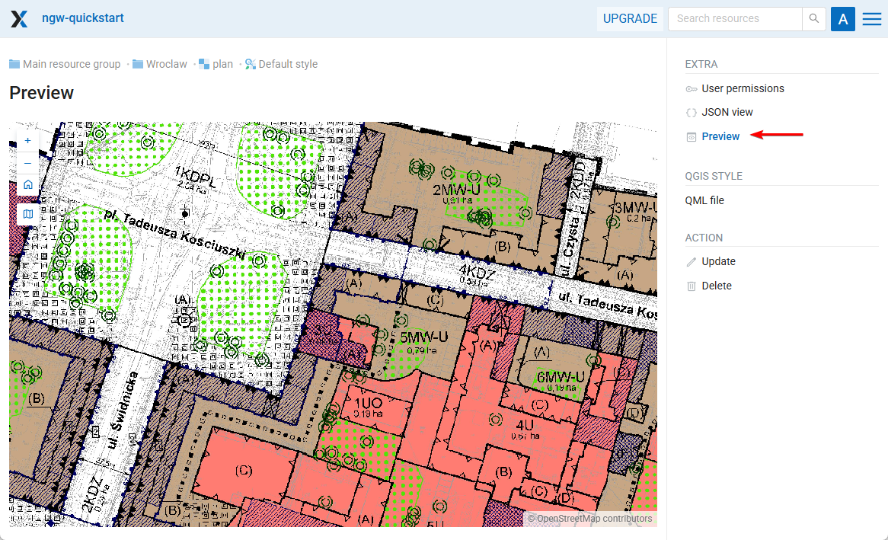

Now let's create a Web Map with the data we've just uploaded.

.. _webmap:

Step 6/6 Publish Web Map
-------------------------

Now that we have a couple of styled layers we are ready to publish our first Web Map. Return to the *Wroclaw* resource group and create a new resource — **Web Map**.

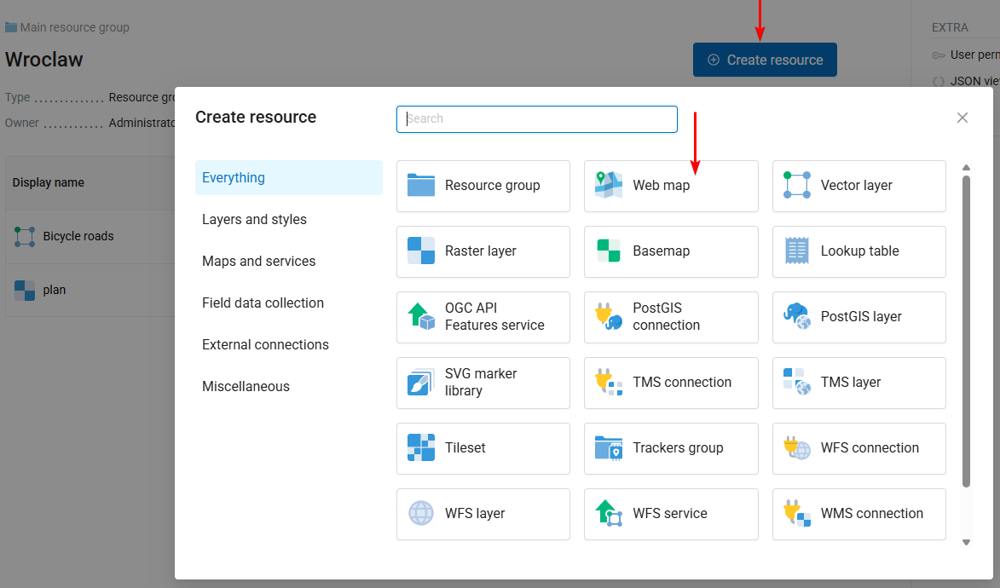

There are a lot of things that could be set for a Web Map. On the “Resource” tab enter the name for the map, e.g. ``Wroclaw``.

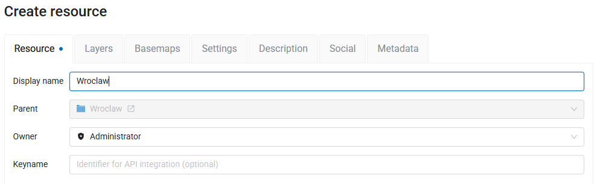

On the **Layers** tab you define the content of this Web Map. Click the |button_plus_layer| **Layer** button. What is added to the map is the visual representation of the data, so you need to select styles, not layers. That is why checkboxes near layer names are not active. You could enter the layer and select its child style, or simply click |button_pick_first| **Select first eligible child resource** on the right side of the layer to select it. Select both *“Bicycle roads”* and *“plan”* layers.

.. |button_pick_first| image:: _static/button_pick_first.png
   :width: 6mm

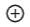

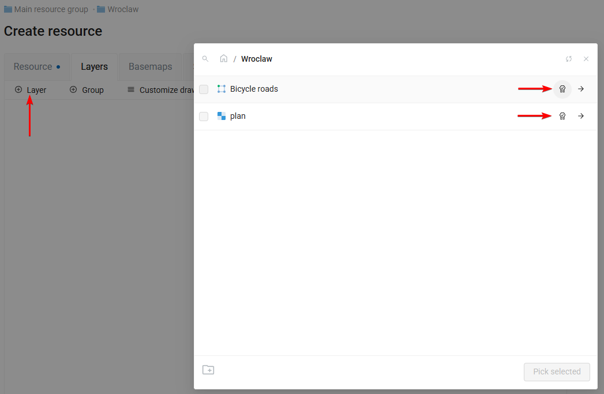

After that you can click on the layer to edit its properties.

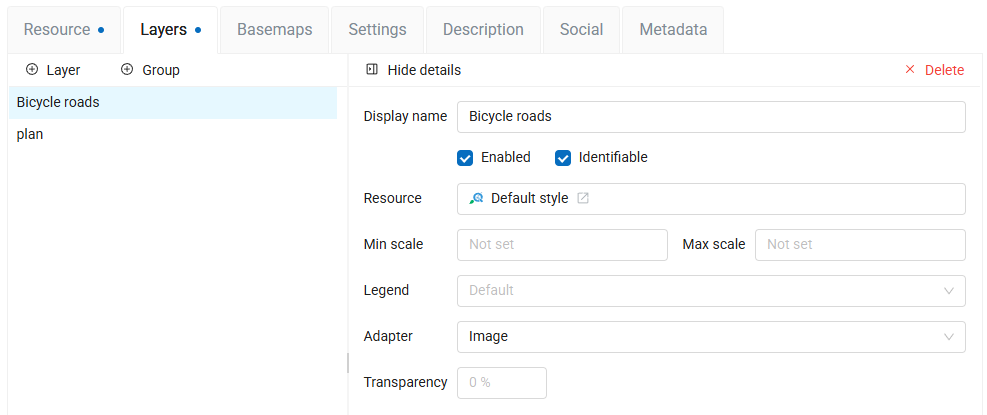

Switch to the **Settings** tab. Find the “Initial extent” row and click the **From layer** button. Then select *Bicycle roads* layer and click the **Pick selected** button. Now the map will open viewing the area of this layer.

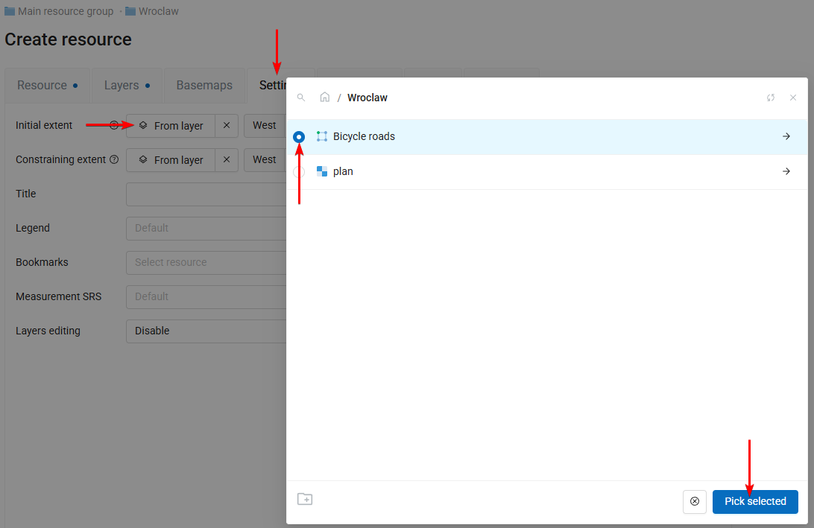

Click the **Create** button to finalize Web Map creation. 

Web Map resources have a special **Display** mode. It could be accessed from the right panel of the resource interface.

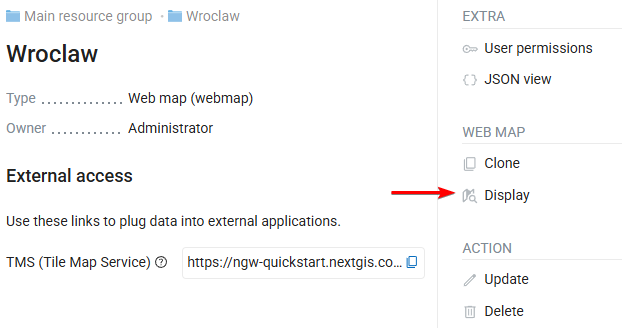

Or, if you return to the *Wroclaw* resource group, click the |button_open_web_map| map icon to the right of the Web Map resource name.

.. |button_open_web_map| image:: _static/button_open_web_map.png
   :width: 6mm

When you click |button_open_web_map| **Display**, an interactive Web Map opens. Each map has its own display URL and a lot of tools to explore and manage the data. 

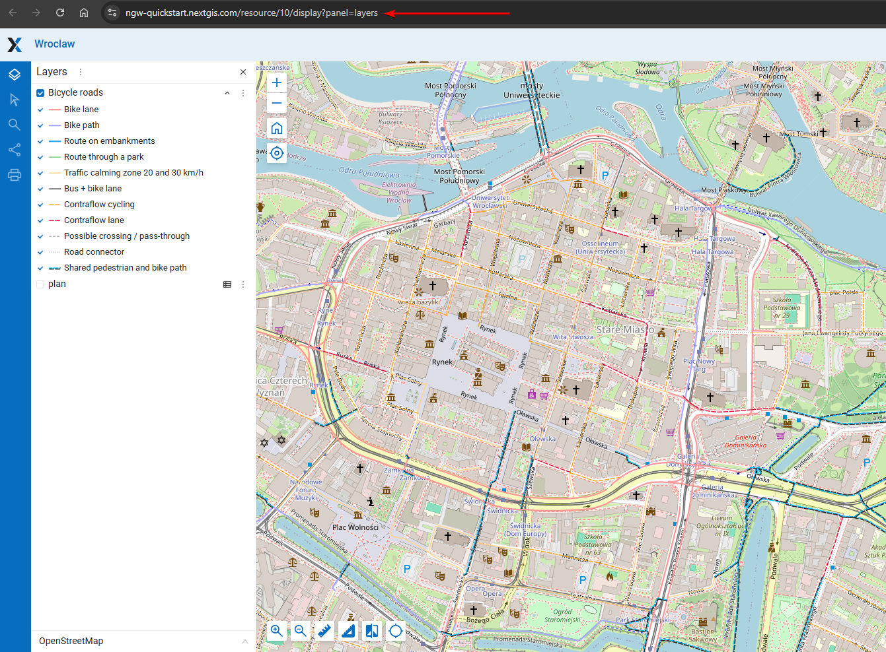

Tabs on the left allow to manage layers, identify, find and edit features, share or print the map. See documentation for more information about Web Map tools and panels: https://docs.nextgis.com/docs_ngweb/source/webmaps_client.html

You can create as many Web Maps as you need, combining available layers and their styles.

Let's explore what else you can do:

* `Add data published on external servers <https://docs.nextgis.com/docs_howto/source/tutorial_webgis.html#add-external-wms-layer-to-web-map>`_;
* `Change basemap <https://docs.nextgis.com/docs_howto/source/tutorial_webgis.html#add-basemaps-to-web-map>`_;
* `Create a vector layer from skratch <https://docs.nextgis.com/docs_howto/source/tutorial_webgis.html#create-vector-layer-inside-web-gis>`_;
* `Edit vector features on a Web Map and attach files <https://docs.nextgis.com/docs_howto/source/tutorial_webgis.html#edit-vector-layer-on-a-web-map-add-file-attachments>`_;
* `Publish OGC API — Features service <https://docs.nextgis.com/docs_howto/source/tutorial_webgis.html#publish-ogc-api-features-service>`_.

.. _wms:

Add external WMS layer to Web Map
---------------------------------

You can connect external :term:`WMS`, :term:`WFS`, :term:`TMS` and :term:`PostGIS` data to NextGIS Web. Let’s explore it with the example of Wroclaw orthophoto serving as a public WMS service.

Return to the *Wroclaw* resource group and create a new resource — **WMS connection**.

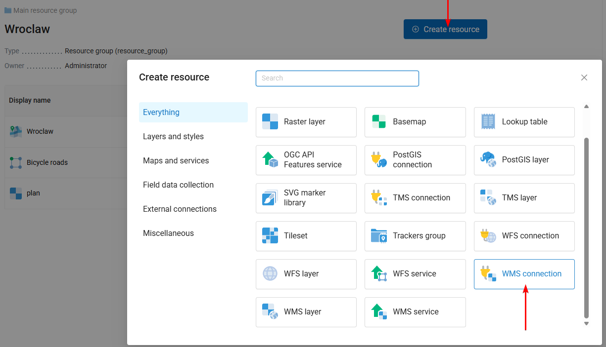

On the resource tab set the name — ``Wroclaw orthophoto service``:

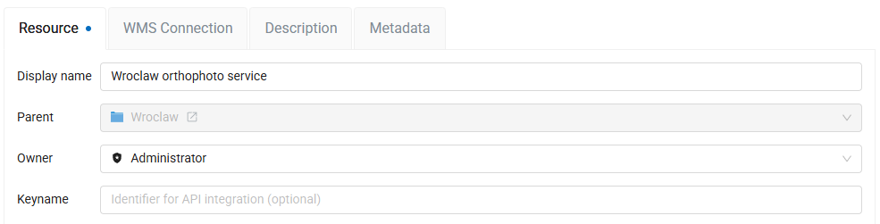

On the WMS Connection tab set the URL: https://gis1.um.wroc.pl/arcgis/services/ogc/OGC_ortofoto_2024/MapServer/WMSServer

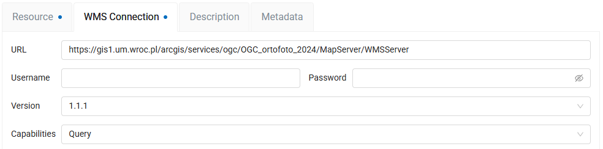

Then click the **Create** button.

Return to the *Wroclaw* group again and create another resource — **WMS layer**.

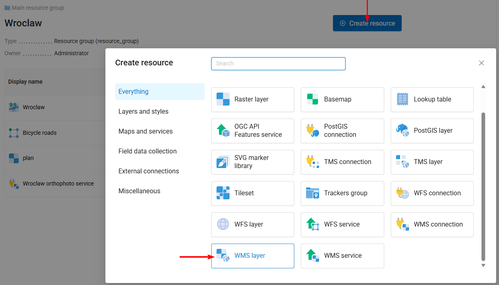

On the Resource tab set the name — ``Wroclaw orthophoto layer``:

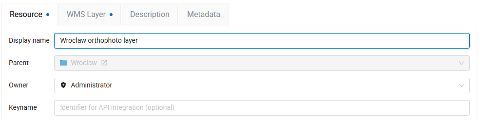

On the **WMS Layer** tab click the *“WMS Connection”* field and select **Wroclaw orthophoto service** resource, then click **Pick selected**.

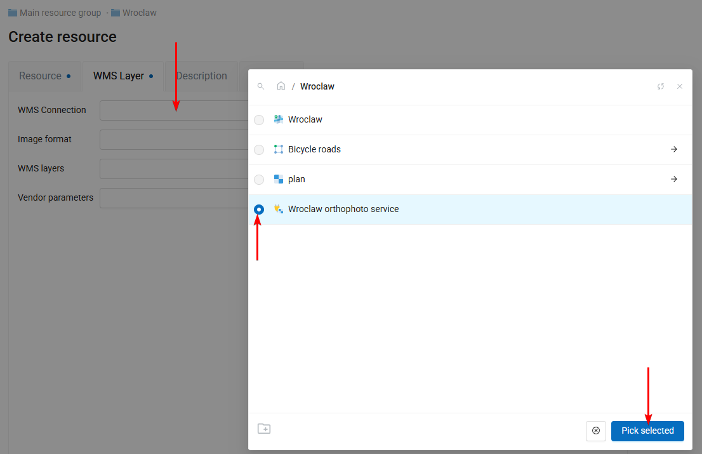

In the *“Image format”* dropdown list select **image/png**, and in the *WMS layers* dropdown list select **Ortofotomapa 2024 - GUGiK**.

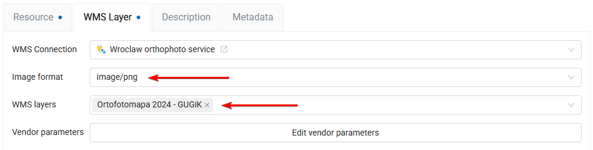

Then click the **Create** button. WMS connection and layer are created. 

In the **External access** section you'll find an auto-generated URL that can be used to connect the data as **raster tiles**. Right away you can add this data to a Web app or a desktop app such as QGIS. Your Web GIS serves as a proxy for the WMS service.

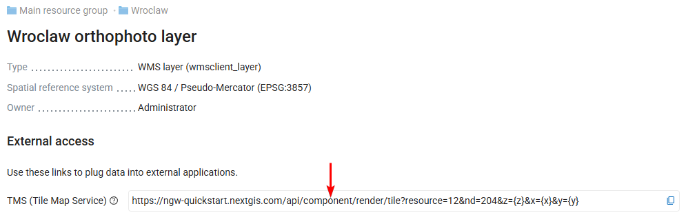

To **add the WMS layer to the Web Map** return to the *Wroclaw* resource group and click the |button_edit| pencil icon next to the Web Map.

.. |button_edit| image:: _static/button_edit.png
   :width: 6mm

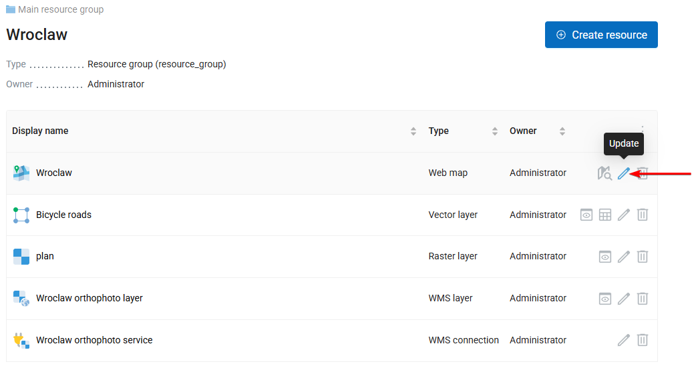

On the **Layers** tab click |button_plus_layer| **Layer** button, select *“Wroclaw orthophoto layer”* and click **Pick selected** button. WMS layer is now added to the Web Map.

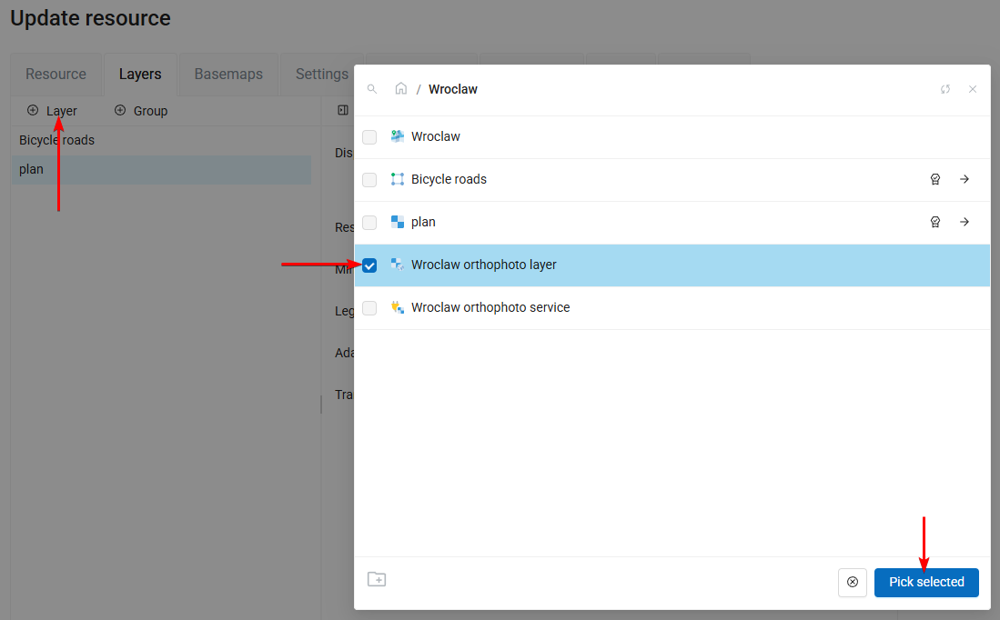

Save the map and open it in display mode. You’ll see that a detailed orthophotomap from external source is now underlaying the previously uploaded data.

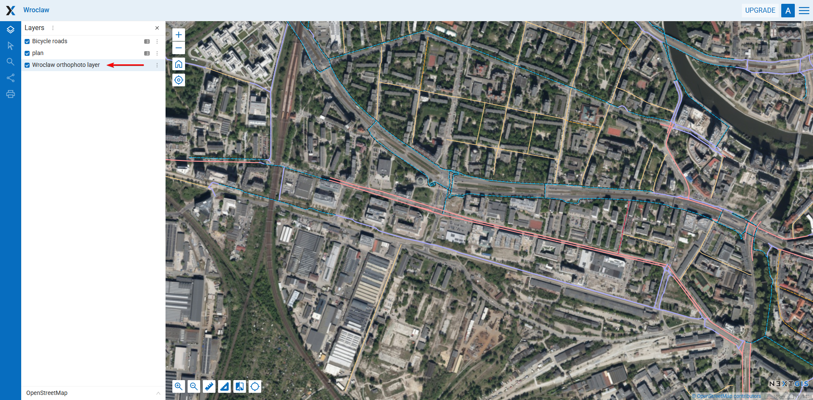

.. _basemap:

Add basemaps to Web Map
---------------------------

By default Web Maps use the standard OpenStreetMap basemap. But you can connect other basemaps and use them with your Web Maps.

Return to the *Wroclaw* resource group and create a new resource — **Basemap**.

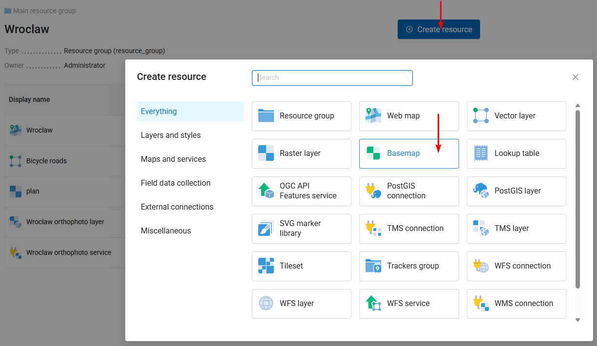

Here you can use our public crowdsourced collection of map services, qms.nextgis.com. Start entering the name of the basemap in the **Pick from QMS** field and select what you need from search results.

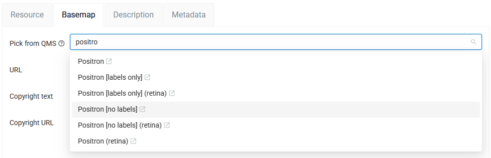

All other fields will be filled automatically, also a preview will be available to explore the selected basemap.

An alternative way to create a basemap is to enter the URL for the **XYZ tiles** manually. 

Use the slider in the top right corner to compare this basemap to the default OSM.

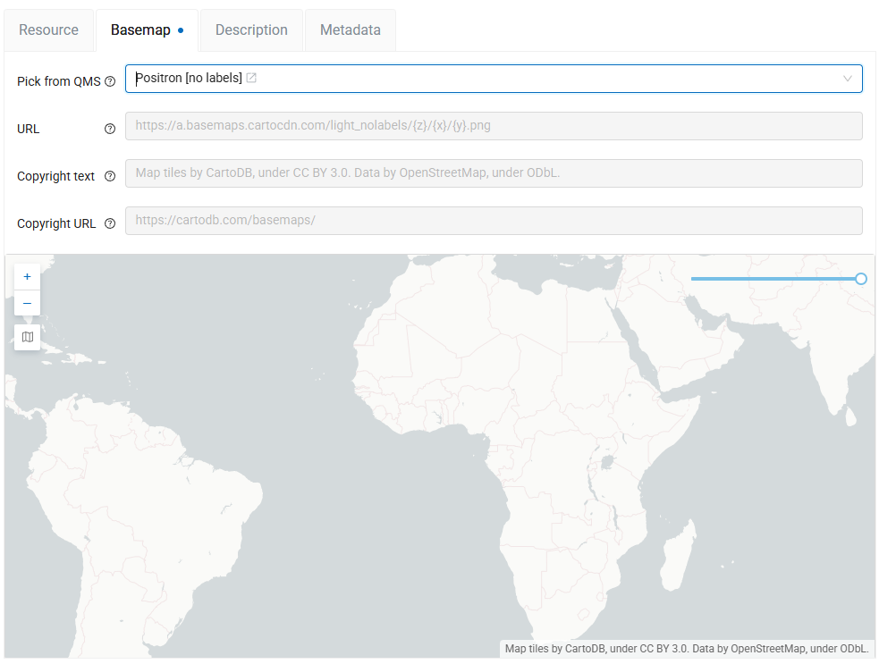

On the **Resource** tab set the name of the basemap.

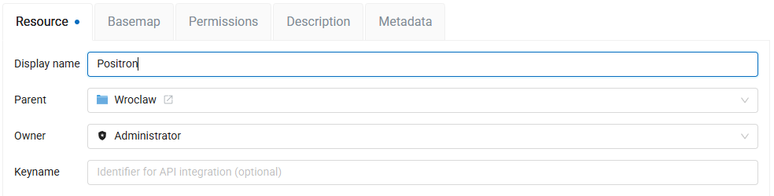

Click the **Create** button.

To add the newly created basemap to the Web Map return to the *Wroclaw* resource group and |button_edit| edit the Web Map resource.

.. figure:: _static/tutorial_webmap_enter_update_en.png
   :name: 
   :align: center
   :width: 20cm

On the **Basemaps** tab click |button_plus_layer| **Add** button and select the created Basemap resource. Then click **Pick selected** and save the Web Map.

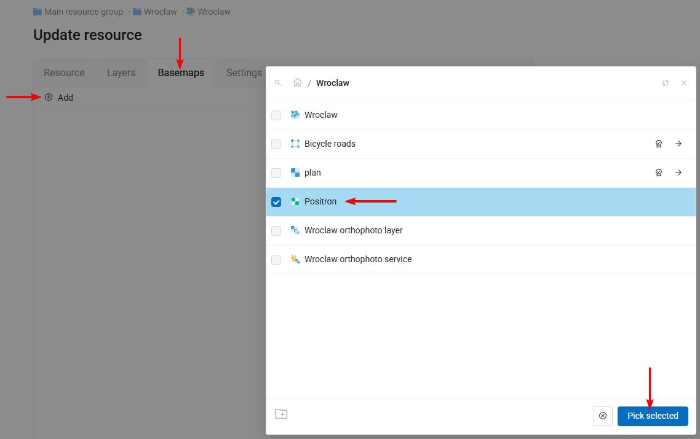

Open the Web Map in |button_open_web_map| display mode. Now the new basemap is used.

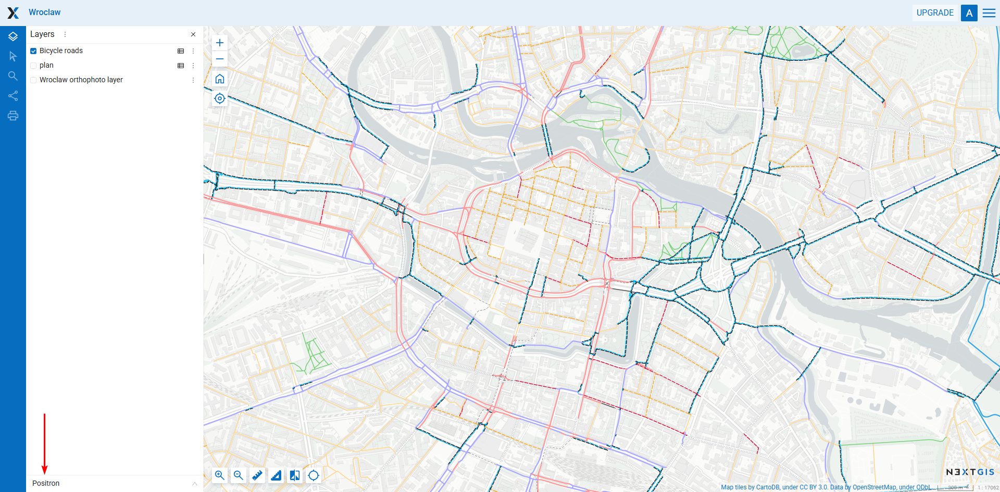

.. _empty_layer:

Create vector layer inside Web GIS
------------------------------------

It is possible not only to upload data from files, but also to create datasets right inside the Web GIS. 

Return to the *Wroclaw* resource group and create a new resource — **Vector layer**.

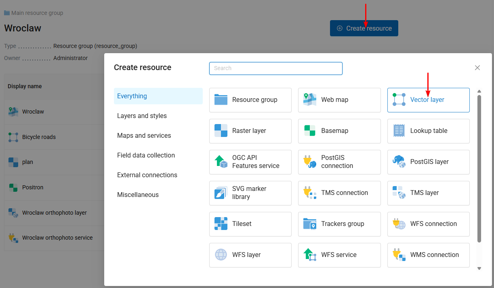

Then open the dropdown menu on the “Vector layer” tab and select **Create empty layer**.

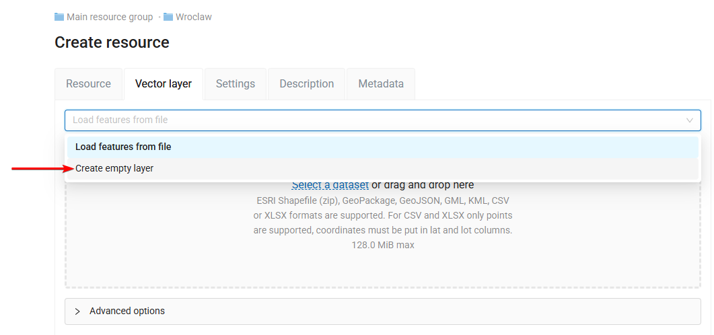

In the changed interface select the **Point** geometry type.

.. figure:: _static/tutorial_empty_layer_geom_en.png
   :name: 
   :align: center
   :width: 20cm

On the **Resource** tab set the name for the new layer, e.g. ``Bicycle parkings``, and click the **Create** button.

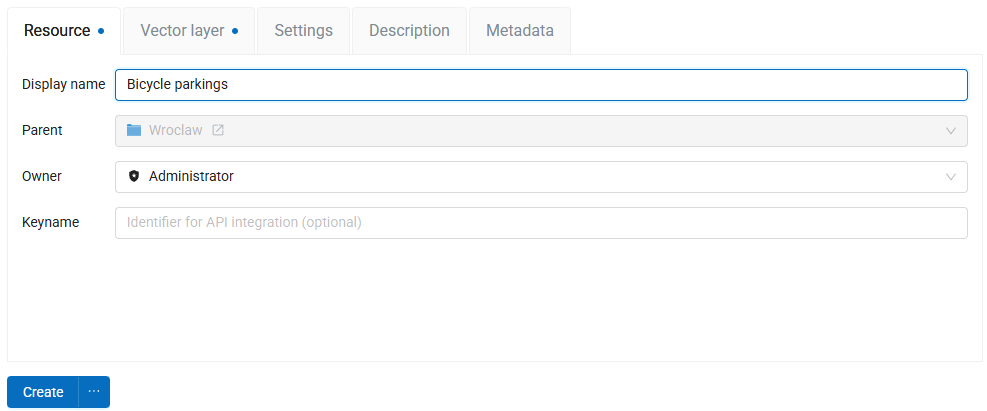

The vector layer is created and you are redirected to its page. Now you need to add attributes to it. Click |button_edit| **Update** in the right menu.

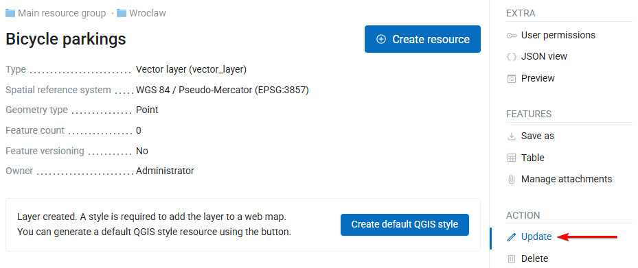

Here, on the **Fields** tab, click the |button_plus_layer| **Add** button.

Set up the properties of the new field in the side panel: 

* Display name: ``Number of parking spaces``, 
* Keyname: ``parking_spaces``, 
* Type: INTEGER. 

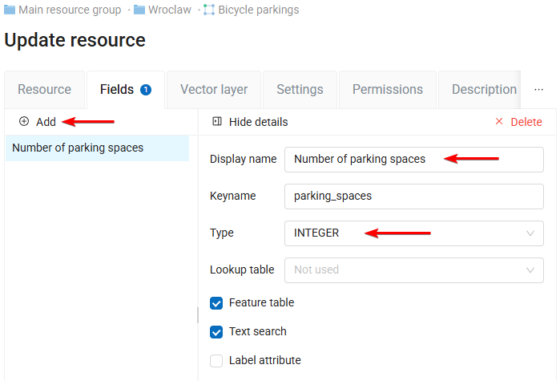

Then click the **Save** button.

Now it’s time to create a style for the new layer. On the vector layer resource page click **Create resource** and select **QGIS vector style**. 

On the **QGIS Style** tab open the dropdown menu and select **User-defined style**.

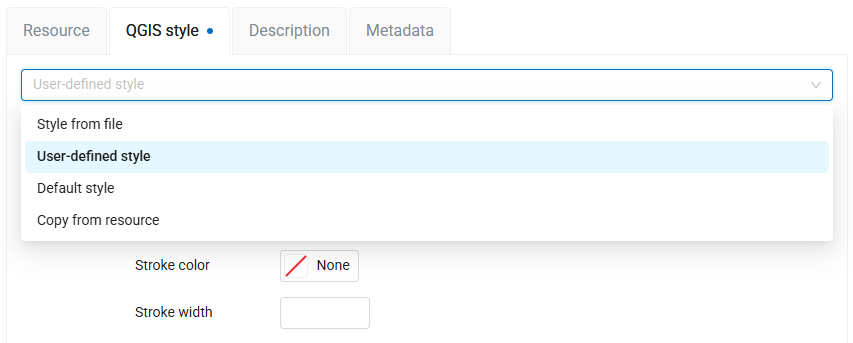

Simple style constructor is available here. We recommend using QGIS to create styles, but for quick tasks this built-in constructor could be useful. Set up a blue circle with size 12 and white stroke with 1 width. Then click the **Create** button.

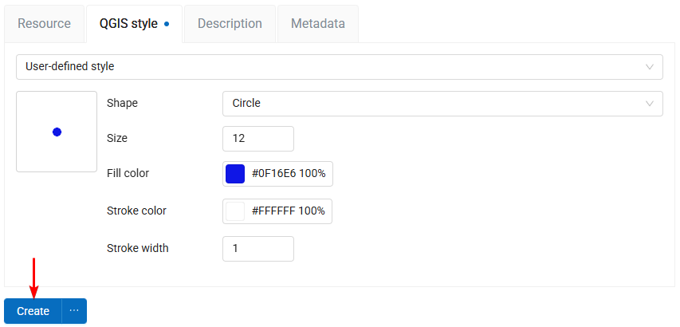

A new vector layer is created inside Web GIS. 

You can now add it to Web Maps and `publish it via OGC services <https://docs.nextgis.com/docs_howto/source/tutorial_webgis.html#publish-ogc-api-features-service>`_.

But first we'll add some features to the newly created layer using Web interface.

.. _edit:

Edit vector layer on a Web Map, add file attachments
-----------------------------------------------------

Return to the *Wroclaw* resource group and enter the |button_edit| Update mode of the Web Map.

First, go to the **Layers** tab, click the |button_plus_layer| **Layer** button and add *Bicycle parkings* layer by clicking |button_pick_first| **Select first eligible child resource** on the right side of the layer. Then click **Pick selected**, and drag *Bicycle parkings* layers to the top of the layers list.

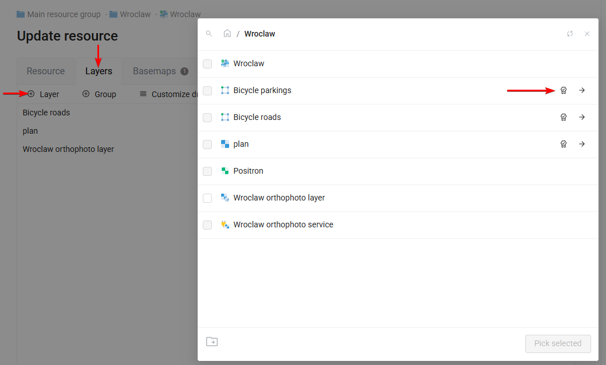

Next, go to the  **Settings** tab, find the **Layers editing** dropdown menu and select **Enable**. Save the changes.

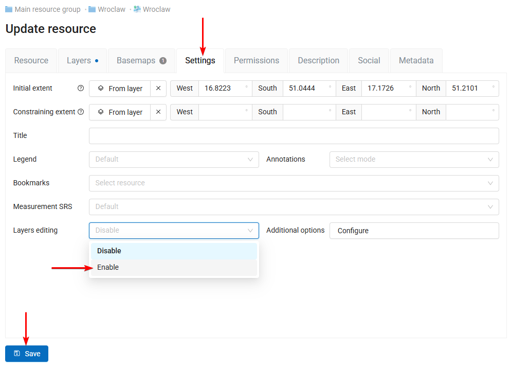

You have just added the new vector layer to the map and activated layer editing. Now go to the |button_open_web_map| “Display” mode of the map.

Zoom in to a place on the map where you would like to place a new bicycle parking. Next, open the layer's context menu by clicking the three dots to the right of its name, and select |button_edit| **Edit**.

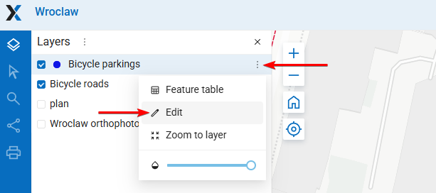

New tools have appeared on the map. 

Select |button_maptool_plus| tool and click on the desired place.

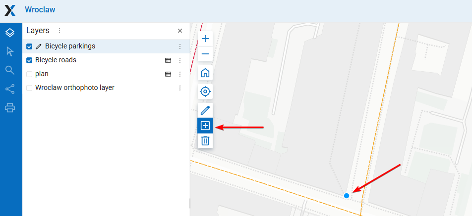

Pop-up modal window appears, where you can set attribute values, e.g. ``15`` as the number of parking spaces.

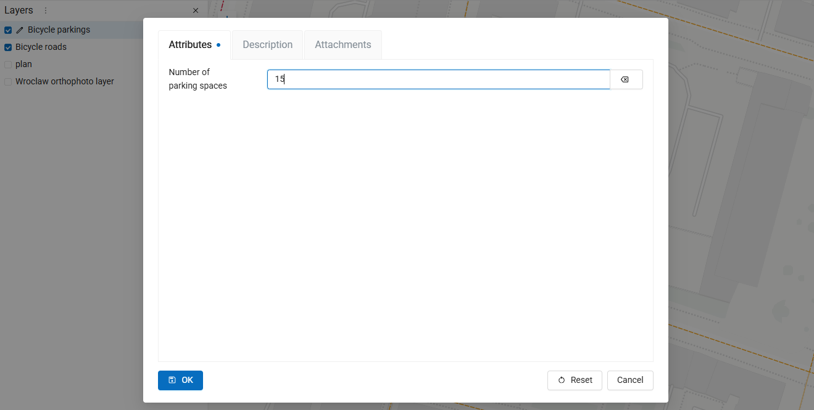

There are also two additional tabs available. On the **Description** tab you could enter any rich-text with images to describe the feature. On the **Attachments** tab you could attach an unlimited number of photos or any sort of files to the feature. Change tab to the “Attachments”, click the |button_upload| **Upload** button and select ``Bicycle_parking.jpg`` and ``WRM_Regulations.pdf`` files from the tutorial dataset.

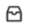

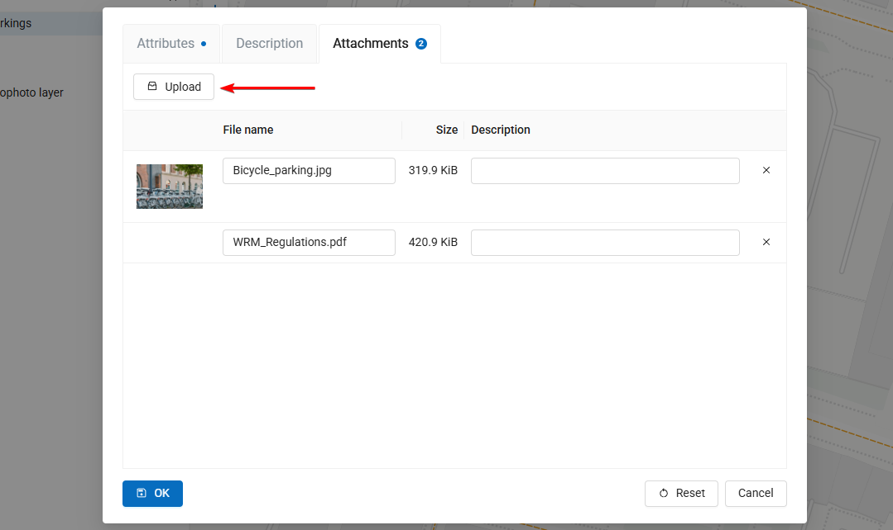

Click the **OK** button to save the feature. 

Then go to the context menu of *Bicycle parkings* layer again and click **Stop editing**.

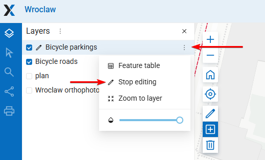

Confirm the edits by clicking the **Save** button in the pop-up dialog.

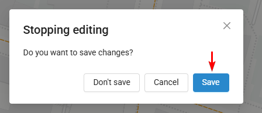

A new feature is created. 

Click on the point symbol on the map. An identification panel will appear, where you can explore the attributes and attachments of the feature.

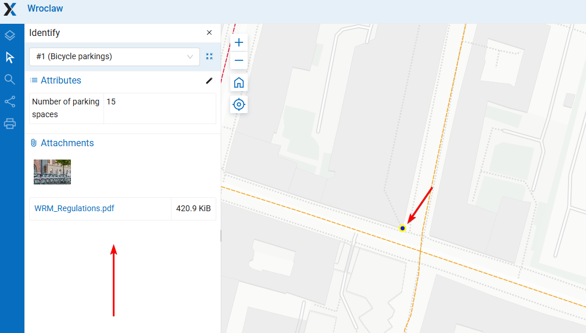

Click on the attached photos and panoramas to view them.

Now that we have data in this layer, let's publish it via OGC API Features.

.. _ogc_api:

Publish OGC API — Features service 
--------------------------------------

We'll publish this layer with OGC API — Features protocol so that it can be edited in external software. Go back to the *Wroclaw* resource group and create a new resource, **OGC API Features service**.

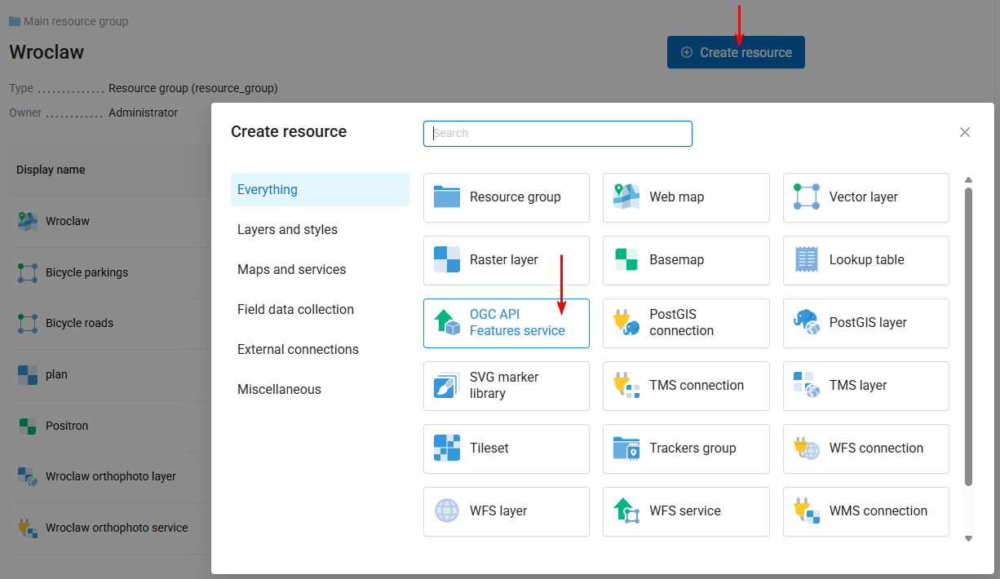

Service creation is a simple process. All you need is to select a layer. 

On the **OGC API Features service** tab click the |button_plus_layer| **Add** button and select the *Bicycle parkings* layer, then click the **Pick selected** button.

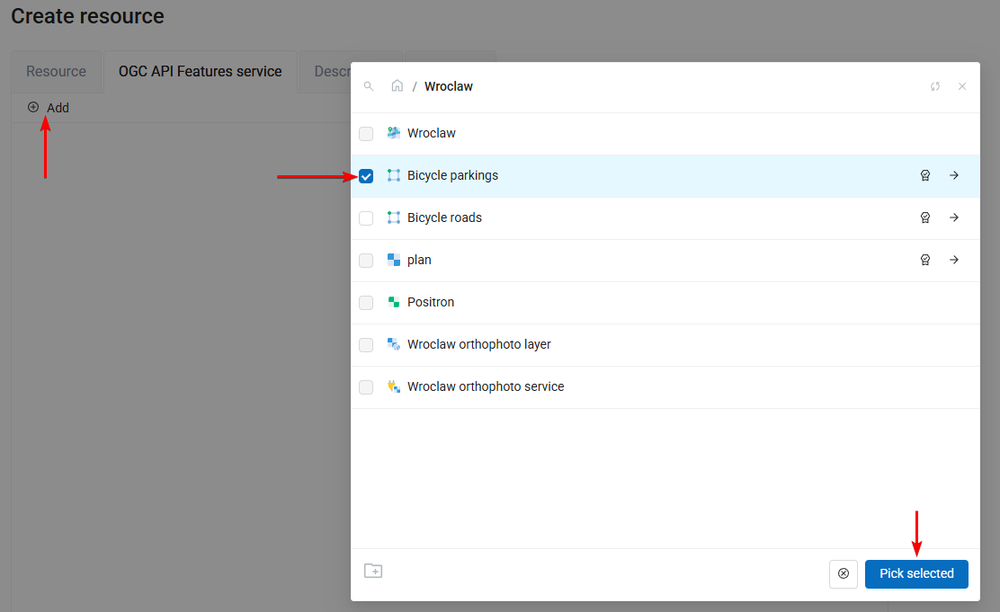

By default the resource would be called just "OGC API Features service". To set a custom display name go to the **Resource** tab and enter ``Bicycle parkings (features service)``. Then click the **Create** button.

.. note:: The name "Bicycle parkings" is already used for the vector layer resource, so you need to add "features service" at the end. 

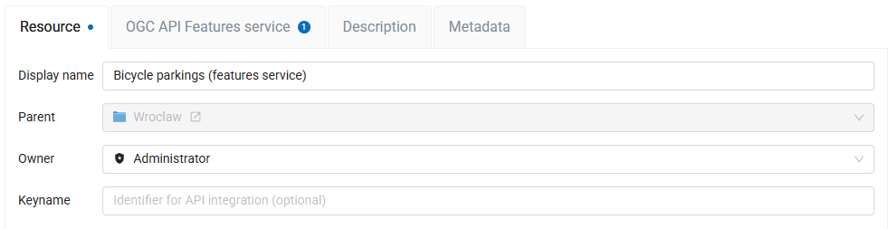

The service is created and you are redirected to its page. In the **External access** section you can see the endpoint of the published service. Copy the URL to use it in external applications.

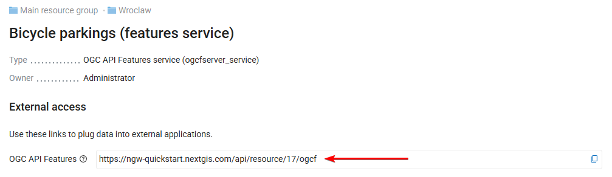

.. _next:

What next
-----------

Congratulations! You’ve completed the tutorial and learned the basics of geospatial data management in NextGIS Web.

There are still a lot of things to explore. You can learn to:

* manage users and permissions, allowing to set up unique access combinations for each layer, service and map;
* manage coordinate reference systems;
* manage data directly from QGIS, including project publishing, style management and collaborative editing;
* and many more.

Try other tutorials or dive into documentation to learn more.

