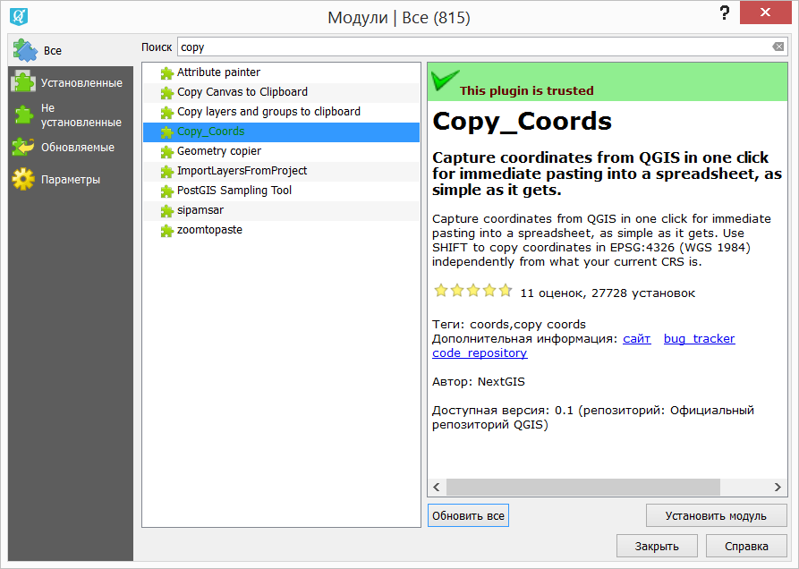
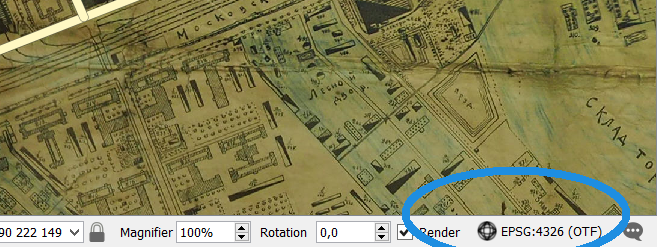
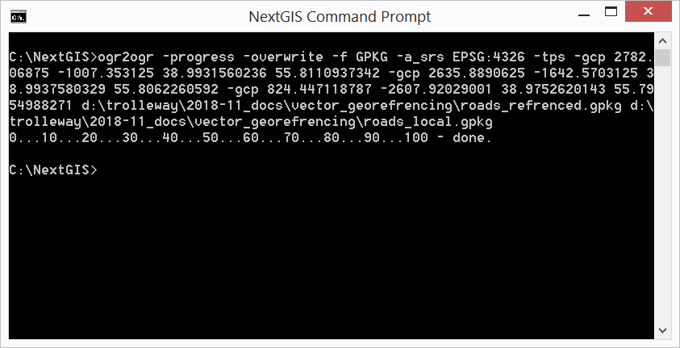

.. sectionauthor:: Артём Светлов <artem.svetlov@nextgis.ru>

.. _howto_vector_ref:

Привязка векторного слоя к растровому или к другому векторному слою
==========================================================================

Введение
---------

Эта инструкция описывает как можно привязать векторный слой к другому слою, используя gcp и ogr2ogr.

gcp - это Ground Control Points, точки с координатами в географической системе координат, и в другой системе координат, например пикселов на изображении. Термин gcp часто используется в софте и утилитах для работы с координатами.

Примеры:

Можно взять векторный слой с дорожным графом, и привязать его к фотографии города сделанной из самолёта. Тогда получится векторный слой, у которого в качестве координат будут координаты пикселов фотографии.

Можно взять растровое изображение карты, и не привязвать растр к вектору, а векторизовать непривязанную карту (у вас получится векторный файл где в координатах будут записаны координаты пикселов, и првиязать его к географическим координатам по точкам)


Возьмём растровую карту 
https://commons.wikimedia.org/wiki/File:Orekhovo-Zuevo_map_1925_(22370728927).jpg

Карта 

Добавляем её в новый проект в NextGIS QGIS. На запросы системы координат отвечаем Cancel, проверяем что в проекте не включено преобразование координат на лету. Если всё правильно, то на экране должна быть карта как есть, а координаты курсора должны показываться в пикселах карты

Проверьте выделенные поля

Теперь нужно создать векторный слой в системе координат изображения. Укажите систему координат EPSG:4326. Мы будем помнить, что на самом деле она локальная, а не географическая. В принципе можно было бы создать Shapefile без prj, но для простоты инструкции это пропущено.

Векторизуем чего-нибудь по карте в нашем новом векторном слое.

Теперь нужно составить набор gcp. GUI для этого ещё никто не заказал, поэтому придётся вручную. 

Ставьте наш плагин copy_coords


   

Добавляйте через qms подложку

проверяйте что система координат проекта выставлена в EPSG:4326


   

щёлкаете точку на растровой карте  копируйте координаты в электронную таблицу

Нажимаете "увелиичить до слоя" на подложке из QMS, щёлкаете точку, копируйте координаты в электронную таблицу

курим мануал по ogr2ogr: https://www.gdal.org/ogr2ogr.html

Аргументы имеющие отношения к gcp устроены так же как в gdalwarp

-gcp ungeoref_x ungeoref_y georef_x georef_y elevation:
Указание наземной контрольной точки. Этот ключ может быть повторён много раз для задания набора точек.
-order n
Задать алгоритм привязки - порядок полинома, используемый для привязки (1 до 3). По умолчанию выберется полином по количеству контрольных точек.
-tps:
Использовать алгоритм тонкостенный сплайн вместо полинома

Алгоритм тонкостенный сплан для наших задач подходит лучше других. Значение elevation можно пропускать.


Пример реальных данных. Слева координаты пикселов картинки, справа - географические координаты.

.. figure:: _static/vector_georefrencing_table.png
   :name: vector_georefrencing_table
   :align: center
   :width: 10cm
   
   
```
2782.06875	-1007.353125	38.9931560236	55.8110937342
2635.8890625	-1642.5703125	38.9937580329	55.8062260592
824.447118787	-2607.92029001	38.9752620143	55.7954988271
```

берёте notepad++ и составляете строку вызова ogr2ogr с gcp. Должно быть что-то вроде такого.

```
ogr2ogr -progress -f GPKG -a_srs EPSG:4326 -tps -gcp 2782.06875 -1007.353125 38.9931560236 55.8110937342 -gcp 2635.8890625 -1642.5703125 38.9937580329 55.8062260592 -gcp 824.447118787 -2607.92029001 38.9752620143 55.7954988271 d:\trolleway\2018-11_docs\vector_georefrencing\roads_refrenced.gpkg d:\trolleway\2018-11_docs\vector_georefrencing\roads_local.gpkg
```


   
   
ogr2ogr должен создать векторный слой с географической системой координат
